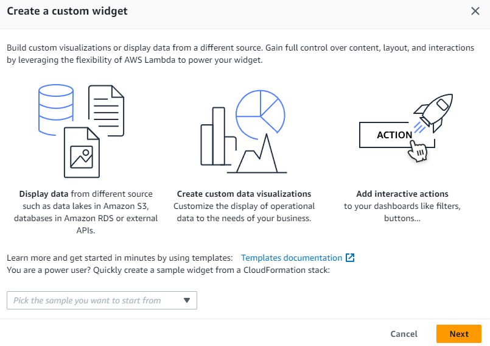
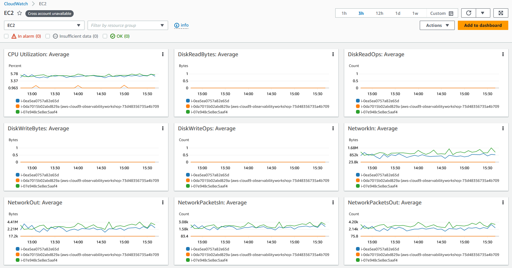
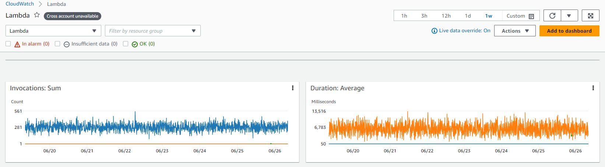

# CloudWatch Dashboard

## పరిచయం

AWS accounts లో resources inventory details, resources performance మరియు health checks తెలుసుకోవడం stable resource management కోసం ముఖ్యం. Amazon CloudWatch dashboards CloudWatch console లో customizable home pages ఇవి ఒకే view లో మీ resources monitor చేయడానికి ఉపయోగించవచ్చు, ఆ resources cross-account లేదా different regions అంతటా spread అయి ఉన్నప్పటికీ.

[Amazon CloudWatch dashboards](https://docs.aws.amazon.com/AmazonCloudWatch/latest/monitoring/CloudWatch_Dashboards.html) customers reusable graphs create చేయడానికి మరియు unified view లో cloud resources మరియు applications visualize చేయడానికి enable చేస్తాయి. CloudWatch dashboards ద్వారా customers metrics మరియు logs data ను unified view లో side by side graph చేయవచ్చు, quickly context get చేసి problem diagnosing నుండి root cause understand చేయడానికి move అవ్వడానికి మరియు mean time to recover or resolve (MTTR) reduce చేయడానికి. ఉదాహరణకు, customers CPU utilization మరియు memory వంటి key metrics current utilization visualize చేసి allocated capacity తో compare చేయవచ్చు. Customers specific metric యొక్క log pattern correlate చేయవచ్చు మరియు performance మరియు operational issues పై alert చేయడానికి alarms set చేయవచ్చు. CloudWatch dashboard alarms current status కూడా display చేయడానికి help చేస్తుంది action కోసం quickly visualize మరియు attention get చేయడానికి. CloudWatch dashboards sharing customers displayed dashboard information teams మరియు/లేదా organizations internal లేదా external stakeholders కు easily share చేయడానికి allow చేస్తుంది.

## Widgets

#### Default Widgets

Widgets CloudWatch dashboards యొక్క building blocks ఇవి AWS environment లో resources మరియు application metrics మరియు logs యొక్క important information & near real time details display చేస్తాయి. Customers తమ requirements ప్రకారం widgets add, remove, rearrange లేదా resize చేయడం ద్వారా dashboards ను తమ desired experience కు customize చేయవచ్చు.

మీ dashboard కు add చేయగల graph types లో Line, Number, Gauge, Stacked area, Bar మరియు Pie include.

**Line, Number, Gauge, Stacked area, Bar, Pie** వంటి default widget types **Graph** type వి మరియు **Text, Alarm Status, Logs table, Explorer** వంటి ఇతర widgets కూడా customers dashboards build చేయడానికి Metrics లేదా Logs data add చేయడానికి choose చేయడానికి available.


**అదనపు References:**

- [Metric Number Widgets](https://catalog.workshops.aws/observability/en-US/aws-native/dashboards/metrics-number) పై AWS Observability Workshop
- [Text Widgets](https://catalog.workshops.aws/observability/en-US/aws-native/dashboards/text-widget) పై AWS Observability Workshop
- [Alarm Widgets](https://catalog.workshops.aws/observability/en-US/aws-native/dashboards/alarm-widgets) పై AWS Observability Workshop
- [CloudWatch dashboards పై widgets create మరియు work చేయడం](https://docs.aws.amazon.com/AmazonCloudWatch/latest/monitoring/create-and-work-with-widgets.html) పై Documentation

#### Custom Widgets

Customers CloudWatch dashboards లో custom visualizations experience చేయడానికి, multiple sources నుండి information display చేయడానికి లేదా CloudWatch Dashboard లో directly actions తీసుకోడానికి buttons వంటి custom controls add చేయడానికి [custom widget add](https://docs.aws.amazon.com/AmazonCloudWatch/latest/monitoring/create-and-work-with-widgets.html) చేయడం కూడా choose చేయవచ్చు. Custom Widgets completely serverless Lambda functions ద్వారా powered, content, layout మరియు interactions పై complete control enable చేస్తుంది. Custom Widget dashboard పై custom data view లేదా tool build చేయడానికి easy way ఇది complicated web framework learn చేయాల్సిన అవసరం లేదు. Lambda లో code write చేయగలిగితే మరియు HTML create చేయగలిగితే useful custom widget create చేయవచ్చు.



**అదనపు References:**

- [Custom widgets](https://catalog.workshops.aws/observability/en-US/aws-native/dashboards/custom-widgets) పై AWS Observability Workshop
- GitHub లో [CloudWatch Custom Widgets Samples](https://github.com/aws-samples/cloudwatch-custom-widgets-samples#what-are-custom-widgets)
- Blog: [Amazon CloudWatch dashboards custom widgets ఉపయోగించడం](https://aws.amazon.com/blogs/mt/introducing-amazon-cloudwatch-dashboards-custom-widgets/)

## Automatic Dashboards

Automatic Dashboards అన్ని AWS public regions లో available ఇవి అన్ని AWS resources health మరియు performance యొక్క aggregated view provide చేస్తాయి. ఇది customers quickly monitoring తో get started చేయడానికి, metrics మరియు alarms యొక్క resource-based view మరియు performance issues యొక్క root cause understand చేయడానికి easily drill-down చేయడానికి help చేస్తుంది. Automatic Dashboards AWS service recommended [best practices](https://docs.aws.amazon.com/prescriptive-guidance/latest/implementing-logging-monitoring-cloudwatch/cloudwatch-dashboards-visualizations.html) తో pre-built, resource aware గా remain అవుతాయి, మరియు important performance metrics latest state reflect చేయడానికి dynamically update అవుతాయి.



**అదనపు References:**

- [Automatic dashboards](https://catalog.workshops.aws/observability/en-US/aws-native/dashboards/autogen-dashboard) పై AWS Observability Workshop
- YouTube లో [Monitor AWS Resources Using Amazon CloudWatch Dashboards](https://www.youtube.com/watch?v=I7EFLChc07M)

#### Automatic dashboards లో Container Insights

[CloudWatch Container Insights](https://docs.aws.amazon.com/AmazonCloudWatch/latest/monitoring/ContainerInsights.html) containerized applications మరియు microservices నుండి metrics మరియు logs collect, aggregate మరియు summarize చేస్తాయి. Container Insights Amazon Elastic Container Service (Amazon ECS), Amazon Elastic Kubernetes Service (Amazon EKS), మరియు Amazon EC2 పై Kubernetes platforms కోసం available.

CloudWatch cluster, node, pod, task, మరియు service level వద్ద aggregated metrics ను [embedded metric format](https://aws-observability.github.io/observability-best-practices/guides/signal-collection/emf/) ఉపయోగించి CloudWatch metrics గా create చేస్తుంది. Container Insights collect చేసే metrics [CloudWatch automatic dashboards](https://docs.aws.amazon.com/prescriptive-guidance/latest/implementing-logging-monitoring-cloudwatch/cloudwatch-dashboards-visualizations.html) లో available, మరియు CloudWatch console Metrics section లో కూడా viewable.


#### Automatic dashboards లో Lambda Insights

[CloudWatch Lambda Insights](https://docs.aws.amazon.com/lambda/latest/dg/monitoring-insights.html) AWS Lambda వంటి serverless applications కోసం monitoring మరియు troubleshooting solution, ఇది Lambda functions కోసం dynamic, [automatic dashboards](https://docs.aws.amazon.com/prescriptive-guidance/latest/implementing-logging-monitoring-cloudwatch/cloudwatch-dashboards-visualizations.html#use-automatic-dashboards) create చేస్తుంది.



## Custom Dashboards

Customers వారికి కావలసినన్ని additional [Custom Dashboards](https://docs.aws.amazon.com/AmazonCloudWatch/latest/monitoring/create_dashboard.html) different widgets తో create చేసి accordingly customize చేయవచ్చు. Dashboards cross-region & cross account view కోసం configure చేయవచ్చు మరియు favorites list కు add చేయవచ్చు.


**అదనపు References:**

- [CloudWatch dashboard](https://catalog.workshops.aws/observability/en-US/aws-native/dashboards/create) పై AWS Observability Workshop
- [CloudWatch Dashboards తో monitoring](https://www.wellarchitectedlabs.com/performance-efficiency/100_labs/100_monitoring_windows_ec2_cloudwatch/) కోసం AWS Well-Architected Labs

#### CloudWatch dashboards కు Contributor Insights Add చేయడం

CloudWatch [Contributor Insights](https://docs.aws.amazon.com/AmazonCloudWatch/latest/monitoring/ContributorInsights.html) provide చేస్తుంది log data analyze చేయడానికి మరియు contributor data display చేసే time series create చేయడానికి. ఇది top talkers find చేయడానికి మరియు system performance ను ఎవరు లేదా ఏది impact చేస్తుందో understand చేయడానికి help చేస్తుంది.


#### CloudWatch dashboards కు Application Insights Add చేయడం

[CloudWatch Application Insights](https://docs.aws.amazon.com/AmazonCloudWatch/latest/monitoring/cloudwatch-application-insights.html) AWS పై hosted applications మరియు underlying AWS resources కోసం observability facilitate చేస్తుంది, applications health లోకి provide చేసే enhanced visibility applications issues troubleshoot చేయడానికి mean time to repair (MTTR) reduce చేయడానికి help చేస్తుంది.


#### CloudWatch dashboards కు Service Map Add చేయడం

[CloudWatch ServiceLens](https://docs.aws.amazon.com/AmazonCloudWatch/latest/monitoring/ServiceLens.html) traces, metrics, logs, alarms, మరియు ఇతర resource health information ను one place లో integrate చేయడం ద్వారా services మరియు applications observability enhance చేస్తుంది.


#### CloudWatch dashboards కు Metrics Explorer Add చేయడం

CloudWatch లో [Metrics explorer](https://docs.aws.amazon.com/AmazonCloudWatch/latest/monitoring/CloudWatch-Metrics-Explorer.html) tag-based tool ఇది customers tags మరియు resource properties ద్వారా metrics filter, aggregate మరియు visualize చేయడానికి enable చేస్తుంది.


## CloudWatch dashboards ఉపయోగించి ఏమి visualize చేయాలి

Customers regions మరియు accounts అంతటా workloads మరియు applications monitor చేయడానికి account మరియు application-level dashboards create చేయవచ్చు. Production environment లో application లేదా workload కు relevant మరియు critical అయిన key metrics మరియు resources పై focus చేసే application మరియు workload-specific dashboards create చేయడం recommended.

#### Metrics data visualize చేయడం

Metrics data CloudWatch dashboards కు **Line, Number, Gauge, Stacked area, Bar, Pie** వంటి Graph widgets ద్వారా add చేయవచ్చు, **Average, Minimum, Maximum, Sum, మరియు SampleCount** ద్వారా metrics పై statistics support చేస్తూ.


[Metric math](https://docs.aws.amazon.com/AmazonCloudWatch/latest/monitoring/using-metric-math.html) multiple CloudWatch metrics query చేయడానికి మరియు ఈ metrics ఆధారంగా new time series create చేయడానికి math expressions ఉపయోగించడానికి enable చేస్తుంది.

#### Logs data visualize చేయడం

Customers bar charts, line charts, మరియు stacked area charts ఉపయోగించి CloudWatch dashboards లో [logs data visualizations](https://docs.aws.amazon.com/AmazonCloudWatch/latest/logs/CWL_Insights-Visualizing-Log-Data.html) achieve చేయవచ్చు.

Sample query stats function తో:

```java
filter @message like /GET/
| parse @message '_ - - _ "GET _ HTTP/1.0" .*.*.*' as ip, timestamp, page, status, responseTime, bytes
| stats count() as request_count by status
```


Query results pie chart గా visualization:


**అదనపు Reference:**

- CloudWatch dashboard లో [log results display చేయడం](https://catalog.workshops.aws/observability/en-US/aws-native/logs/logsinsights/displayformats) పై AWS Observability Workshop.

#### Alarms visualize చేయడం

CloudWatch లో Metric alarm single metric లేదా CloudWatch metrics ఆధారంగా math expression result watch చేస్తుంది. [CloudWatch dashboards](https://docs.aws.amazon.com/AmazonCloudWatch/latest/monitoring/add_remove_alarm_dashboard.html) widget లో single alarm add చేయవచ్చు, alarm metric graph మరియు alarm status display చేస్తుంది.


## Cross-account & Cross-region

Multiple AWS accounts ఉన్న Customers [CloudWatch cross-account](https://docs.aws.amazon.com/AmazonCloudWatch/latest/monitoring/cloudwatch_crossaccount_dashboard.html) observability set up చేసి central monitoring accounts లో rich cross-account dashboards create చేయవచ్చు.

Customers [cross-account cross-region](https://docs.aws.amazon.com/AmazonCloudWatch/latest/monitoring/cloudwatch_xaxr_dashboard.html) dashboards కూడా create చేయవచ్చు, ఇవి multiple AWS accounts మరియు multiple regions నుండి CloudWatch data ను single dashboard లో summarize చేస్తాయి.

**అదనపు References:**

- [Cross-account Amazon EC2 instances auto add చేయడం](https://aws.amazon.com/blogs/mt/how-to-auto-add-new-cross-account-amazon-ec2-instances-in-a-central-amazon-cloudwatch-dashboard/)
- [Multi-Account Amazon CloudWatch Dashboards Deploy చేయడం](https://aws.amazon.com/blogs/mt/deploy-multi-account-amazon-cloudwatch-dashboards/)

## Dashboards Share చేయడం

CloudWatch dashboards teams అంతటా, stakeholders తో మరియు మీ AWS account కు direct access లేని organizations external people తో share చేయవచ్చు. ఈ [shared dashboards](https://docs.aws.amazon.com/AmazonCloudWatch/latest/monitoring/cloudwatch-dashboard-sharing.html) team areas లో big screens పై display చేయవచ్చు, monitoring లేదా network operations centers (NOC) లేదా Wikis లేదా public webpages లో embed చేయవచ్చు.

Dashboards share చేయడానికి మూడు మార్గాలు ఉన్నాయి:

- Dashboard [publicly share](https://docs.aws.amazon.com/AmazonCloudWatch/latest/monitoring/cloudwatch-dashboard-sharing.html#share-cloudwatch-dashboard-public) చేయవచ్చు link ఉన్న ఎవరైనా dashboard view చేయగలిగేలా.
- Dashboard [specific email addresses](https://docs.aws.amazon.com/AmazonCloudWatch/latest/monitoring/cloudwatch-dashboard-sharing.html#share-cloudwatch-dashboard-email-addresses) కు share చేయవచ్చు.
- Dashboards [single sign-on (SSO) provider](https://docs.aws.amazon.com/AmazonCloudWatch/latest/monitoring/cloudwatch-dashboard-sharing.html#share-cloudwatch-dashboards-setup-SSO) ద్వారా access తో AWS accounts లో share చేయవచ్చు.

**అదనపు References:**

- [Dashboards share చేయడం](https://catalog.workshops.aws/observability/en-US/aws-native/dashboards/sharingdashboard) పై AWS Observability Workshop

## Live data

CloudWatch dashboards మీ workloads నుండి metrics constantly published అవుతుంటే metric widgets ద్వారా [live data](https://docs.aws.amazon.com/AmazonCloudWatch/latest/monitoring/cloudwatch-live-data.html) కూడా display చేస్తాయి.

## Animated Dashboard

[Animated dashboard](https://docs.aws.amazon.com/AmazonCloudWatch/latest/monitoring/cloudwatch-animated-dashboard.html) కాలక్రమేణా capture అయిన CloudWatch metric data replay చేస్తుంది, customers trends చూడటానికి, presentations చేయడానికి లేదా issues occur అయిన తర్వాత analyze చేయడానికి help చేస్తుంది.

## CloudWatch Dashboard కోసం API/CLI support

AWS Management Console ద్వారా CloudWatch dashboard access చేయడంతో పాటు customers API, AWS command-line interface (CLI) మరియు AWS SDKs ద్వారా కూడా service access చేయవచ్చు.

- [ListDashboards](https://docs.aws.amazon.com/AmazonCloudWatch/latest/APIReference/API_ListDashboards.html): మీ account కోసం dashboards list return చేస్తుంది
- [GetDashboard](https://docs.aws.amazon.com/AmazonCloudWatch/latest/APIReference/API_GetDashboard.html): మీరు specify చేసిన dashboard details display చేస్తుంది.
- [DeleteDashboards](https://docs.aws.amazon.com/AmazonCloudWatch/latest/APIReference/API_DeleteDashboards.html): మీరు specify చేసిన అన్ని dashboards delete చేస్తుంది.
- [PutDashboard](https://docs.aws.amazon.com/AmazonCloudWatch/latest/APIReference/API_PutDashboard.html): Dashboard already exist అవ్వకపోతే create చేస్తుంది, లేదా existing dashboard update చేస్తుంది.

CLI Support:

- [list-dashboards](https://docs.aws.amazon.com/cli/latest/reference/cloudwatch/list-dashboards.html)
- [get-dashboard](https://docs.aws.amazon.com/cli/latest/reference/cloudwatch/get-dashboard.html)
- [delete-dashboards](https://docs.aws.amazon.com/cli/latest/reference/cloudwatch/delete-dashboards.html)
- [put-dashboard](https://docs.aws.amazon.com/cli/latest/reference/cloudwatch/put-dashboard.html)

**అదనపు Reference:** [CloudWatch dashboards మరియు AWS CLI](https://catalog.workshops.aws/observability/en-US/aws-native/dashboards/createcli) పై AWS Observability Workshop

## CloudWatch Dashboard Automation

CloudWatch dashboards creation automate చేయడానికి, customers CloudFormation లేదా Terraform వంటి Infrastructure as a Code (IaaC) tools ఉపయోగించవచ్చు.

[AWS CloudFormation](https://docs.aws.amazon.com/AWSCloudFormation/latest/UserGuide/aws-resource-cloudwatch-dashboard.html) templates ద్వారా dashboards create చేయడం support చేస్తుంది.

[Terraform](https://registry.terraform.io/providers/hashicorp/aws/latest/docs/resources/cloudwatch_dashboard) కూడా IaaC automation ద్వారా CloudWatch dashboards create చేయడం support చేసే modules కలిగి ఉంది.

**అదనపు Reference Blogs:**

- [Amazon EBS volume KPIs కోసం Amazon CloudWatch dashboard creation automate చేయడం](https://aws.amazon.com/blogs/storage/automating-amazon-cloudwatch-dashboard-creation-for-amazon-ebs-volume-kpis/)
- [AWS Systems Manager మరియు Ansible తో Amazon CloudWatch alarms మరియు dashboards creation automate చేయడం](https://aws.amazon.com/blogs/mt/automate-creation-of-amazon-cloudwatch-alarms-and-dashboards-with-aws-systems-manager-and-ansible/)
- [AWS CDK ఉపయోగించి AWS Outposts కోసం automated Amazon CloudWatch dashboard deploy చేయడం](https://aws.amazon.com/blogs/compute/deploying-an-automated-amazon-cloudwatch-dashboard-for-aws-outposts-using-aws-cdk/)

**Product FAQs** [CloudWatch dashboard](https://aws.amazon.com/cloudwatch/faqs/#Dashboards) పై
