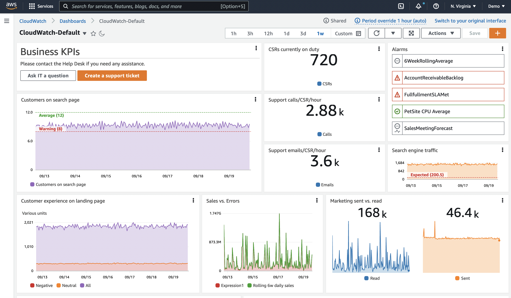

# డాష్‌బోర్డ్‌లు

డాష్‌బోర్డ్‌లు మీ Observability సొల్యూషన్‌లో ముఖ్యమైన భాగం. అవి మీ డేటా యొక్క క్యూరేటెడ్ విజ్యువలైజేషన్‌ను ఉత్పత్తి చేయడానికి మిమ్మల్ని అనుమతిస్తాయి. అవి మీ డేటా చరిత్రను చూడడానికి మరియు ఇతర సంబంధిత డేటాతో పాటు చూడడానికి అనుమతిస్తాయి. అవి సందర్భం అందించడానికి కూడా అనుమతిస్తాయి. అవి పెద్ద చిత్రాన్ని అర్థం చేసుకోవడంలో మీకు సహాయం చేస్తాయి.

తరచుగా వ్యక్తులు తమ డేటాను సేకరించి అలారంలు సృష్టించి, ఆపై ఆగిపోతారు. అయితే, అలారంలు ఒక సమయ బిందువును మాత్రమే చూపిస్తాయి, మరియు సాధారణంగా ఒకే మెట్రిక్ లేదా చిన్న డేటా సెట్ కోసం. డాష్‌బోర్డ్‌లు కాలక్రమేణా ప్రవర్తనను చూడడానికి మీకు సహాయం చేస్తాయి.



## ఒక ఆచరణాత్మక ఉదాహరణ: అధిక CPU కోసం అలారంను పరిగణించండి
మెషీన్ కోరుకున్న దానికంటే ఎక్కువ CPU తో నడుస్తోందని మీకు తెలుసు. మీరు చర్య తీసుకోవాలా, మరియు ఎంత త్వరగా? నిర్ణయించడానికి ఏది సహాయం చేయగలదు?

* ఈ ఇన్‌స్టాన్స్/అప్లికేషన్‌కు సాధారణ CPU ఎలా ఉంటుంది?
* ఇది ఒక స్పైక్‌నా, లేక పెరుగుతున్న CPU ట్రెండ్‌నా?
* ఇది పనితీరుపై ప్రభావం చూపుతోందా? లేకపోతే, ఎంత సేపటికి ప్రభావం చూపుతుంది?
* ఇది సాధారణ సంఘటనా? మరియు సాధారణంగా దానంతట అదే కోలుకుంటుందా?

### డేటా చరిత్ర చూడండి

ఇప్పుడు CPU యొక్క హిస్టారిక్ టైమ్‌చార్ట్‌తో ఒక డాష్‌బోర్డ్ పరిగణించండి. ఈ ఒకే మెట్రిక్‌తో కూడా, ఇది ఒక స్పైక్ నా లేక ఒక అప్‌వార్డ్ ట్రెండ్ నా అని చూడవచ్చు. ఇది ఎంత వేగంగా పైకి ట్రెండ్ అవుతుందో కూడా చూడవచ్చు, మరియు చర్య ప్రాధాన్యతపై కొన్ని నిర్ణయాలు తీసుకోవచ్చు.

### వర్క్‌ఫ్లోపై ప్రభావం చూడండి

అయితే ఈ మెషీన్ ఏమి చేస్తుంది? మన మొత్తం సందర్భంలో ఇది ఎంత ముఖ్యమైనది? వర్క్‌ఫ్లో పనితీరు యొక్క విజ్యువలైజేషన్ జోడించినట్లు ఊహించుకోండి, అది రెస్పాన్స్ టైమ్, థ్రూపుట్, ఎర్రర్‌లు, లేదా ఏదైనా ఇతర కొలత అయినా. ఇప్పుడు అధిక CPU ఈ ఇన్‌స్టాన్స్ సపోర్ట్ చేస్తున్న వర్క్‌ఫ్లో లేదా వినియోగదారులపై ప్రభావం చూపుతోందా అని చూడవచ్చు.

### అలారం చరిత్ర చూడండి

గత నెలలో అలారం ఎన్నిసార్లు ట్రిగ్గర్ అయ్యిందో చూపే విజ్యువలైజేషన్ జోడించడం మరియు ఇది సాధారణ సంఘటనా అని చూడడానికి మరింత వెనుకకు చూడడం పరిగణించండి. ఉదాహరణకు, బ్యాకప్ జాబ్ స్పైక్‌ను ట్రిగ్గర్ చేస్తోందా? పునరావృతం యొక్క నమూనాను తెలుసుకోవడం అంతర్లీన సమస్యను అర్థం చేసుకోవడంలో మరియు అలారం మళ్ళీ రాకుండా ఆపడానికి దీర్ఘకాలిక నిర్ణయాలు తీసుకోవడంలో సహాయపడుతుంది.

### సందర్భం జోడించండి

చివరగా, డాష్‌బోర్డ్‌కు కొంత సందర్భం జోడించండి. ఈ డాష్‌బోర్డ్ ఎందుకు ఉందో, ఇది ఏ వర్క్‌ఫ్లోకు సంబంధించినదో, సమస్య ఉన్నప్పుడు ఏమి చేయాలో, డాక్యుమెంటేషన్ లింక్‌లు మరియు ఎవరిని సంప్రదించాలో సంక్షిప్త వివరణ చేర్చండి.

:::info
    ఇప్పుడు మనకు ఒక *కథ* ఉంది, ఇది డాష్‌బోర్డ్ వినియోగదారుకు ఏమి జరుగుతుందో చూడడానికి, ప్రభావాన్ని అర్థం చేసుకోవడానికి మరియు ఏ చర్య మరియు దాని ఆవశ్యకతపై సముచిత డేటా-ఆధారిత నిర్ణయాలు తీసుకోవడానికి సహాయం చేస్తుంది.
:::
### అన్నింటినీ ఒకేసారి విజ్యువలైజ్ చేయడానికి ప్రయత్నించకండి

మేము తరచుగా అలారం అలసట గురించి మాట్లాడతాము. గుర్తించగల చర్యలు మరియు ప్రాధాన్యతలు లేకుండా చాలా ఎక్కువ అలారంలు, మీ టీమ్‌ను ఓవర్‌లోడ్ చేసి అసమర్థతలకు దారితీయవచ్చు. అలారంలు మీకు ముఖ్యమైన మరియు చర్య తీసుకోగల విషయాలకు ఉండాలి.

డాష్‌బోర్డ్‌లు ఇక్కడ మరింత సౌకర్యవంతంగా ఉంటాయి. అవి అదే విధంగా మీ దృష్టిని డిమాండ్ చేయవు, కాబట్టి ఇంకా ముఖ్యమైనవి అని మీకు ఖచ్చితంగా తెలియని విషయాలను విజ్యువలైజ్ చేయడానికి లేదా మీ అన్వేషణకు సపోర్ట్ చేయడానికి మీకు ఎక్కువ స్వేచ్ఛ ఉంది. అయినప్పటికీ, ఎక్కువగా చేయకండి! ప్రతిదీ మంచి విషయం ఎక్కువగా ఉంటే బాధపడవచ్చు.

డాష్‌బోర్డ్‌లు మీకు ముఖ్యమైన దాని చిత్రాన్ని అందించాలి. ఏ డేటాను ఇంజెస్ట్ చేయాలో నిర్ణయించడంలో అదే విధంగా, డాష్‌బోర్డ్‌ల కోసం మీకు ఏమి ముఖ్యమో ఆలోచించాలి.
మీ డాష్‌బోర్డ్‌ల కోసం, ఆలోచించండి

* దీనిని ఎవరు చూస్తారు?
    * వారి నేపథ్యం మరియు జ్ఞానం ఏమిటి?
	* వారికి ఎంత సందర్భం అవసరం?
* వారు ఏ ప్రశ్నలకు సమాధానం కనుగొనడానికి ప్రయత్నిస్తున్నారు?
* ఈ డేటా చూసిన ఫలితంగా వారు ఏ చర్యలు తీసుకుంటారు?

:::tip
    కొన్నిసార్లు మీ డాష్‌బోర్డ్ కథ ఏమై ఉండాలో మరియు ఎంత చేర్చాలో తెలుసుకోవడం కష్టంగా ఉంటుంది. కాబట్టి మీ డాష్‌బోర్డ్ డిజైన్ చేయడం ఎక్కడ ప్రారంభించవచ్చు? రెండు మార్గాలు చూద్దాం: *KPI ఆధారిత*, లేదా *ఇన్సిడెంట్ ఆధారిత*.
:::

#### మీ డాష్‌బోర్డ్ డిజైన్ చేయండి: KPI ఆధారిత

దీన్ని అర్థం చేసుకోవడానికి ఒక మార్గం మీ KPIల నుండి వెనుకకు పని చేయడం. ఇది సాధారణంగా చాలా వినియోగదారు-ఆధారిత విధానం.
[లేఔట్](#layout) కోసం, సాధారణంగా మనం పై నుండి కిందకు పని చేస్తాము, డాష్‌బోర్డ్‌లో మరింత కిందకు వెళ్ళేకొద్దీ మరింత వివరాలకు చేరుకుంటాము, లేదా తక్కువ స్థాయి డాష్‌బోర్డ్‌లకు నావిగేట్ చేస్తాము.

మొదట, **మీ KPIలను అర్థం చేసుకోండి**. అవి ఏమి అర్థం చేస్తాయి. మీరు వాటిని ఎలా విజ్యువలైజ్ చేయాలనుకుంటున్నారో నిర్ణయించడంలో ఇది సహాయం చేస్తుంది.
చాలా KPIలు ఒకే సంఖ్యగా చూపించబడతాయి. ఉదాహరణకు, ఎంత శాతం కస్టమర్లు నిర్దిష్ట వర్క్‌ఫ్లోను విజయవంతంగా పూర్తి చేస్తున్నారు, మరియు ఎంత సమయంలో? అయితే ఏ కాల వ్యవధిలో? మీరు ఒక వారం సగటు తీస్తే మీ KPI చేరుకోవచ్చు, అయినప్పటికీ దీనిలో మీ ప్రమాణాలను ఉల్లంఘించే చిన్న కాల వ్యవధులు ఉంటాయి. ఈ ఉల్లంఘనలు మీకు ముఖ్యమైనవా? అవి మీ కస్టమర్ అనుభవాన్ని ప్రభావితం చేస్తున్నాయా. అలా అయితే, మీ KPIలను చూడడానికి వేర్వేరు కాలాలు మరియు టైమ్ చార్ట్‌లు పరిగణించవచ్చు. మరియు బహుశా అందరికీ వివరాలు చూడవలసిన అవసరం లేదు, కాబట్టి బహుశా KPIల విభజనను ప్రత్యేక డాష్‌బోర్డ్‌కు, ప్రత్యేక ప్రేక్షకులకు తరలించవచ్చు.

తర్వాత, **ఆ KPIలకు ఏమి దోహదం చేస్తుంది?** ఆ చర్యలు జరగడానికి ఏ వర్క్‌ఫ్లోలు నడవాలి? మీరు వాటిని కొలవగలరా?

ప్రధాన కాంపోనెంట్‌లను గుర్తించి వాటి పనితీరు యొక్క విజ్యువలైజేషన్‌లు జోడించండి. KPI ఉల్లంఘించినప్పుడు, వర్క్‌ఫ్లోలో ప్రధాన ప్రభావం ఎక్కడ ఉందో త్వరగా చూడగలగాలి.

మరియు మీరు కిందకు కొనసాగవచ్చు - ఆ వర్క్‌ఫ్లోల పనితీరును ఏది ప్రభావితం చేస్తుంది? లోతు స్థాయిని నిర్ణయిస్తున్నప్పుడు మీ ప్రేక్షకులను గుర్తుంచుకోండి.

ఆర్డర్‌ల సంఖ్య కోసం KPI ఉన్న ఈ-కామర్స్ సిస్టమ్ ఉదాహరణ పరిగణించండి.
ఆర్డర్ ఇవ్వడానికి, వినియోగదారులు ఈ చర్యలు చేయగలగాలి: ఉత్పత్తుల కోసం శోధించడం, వాటిని కార్ట్‌కు జోడించడం, డెలివరీ వివరాలు జోడించడం మరియు ఆర్డర్ కోసం చెల్లించడం.
ఈ వర్క్‌ఫ్లోలలో ప్రతి ఒక్కదానికి, కీలక కాంపోనెంట్‌లు పనిచేస్తున్నాయో తనిఖీ చేయడం పరిగణించవచ్చు. ఉదాహరణకు RUM లేదా Synthetics ఉపయోగించి చర్య విజయం గురించి డేటా పొందడం మరియు సమస్య వల్ల వినియోగదారు ప్రభావితమవుతున్నారా చూడడం. థ్రూపుట్, లేటెన్సీ, విఫల చర్య శాతాల కొలత పరిగణించవచ్చు, ప్రతి చర్య పనితీరు ఆశించిన విధంగా ఉందో చూడడానికి. పనితీరును ప్రభావితం చేస్తున్నదేమిటో చూడడానికి అంతర్లీన మౌలిక సదుపాయాల కొలతలు పరిగణించవచ్చు.

అయితే, మీ అన్ని సమాచారాన్ని ఒకే డాష్‌బోర్డ్‌లో ఉంచకండి. మళ్ళీ, మీ వినియోగదారు ప్రేక్షకులను పరిగణించండి.

:::info
    డ్రిల్‌డౌన్ అనుమతించే మరియు సరైన వినియోగదారులకు సరైన సందర్భం అందించే డాష్‌బోర్డ్‌ల లేయర్‌లను సృష్టించండి.
:::
#### మీ డాష్‌బోర్డ్ డిజైన్ చేయండి: ఇన్సిడెంట్ ఆధారిత

చాలా మంది వ్యక్తులకు, ఇన్సిడెంట్ పరిష్కారం observability కోసం కీలక డ్రైవర్. మీకు ఒక సమస్య గురించి వినియోగదారు లేదా Observability అలారం ద్వారా అలర్ట్ చేయబడింది, మరియు మీరు సమస్యకు త్వరగా పరిష్కారం మరియు సంభావ్యంగా మూల కారణం కనుగొనాలి.

:::info
    మీ ఇటీవలి ఇన్సిడెంట్‌లను చూడటం ద్వారా ప్రారంభించండి. సాధారణ నమూనాలు ఉన్నాయా? మీ కంపెనీకి ఏవి అత్యంత ప్రభావశీలం? ఏవి పునరావృతమవుతాయి?
:::
ఈ సందర్భంలో, తీవ్రతను అర్థం చేసుకోవడానికి, మూల కారణాన్ని గుర్తించడానికి మరియు ఇన్సిడెంట్‌ను పరిష్కరించడానికి ప్రయత్నిస్తున్నవారి కోసం డాష్‌బోర్డ్ డిజైన్ చేస్తున్నాము.

నిర్దిష్ట ఇన్సిడెంట్ గురించి ఆలోచించండి.

* ఇన్సిడెంట్ నివేదించినట్లు ఉందని మీరు ఎలా ధృవీకరించారు?
    * మీరు ఏమి తనిఖీ చేశారు? ఎండ్‌పాయింట్‌లు? ఎర్రర్‌లు?
* ప్రభావాన్ని, మరియు అందువల్ల సమస్య ప్రాధాన్యతను మీరు ఎలా అర్థం చేసుకున్నారు?
* సమస్య కారణం కోసం మీరు ఏమి చూశారు?

Application Performance Monitoring (APM) ఇక్కడ సహాయం చేయగలదు, ఎండ్‌పాయింట్‌లు మరియు వర్క్‌ఫ్లోల సాధారణ బేస్‌లైన్ మరియు టెస్టింగ్ కోసం [Synthetics](./synthetics.md) తో, మరియు వాస్తవ కస్టమర్ అనుభవం కోసం [RUM](./rum.md) తో. ఏ వర్క్‌ఫ్లోలు ప్రభావితమయ్యాయో, మరియు ఎంతవరకు ప్రభావితమయ్యాయో త్వరగా విజ్యువలైజ్ చేయడానికి ఈ డేటాను ఉపయోగించవచ్చు.

కాలక్రమేణా ఎర్రర్ కౌంట్ మరియు టాప్ # ఎర్రర్‌లను చూపించే విజ్యువలైజేషన్‌లు సరైన ప్రాంతంపై దృష్టి పెట్టడానికి సహాయం చేయగలవు, మరియు ఎర్రర్‌ల నిర్దిష్ట వివరాలు చూపించగలవు. ఇక్కడే మనం తరచుగా లాగ్ డేటా, మరియు ఎర్రర్ కోడ్‌లు మరియు కారణాల డైనమిక్ విజ్యువలైజేషన్‌లను ఉపయోగిస్తాము.

సాధ్యమైనంత త్వరగా నిర్దిష్టతలకు చేరుకోవడానికి ఇక్కడ ఏదైనా రకమైన ఫిల్టరింగ్ లేదా డ్రిల్‌డౌన్ చాలా ఉపయోగకరంగా ఉంటుంది. ఎక్కువ ఓవర్‌హెడ్ లేకుండా దీన్ని అమలు చేయడానికి మార్గాల గురించి ఆలోచించండి. ఉదాహరణకు, వివరాలకు దగ్గరగా ఫిల్టర్ చేయగల ఒకే డాష్‌బోర్డ్ కలిగి ఉండటం.
 
### లేఔట్

మీ డాష్‌బోర్డ్ లేఔట్ కూడా ముఖ్యమైనది.

:::info
    సాధారణంగా మీ వినియోగదారుకు అత్యంత ముఖ్యమైన విజ్యువలైజేషన్‌లు ఎగువ ఎడమ వైపున ఉండాలి, లేదా పేజీ నావిగేషన్ యొక్క సహజ *ప్రారంభం*తో సమలేఖనం చేయబడాలి.
:::

కథ చెప్పడానికి లేఔట్ ఉపయోగించవచ్చు. ఉదాహరణకు, పై-నుండి-కింద లేఔట్ ఉపయోగించవచ్చు, ఇక్కడ కింద స్క్రోల్ చేసేకొద్దీ మరింత వివరాలు కనిపిస్తాయి. లేదా బహుశా ఎడమ-కుడి ప్రదర్శన ఉపయోగకరంగా ఉంటుంది, ఎడమన ఉన్నత స్థాయి సేవలు మరియు కుడికి వెళ్ళేకొద్దీ వాటి డిపెండెన్సీలు.

### డైనమిక్ కంటెంట్ సృష్టించండి

మీ వర్క్‌లోడ్‌లలో చాలా వరకు డిమాండ్ ఆదేశించినట్లు పెరగడానికి లేదా తగ్గడానికి రూపొందించబడి ఉంటాయి, మరియు మీ డాష్‌బోర్డ్‌లు దీన్ని పరిగణనలోకి తీసుకోవాలి. ఉదాహరణకు మీ ఇన్‌స్టాన్స్‌లు ఒక ఆటోస్కేలింగ్ గ్రూప్‌లో ఉండవచ్చు, మరియు నిర్దిష్ట లోడ్ చేరినప్పుడు అదనపు ఇన్‌స్టాన్స్‌లు జోడించబడతాయి.

:::info
    నిర్దిష్ట ఇన్‌స్టాన్స్‌ల నుండి డేటాను చూపించే డాష్‌బోర్డ్, ఏదైనా ID ద్వారా నిర్దేశించబడిన, ఆ కొత్త ఇన్‌స్టాన్స్‌ల నుండి డేటా చూడడానికి అనుమతించదు. మీ వనరులు మరియు డేటాకు మెటాడేటా జోడించండి, తద్వారా నిర్దిష్ట మెటాడేటా విలువ కలిగిన అన్ని ఇన్‌స్టాన్స్‌లను క్యాప్చర్ చేయడానికి మీ విజ్యువలైజేషన్‌లు సృష్టించవచ్చు. ఈ విధంగా అవి వాస్తవ స్థితిని ప్రతిబింబిస్తాయి.
:::
డైనమిక్ విజ్యువలైజేషన్‌ల మరొక ఉదాహరణ ఇప్పుడు సంభవిస్తున్న టాప్ 10 ఎర్రర్‌లను కనుగొనగలగడం, మరియు ఇటీవలి చరిత్రలో అవి ఎలా ప్రవర్తించాయో. ఏ ఎర్రర్‌లు సంభవించవచ్చో తెలియకుండా ఒక టేబుల్ లేదా చార్ట్ చూడగలగాలి.

### లక్షణాల గురించి ముందుగా ఆలోచించండి, కారణాల కంటే

మీరు లక్షణాలను గమనించినప్పుడు, ఇది మీ వినియోగదారులు మరియు సిస్టమ్‌లపై కలిగించే ప్రభావం గురించి ఆలోచిస్తున్నారు. అనేక అంతర్లీన కారణాలు ఒకే లక్షణాలను ఇవ్వవచ్చు. తెలియని సమస్యలతో సహా మరిన్ని సమస్యలను క్యాప్చర్ చేయడానికి ఇది మిమ్మల్ని అనుమతిస్తుంది. మీరు కారణాలను అర్థం చేసుకునేకొద్దీ, సమస్యలను త్వరగా నిర్ధారించడానికి మరియు పరిష్కరించడానికి మీ తక్కువ స్థాయి డాష్‌బోర్డ్‌లు వాటికి మరింత నిర్దిష్టంగా ఉండవచ్చు.

:::tip 
    గత వారం వినియోగదారులను ప్రభావితం చేసిన నిర్దిష్ట JavaScript ఎర్రర్‌ను క్యాప్చర్ చేయకండి. అది అంతరాయం కలిగించిన వర్క్‌ఫ్లోపై *ప్రభావాన్ని* క్యాప్చర్ చేయండి, ఆపై ఇటీవలి చరిత్రలో టాప్ కౌంట్ JavaScript ఎర్రర్‌లు, లేదా ఇటీవలి చరిత్రలో నాటకీయంగా పెరిగినవి చూపించండి.
:::
### టాప్/బాటమ్ N ఉపయోగించండి

చాలా సమయం మీ *అన్ని* ఆపరేషనల్ మెట్రిక్స్‌ను ఒకే సమయంలో విజ్యువలైజ్ చేయవలసిన అవసరం లేదు. EC2 ఇన్‌స్టాన్స్‌ల పెద్ద ఫ్లీట్ దీనికి మంచి ఉదాహరణ: వందల సర్వర్‌ల మొత్తం ఫార్మ్ కోసం డిస్క్ IOPS లేదా CPU వినియోగాన్ని ఏకకాలంలో ప్రదర్శించడంలో అవసరం లేదా విలువ లేదు. ఇది మీ మెట్రిక్స్‌లో తవ్వడానికి ఉత్తమ (లేదా చెత్త) పనితీరు కలిగిన వనరులను చూడడం కంటే ఎక్కువ సమయం గడపగల యాంటీ-ప్యాటర్న్‌ను సృష్టిస్తుంది.

:::info
    ఏదైనా ఇచ్చిన మెట్రిక్ యొక్క పది లేదా 20 చూపించడానికి మీ డాష్‌బోర్డ్‌లను ఉపయోగించండి, ఆపై ఇది వెల్లడించే [లక్షణాలపై](#think-about-symptoms-first-over-causes) దృష్టి పెట్టండి.
:::
[CloudWatch మెట్రిక్స్](./metrics.md) ఏదైనా టైమ్ సిరీస్ కోసం టాప్ N శోధించడానికి అనుమతిస్తుంది. ఉదాహరణకు, ఈ క్వెరీ CPU వినియోగం ద్వారా అత్యంత బిజీ 20 EC2 ఇన్‌స్టాన్స్‌లను రిటర్న్ చేస్తుంది:

```
SORT(SEARCH('{AWS/EC2,InstanceId} MetricName="CPUUtilization"', 'Average', 300), SUM, DESC, 10)
```

మీ డాష్‌బోర్డ్‌లలో టాప్ లేదా బాటమ్ పనితీరు కలిగిన మెట్రిక్స్‌ను గుర్తించడానికి ఈ విధానం, లేదా [CloudWatch Metric Insights](https://docs.aws.amazon.com/AmazonCloudWatch/latest/monitoring/query_with_cloudwatch-metrics-insights.html) తో సమానమైనవి ఉపయోగించండి.

### థ్రెషోల్డ్‌లతో KPIలను దృశ్యంగా చూపించండి

మీ KPIలకు హెచ్చరిక లేదా ఎర్రర్ థ్రెషోల్డ్ ఉండాలి, మరియు డాష్‌బోర్డ్‌లు ఒక హారిజాంటల్ ఎనోటేషన్ ఉపయోగించి దీన్ని చూపించగలవు. ఇది ఒక విడ్జెట్‌లో హై వాటర్ మార్క్‌గా కనిపిస్తుంది. దీన్ని దృశ్యంగా చూపించడం వ్యాపార ఫలితాలు లేదా మౌలిక సదుపాయాలు ప్రమాదంలో ఉంటే మానవ ఆపరేటర్‌లకు ముందస్తు హెచ్చరిక ఇవ్వగలదు.


:::info
    హారిజాంటల్ ఎనోటేషన్‌లు బాగా అభివృద్ధి చేయబడిన డాష్‌బోర్డ్‌లో కీలకమైన భాగం.
:::
### సందర్భం యొక్క ప్రాముఖ్యత

వ్యక్తులు డేటాను సులభంగా తప్పుగా అర్థం చేసుకోవచ్చు. వారి నేపథ్యం మరియు ప్రస్తుత సందర్భం వారు డేటాను ఎలా చూస్తారో ప్రభావితం చేస్తుంది.

కాబట్టి మీ డాష్‌బోర్డ్‌లో *టెక్స్ట్* చేర్చాలని నిశ్చయించుకోండి. ఈ డేటా ఎందుకు మరియు ఎవరి కోసం? దీని అర్థం ఏమిటి? అప్లికేషన్ గురించి డాక్యుమెంటేషన్‌కు లింక్ చేయండి, దానికి ఎవరు సపోర్ట్ చేస్తారు, ట్రబుల్‌షూటింగ్ డాక్స్. మీ డాష్‌బోర్డ్ ప్రదర్శనను విభజించడానికి కూడా టెక్స్ట్ డిస్‌ప్లేలు ఉపయోగించవచ్చు. ఎడమ-కుడి సందర్భం సెట్ చేయడానికి వాటిని ఎడమన ఉపయోగించండి. మీ డాష్‌బోర్డ్‌ను నిలువుగా విభజించడానికి వాటిని పూర్తి హారిజాంటల్ డిస్‌ప్లేలుగా ఉపయోగించండి.

:::info
    IT సపోర్ట్, ఆపరేషన్స్ ఆన్-కాల్ లేదా బిజినెస్ ఓనర్‌లకు హైపర్‌లింక్‌లు సమస్యలు సంభవించినప్పుడు సహాయం చేయగల వ్యక్తులను సంప్రదించడానికి టీమ్‌లకు వేగవంతమైన మార్గం అందిస్తాయి.
:::
:::tip
    టికెటింగ్ సిస్టమ్‌లకు హైపర్‌లింక్‌లు కూడా డాష్‌బోర్డ్‌లకు చాలా ఉపయోగకరమైన అదనపు.
:::
