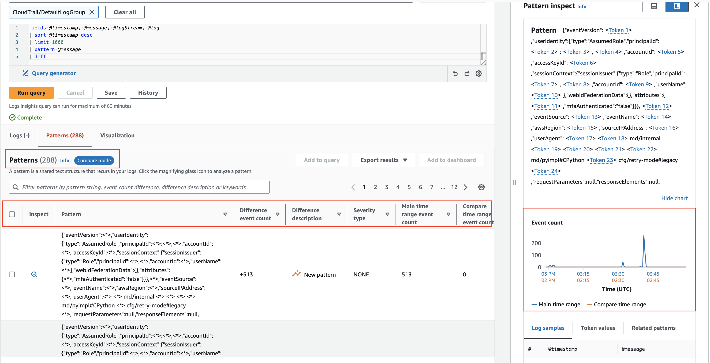

# లాగింగ్

లాగింగ్ టూల్స్ ఎంపిక మీ డేటా ట్రాన్స్‌మిషన్, ఫిల్టరింగ్, రిటెన్షన్, క్యాప్చర్, మరియు మీ డేటాను ఉత్పత్తి చేసే అప్లికేషన్‌లతో ఇంటిగ్రేషన్ అవసరాలకు అనుసంధానంగా ఉంటుంది. Observability కోసం Amazon Web Services ను ఉపయోగించినప్పుడు (మీరు on-premises లేదా మరొక క్లౌడ్ ఎన్విరాన్‌మెంట్‌లో హోస్ట్ చేసినా), విశ్లేషణ కోసం లాగింగ్ డేటాను emit చేయడానికి మీరు [CloudWatch agent](https://docs.aws.amazon.com/AmazonCloudWatch/latest/monitoring/Install-CloudWatch-Agent.html) లేదా [Fluentd](https://www.fluentd.org/) వంటి మరొక టూల్‌ను ఉపయోగించవచ్చు.

ఇక్కడ మేము లాగింగ్ కోసం CloudWatch agent ను అమలు చేయడం మరియు AWS కన్సోల్ లేదా APIs లో CloudWatch Logs ను ఉపయోగించడం కోసం ఉత్తమ పద్ధతులను వివరిస్తాము.

:::info
	CloudWatch agent ను CloudWatch కు [metric డేటా](../../signals/metrics) డెలివరీ కోసం కూడా ఉపయోగించవచ్చు. అమలు వివరాల కోసం [metrics](../metrics) పేజీని చూడండి. OpenTelemetry లేదా X-Ray client SDKs నుండి [traces](../../signals/traces.md) సేకరించడానికి మరియు వాటిని [AWS X-Ray](../xray.md) కు పంపడానికి కూడా దీనిని ఉపయోగించవచ్చు.
:::
## CloudWatch agent తో logs సేకరించడం

### ఫార్వార్డింగ్

Observability కోసం [క్లౌడ్ ఫస్ట్ అప్రోచ్](../../faq/general.md#what-is-a-cloud-first-approach) తీసుకున్నప్పుడు, ఒక నియమంగా, మీరు ఒక మెషీన్‌లో logs పొందడానికి లాగిన్ అవసరమైతే, అది ఒక యాంటీ-ప్యాటర్న్. మీ వర్క్‌లోడ్‌లు వాటి లాగింగ్ డేటాను నియర్ రియల్ టైమ్‌లో లాగ్ ఎనాలిసిస్ సిస్టమ్‌కు బయటకు emit చేయాలి, మరియు ఆ ట్రాన్స్‌మిషన్ మరియు అసలు ఈవెంట్ మధ్య latency అనేది మీ వర్క్‌లోడ్‌కు విపత్తు సంభవిస్తే point-in-time సమాచారం యొక్క సంభావ్య నష్టాన్ని సూచిస్తుంది.

ఒక ఆర్కిటెక్ట్‌గా మీరు లాగింగ్ డేటా కోసం మీ ఆమోదయోగ్యమైన నష్టాన్ని నిర్ణయించి, CloudWatch agent యొక్క [`force_flush_interval`](https://docs.aws.amazon.com/AmazonCloudWatch/latest/monitoring/CloudWatch-Agent-Configuration-File-Details.html#CloudWatch-Agent-Configuration-File-Logssection) ను తదనుగుణంగా సర్దుబాటు చేయాలి.

`force_flush_interval` అనేది buffer సైజ్ చేరుకునే వరకు agent ను క్రమబద్ధమైన వ్యవధిలో డేటా ప్లేన్‌కు లాగింగ్ డేటాను పంపమని ఆదేశిస్తుంది, buffer సైజ్ చేరుకుంటే అది అన్ని buffered logs ను వెంటనే పంపుతుంది.

:::tip
	Edge devices కు తక్కువ-latency, in-AWS వర్క్‌లోడ్‌ల నుండి చాలా భిన్నమైన అవసరాలు ఉండవచ్చు, మరియు చాలా ఎక్కువ `force_flush_interval` సెట్టింగ్‌లు అవసరం కావచ్చు. ఉదాహరణకు, తక్కువ-bandwidth ఇంటర్నెట్ కనెక్షన్‌లో ఉన్న IoT device ప్రతి 15 నిమిషాలకు ఒకసారి మాత్రమే logs flush చేయవలసి రావచ్చు.
:::
:::info
	Containerized లేదా stateless వర్క్‌లోడ్‌లు log flush అవసరాలకు ప్రత్యేకంగా సున్నితంగా ఉండవచ్చు. ఏ క్షణంలోనైనా scale-in అయ్యే stateless Kubernetes అప్లికేషన్ లేదా EC2 fleet ను పరిగణించండి. ఈ resources అకస్మాత్తుగా terminate అయినప్పుడు logs నష్టం జరగవచ్చు, భవిష్యత్తులో వాటి నుండి logs తీయడానికి ఏ మార్గం లేకుండా. ప్రామాణిక `force_flush_interval` సాధారణంగా ఈ సందర్భాలకు సరిపోతుంది, కానీ అవసరమైతే తగ్గించవచ్చు.
:::
### Log groups

CloudWatch Logs లో, ఒక అప్లికేషన్‌కు తార్కికంగా వర్తించే ప్రతి logs సమాహారం ఒకే [log group](https://docs.aws.amazon.com/AmazonCloudWatch/latest/logs/CloudWatchLogsConcepts.html) కు డెలివర్ చేయాలి. ఆ log group లో మీరు లోపల log streams ను సృష్టించే source systems మధ్య *సమానత్వం* కలిగి ఉండాలి.

ఒక LAMP stack ను పరిగణించండి: Apache, MySQL, మీ PHP అప్లికేషన్, మరియు హోస్టింగ్ Linux ఆపరేటింగ్ సిస్టమ్ నుండి logs ప్రతి ఒక్కటి వేర్వేరు log group కు చెందుతాయి.

ఈ గ్రూపింగ్ చాలా ముఖ్యమైనది ఎందుకంటే ఇది మిమ్మల్ని groups ను ఒకే retention period, encryption key, metric filters, subscription filters, మరియు Contributor Insights rules తో చికిత్స చేయడానికి అనుమతిస్తుంది.

:::info
	Log group లో log streams సంఖ్యకు పరిమితి లేదు, మరియు మీరు మీ అప్లికేషన్ కోసం ఒకే CloudWatch Logs Insights query లో మొత్తం logs ద్వారా శోధించవచ్చు. Kubernetes service లో ప్రతి pod కోసం లేదా మీ fleet లో ప్రతి EC2 instance కోసం ఒక ప్రత్యేక log stream కలిగి ఉండటం ఒక ప్రామాణిక pattern.
:::
:::info
	Log group కోసం default retention period *అనిశ్చిత కాలం*. Log group సృష్టించే సమయంలో retention period సెట్ చేయడం ఉత్తమ పద్ధతి.

	మీరు ఇది CloudWatch console లో ఏ సమయంలోనైనా సెట్ చేయవచ్చు, కానీ ఉత్తమ పద్ధతి ఏమిటంటే infrastructure as code (CloudFormation, Cloud Development Kit, మొ.) ఉపయోగించి log group creation తో కలిపి లేదా CloudWatch agent configuration లో `retention_in_days` సెట్టింగ్ ఉపయోగించడం.

	రెండు అప్రోచ్‌లు మీకు log retention period ను ముందుగానే మరియు మీ ప్రాజెక్ట్ యొక్క డేటా retention అవసరాలకు అనుగుణంగా సెట్ చేయడానికి అనుమతిస్తాయి.
:::

:::info
	Log group డేటా CloudWatch Logs లో ఎల్లప్పుడూ encrypt చేయబడుతుంది. డిఫాల్ట్‌గా, CloudWatch Logs విశ్రాంతిలో ఉన్న log డేటా కోసం `server-side` encryption ను ఉపయోగిస్తుంది. ఒక ప్రత్యామ్నాయంగా, మీరు ఈ encryption కోసం AWS Key Management Service ను ఉపయోగించవచ్చు. [AWS KMS ఉపయోగించి Encryption](https://docs.aws.amazon.com/AmazonCloudWatch/latest/logs/encrypt-log-data-kms.html) log group స్థాయిలో ఎనేబుల్ చేయబడుతుంది, log group తో KMS key ను అనుబంధించడం ద్వారా, మీరు log group సృష్టించినప్పుడు లేదా అది ఉన్న తర్వాత. ఇది infrastructure as code (CloudFormation, Cloud Development Kit, మొ.) ఉపయోగించి కాన్ఫిగర్ చేయవచ్చు.

	CloudWatch Logs కోసం keys నిర్వహించడానికి AWS Key Management Service ను ఉపయోగించడానికి అదనపు configuration మరియు మీ users కోసం keys కు permissions ఇవ్వడం అవసరం.[^1]
:::
### Log ఫార్మాటింగ్

CloudWatch Logs log fields ను స్వయంచాలకంగా కనుగొని, ingestion సమయంలో JSON డేటాను index చేసే సామర్థ్యం కలిగి ఉంది. ఈ ఫీచర్ ad hoc queries మరియు filtering ను సులభతరం చేస్తుంది, log డేటా యొక్క ఉపయోగాన్ని మెరుగుపరుస్తుంది. అయితే, ఆటోమేటిక్ indexing structured డేటాకు మాత్రమే వర్తిస్తుందని గమనించడం ముఖ్యం. Unstructured లాగింగ్ డేటా ఆటోమేటిక్‌గా index చేయబడదు కానీ ఇప్పటికీ CloudWatch Logs కు డెలివర్ చేయవచ్చు.

Unstructured logs ను `parse` command తో regular expression ఉపయోగించి ఇప్పటికీ search లేదా query చేయవచ్చు.

:::info
	CloudWatch Logs ఉపయోగించేటప్పుడు log formats కోసం రెండు ఉత్తమ పద్ధతులు:

	1. [Log4j](https://logging.apache.org/log4j/2.x/), [`python-json-logger`](https://pypi.org/project/python-json-logger/), లేదా మీ framework యొక్క native JSON emitter వంటి structured log formatter ను ఉపయోగించండి.
	2. మీ log destination కు ప్రతి event కు ఒక single line of logging పంపండి.

	అనేక JSON logging lines పంపినప్పుడు, ప్రతి line ఒక single event గా interpret చేయబడుతుందని గమనించండి.
:::
### `stdout` హ్యాండ్లింగ్

మా [log signals](../../signals/logs#log-to-stdout) పేజీలో చర్చించినట్లు, లాగింగ్ సిస్టమ్‌లను వాటిని ఉత్పత్తి చేసే అప్లికేషన్‌ల నుండి decouple చేయడం ఉత్తమ పద్ధతి. అయితే `stdout` నుండి ఒక file కు డేటా పంపడం చాలా (అన్ని కాకపోయినా) platforms కోసం ఒక సాధారణ pattern. Kubernetes లేదా [Amazon Elastic Container Service](https://aws.amazon.com/ecs/) వంటి container orchestration systems `stdout` ను log file కు ఆటోమేటిక్‌గా డెలివర్ చేస్తాయి, ఒక collector నుండి ప్రతి log సేకరణను అనుమతిస్తాయి. CloudWatch agent ఈ file ను real time లో చదివి, మీ తరపున డేటాను log group కు ఫార్వర్డ్ చేస్తుంది.

:::info
	సరళీకృత అప్లికేషన్ లాగింగ్ `stdout` కు, agent ద్వారా సేకరణ pattern ను వీలైనంత ఎక్కువగా ఉపయోగించండి.
:::
### Logs ఫిల్టరింగ్

వ్యక్తిగత డేటా యొక్క నిరంతర నిల్వను నిరోధించడం లేదా నిర్దిష్ట log level డేటాను మాత్రమే capture చేయడం వంటి మీ logs ను filter చేయడానికి అనేక కారణాలు ఉన్నాయి. ఏదేమైనా, ఈ filtering ను మూల వ్యవస్థకు వీలైనంత దగ్గరగా నిర్వహించడం ఉత్తమ పద్ధతి. CloudWatch విషయంలో, ఇది విశ్లేషణ కోసం CloudWatch Logs లోకి డేటా డెలివర్ చేయబడటానికి *ముందు* అని అర్థం. CloudWatch agent మీ కోసం ఈ filtering చేయగలదు.

:::info
	మీకు కావలసిన log levels ను `include` చేయడానికి మరియు క్రెడిట్ కార్డ్ నంబర్లు, ఫోన్ నంబర్లు మొదలైన అనుచితమైన patterns ను `exclude` చేయడానికి [`filters`](https://docs.aws.amazon.com/AmazonCloudWatch/latest/monitoring/CloudWatch-Agent-Configuration-File-Details.html#CloudWatch-Agent-Configuration-File-Logssection) ఫీచర్ ఉపయోగించండి.
:::
:::tip
	మీ logs లోకి సంభావ్యంగా లీక్ అయ్యే నిర్దిష్ట రకాల తెలిసిన డేటాను filter out చేయడం సమయం తీసుకునే మరియు లోపాలకు అవకాశం ఉన్న పని. అయితే, నిర్దిష్ట రకాల తెలిసిన అనుచితమైన డేటాను (ఉదా. క్రెడిట్ కార్డ్ నంబర్లు, Social Security నంబర్లు) హ్యాండిల్ చేసే వర్క్‌లోడ్‌ల కోసం, ఈ records కోసం filter కలిగి ఉండటం భవిష్యత్తులో సంభావ్య హానికరమైన compliance సమస్యను నిరోధించగలదు. ఉదాహరణకు, Social Security నంబర్ కలిగి ఉన్న అన్ని records ను drop చేయడం ఈ configuration వలె సరళంగా ఉంటుంది:

	```
	"filters": [
      {
        "type": "exclude",
        "expression": "\b(?!000|666|9\d{2})([0-8]\d{2}|7([0-6]\d))([-]?|\s{1})(?!00)\d\d\2(?!0000)\d{4}\b"
      }
    ]
    ```
:::

### Multi-line లాగింగ్

అన్ని లాగింగ్ కోసం ఉత్తమ పద్ధతి ప్రతి discrete log event కోసం single line emit చేయబడే [structured logging](../../signals/logs#structured-logging-is-key-to-success) ఉపయోగించడం. అయితే, ఈ option లేని అనేక legacy మరియు ISV-supported అప్లికేషన్‌లు ఉన్నాయి. ఈ వర్క్‌లోడ్‌ల కోసం, CloudWatch Logs ప్రతి line ను ఒక unique event గా interpret చేస్తుంది, అవి multi-line-aware protocol ఉపయోగించి emit చేయబడకపోతే. CloudWatch agent దీనిని [`multi_line_start_pattern`](https://docs.aws.amazon.com/AmazonCloudWatch/latest/monitoring/CloudWatch-Agent-Configuration-File-Details.html#CloudWatch-Agent-Configuration-File-Logssection) directive తో నిర్వహించగలదు.

:::info
	CloudWatch Logs లోకి multi-line logging ingest చేయడం యొక్క భారాన్ని తగ్గించడానికి `multi_line_start_pattern` directive ను ఉపయోగించండి.
:::
### లాగింగ్ class కాన్ఫిగర్ చేయడం

CloudWatch Logs log groups యొక్క రెండు [classes](https://docs.aws.amazon.com/AmazonCloudWatch/latest/logs/CloudWatch_Logs_Log_Classes.html) అందిస్తుంది:

- CloudWatch Logs Standard log class అనేది real-time monitoring అవసరమైన logs లేదా మీరు తరచుగా access చేసే logs కోసం పూర్తి-ఫీచర్ option.

- CloudWatch Logs Infrequent Access log class అనేది మీ logs ను ఖర్చు-సమర్థంగా consolidate చేయడానికి ఉపయోగించగల కొత్త log class. ఈ log class managed ingestion, storage, cross-account log analytics, మరియు encryption తో CloudWatch Logs సామర్థ్యాల subset ను తక్కువ ingestion ధర per GB తో అందిస్తుంది. Infrequent Access log class అరుదుగా access చేసే logs పై ad-hoc querying మరియు after-the-fact forensic analysis కోసం అనువైనది.

:::info
	కొత్త log group కోసం ఏ log group class ఉపయోగించాలో specify చేయడానికి `log_group_class` directive ను ఉపయోగించండి. చెల్లుబాటు అయ్యే values **STANDARD** మరియు **INFREQUENT_ACCESS**. మీరు ఈ field ను వదిలివేస్తే, agent **STANDARD** default ఉపయోగిస్తుంది.
:::

#### సరైన class నిర్ధారణ కోసం ఉన్న logs ను audit చేయడం

CloudWatch logs Infrequent Access tier log class CloudWatch logging సామర్థ్యాల subset ను ఉపయోగిస్తుంది. ఏవైనా standard log groups Infrequent Access log groups గా మళ్ళీ సృష్టించగలవా అని తనిఖీ చేయడానికి ఉన్న log groups ను audit చేయడం సిఫార్సు చేయబడింది. దీన్ని చేయడానికి మంచి మార్గం [log-ia-checker](https://github.com/aws-observability/log-ia-checker) cli tool ను run చేయడం. ఈ tool ఇచ్చిన region లో అన్ని log groups ను analyze చేసి, Infrequent Access కు transition చేయగల logs యొక్క output ను అందిస్తుంది.

## CloudWatch Logs తో శోధన

### Query scoping తో ఖర్చులను నిర్వహించడం

CloudWatch Logs లోకి డేటా డెలివర్ చేయబడిన తర్వాత, మీరు అవసరమైనప్పుడు దాని ద్వారా శోధించవచ్చు. CloudWatch Logs scan చేసిన డేటా gigabyte కు charge చేస్తుందని గుర్తుంచుకోండి. మీ query scope ను నియంత్రణలో ఉంచడానికి వ్యూహాలు ఉన్నాయి, ఇది scan చేసిన డేటాను తగ్గిస్తుంది.

:::info
	మీ logs ను శోధించేటప్పుడు మీ సమయం మరియు తేదీ పరిధి సరిగ్గా ఉందో నిర్ధారించుకోండి. CloudWatch Logs scans కోసం relative లేదా absolute time ranges సెట్ చేయడానికి అనుమతిస్తుంది. *మీరు మునుపటి రోజు నుండి entries మాత్రమే చూస్తుంటే, ఈ రోజు logs scans చేర్చడం అవసరం లేదు!*
:::

:::info
	మీరు ఒకే query లో అనేక log groups ను search చేయవచ్చు, కానీ అలా చేయడం వలన ఎక్కువ డేటా scan అవుతుంది. మీరు target చేయాల్సిన log group(s) ను గుర్తించిన తర్వాత, మీ query scope ను సరిపోయేలా తగ్గించండి.
:::

:::tip
	ప్రతి query ఎంత డేటాను scan చేస్తుందో CloudWatch console నుండి నేరుగా చూడవచ్చు. ఈ approach సమర్థవంతమైన queries సృష్టించడంలో మీకు సహాయపడగలదు.

	
:::

### విజయవంతమైన Queries ను ఇతరులతో పంచుకోండి

[CloudWatch Logs query syntax](https://docs.aws.amazon.com/AmazonCloudWatch/latest/logs/CWL_QuerySyntax.html) సంక్లిష్టం కానప్పటికీ, కొన్ని queries ను మొదటి నుండి వ్రాయడం ఇప్పటికీ సమయం తీసుకుంటుంది. ఒకే AWS account లోని ఇతర users తో బాగా వ్రాసిన queries ను share చేయడం అప్లికేషన్ logs యొక్క పరిశోధనను సులభతరం చేయగలదు. ఇది [AWS Management Console](https://docs.aws.amazon.com/AmazonCloudWatch/latest/logs/CWL_Insights-Saving-Queries.html) నుండి నేరుగా లేదా [CloudFormation](https://docs.aws.amazon.com/AWSCloudFormation/latest/UserGuide/aws-resource-logs-querydefinition.html) లేదా [AWS CDK](https://docs.aws.amazon.com/cdk/api/v2/docs/aws-cdk-lib.aws_logs.CfnQueryDefinition.html) ఉపయోగించి ప్రోగ్రామాటిక్‌గా సాధించవచ్చు. ఇలా చేయడం log డేటాను analyze చేయాల్సిన ఇతరుల కోసం అవసరమైన rework మొత్తాన్ని తగ్గిస్తుంది.

:::info
	తరచుగా పునరావృతమయ్యే queries ను CloudWatch Logs లో save చేయండి, తద్వారా అవి మీ users కోసం prepopulate చేయబడతాయి.

	
:::

### Pattern analysis

CloudWatch Logs Insights మీ logs ను query చేసినప్పుడు patterns కనుగొనడానికి machine learning algorithms ను ఉపయోగిస్తుంది. ఒక pattern అనేది మీ log fields మధ్య పునరావృతమయ్యే shared text structure. Patterns పెద్ద log sets ను analyze చేయడానికి ఉపయోగకరంగా ఉంటాయి ఎందుకంటే పెద్ద సంఖ్యలో log events ను తరచుగా కొన్ని patterns లోకి compress చేయవచ్చు.[^2]

:::info
	మీ log డేటాను ఆటోమేటిక్‌గా patterns లోకి cluster చేయడానికి pattern ను ఉపయోగించండి.

	
:::

### మునుపటి time ranges తో Compare (diff) చేయడం

CloudWatch Logs Insights కాలానుగుణంగా log event మార్పులను పోల్చడాన్ని ఎనేబుల్ చేస్తుంది, error detection మరియు trend identification లో సహాయపడుతుంది. Comparison queries patterns ను వెల్లడిస్తాయి, శీఘ్ర trend analysis ను సులభతరం చేస్తాయి, లోతైన పరిశోధన కోసం sample raw log events ను పరిశీలించే సామర్థ్యంతో. Queries రెండు time periods కు వ్యతిరేకంగా analyze చేయబడతాయి: ఎంచుకున్న period మరియు సమాన-పొడవు comparison period.[^3]

:::info
	కాలానుగుణంగా మీ log events లో మార్పులను `diff` command ఉపయోగించి compare చేయండి.

	
:::

[^1]: CloudWatch Logs log group encryption మరియు access privileges యొక్క ఆచరణాత్మక ఉదాహరణ కోసం [How to search through your AWS Systems Manager Session Manager console logs – Part 1](https://aws.amazon.com/blogs/mt/how-to-search-through-your-aws-systems-manager-session-manager-console-logs-part-1/) చూడండి.

[^2]: మరింత వివరమైన insights కోసం [CloudWatch Logs Insights Pattern Analysis](https://docs.aws.amazon.com/AmazonCloudWatch/latest/logs/CWL_AnalyzeLogData_Patterns.html) చూడండి.

[^3]: మరింత సమాచారం కోసం [CloudWatch Logs Insights Compare(diff) with previous ranges](https://docs.aws.amazon.com/AmazonCloudWatch/latest/logs/CWL_AnalyzeLogData_Compare.html) చూడండి.
