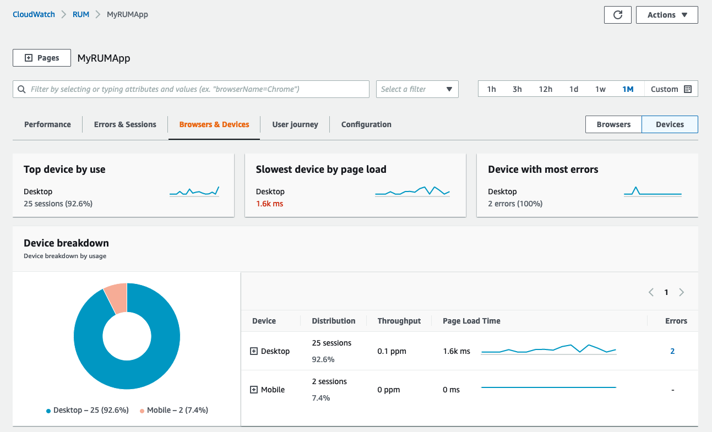

# రియల్ యూజర్ మానిటరింగ్

CloudWatch RUM తో, మీరు వాస్తవ వినియోగదారు సెషన్‌ల నుండి మీ వెబ్ అప్లికేషన్ పనితీరు గురించి క్లయింట్-వైపు డేటాను దాదాపు నిజ సమయంలో సేకరించడానికి మరియు వీక్షించడానికి real user monitoring చేయవచ్చు. మీరు విజువలైజ్ చేయగల మరియు విశ్లేషించగల డేటాలో పేజీ లోడ్ సమయాలు, క్లయింట్-వైపు లోపాలు మరియు వినియోగదారు ప్రవర్తన ఉన్నాయి. మీరు ఈ డేటాను చూసినప్పుడు, మీరు దానిని అన్నింటినీ కలిసి సమగ్రంగా చూడవచ్చు, మరియు మీ కస్టమర్లు ఉపయోగించే బ్రౌజర్‌లు మరియు పరికరాల వారీగా బ్రేక్‌డౌన్‌లను కూడా చూడవచ్చు.



## వెబ్ క్లయింట్

CloudWatch RUM వెబ్ క్లయింట్ Node.js వెర్షన్ 16 లేదా అంతకంటే ఎక్కువ ఉపయోగించి అభివృద్ధి చేయబడింది మరియు నిర్మించబడింది. కోడ్ GitHub లో [పబ్లిక్‌గా అందుబాటులో](https://github.com/aws-observability/aws-rum-web) ఉంది. మీరు [Angular](https://github.com/aws-observability/aws-rum-web/blob/main/docs/cdn_angular.md) మరియు [React](https://github.com/aws-observability/aws-rum-web/blob/main/docs/cdn_react.md) అప్లికేషన్‌లతో క్లయింట్‌ను ఉపయోగించవచ్చు.

CloudWatch RUM మీ అప్లికేషన్ యొక్క లోడ్ సమయం, పనితీరు మరియు అన్‌లోడ్ సమయంపై గుర్తించదగిన ప్రభావాన్ని సృష్టించకుండా రూపొందించబడింది.

:::note
    CloudWatch RUM కోసం మీరు సేకరించే ఎండ్ యూజర్ డేటా 30 రోజులు భద్రపరచబడుతుంది మరియు తర్వాత స్వయంచాలకంగా తొలగించబడుతుంది. మీరు RUM ఈవెంట్‌లను ఎక్కువ కాలం ఉంచాలనుకుంటే, మీ ఖాతాలోని CloudWatch Logs కు ఈవెంట్‌ల కాపీలను పంపడానికి app monitor ను ఎంచుకోవచ్చు.
:::
:::tip
    మీ వెబ్ అప్లికేషన్ కోసం ad blockers ద్వారా సంభావ్య అంతరాయాన్ని నివారించడం ఆందోళన అయితే, మీరు వెబ్ క్లయింట్‌ను మీ స్వంత content delivery network పై లేదా మీ స్వంత వెబ్ సైట్ లోపల హోస్ట్ చేయాలనుకోవచ్చు. మీ స్వంత origin domain నుండి వెబ్ క్లయింట్‌ను హోస్ట్ చేయడంపై మా [GitHub లో డాక్యుమెంటేషన్](https://github.com/aws-observability/aws-rum-web/blob/main/docs/cdn_installation.md) మార్గదర్శకత్వం అందిస్తుంది.
:::

## మీ అప్లికేషన్‌ను అధికారం చేయండి

CloudWatch RUM ను ఉపయోగించడానికి, మీ అప్లికేషన్‌కు మూడు ఎంపికలలో ఒకదాని ద్వారా అధికారం ఉండాలి.

1. మీరు ఇప్పటికే సెటప్ చేసిన ఉన్న identity provider నుండి authentication ఉపయోగించండి.
1. ఉన్న Amazon Cognito identity pool ను ఉపయోగించండి
1. అప్లికేషన్ కోసం కొత్త Amazon Cognito identity pool ను CloudWatch RUM సృష్టించనివ్వండి

:::info
    అప్లికేషన్ కోసం కొత్త Amazon Cognito identity pool ను CloudWatch RUM సృష్టించనివ్వడం సెటప్ చేయడానికి తక్కువ ప్రయత్నం అవసరం. ఇది డిఫాల్ట్ ఎంపిక.
:::
:::tip
    CloudWatch RUM ను unauthenticated users ను authenticated users నుండి వేరు చేయడానికి కాన్ఫిగర్ చేయవచ్చు. వివరాల కోసం [ఈ బ్లాగ్ పోస్ట్](https://aws.amazon.com/blogs/mt/how-to-isolate-signed-in-users-from-guest-users-within-amazon-cloudwatch-rum/) చూడండి.
:::
## డేటా ప్రొటెక్షన్ & ప్రైవసీ

CloudWatch RUM క్లయింట్ ఎండ్ యూజర్ డేటాను సేకరించడానికి సహాయపడటానికి cookies ను ఉపయోగించగలదు. ఇది user journey ఫీచర్ కోసం ఉపయోగకరంగా ఉంటుంది, కానీ అవసరం కాదు. ప్రైవసీ సంబంధిత సమాచారం కోసం [మా వివరమైన డాక్యుమెంటేషన్](https://docs.aws.amazon.com/AmazonCloudWatch/latest/monitoring/CloudWatch-RUM-privacy.html) చూడండి.[^1]

:::tip
    RUM ఉపయోగించి వెబ్ అప్లికేషన్ టెలిమెట్రీ సేకరణ సురక్షితమైనది మరియు console లేదా CloudWatch Logs ద్వారా personally identifiable information (PII) ను మీకు బహిర్గతం చేయదు, కానీ మీరు వెబ్ క్లయింట్ ద్వారా [custom attribute](https://docs.aws.amazon.com/AmazonCloudWatch/latest/monitoring/CloudWatch-RUM-custom-metadata.html) సేకరించగలరని గుర్తుంచుకోండి. ఈ మెకానిజం ఉపయోగించి సున్నితమైన డేటాను బహిర్గతం చేయకుండా జాగ్రత్తగా ఉండండి.
:::

## క్లయింట్ కోడ్ స్నిప్పెట్

CloudWatch RUM వెబ్ క్లయింట్ కోసం కోడ్ స్నిప్పెట్ స్వయంచాలకంగా జనరేట్ చేయబడుతుంది, మీరు మీ అవసరాలకు అనుగుణంగా క్లయింట్‌ను కాన్ఫిగర్ చేయడానికి కోడ్ స్నిప్పెట్‌ను మాన్యువల్‌గా కూడా మార్చవచ్చు.
:::info
    Single page applications లో cookie creation ను డైనమిక్‌గా ఎనేబుల్ చేయడానికి cookie consent mechanism ఉపయోగించండి. మరింత సమాచారం కోసం [ఈ బ్లాగ్ పోస్ట్](https://aws.amazon.com/blogs/mt/how-and-when-to-enable-session-cookies-with-amazon-cloudwatch-rum/) చూడండి.
:::
### URL సేకరణను నిలిపివేయండి

వ్యక్తిగత సమాచారం కలిగి ఉండే resource URL ల సేకరణను నివారించండి.

:::info
    మీ అప్లికేషన్ personally identifiable information (PII) కలిగి ఉన్న URL లను ఉపయోగిస్తుంటే, మీ అప్లికేషన్‌లో చేర్చడానికి ముందు కోడ్ స్నిప్పెట్ కాన్ఫిగరేషన్‌లో `recordResourceUrl: false` సెట్ చేయడం ద్వారా resource URL ల సేకరణను నిలిపివేయమని మేము గట్టిగా సిఫారసు చేస్తున్నాము.
:::

### Active Tracing ను ఎనేబుల్ చేయండి

వెబ్ క్లయింట్‌లో `addXRayTraceIdHeader: true` సెట్ చేయడం ద్వారా ఎండ్-టు-ఎండ్ ట్రేసింగ్ ఎనేబుల్ చేయండి. ఇది CloudWatch RUM వెబ్ క్లయింట్ HTTP అభ్యర్థనలకు X-Ray trace header ను జోడించేలా చేస్తుంది.

మీరు ఈ ఐచ్ఛిక సెట్టింగ్‌ను ఎనేబుల్ చేస్తే, app monitor ద్వారా శాంపిల్ చేయబడిన user sessions సమయంలో చేయబడిన XMLHttpRequest మరియు fetch అభ్యర్థనలు ట్రేస్ చేయబడతాయి. మీరు RUM డాష్‌బోర్డ్, CloudWatch ServiceLens console మరియు X-Ray console లో ఈ user sessions నుండి traces మరియు segments ను చూడవచ్చు.

మీ కోడ్ స్నిప్పెట్‌లో సెట్టింగ్ స్వయంచాలకంగా ఎనేబుల్ చేయబడటానికి AWS Console లో మీ application monitor ను సెటప్ చేసేటప్పుడు active tracing ను ఎనేబుల్ చేయడానికి checkbox ను క్లిక్ చేయండి.


### స్నిప్పెట్‌ను చొప్పించడం

మీ అప్లికేషన్ యొక్క `<head>` ఎలిమెంట్ లోపల మునుపటి విభాగంలో మీరు కాపీ చేసిన లేదా డౌన్‌లోడ్ చేసిన కోడ్ స్నిప్పెట్‌ను చొప్పించండి. `<body>` ఎలిమెంట్ లేదా ఏదైనా ఇతర `<script>` ట్యాగ్‌ల ముందు దీన్ని చొప్పించండి.

:::info
    మీ అప్లికేషన్‌కు బహుళ పేజీలు ఉంటే, అన్ని పేజీలలో చేర్చబడిన షేర్డ్ header component లో కోడ్ స్నిప్పెట్‌ను చొప్పించండి.
:::

:::warning
    వెబ్ క్లయింట్ `<head>` ఎలిమెంట్‌లో సాధ్యమైనంత ముందుగా ఉండటం చాలా ముఖ్యం! పేజీ HTML దిగువన లోడ్ చేయబడే passive web trackers వలె కాకుండా, RUM అత్యధిక పనితీరు డేటాను సంగ్రహించడానికి పేజీ రెండర్ ప్రాసెస్‌లో ముందుగా instantiate చేయబడాలి.
:::
## కస్టమ్ Metadata ఉపయోగించండి

మీరు CloudWatch RUM ఈవెంట్‌ల డిఫాల్ట్ [event metadata](https://docs.aws.amazon.com/AmazonCloudWatch/latest/monitoring/CloudWatch-RUM-datacollected.html#CloudWatch-RUM-datacollected-metadata) కు కస్టమ్ metadata ను జోడించవచ్చు. Session attributes వినియోగదారు సెషన్‌లోని అన్ని ఈవెంట్‌లకు జోడించబడతాయి. Page attributes నిర్దిష్టంగా పేర్కొన్న పేజీలకు మాత్రమే జోడించబడతాయి.

:::info
    మీ కస్టమ్ attributes కోసం key names గా [ఈ పేజీ](https://docs.aws.amazon.com/AmazonCloudWatch/latest/monitoring/CloudWatch-RUM-custom-metadata.html#CloudWatch-RUM-custom-metadata-syntax) లో నమోదు చేయబడిన reserved keywords ను ఉపయోగించడం మానుకోండి
:::
## Page Groups ఉపయోగించండి

:::info
    మీ అప్లికేషన్‌లో వివిధ పేజీలను ఒకదానితో మరొకటి అనుబంధించడానికి page groups ను ఉపయోగించండి, తద్వారా మీరు పేజీల సమూహాల కోసం సమగ్ర విశ్లేషణలను చూడగలరు. ఉదాహరణకు, మీ అన్ని పేజీల యొక్క సమగ్ర పేజీ లోడ్ సమయాలను రకం మరియు భాష వారీగా చూడాలనుకోవచ్చు.

    ```
    awsRum.recordPageView({ pageId: '/home', pageTags: ['en', 'landing']})
    ```
:::
## Extended Metrics ఉపయోగించండి

CloudWatch RUM ద్వారా స్వయంచాలకంగా సేకరించబడే [డిఫాల్ట్ మెట్రిక్స్ సెట్](https://docs.aws.amazon.com/AmazonCloudWatch/latest/monitoring/CloudWatch-RUM-metrics.html) `AWS/RUM` అనే metric namespace లో ప్రచురించబడుతుంది. ఇవి RUM మీ తరపున సృష్టించే ఉచిత, [vended metrics](./metrics.md#vended-metrics).

:::info
    CloudWatch RUM మెట్రిక్స్‌లో ఏదైనా అదనపు dimensions తో CloudWatch కు పంపండి, తద్వారా మెట్రిక్స్ మీకు మరింత సూక్ష్మ-స్థాయి వీక్షణను అందిస్తాయి.
:::
extended metrics కోసం కింది dimensions మద్దతు ఇవ్వబడతాయి:

- BrowserName
- CountryCode - ISO-3166 ఫార్మాట్ (రెండు-అక్షరాల కోడ్)
- DeviceType
- FileType
- OSName
- PageId

అయితే, మీరు మీ స్వంత మెట్రిక్స్ మరియు వాటి ఆధారంగా అలారాలను [ఈ పేజీ నుండి మా మార్గదర్శకత్వం](https://aws.amazon.com/blogs/mt/create-metrics-and-alarms-for-specific-web-pages-amazon-cloudwatch-rum/) ఉపయోగించి సృష్టించవచ్చు. ఈ విధానం మీకు అవసరమైన ఏదైనా datapoint, URI లేదా ఇతర component కోసం పనితీరును మానిటర్ చేయడానికి అనుమతిస్తుంది.

[^1]: CloudWatch RUM తో cookies ఉపయోగించేటప్పుడు పరిగణనలను చర్చించే మా [బ్లాగ్ పోస్ట్](https://aws.amazon.com/blogs/mt/how-and-when-to-enable-session-cookies-with-amazon-cloudwatch-rum/) చూడండి.
