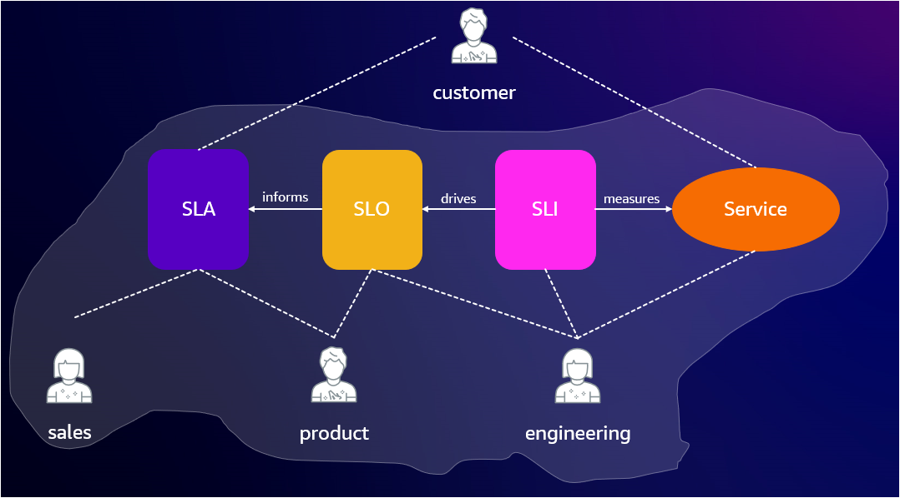

# Service Level Objectives (SLOs)

అధికంగా అందుబాటులో ఉండే మరియు తట్టుకునే అప్లికేషన్‌లు మీ కంపెనీకి క్రియాశీల వ్యాపార చోదకమా**?**  
సమాధానం '**అవును**' అయితే, చదవడం కొనసాగించండి.

వైఫల్యాలు తప్పనిసరి మరియు కాలక్రమంలో ప్రతిదీ చివరికి విఫలమవుతుంది! స్కేల్ చేయవలసిన అప్లికేషన్‌లను నిర్మిస్తున్నప్పుడు ఇది మరింత ముఖ్యమైన పాఠం అవుతుంది. ఇక్కడ SLO ల ప్రాముఖ్యత వస్తుంది.

SLO లు క్లిష్టమైన ఎండ్-యూజర్ జర్నీల ఆధారంగా సేవ అందుబాటు కోసం అంగీకరించిన లక్ష్యాన్ని కొలుస్తాయి. ఆ అంగీకరించిన లక్ష్యం మీ కస్టమర్ / ఎండ్-యూజర్‌కు ఏది ముఖ్యమో దాని చుట్టూ రూపొందించబడాలి. అటువంటి తట్టుకునే వ్యవస్థను నిర్మించడానికి, మీరు పనితీరును ఆబ్జెక్టివ్‌గా కొలవాలి మరియు అర్థవంతమైన, వాస్తవిక మరియు చర్య తీసుకోగల SLO లను ఉపయోగించి విశ్వసనీయతను ఖచ్చితంగా నివేదించాలి. ఇప్పుడు, ముఖ్యమైన సేవా స్థాయి పరిభాషలతో పరిచయం చేసుకుందాం.

## సేవా స్థాయి పరిభాష

- SLI అనేది service level indicator: అందించబడే సేవా స్థాయిలోని కొన్ని అంశాల యొక్క జాగ్రత్తగా నిర్వచించబడిన పరిమాణాత్మక కొలత.

- SLO అనేది service level objective: ఒక కాల వ్యవధిలో SLI ద్వారా కొలవబడే సేవా స్థాయి కోసం ఒక లక్ష్య విలువ లేదా విలువల పరిధి.

- SLA అనేది service level agreement: SLO లను చేరుకోలేకపోవడం వల్ల కలిగే పరిణామాలను కలిగి ఉన్న మీ కస్టమర్లతో ఒప్పందం.

SLA అనేది ఒక 'వాగ్దానం/ఒప్పందం', SLO అనేది ఒక 'లక్ష్యం/టార్గెట్ విలువ', మరియు SLI అనేది 'సేవ ఎలా పని చేసింది?' అనే కొలత అని కింది రేఖాచిత్రం వివరిస్తుంది.

### వీటన్నింటిని మానిటర్ చేయడానికి AWS టూల్ ఉందా?

సమాధానం '**అవును**'!

[Amazon CloudWatch Application Signals](https://docs.aws.amazon.com/AmazonCloudWatch/latest/monitoring/CloudWatch-Application-Monitoring-Sections.html) అనేది AWS పై అప్లికేషన్‌లను స్వయంచాలకంగా ఇన్‌స్ట్రుమెంట్ చేయడం మరియు ఆపరేట్ చేయడం సులభతరం చేసే కొత్త సామర్థ్యం. Application Signals మీ అప్లికేషన్‌ల ఆరోగ్యాన్ని మానిటర్ చేయడానికి మరియు మీ వ్యాపార లక్ష్యాలకు అనుగుణంగా పనితీరును ట్రాక్ చేయడానికి AWS పై మీ అప్లికేషన్‌లను ఇన్‌స్ట్రుమెంట్ చేస్తుంది. Application Signals మీ అప్లికేషన్‌లు, సేవలు మరియు డిపెండెన్సీల యొక్క ఏకీకృత, అప్లికేషన్-కేంద్రిత వీక్షణను అందిస్తుంది మరియు అప్లికేషన్ ఆరోగ్యాన్ని మానిటర్ చేయడానికి మరియు ట్రయేజ్ చేయడానికి సహాయపడుతుంది. Application Signals Amazon EKS, Amazon ECS మరియు Amazon EC2 లో మద్దతు మరియు పరీక్షించబడింది, మరియు ఇది వ్రాసే సమయంలో, Java అప్లికేషన్‌లకు మాత్రమే మద్దతు ఇస్తుంది!

Application Signals మీ ప్రధాన పనితీరు మెట్రిక్స్‌పై SLO లను సెట్ చేయడానికి సహాయపడుతుంది. మీ క్లిష్టమైన వ్యాపార కార్యకలాపాల కోసం సేవల కోసం service level objectives ను సృష్టించడానికి మీరు Application Signals ను ఉపయోగించవచ్చు. ఈ సేవలపై SLO లను సృష్టించడం ద్వారా, మీరు SLO డాష్‌బోర్డ్‌పై వాటిని ట్రాక్ చేయగలరు, మీ అత్యంత ముఖ్యమైన కార్యకలాపాల యొక్క ఒక చూపులో వీక్షణను అందిస్తుంది. మూల కారణ గుర్తింపును వేగవంతం చేయడానికి, Application Signals క్లిష్టమైన API లు మరియు యూజర్ ఇంటరాక్షన్‌లను మానిటర్ చేసే CloudWatch Synthetics మరియు నిజమైన వినియోగదారు పనితీరును మానిటర్ చేసే CloudWatch RUM నుండి అదనపు పనితీరు సిగ్నల్‌లను ఏకీకృతం చేస్తూ అప్లికేషన్ పనితీరు యొక్క సమగ్ర వీక్షణను అందిస్తుంది.

Application Signals స్వయంచాలకంగా కనుగొనే ప్రతి సేవ మరియు ఆపరేషన్ కోసం లేటెన్సీ మరియు అందుబాటు మెట్రిక్స్‌ను సేకరిస్తుంది, మరియు ఈ మెట్రిక్స్ SLI లుగా ఉపయోగించడానికి తరచుగా ఆదర్శంగా ఉంటాయి. అదే సమయంలో, Application Signals ఏదైనా CloudWatch మెట్రిక్ లేదా మెట్రిక్ ఎక్స్‌ప్రెషన్‌ను SLI గా ఉపయోగించే సౌలభ్యాన్ని మీకు అందిస్తుంది!

Application Signals అప్లికేషన్ పనితీరు కోసం ఉత్తమ పద్ధతుల ఆధారంగా అప్లికేషన్‌లను స్వయంచాలకంగా ఇన్‌స్ట్రుమెంట్ చేస్తుంది మరియు Amazon EKS పై నడుస్తున్న అప్లికేషన్‌ల కోసం మెట్రిక్స్, ట్రేసెస్, లాగ్‌లు, real user monitoring మరియు synthetic monitoring అంతటా టెలిమెట్రీని కొరిలేట్ చేస్తుంది. మరింత వివరాల కోసం ఈ [బ్లాగ్](https://aws.amazon.com/blogs/aws/amazon-cloudwatch-application-signals-for-automatic-instrumentation-of-your-applications-preview/) చదవండి.

CloudWatch Application Signals లో SLO ను సెటప్ చేసి సేవ యొక్క విశ్వసనీయతను ఎలా మానిటర్ చేయాలో తెలుసుకోవడానికి ఈ [బ్లాగ్](https://aws.amazon.com/blogs/mt/how-to-monitor-application-health-using-slos-with-amazon-cloudwatch-application-signals/) చూడండి.

Observability అనేది విశ్వసనీయ సేవను స్థాపించడానికి ఒక పునాది అంశం, తద్వారా మీ సంస్థ స్కేల్‌లో సమర్థవంతంగా పనిచేయడానికి సరిగ్గా మార్గంలో ఉంటుంది. [Amazon CloudWatch Application Signals](https://docs.aws.amazon.com/AmazonCloudWatch/latest/monitoring/CloudWatch-Application-Monitoring-Sections.html) ఆ లక్ష్యాన్ని సాధించడంలో మీకు సహాయపడే అద్భుతమైన సాధనంగా ఉంటుందని మేము విశ్వసిస్తున్నాము.
