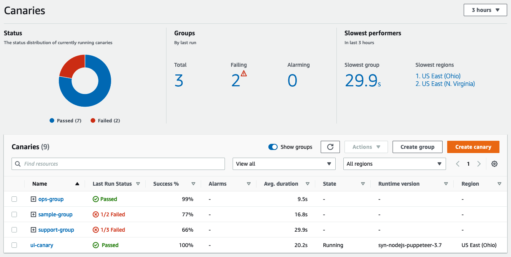

# సింథెటిక్ టెస్టింగ్

Amazon CloudWatch Synthetics వాస్తవ వినియోగదారులు లేనప్పటికీ, కస్టమర్ దృష్టికోణం నుండి అప్లికేషన్‌లను మానిటర్ చేయడానికి మిమ్మల్ని అనుమతిస్తుంది. మీ APIలు మరియు వెబ్‌సైట్ అనుభవాలను నిరంతరం టెస్ట్ చేయడం ద్వారా, వినియోగదారు ట్రాఫిక్ లేనప్పుడు కూడా సంభవించే అడపాదడపా సమస్యలపై దృశ్యమానత పొందవచ్చు.

క్యానరీలు కాన్ఫిగర్ చేయగల స్క్రిప్ట్‌లు, వీటిని మీ APIలు మరియు వెబ్‌సైట్ అనుభవాలను 24x7 నిరంతరం టెస్ట్ చేయడానికి షెడ్యూల్‌లో రన్ చేయవచ్చు. అవి వాస్తవ-వినియోగదారుల వలె అదే కోడ్ పాత్‌లు మరియు నెట్‌వర్క్ రూట్‌లను అనుసరిస్తాయి, మరియు లేటెన్సీ, పేజీ లోడ్ ఎర్రర్‌లు, విరిగిన లేదా డెడ్ లింక్‌లు మరియు విరిగిన వినియోగదారు వర్క్‌ఫ్లోలతో సహా ఊహించని ప్రవర్తన గురించి మీకు నోటిఫై చేయగలవు.

:::note
    మీకు యాజమాన్యం లేదా అనుమతులు ఉన్న ఎండ్‌పాయింట్‌లు మరియు APIలను మాత్రమే మానిటర్ చేయడానికి Synthetics క్యానరీలను ఉపయోగించేలా నిర్ధారించుకోండి. క్యానరీ ఫ్రీక్వెన్సీ సెట్టింగ్‌లపై ఆధారపడి, ఈ ఎండ్‌పాయింట్‌లు పెరిగిన ట్రాఫిక్‌ను అనుభవించవచ్చు.
:::
## ప్రారంభించడం

### పూర్తి కవరేజ్

:::tip
    మీ టెస్టింగ్ వ్యూహాన్ని అభివృద్ధి చేసేటప్పుడు, మీ Amazon VPC లోని పబ్లిక్ మరియు [ప్రైవేట్ ఇంటర్నల్ ఎండ్‌పాయింట్‌లు](https://aws.amazon.com/blogs/mt/monitor-your-private-endpoints-using-cloudwatch-synthetics/) రెండింటినీ పరిగణించండి.
:::
### కొత్త క్యానరీలను రికార్డ్ చేయడం

[CloudWatch Synthetics Recorder](https://chrome.google.com/webstore/detail/cloudwatch-synthetics-rec/bhdnlmmgiplmbcdmkkdfplenecpegfno) Chrome బ్రౌజర్ ప్లగిన్ సంక్లిష్ట వర్క్‌ఫ్లోలతో కొత్త క్యానరీ టెస్ట్ స్క్రిప్ట్‌లను మొదటి నుండి త్వరగా నిర్మించడానికి మిమ్మల్ని అనుమతిస్తుంది. రికార్డింగ్ సమయంలో తీసుకున్న టైప్ మరియు క్లిక్ చర్యలు Node.js స్క్రిప్ట్‌గా మార్చబడతాయి, దీనిని క్యానరీ సృష్టించడానికి ఉపయోగించవచ్చు. CloudWatch Synthetics Recorder యొక్క తెలిసిన పరిమితులు [ఈ పేజీ](https://docs.aws.amazon.com/AmazonCloudWatch/latest/monitoring/CloudWatch_Synthetics_Canaries_Recorder.html#CloudWatch_Synthetics_Canaries_Recorder-limitations)లో గమనించబడ్డాయి.

### సమగ్ర మెట్రిక్స్ చూడడం

మీ క్యానరీ స్క్రిప్ట్‌ల ఫ్లీట్ నుండి సేకరించిన సమగ్ర మెట్రిక్స్‌పై అంతర్నిర్మిత రిపోర్టింగ్ ప్రయోజనం పొందండి. CloudWatch ఆటోమేటిక్ డాష్‌బోర్డ్

## క్యానరీలు నిర్మించడం

### బ్లూప్రింట్‌లు

బహుళ క్యానరీ రకాల కోసం సెటప్ ప్రక్రియను సరళీకృతం చేయడానికి [canary blueprints](https://docs.aws.amazon.com/AmazonCloudWatch/latest/monitoring/CloudWatch_Synthetics_Canaries_Blueprints.html) ఉపయోగించండి.

:::info
    బ్లూప్రింట్‌లు క్యానరీలు రాయడం ప్రారంభించడానికి అనుకూలమైన మార్గం మరియు సరళ ఉపయోగ సందర్భాలు కోడ్ లేకుండా కవర్ చేయవచ్చు.
:::
### నిర్వహణ సామర్థ్యం

మీరు మీ సొంత క్యానరీలను రాసినప్పుడు, అవి ఒక *runtime version* కు బంధించబడి ఉంటాయి. ఇది Selenium తో Python యొక్క నిర్దిష్ట వెర్షన్ లేదా Puppeteer తో JavaScript అవుతుంది. ప్రస్తుతం-సపోర్ట్ చేయబడిన runtime వెర్షన్‌లు మరియు deprecated వాటి జాబితా కోసం [ఈ పేజీ] చూడండి.

:::info
    క్యానరీ ఎగ్జిక్యూషన్ సమయంలో యాక్సెస్ చేయగల డేటాను భాగస్వామ్యం చేయడానికి [ఎన్విరాన్‌మెంట్ వేరియబుల్స్ ఉపయోగించడం](https://aws.amazon.com/blogs/mt/using-environment-variables-with-amazon-cloudwatch-synthetics/) ద్వారా మీ స్క్రిప్ట్‌ల నిర్వహణ సామర్థ్యాన్ని మెరుగుపరచండి.
:::

:::info
    అందుబాటులో ఉన్నప్పుడు మీ క్యానరీలను తాజా runtime version కు అప్‌గ్రేడ్ చేయండి.
:::
### స్ట్రింగ్ సీక్రెట్స్

మీ క్యానరీలను మీ క్యానరీ లేదా దాని ఎన్విరాన్‌మెంట్ వేరియబుల్స్ బయట సురక్షిత సిస్టమ్ నుండి సీక్రెట్స్ (లాగిన్ క్రెడెన్షియల్స్ వంటివి) పుల్ చేయడానికి కోడ్ చేయవచ్చు. AWS Lambda ద్వారా చేరుకోగల ఏదైనా సిస్టమ్ రన్‌టైమ్‌లో మీ క్యానరీలకు సీక్రెట్స్ అందించగలదు.

:::info
    మీ టెస్ట్‌లను ఎగ్జిక్యూట్ చేయండి మరియు AWS Secrets Manager ఉపయోగించి డేటాబేస్ కనెక్షన్ వివరాలు, API కీలు మరియు అప్లికేషన్ క్రెడెన్షియల్స్ వంటి సీక్రెట్స్‌ను నిల్వ చేయడం ద్వారా [సున్నితమైన డేటాను సురక్షితం](https://aws.amazon.com/blogs/mt/secure-monitoring-of-user-workflow-experience-using-amazon-cloudwatch-synthetics-and-aws-secrets-manager/) చేయండి.
:::
## స్కేల్‌లో క్యానరీలను నిర్వహించడం

### విరిగిన లింక్‌ల కోసం తనిఖీ చేయండి
:::info
    మీ వెబ్‌సైట్ అధిక-వాల్యూమ్ డైనమిక్ కంటెంట్ మరియు లింక్‌లను కలిగి ఉంటే, మీ వెబ్‌సైట్‌ను క్రాల్ చేయడానికి, [విరిగిన లింక్‌లను కనుగొనడానికి](https://aws.amazon.com/blogs/mt/cloudwatch-synthetics-to-find-broken-links-on-your-website/) మరియు వైఫల్యం కారణాన్ని కనుగొనడానికి CloudWatch Synthetics ఉపయోగించవచ్చు. వైఫల్యం థ్రెషోల్డ్ ఉల్లంఘించినప్పుడు ఐచ్ఛికంగా CloudWatch Alarm సృష్టించడానికి వైఫల్యం థ్రెషోల్డ్ ఉపయోగించవచ్చు.
:::
### బహుళ హార్ట్‌బీట్ URLలు

:::info
    ఒకే హార్ట్‌బీట్ మానిటరింగ్ క్యానరీ టెస్ట్‌లో [బహుళ URLలను బ్యాచ్ చేయడం](https://aws.amazon.com/blogs/mt/simplify-your-canary-by-batching-multiple-urls-in-amazon-cloudwatch-synthetics/) ద్వారా మీ టెస్టింగ్‌ను సరళీకృతం చేయండి మరియు ఖర్చులను ఆప్టిమైజ్ చేయండి. క్యానరీ రన్ రిపోర్ట్ యొక్క స్టెప్ సమ్మరీలో ప్రతి URL కోసం స్టేటస్, వ్యవధి, సంబంధిత స్క్రీన్‌షాట్‌లు మరియు వైఫల్యం కారణం చూడవచ్చు.
:::
### గ్రూపులలో ఆర్గనైజ్ చేయండి

:::info
    సమగ్ర మెట్రిక్స్ చూడడానికి మరియు వైఫల్యాలను మరింత సులభంగా ఐసోలేట్ చేసి డ్రిల్ ఇన్ చేయడానికి మీ క్యానరీలను [groups](https://docs.aws.amazon.com/AmazonCloudWatch/latest/monitoring/CloudWatch_Synthetics_Groups.html) లో ఆర్గనైజ్ చేసి ట్రాక్ చేయండి.
:::

:::warning
    క్రాస్-రీజియన్ గ్రూప్ సృష్టిస్తున్నట్లయితే గ్రూపులకు క్యానరీ యొక్క *ఖచ్చితమైన* పేరు అవసరం అని గమనించండి.
:::
## రన్‌టైమ్ ఆప్షన్‌లు

### వెర్షన్‌లు మరియు సపోర్ట్

CloudWatch Synthetics ప్రస్తుతం స్క్రిప్ట్‌ల కోసం Node.js మరియు [Puppeteer](https://github.com/puppeteer/puppeteer) ఫ్రేమ్‌వర్క్ ఉపయోగించే రన్‌టైమ్‌లను, మరియు స్క్రిప్టింగ్ కోసం Python మరియు ఫ్రేమ్‌వర్క్ కోసం [Selenium WebDriver](https://www.selenium.dev/documentation/webdriver/) ఉపయోగించే రన్‌టైమ్‌లను సపోర్ట్ చేస్తుంది.

:::info
    తాజా ఫీచర్‌లు మరియు Synthetics లైబ్రరీకి అప్‌డేట్‌లను ఉపయోగించగలగడానికి మీ క్యానరీలకు ఎల్లప్పుడూ అత్యంత ఇటీవలి runtime version ఉపయోగించండి.
:::
CloudWatch Synthetics రాబోయే 60 రోజుల్లో [deprecated కానున్న రన్‌టైమ్‌లను](https://docs.aws.amazon.com/AmazonCloudWatch/latest/monitoring/CloudWatch_Synthetics_Canaries_Library.html#CloudWatch_Synthetics_Canaries_runtime_support) ఉపయోగించే క్యానరీలు ఉంటే ఈమెయిల్ ద్వారా మీకు నోటిఫై చేస్తుంది.

### కోడ్ నమూనాలు

[Node.js మరియు Puppeteer](https://docs.aws.amazon.com/AmazonCloudWatch/latest/monitoring/CloudWatch_Synthetics_Canaries_Samples.html#CloudWatch_Synthetics_Canaries_Samples_nodejspup) మరియు [Python మరియు Selenium](https://docs.aws.amazon.com/AmazonCloudWatch/latest/monitoring/CloudWatch_Synthetics_Canaries_Samples.html#CloudWatch_Synthetics_Canaries_Samples_pythonsel) రెండింటికీ కోడ్ నమూనాలతో ప్రారంభించండి.

### Selenium కోసం ఇంపోర్ట్

[Python మరియు Selenium](https://aws.amazon.com/blogs/mt/create-canaries-in-python-and-selenium-using-amazon-cloudwatch-synthetics/) లో కనీస మార్పులతో ఉన్న స్క్రిప్ట్‌లను ఇంపోర్ట్ చేయడం ద్వారా లేదా మొదటి నుండి క్యానరీలను సృష్టించండి.
