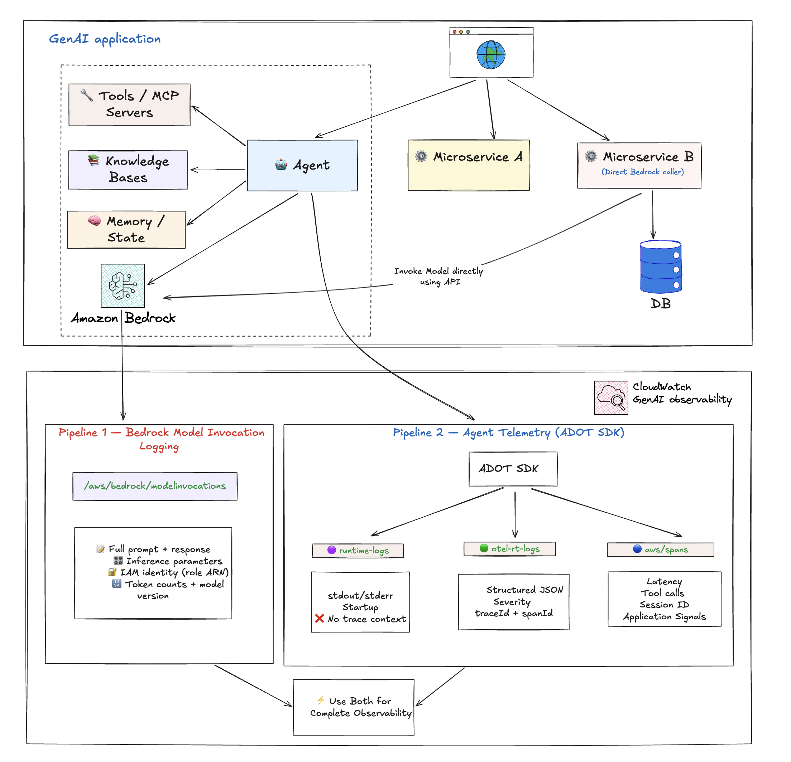

# AWS 上的 GenAI 可观测性

## 概述

生成式 AI 工作负载在多个方面与传统应用不同，这使得从第一天起可观测性就至关重要。响应是非确定性的，延迟随提示复杂度急剧变化，成本直接与 token 使用量挂钩，单个 Agent 调用可以在几秒内跨 Bedrock、S3、Lambda 和 KMS 链接数十个 API 调用。

如果没有适当的可观测性，团队会面临可预见的问题：

- **成本超支** — 未跟踪的 token 使用导致意外账单。单个失控的 Agent 循环可以在几分钟内消耗数百美元。
- **性能下降** — 慢响应影响用户体验，而您无法修复看不到的问题。Agent 工作流可能在编排层静默失败，而模型调用却成功。
- **质量差距** — 错误、幻觉和意外输出在用户投诉之前一直未被检测到。
- **合规和审计风险** — 没有记录模型说了什么、使用了什么参数或哪个 IAM 角色进行了提问。

本指南将引导您完成监控 AWS 上 GenAI 工作负载的策略、AWS 实施、启用模式和 dashboard 设计。它与配套的[为 GenAI 遥测数据创建自定义 Dashboard](../custom-dashboards-for-genai-telemetry) 指南配对，该指南展示了如何将相同的遥测数据转化为面向 DevOps、FinOps 和其他利益相关者的基于角色的 dashboard。

---

## 为什么 GenAI 可观测性不同

### 独特挑战

**非确定性行为** — 相同的输入可以产生不同的输出。传统的"是否返回了正确值"测试不适用。您需要质量 metrics，而不仅仅是成功/失败。

**可变延迟** — 响应时间取决于提示复杂度、输出长度、模型负载和跨区域路由。P50 和 P95 的差异比传统 API 大得多。

**基于 Token 的定价** — 成本随使用模式而非仅请求数量扩展。平均提示长度的小幅增加可能使您的月度账单翻倍。

**多服务复杂性** — Agent 跨多个 AWS 服务链接 API 调用。没有单一的日志源能讲述完整的故事。

**快速迭代** — 模型和提示频繁变化。您的可观测性必须跟踪模型版本、提示模板和配置随时间的变化。

### 业务影响

将可观测性视为事后考虑的组织通常在事后发现这些模式：

- 单个未调优的提示消耗了每月 Bedrock 预算的 80%
- Agent 工作流在工具层失败，而模型 metrics 看起来正常
- PII 泄漏到 logs 中，因为未提前配置脱敏
- 由于未应用团队标签，成本归因无法实现

尽早做好可观测性可以避免日后昂贵的改造。

---

## GenAI 的核心支柱

### Metrics

回答"我的 AI 表现如何？"的运营遥测数据

**需要跟踪的关键 metrics：**

- **Token 用量** — 每次请求的输入 token 数、每次请求的输出 token 数、按模型和用户统计的总 token 数、token 成本计算
- **延迟** — 首 token 时间 (TTFT)、总响应时间、P50/P95/P99 百分位数、按模型和区域统计的延迟
- **请求量** — 每秒/每分钟/每小时请求数、成功率与错误率、并发请求数
- **成本** — 每次请求成本、按模型/用户/团队统计的成本、每日/每月趋势、成本效率（每美元输出 token 数）

### Logs

回答"我的 AI 说了什么，对谁说的？"的内容和上下文

**需要记录的内容：**

- 请求/响应对（需进行 PII 脱敏）
- 提示模板和变量
- 模型参数（temperature、max_tokens、top_p）
- 错误消息和堆栈跟踪
- 用户上下文和会话 ID
- A/B 测试变体

**Log 级别：**

- `DEBUG` — 详细的提示工程迭代
- `INFO` — 成功请求及其元数据
- `WARN` — 重试、降级、速率限制
- `ERROR` — 失败、超时、无效响应

### Traces

回答"请求如何在我的系统中流转？"的分布式流

**需要捕获的内容：**

- 端到端请求流
- 提示预处理步骤
- 模型调用 span
- 工具和函数调用 span
- 后处理和验证
- 与下游服务的集成
- 多跳 Agent 工作流

---

## 战略最佳实践

1. **尽早插桩** — 在构建时就添加可观测性，而不是上线之后。使用 OpenTelemetry 使您的插桩与供应商无关且可移植。
2. **多维度标签** — 为每个 metric 添加 `model`、`environment`、`application`、`team` 和 `region` 维度标签，以便后续可以按维度切分成本和性能。
3. **先建立基线再设告警** — 在生产环境中运行至少一周以建立正常行为基线，然后再设置告警阈值。没有基线的告警会造成告警疲劳。
4. **关注业务 metrics，而非仅技术 metrics** — 除延迟和错误率之外，还要跟踪输出质量、用户满意度（点赞/点踩）和每功能成本。
5. **从第一天起就规划 PII 处理** — 在数据落盘之前就对 logs 中的敏感数据进行脱敏。使用 [CloudWatch Logs 数据保护策略](https://docs.aws.amazon.com/AmazonCloudWatch/latest/monitoring/mask-sensitive-data.html) 进行自动遮蔽。
6. **设置保留策略** — log 量增长迅速。按用途区分保留期：
   - 运维 logs：7 天
   - 模型调用记录：30-90 天
   - 审计/合规：按监管要求（通常 7 年）
7. **跟踪模型版本和提示模板** — 当出现变化时，您需要能够关联当时生产环境中运行的具体版本。

---

## AWS 上的两个数据管道

Amazon CloudWatch 通过两个互补的数据管道为 GenAI 提供端到端的可观测性。它们服务于不同的目的，捕获不同的数据，并以不同的方式启用。大多数生产环境需要两者兼备。



### Pipeline 1：Bedrock 模型调用日志

这是 Bedrock 级别的日志功能，用于捕获每次模型调用的原始请求和响应。这是 **仅限 Bedrock** 的功能 — 它只覆盖对 Amazon Bedrock 基础模型的调用。如果您使用的是非 Bedrock 模型（在 SageMaker 上自托管、外部提供商），此 Pipeline 不适用。

**捕获的内容：**

| 字段 | 重要性 |
| --- | --- |
| 完整请求负载 | 查看发送给模型的确切内容，包括系统提示和消息历史 |
| 完整响应负载 | 查看模型返回的确切内容，逐字记录 |
| 推理参数（`temperature`、`max_tokens`、`top_p`） | 调试意外的模型行为 — 调用时使用的是 temp 0.7 还是 0.0？ |
| 调用者 IAM 身份（角色 ARN） | 安全审计、按团队/角色进行成本归因 |
| Bedrock 操作类型 | `InvokeModel`、`Converse`、`ConverseStream` |
| 模型版本 | 包含后缀的确切模型 ID（例如 `cohere.command-r-plus-v1:0`） |
| Token 计数 | 与内容直接关联的输入和输出 token 数 |

**未捕获的内容：**

- Agent 编排流程（调用了哪些工具、Agent 循环行为）
- 客户端延迟
- 分布式 trace 关联（无 traceId/spanId — 只有 requestId）
- 工具调用详情
- 基础设施上下文
- 非 Bedrock 模型调用

**示例 log 条目：**

```json
{
  "timestamp": "2026-04-17T14:21:50Z",
  "accountId": "123456789012",
  "region": "us-east-1",
  "requestId": "a1b2c3d4-e5f6-7890-abcd-ef1234567890",
  "operation": "InvokeModel",
  "modelId": "cohere.command-r-plus-v1:0",
  "input": {
    "inputBodyJson": {
      "message": "Write a short joke about software engineers.",
      "max_tokens": 256,
      "temperature": 0.7
    },
    "inputTokenCount": 8
  },
  "output": {
    "outputBodyJson": {
      "text": "Why did the engineer break up? Because they couldn't commit.",
      "finish_reason": "COMPLETE"
    },
    "outputTokenCount": 20
  },
  "identity": {
    "arn": "arn:aws:sts::123456789012:assumed-role/my-bedrock-role/my-session"
  },
  "schemaType": "ModelInvocationLog"
}
```

**如何启用：**

通过 Amazon Bedrock 控制台（或 API）手动启用。无论模型是由 Agent、直接 API 调用、SDK 还是其他方式调用的，启用步骤都相同。启用后，它将应用于账户范围内的所有 Bedrock 模型调用。

1. 打开 [Amazon Bedrock 控制台](https://console.aws.amazon.com/bedrock/)
2. 选择 **Settings**
3. 在 **Model invocation logging** 下，选择 **Model invocation logging**
4. 选择要包含在 logs 中的所需数据类型。选择仅将 logs 发送到 CloudWatch Logs，或同时发送到 Amazon S3 和 CloudWatch Logs。
5. 在 CloudWatch Logs 配置下，创建 log group 名称并选择相应的服务角色
6. 选择 **Save settings**

更多信息请参阅 [Model Invocations](https://docs.aws.amazon.com/AmazonCloudWatch/latest/monitoring/model-invocations.html) 和 [Set up a CloudWatch Logs destination](https://docs.aws.amazon.com/bedrock/latest/userguide/model-invocation-logging.html#setup-cloudwatch-logs-destination)。

**预配置的 dashboard：**

启用模型调用日志后，CloudWatch 自动提供显示以下内容的 dashboard：

- **调用次数** — 对 Converse、ConverseStream、InvokeModel 和 InvokeModelWithResponseStream API 的成功请求数
- **调用延迟** — 调用的延迟
- **按模型统计的 Token 数** — 按模型统计的输入和输出 token 数
- **按模型 ID 统计的每日 Token 数** — 按模型 ID 统计的每日总 token 数
- **按输入 token 分组的请求** — 按 token 范围分组的请求数
- **调用限流** — 被限流的调用数
- **调用错误计数** — 产生错误的调用计数

### Pipeline 2：Agent 遥测（通过 ADOT SDK）

基于 OpenTelemetry 的 traces、span 和 logs，由 [AWS Distro for OpenTelemetry (ADOT)](https://aws-otel.github.io/docs/introduction) SDK 捕获。与模型调用日志不同，Agent 遥测适用于任何模型提供商（Bedrock、SageMaker、外部），而不仅限于 Bedrock。

**捕获的内容：**

- **Agent 编排流程** — 调用了哪些工具、调用顺序、Agent 循环迭代
- **模型调用元数据** — 模型 ID、token 计数（输入/输出）、延迟、状态码、完成原因
- **工具执行详情** — 每次工具调用的工具名称、持续时间、成功/失败
- **分布式 trace 关联** — traceId、spanId、parentSpanId，用于完整的端到端请求追踪
- **会话跟踪** — session.id 将多次调用关联到单个用户会话
- **平台和环境上下文** — cloud.platform、deployment.environment、服务元数据

**未捕获的内容：**

- 推理参数（temperature、max_tokens、top_p）
- 调用者 IAM 身份
- 默认情况下不包含完整提示/响应内容（取决于框架 — Strands、LangChain、CrewAI 等受支持；其他框架各有不同）

**示例模型调用 span**（`aws/spans`）：

```json
{
  "resource": {
    "attributes": {
      "deployment.environment.name": "bedrock-agentcore:default",
      "service.name": "MyAgent.DEFAULT",
      "cloud.platform": "aws_bedrock_agentcore",
      "telemetry.sdk.version": "1.40.0"
    }
  },
  "traceId": "a1b2c3d4e5f6a7b8c9d0e1f2a3b4c5d6",
  "spanId": "1a2b3c4d5e6f7a8b",
  "parentSpanId": "9c8d7e6f5a4b3c2d",
  "name": "chat us.anthropic.claude-sonnet-4-6",
  "durationNano": 2644916837,
  "attributes": {
    "gen_ai.request.model": "us.anthropic.claude-sonnet-4-6",
    "gen_ai.usage.input_tokens": 1980,
    "gen_ai.usage.output_tokens": 119,
    "gen_ai.response.finish_reasons": ["tool_use"],
    "http.response.status_code": 200,
    "session.id": "session-a1b2c3d4-e5f6-7890"
  }
}
```

**示例工具执行 span**（`aws/spans`）：

```json
{
  "traceId": "a1b2c3d4e5f6a7b8c9d0e1f2a3b4c5d6",
  "spanId": "2b3c4d5e6f7a8b9c",
  "parentSpanId": "d4e5f6a7b8c9d0e1",
  "name": "execute_tool http_request",
  "durationNano": 37505594,
  "attributes": {
    "gen_ai.tool.name": "http_request",
    "gen_ai.tool.status": "success",
    "gen_ai.system": "strands-agents"
  }
}
```

**数据落地位置：**

| Log Group | 内容 |
| --- | --- |
| `aws/spans` | OTel trace span — 模型调用、工具执行、Agent 循环迭代 |
| `/aws/bedrock-agentcore/runtimes/<agent>` (runtime-logs) | 应用程序 stdout/stderr — 启动 logs、错误、自定义应用日志 |
| `/aws/bedrock-agentcore/runtimes/<agent>` (otel-rt-logs) | 来自 Agent 框架的 OTel log 记录（支持的框架包含提示/响应内容） |

**在 CloudWatch 中支持的功能：**

- **Application Signals dashboard** — 延迟百分位数、错误率、吞吐量
- **Application Maps** — 可视化 Agent → 模型 → 工具调用链
- **分布式追踪** — 跨服务的端到端请求追踪
- **SLO 监控**
- **Trace 分析** — 深入到单个请求的端到端详情
- **与基础设施 metrics 的关联**

**如何启用：**

| 部署模型 | 需要做的事情 |
| --- | --- |
| Bedrock AgentCore | 无需操作 — ADOT SDK 已内置于运行时。遥测数据自动流转。 |
| 非 AgentCore（EKS/ECS/自托管） | 附加 ADOT 自动插桩代理。无需代码更改。 |

---

## 并行比较

| 您想了解的内容 | 模型调用日志（仅 Bedrock） | Agent 遥测（ADOT） |
| --- | --- | --- |
| 调用了哪个模型？ | ✅ | ✅ |
| 延迟/持续时间？ | ❌ | ✅（客户端） |
| Token 计数？ | ✅ | ✅ |
| 错误率/状态？ | ✅ | ✅ |
| Agent 编排流程？ | ❌ | ✅ |
| 工具调用详情？ | ❌ | ✅ |
| 完整提示文本？ | ✅ | 取决于框架 |
| 完整模型响应？ | ✅ | 取决于框架 |
| 推理参数？ | ✅ | ❌ |
| 调用者 IAM 身份？ | ✅ | ❌ |
| 分布式 trace 关联？ | ❌ | ✅ |
| 适用于非 Agent 的 Bedrock 调用？ | ✅ | ❌ |
| 适用于非 Bedrock 模型？ | ❌（仅 Bedrock） | ✅ |
| Application Signals / Application Maps？ | ❌ | ✅ |

Pipeline 2 中的提示/响应内容捕获取决于 Agent 框架的 OTel 插桩。Strands、LangChain 和 CrewAI 受支持；其他框架可能有所不同。

**总结：** Agent 遥测告诉您*您的 Agent 表现如何*。模型调用日志告诉您*模型说了什么以及谁在提问*。要获得完整的可观测性，请同时启用两者。

---

## 为 Agentic 工作负载启用可观测性

在开始之前，启用 [CloudWatch Transaction Search](https://docs.aws.amazon.com/AmazonCloudWatch/latest/monitoring/Enable-TransactionSearch.html) 以解锁完整的 GenAI 可观测性体验。

### AgentCore Runtime 托管的 Agent

AgentCore Runtime 是一个安全的无服务器运行时，专门为部署和扩展动态 AI Agent 和工具而构建。它支持任何开源框架，包括 LangGraph、CrewAI、Strands Agents，以及任何协议和任何模型。

可观测性已内置 — ADOT SDK 已集成在 AgentCore 运行时中。Metrics 自动生成，traces 无需任何代码更改即可流转。

- [配置自定义可观测性](https://docs.aws.amazon.com/bedrock-agentcore/latest/devguide/observability-configure.html#observability-configure-custom)
- [分步教程：为 AgentCore Runtime 托管的 Agent 启用可观测性](https://aws.github.io/bedrock-agentcore-starter-toolkit/user-guide/observability/quickstart.html#enabling-observability-for-agentcore-runtime-hosted-agents)

### 非 AgentCore 托管的 Agent（EKS、ECS、自托管）

您可以在 AgentCore 之外托管您的 Agent，并将可观测性数据引入 CloudWatch 以在一个位置进行端到端监控。将 ADOT 自动插桩代理附加到您的工作负载 — 无需代码更改。

- [配置第三方可观测性](https://docs.aws.amazon.com/bedrock-agentcore/latest/devguide/observability-configure.html#observability-configure-3p)
- [分步教程：为非 AgentCore 托管的 Agent 启用可观测性](https://aws.github.io/bedrock-agentcore-starter-toolkit/user-guide/observability/quickstart.html#enabling-observability-for-non-agentcore-hosted-agents)

### AgentCore memory、gateway 和内置工具资源

获得对 AgentCore 模块化服务的 metrics 和 traces 的可见性。请参阅[配置 CloudWatch 可观测性](https://docs.aws.amazon.com/bedrock-agentcore/latest/devguide/observability-configure.html#observability-configure-cloudwatch)。

### AgentCore Evaluations

AgentCore Evaluations 提供监控和评估 AI Agent 性能、质量和可靠性的功能。请参阅 [AgentCore evaluations](https://docs.aws.amazon.com/bedrock-agentcore/latest/devguide/evaluations.html)。

### 启用总结

| 组件 | AgentCore | 非 AgentCore（EKS/ECS） |
| --- | --- | --- |
| Metrics | 自动 | ADOT 自动插桩代理 |
| Agent traces 和 span | 自动（ADOT 已内置） | ADOT 自动插桩代理 |
| 模型调用日志 | 通过 Bedrock 控制台手动启用 | 通过 Bedrock 控制台手动启用 |

在两种路径中，唯一真正需要手动启用的是模型调用日志。其他一切要么是自动的，要么通过附加 ADOT 自动插桩代理来处理。

---

## 保护敏感数据

在记录模型调用时，提示和响应可能包含 PII 或敏感信息。Amazon CloudWatch Logs 提供数据保护策略，使用机器学习和模式匹配来识别和遮蔽敏感数据。

您可以在两个级别配置数据保护：

### 账户级别数据保护

1. 打开 Amazon CloudWatch 控制台
2. 在导航窗格中，选择 **Settings**
3. 选择 **Logs** 选项卡
4. 选择 **Configure the Data protection account policy**
5. 指定与您的数据相关的数据标识符（托管或自定义）
6. （可选）为审计结果选择目标位置（CloudWatch Logs、Firehose 或 S3）
7. 选择 **Activate data protection**

### Log group 级别数据保护

1. 打开 Amazon CloudWatch 控制台
2. 在导航面板中，选择 **Logs**、**Log Management**
3. 选择 **Log groups** 选项卡，选择 log group（例如 `aws/bedrock/modelinvocations`），然后选择 **Create data protection policy**
4. 指定与您的数据相关的数据标识符
5. （可选）为审计结果选择目标位置
6. 选择 **Activate data protection**

更多信息请参阅[使用遮蔽保护敏感 log 数据](https://docs.aws.amazon.com/AmazonCloudWatch/latest/logs/cloudwatch-logs-data-protection-policies.html)和[保护敏感数据](https://docs.aws.amazon.com/AmazonCloudWatch/latest/monitoring/mask-sensitive-data.html)。

---

## 何时启用什么

| 场景 | 模型调用日志 | Agent 遥测（ADOT） |
| --- | --- | --- |
| 不使用 Agent 直接调用 Bedrock（直接 API） | ✅ 唯一选项 | ❌ 不适用 |
| 所有 LLM 交互的合规/审计跟踪 | ✅ 必需 | 有则更好 |
| 调试提示质量或意外的模型输出 | ✅ 必需（推理参数 + 内容） | 有助于提供上下文 |
| 按团队/角色进行成本归因 | ✅ 必需（IAM 身份） | ❌ 无法实现 |
| 构建评估/微调 Pipeline | ✅ 必需（结构化内容） | 取决于框架 |
| 运行 Agent，需要运维 dashboard | 有则更好 | ✅ 必需 |
| 仅需延迟/错误监控 | 不需要 | ✅ 足够 |

---

## 构建 Dashboard

当两个 Pipeline 的数据都在流转时，您可以为不同受众构建 dashboard。有关即用型查询，请参阅[为 GenAI 遥测数据创建自定义 Dashboard](../custom-dashboards-for-genai-telemetry) 指南。

### 按受众分层的 Dashboard

**高管 dashboard** — 高层 KPI：

- 每日总成本
- 请求量趋势
- 错误率
- 按使用量排名的热门模型

**DevOps dashboard** — 实时监控：

- 停止原因分布（end_turn vs tool_use vs max_tokens）
- 完成率 vs 截断趋势
- Agent traces vs 错误（按小时）
- Span 错误深入分析
- 组件性能分布（P50/P95/P99）
- 跨区域推理延迟

**FinOps dashboard** — 成本管理：

- 总支出（按小时、每日、每月）
- 按模型的成本分布
- 按角色/用户排名的前 10 大消费者
- 输入 vs 输出成本分割
- 提示缓存优化机会
- 每日成本趋势与异常检测

**开发者 dashboard** — 调试和优化：

- 请求 traces
- 按功能的 token 使用量
- 延迟分解
- 错误详情和堆栈跟踪
- Token 效率（高输入、低输出浪费检测）

### 示例 DevOps 查询：完成率

跟踪每小时成功完成与截断响应的比率。目标完成率 95% 以上。

```text
fields @timestamp, modelId,
       output.outputBodyJson.stopReason as stop_reason
| filter schemaType = "ModelInvocationLog"
| filter ispresent(output.outputBodyJson.stopReason)
| stats sum(stop_reason = "end_turn" or stop_reason = "tool_use") as ok,
        sum(stop_reason = "max_tokens") as truncated
  by bin(@timestamp, 1h) as hour
| sort hour desc
```

### 示例 FinOps 查询：按角色排名的最大消费者

```text
SOURCE "bedrock-model-invocation-logging"
| filter @logStream = 'aws/bedrock/modelinvocations'
| fields replace(`identity.arn`, "arn:aws:sts::ACCOUNT_ID:assumed-role/", "") as userRole
| stats sum(totalCostUSD) as spend, count(*) as invocations
  by userRole
| sort spend desc
| limit 10
```

有关完整的成本计算和更多示例，请参阅 [dashboard 查询指南](../custom-dashboards-for-genai-telemetry)。

---

## 告警策略

按紧急程度和影响范围分层设置告警。

### 严重告警（立即响应）

- 错误率超过 5%
- P95 延迟超过 10 秒
- 每日成本超过基线的 150%
- 模型不可用
- Agent 错误率在 15 分钟内超过 10%

### 警告告警（工作时间内调查）

- Token 使用量周环比上升 20%
- 延迟在 7 天内持续劣化
- 缓存命中率下降
- 异常请求模式
- 完成率在 2 小时内低于 95%
- 组件 P95 超过 5000ms

### 信息告警（每日摘要）

- 每日成本摘要
- 每周使用报告
- 模型性能比较
- 最大消费者报告

### 告警路由示例

```yaml
route:
  group_by: ['alertname', 'cloud_provider']
  group_wait: 30s
  group_interval: 5m
  repeat_interval: 4h
  receiver: 'default'
  routes:
    - match:
        severity: critical
      receiver: 'pagerduty'
    - match:
        severity: warning
      receiver: 'slack-ops'
    - match:
        alertname: MonthlyBudgetExceeded
      receiver: 'slack-finops'
```

---

## 可观测性成熟度模型

**第 1 级：基础监控**

- 跟踪请求计数和错误
- 基本延迟 metrics
- 手动成本跟踪

**第 2 级：全面 Metrics**

- Token 级别跟踪
- 多维度 metrics（模型、团队、环境）
- 自动化 dashboard
- 基于基线的基本告警

**第 3 级：高级分析**

- 跨 Agent 工作流的分布式追踪
- 按团队/功能的成本归因
- 质量评分和用户反馈集成
- 基于趋势的预测性告警

**第 4 级：AI 驱动的可观测性**

- 成本和行为异常检测
- 自动化根因分析
- 自愈系统（自动降级到更便宜的模型）
- 持续优化闭环

---

## 与 MLOps 的集成

可观测性应贯穿整个 ML 生命周期，而不仅仅是生产环境：

**训练阶段：**

- 跟踪训练成本和持续时间
- 监控模型质量 metrics
- 模型和提示的版本控制

**部署阶段：**

- 带有 metric 比较的金丝雀部署
- 蓝绿部署监控
- 基于可观测性信号的回滚触发

**生产阶段：**

- 持续监控
- 基于漂移检测的自动化重训练触发
- 性能劣化检测

**优化阶段：**

- 提示和模型的 A/B 测试框架
- 成本-性能权衡分析
- 提示工程反馈闭环

---

## 需要避免的常见反模式

1. **在未进行 PII 脱敏的情况下记录完整提示和响应** — 合规违规、数据泄露风险。在启用模型调用日志*之前*配置数据保护策略。
2. **仅跟踪聚合 metrics** — 没有每次请求的详细信息，您无法调试单个问题或归因成本。
3. **在没有基线的情况下设置告警** — 误报导致的告警疲劳。始终先建立正常行为基线。
4. **忽视 token 使用量直到账单到来** — 等您看到账单时，损失已经造成。每天监控。
5. **每个提供商使用不同的 metric 名称** — 无法跨模型比较性能。标准化使用 OpenTelemetry GenAI 语义约定。
6. **无限期存储遥测数据** — 合规问题和不必要的存储成本。按数据类别设置保留策略。
7. **手动创建 dashboard** — 不一致且维护负担重。使用基础设施即代码来管理 dashboard。
8. **仅监控技术 metrics** — 会遗漏质量和业务影响问题。在监控延迟的同时跟踪用户满意度。

---

## 入门清单

### 预生产

- [ ] 启用 CloudWatch Transaction Search
- [ ] 对于 AgentCore：部署您的 Agent — 遥测数据自动流转
- [ ] 对于非 AgentCore：附加 ADOT 自动插桩代理
- [ ] 通过 Bedrock 控制台启用 Bedrock 模型调用日志
- [ ] 配置 PII 脱敏的数据保护策略
- [ ] 为每个 log group 设置 log 保留策略
- [ ] 使用 [dashboard 查询指南](../custom-dashboards-for-genai-telemetry) 构建初始 dashboard
- [ ] 记录基线 metrics（延迟、token 使用量、成本）
- [ ] 配置适当阈值的告警
- [ ] 为常见问题创建运维手册

### 生产环境

- [ ] 在生产环境中启用监控
- [ ] 告警路由到正确的渠道（PagerDuty、Slack）
- [ ] 配置团队访问权限（为利益相关者提供只读 dashboard）
- [ ] 测试备份和灾难恢复
- [ ] 建立定期审查计划（每周成本审查、每月性能审查）

---

## 其他资源

### 配套指南

- [为 GenAI 遥测数据创建自定义 Dashboard](../custom-dashboards-for-genai-telemetry) — 将遥测数据转化为面向 DevOps、FinOps 和其他利益相关者的基于角色的 dashboard

### AWS 文档

- [Model Invocations — CloudWatch GenAI 可观测性](https://docs.aws.amazon.com/AmazonCloudWatch/latest/monitoring/model-invocations.html)
- [AgentCore 可观测性入门](https://docs.aws.amazon.com/AmazonCloudWatch/latest/monitoring/AgentCore-GettingStarted.html)
- [设置 Bedrock 模型调用日志](https://docs.aws.amazon.com/bedrock/latest/userguide/model-invocation-logging.html#setup-cloudwatch-logs-destination)
- [在 CloudWatch Logs 中保护敏感数据](https://docs.aws.amazon.com/AmazonCloudWatch/latest/monitoring/mask-sensitive-data.html)
- [为 AgentCore 配置自定义可观测性](https://docs.aws.amazon.com/bedrock-agentcore/latest/devguide/observability-configure.html#observability-configure-custom)
- [配置第三方可观测性](https://docs.aws.amazon.com/bedrock-agentcore/latest/devguide/observability-configure.html#observability-configure-3p)
- [AgentCore Evaluations](https://docs.aws.amazon.com/bedrock-agentcore/latest/devguide/evaluations.html)

### 标准和工具

- [AWS Distro for OpenTelemetry (ADOT)](https://aws-otel.github.io/docs/introduction)
- [OpenTelemetry GenAI 语义约定](https://opentelemetry.io/docs/specs/semconv/gen-ai/)
- [OpenTelemetry 规范](https://opentelemetry.io/docs/)

---

**贡献者：** AWS Observability 团队
**最后更新：** 2026-04-21
