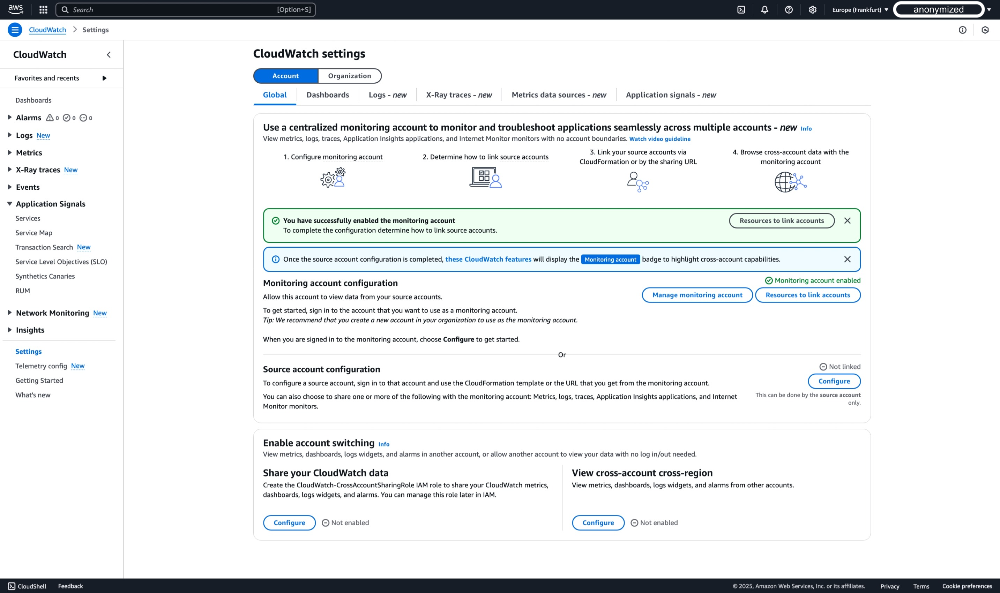
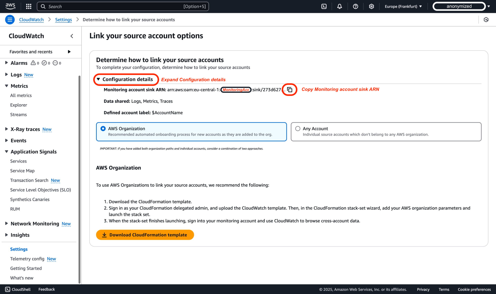
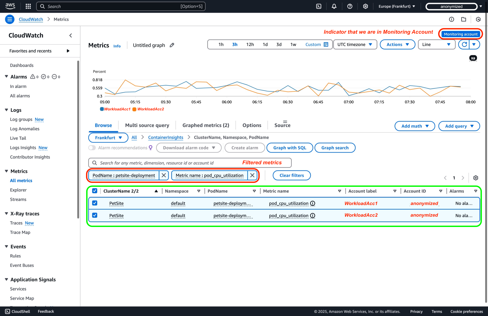
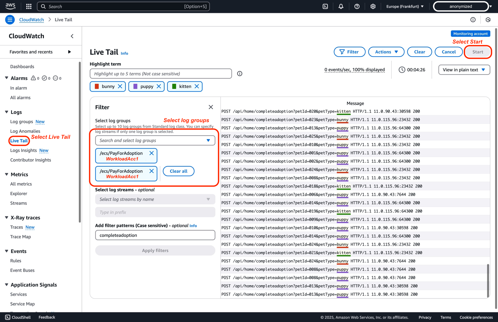

# CloudWatch 跨账户 Observability

监控部署在单个 AWS 区域内多个 AWS 账户中的应用程序可能很有挑战性。[Amazon CloudWatch 的跨账户 observability](https://aws.amazon.com/blogs/aws/new-amazon-cloudwatch-cross-account-observability/)[^1] 简化了这一过程，实现了对跨多个账户应用程序在单个 [**AWS 区域**](https://docs.aws.amazon.com/AmazonCloudWatch/latest/monitoring/CloudWatch-Unified-Cross-Account.html)[^2] 内的无缝监控和故障排除。本教程提供了配置两个 AWS 账户之间跨账户 observability 的分步指南，并附有截图。此外值得注意的是，也可以通过 AWS Organizations 实现更大规模的部署。

## 术语

要有效地使用 Amazon CloudWatch 进行跨账户 observability，您必须了解以下关键术语：

| **术语** | **描述** |
|------|-------------|
| **监控账户** | 一个中心 AWS 账户，可以查看多个源账户生成的 observability 数据并与之交互 |
| **源账户** | 一个单独的 AWS 账户，为其中的资源生成 observability 数据 |
| **Sink** | 监控账户中的一种资源，作为源账户链接和共享其 observability 数据的连接点。每个账户在每个 [AWS 区域](https://docs.aws.amazon.com/AmazonCloudWatch/latest/monitoring/CloudWatch-Unified-Cross-Account.html)[^2] 可以有一个 **Sink** |
| **Observability Link** | 表示源账户和监控账户之间建立的连接的资源，促进 observability 数据的共享。链接由源账户管理。 |

了解这些定义以成功配置和管理 Amazon CloudWatch 中的跨账户 observability。
## 注意事项
1. 账户限制：您可以将多达 100,000 个源账户链接到单个监控账户，即使是最大的企业环境也能满足。
2. 跨区域：跨区域功能已内置于此功能中，会自动生效。您无需采取任何额外步骤即可在同一个图表或同一个 dashboard 上显示来自不同区域的单个账户的 metrics。
3. 数据保留：所有数据保留在源账户级别处理。监控账户不存储或复制数据。监控账户对源账户的数据具有只读访问权限。不涉及实际的数据传输或同步。
4. 成本影响：出乎意料的是，跨账户 Observability 没有额外费用。由于数据保留在源账户中，仅由监控账户读取，因此没有额外的数据传输或存储费用。
5. 使用跨账户 observability 将 traces 从源账户 (X) 共享到监控账户 (Y) 时，traces 会被复制并存储在监控账户 (Y) 中。此过程不会给源账户 (X) 产生额外费用，确保监控能力可以跨账户扩展而不影响原始计费。
6. 根据 CloudWatch 服务配额，每个 dashboard 最多可以有 500 个小部件。一个小部件最多可以有 500 个 metrics，一个 dashboard 在所有小部件中最多可以有 2500 个 metrics。这些配额包括用于 metric 数学函数的所有 metrics，即使这些 metrics 未显示在图表上。这些配额是硬性配额，无法更改。
7. 在 Amazon CloudWatch Logs Insights 中，如果单独指定日志组，每次查询最多可以查询 50 个日志组。此限制是固定的，无法增加。但是，如果使用日志组条件（例如根据名称前缀选择日志组或选择"所有日志组"），则单次查询可以包含多达 10,000 个日志组，从而实现跨多个组的更广泛日志分析。
8. 在 CloudWatch 跨账户 Observability 中使用 Logs 和 Metrics 时，您可以选择将所有命名空间的 metrics 与监控账户共享，或筛选为命名空间的子集。
9. 在跨账户场景中使用告警时的一些注意事项：
   1. CloudWatch Metrics Insights 是一个强大的高性能 SQL 查询引擎，可用于大规模查询 metrics，例如在跨账户 observability 场景中您可能需要从多个账户查询数百个 metrics。
    2. 设置告警时，它必须来自返回单个时间序列的查询，这可以通过 SELECT 表达式实现，但您只能使用统计函数 SUM、MIN、MAX、COUNT 和 AVG。
    3. 此外，可以使用 "group by" 子句按特定维度值将 metrics 实时分组为单独的时间序列。还可以使用 "order by" 功能进行 "Top N" 类型的查询。
    4. 可以使用自然语言创建查询。为此，可以提出关于数据的问题或描述您要查找的数据。这种 AI 辅助功能会根据您的提示生成查询，并逐行解释查询的工作原理。
    5. 您无法基于 SEARCH 表达式创建告警。这是因为搜索表达式返回多个时间序列，而基于数学表达式的告警只能监视一个时间序列。此外，您也无法对包含 SEARCH 函数的数学表达式（如 "MAX"）设置告警。此场景可以通过 CloudWatch Custom Data Sources 来实现。
    6. 告警不支持跨区域功能，因此您无法在一个区域创建监视不同区域中 metric 的告警。

10. 数据保护策略：如果源账户启用了数据保护策略，除非明确授予权限，否则监控账户将无法访问数据。


## 通过 AWS 控制台的分步教程

### 前提条件

1. 要完成本教程，您需要三个 AWS 账户：一个监控账户和两个源账户。

2. 用户或角色必须至少具有 [AWS CloudWatch 跨账户设置指南](https://docs.aws.amazon.com/AmazonCloudWatch/latest/monitoring/CloudWatch-Unified-Cross-Account-Setup.html#CloudWatch-Unified-Cross-Account-Setup-permissions)[^3] 中记录的权限，才能在监控账户和源账户之间创建跨账户链接。

<div style={{ textAlign: 'center' }}>

</div>

### 步骤 1：设置监控账户

#### 监控账户

要设置监控账户，请按照以下步骤操作：

1. 在 [https://console.aws.amazon.com/cloudwatch](https://console.aws.amazon.com/cloudwatch) 打开 CloudWatch 控制台，并选择您将配置跨账户监控账户的 AWS 区域。在本演示范围内，我们将使用欧洲（法兰克福）区域 (eu-central-1)。


2. 在导航窗格中，选择 **Settings**。


3. 在本演示范围内，我们将使用默认的账户全局设置，然后在 **Monitoring account configuration** 部分中选择 **Configure**。


4. 选择要与监控账户共享的数据类型后，将源账户 ID 粘贴到"List source accounts"框中。在本演示中，使用了 WorkloadAcc1 和 WorkloadAcc2 的 ID。选择了 Metrics、Logs 和 Traces。只有 Metrics 和 Logs 允许筛选；所有其他类型始终完全共享。请注意，对于 ServiceLens 和 X-Ray，您必须启用 metrics、logs 和 traces。对于 Application Insights，还需启用 Application Insights applications。对于 Internet Monitor，需启用 metrics、logs 和 Internet Monitor – Monitors。


:::info
在 CloudWatch 跨账户 Observability 中配置遥测类型时，了解它们的依赖关系很重要。虽然 Metrics、Logs 和 Traces 可以独立配置，但其他 CloudWatch 功能有特定要求。ServiceLens 和 X-Ray 功能需要全部三个：Metrics、Logs 和 Traces。对于更高级的监控，Application Insights 需要启用 Metrics、Logs、Traces 和 Application Insights applications。同样，Internet Monitor 需要启用 Metrics、Logs 和 Internet Monitor - Monitors。下表详细说明了这些依赖关系：
:::
    | 遥测类型 | 描述 | CloudWatch 跨账户 Observability 的依赖关系 |
    |----------------|-------------|-----------------------------------------------------|
    | Amazon CloudWatch 中的 Metrics | 共享所有 metric 命名空间或筛选为子集 | 无 |
    | Amazon CloudWatch Logs 中的日志组 | 共享所有日志组或筛选为子集 | 无 |
    | ServiceLens 和 X-Ray | 共享所有 traces（无筛选可用） | 需要为 ServiceLens 和 X-Ray 启用 Metrics、Logs 和 Traces |
    | Amazon CloudWatch Application Insights 中的应用程序 | 共享所有应用程序（无筛选可用） | 需要启用 Metrics、Logs、Traces 和 Application Insights applications |
    | CloudWatch Internet Monitor 中的监视器 | 共享所有监视器（无筛选可用） | 需要启用 Metrics、Logs 和 Internet Monitor - Monitors |

5. 在监控账户的 AWS 控制台中，您应该看到以下图示，确认监控账户已成功配置。


:::tip
	成功配置监控账户后，您需要链接源账户。链接源账户有两种主要方法：使用 AWS Organizations 和链接单个账户。在步骤 2 中，我们将介绍配置单个账户的过程。但是，在登录源账户并进行更改之前，我们需要从刚配置的监控账户收集信息，例如监控账户 sink ARN。
:::

6. 在您之前停留的监控账户的 AWS 控制台中，选择 **Resources to link accounts**


7. 在 AWS 控制台中，展开"Configuration details"部分，您将在此找到需要复制并保存的监控账户 sink ARN，此信息将在步骤 2 中链接源账户时使用。


#### 摘要

在前面的步骤中，我们配置了监控账户 sink 以与源账户链接，无论它们是独立账户还是组织的一部分。基本上，上述步骤在监控账户 sink 中创建了一个配置策略，允许源账户集成。通过 AWS 控制台配置生成的示例策略如下：

```
{
    "Version": "2012-10-17",
    "Statement": [
        {
            "Effect": "Allow",
            "Principal": {
                "AWS": [
                    "${WorkloadAcc1}", // Workload Account
                    "${WorkloadAcc2}"  // Workload Account
                ]
            },
            "Action": [
                "oam:CreateLink",
                "oam:UpdateLink"
            ],
            "Resource": "*",
            "Condition": {
                "ForAllValues:StringEquals": {
                    "oam:ResourceTypes": [
                        "AWS::Logs::LogGroup",
                        "AWS::CloudWatch::Metric",
                        "AWS::XRay::Trace"
                    ]
                }
            }
        }
    ]
}
```

如果您使用 AWS Organizations 进行配置，最终将得到一个应用于监控账户 sink 的配置策略，该策略不需要进一步修改，因为您将信任 AWS 组织内的所有 AWS 账户基于 PrincipalOrgID 条件创建或更新链接。此类示例策略如下：

```
{
    "Version": "2012-10-17",
    "Statement": [
        {
            "Effect": "Allow",
            "Principal": "*",
            "Action": ["oam:CreateLink", "oam:UpdateLink"],
            "Resource": "*",
            "Condition": {
                "ForAllValues:StringEquals": {
                    "oam:ResourceTypes": [
                        "AWS::Logs::LogGroup",
                        "AWS::CloudWatch::Metric",
                        "AWS::XRay::Trace",
                        "AWS::ApplicationInsights::Application",
                        "AWS::InternetMonitor::Monitor"
                    ]
                },
                "ForAnyValue:StringEquals": {
                    "aws:PrincipalOrgID": "${OrganizationId}" // AWS Organization as Condition
                }
            }
        }
    ]
}
```


### 步骤 2：链接源账户

#### 链接单个账户

在步骤 1 中配置监控账户后，我们现在将配置一个单独的 AWS 源账户。当使用组织外的账户或需要为特定独立账户建立监控时，这种方法特别有用。虽然 AWS Organizations 为管理多个账户提供了可扩展的解决方案，但单个账户设置提供了更精细的控制和灵活性。

在继续源账户配置之前，请确保您已复制我们在步骤 1 中获取的监控账户 sink ARN，因为建立连接需要它。

要链接单个源账户，请按照以下步骤操作：

1. 在 [https://console.aws.amazon.com/cloudwatch](https://console.aws.amazon.com/cloudwatch) 打开 CloudWatch 控制台，并选择您将配置跨账户监控账户的 AWS 区域。在本演示范围内，我们将使用欧洲（法兰克福）区域 (eu-central-1)。
 

2. 在导航窗格中，选择 **Settings**。


3. 在本演示范围内，我们将保持账户全局设置的默认配置，然后在 **Source account configuration** 部分中选择 **Configure**。


4. 在 AWS 控制台中，我们将选择 Logs、Metrics 和 Traces 作为数据类型。默认情况下，所有数据都将被共享；但是，您可以选择更精细地筛选要与监控账户共享的 Logs 和 Metrics。链接前需要完成的下一步是输入我们之前配置监控账户时复制的监控账户 sink ARN。


5. 完成源账户配置前的最后一步是确认源账户的数据将与监控账户共享。您将通过在弹出框中输入"Confirm"来确认此操作。


6. 在 AWS 控制台中，"Source account configuration"部分下，您应该看到绿色状态，表明账户已"linked"。


:::tip
    对 WorkloadAcc2 重复步骤 2，这样两个工作负载账户的 Observability 遥测数据都将与监控账户共享
:::

### 步骤 3：验证配置

:::tip
    确保您已登录监控账户
:::

1. 在 [https://console.aws.amazon.com/cloudwatch](https://console.aws.amazon.com/cloudwatch) 打开 CloudWatch 控制台，并选择您在步骤 1 中配置跨账户监控的 AWS 区域。在本演示范围内，我们使用欧洲（法兰克福）区域 (eu-central-1)
 

2. 在导航窗格中，选择 **Settings**。


3. 在 **Monitoring account configuration** 部分中选择 **Manage monitoring account**。
 

4. 在监控账户配置页面的"Linked source accounts"窗格中，您将看到两个工作负载账户已作为 **Source accounts** 链接。


#### 替代方案：AWS Organizations 集成

AWS CloudWatch 跨账户 observability 支持对区域内跨多个 AWS 账户的应用程序进行集中监控和故障排除。通过集成 AWS Organizations，您可以简化设置并自动化所有账户的配置。这种方法可以高效处理组织内众多账户的监控。

##### 前提条件：

- 已启用 AWS Organizations，成员账户已正确包含[^4]。
- 拥有在子账户中部署 AWS CloudFormation StackSets[^5] 的权限，包括具有足够 CloudFormation 操作权限来创建链接的 IAM 角色[^3]。
- 一个已配置的监控账户，允许组织内（或特定 OU 内）的源账户创建和更新 observability 链接[^6]。

AWS CloudFormation StackSets 自动化了在所有成员账户中部署必要的服务关联角色和 observability 配置。启用自动部署后，新创建的 AWS 账户会自动继承所需的 observability 设置，在整个 AWS 环境中保持统一监控实践的同时减少管理开销。

有关分步实施指南（包括 IAM 权限、示例 StackSet 模板和监控策略），请参阅官方 AWS 文档[^7]。

## 视频教程

有关跨账户 observability 设置的详细演示，您还可以观看官方 AWS YouTube 指南"Enable Cross-Account Observability in Amazon CloudWatch | Amazon Web Services"。本教程直观地演示了如何配置集中监控账户、链接多个源账户以及在 CloudWatch 控制台中探索共享的 observability 数据。

<!-- blank line -->
<figure class="video_container">
  <iframe width="560" height="315" src="https://www.youtube.com/embed/lUaDO9dqISc?si=mPewnqzWBqBZKmyg" title="YouTube video player" frameborder="0" allow="accelerometer; autoplay; clipboard-write; encrypted-media; gyroscope; picture-in-picture; web-share" referrerpolicy="strict-origin-when-cross-origin" allowfullscreen></iframe>
</figure>
<!-- blank line -->

## 查询跨账户遥测数据

:::tip
    确保您已登录监控账户
:::

:::info
    我们重用了 [Observability One Workshop](https://catalog.workshops.aws/observability/en-US/architecture)[^8] 中的 Pet Adoption 应用程序。在本演示中，它部署在两个工作负载账户中以说明跨账户 observability。
:::

### Metrics

要在集中位置监控多个账户的 metrics：

1. 在监控账户的 CloudWatch 控制台中，导航到左侧导航窗格中的"All Metrics"，您现在可以查看所有已链接源账户的 metrics。


2. 您可以使用账户 ID 过滤器 `:aws.AccountId=` 来筛选特定账户的 metrics，或者通过选择命名空间和维度来深入查看。在本演示范围内，让我们按照 [View Metrics in Observability One Workshop](https://catalog.workshops.aws/observability/en-US/aws-native/metrics/viewmetrics)[^8] 的指南进行。我们现在将选择 ContainerInsights 命名空间并选择 ClusterName、Namespace 和 PodName 维度。然后，我们将按 metric 名称 pod_cpu_utilization 进行筛选。如您所见，您拥有来自两个工作负载账户的 metrics，可以进行图表化。


#### 告警

[Amazon CloudWatch 跨账户告警](https://aws.amazon.com/about-aws/whats-new/2021/08/announcing-amazon-cloudwatch-cross-account-alarms/)[^9] 让您可以从中心监控账户监控多个 AWS 账户的 metrics。您可以创建 metric 告警（监视单个 metric 或数学表达式的输出）和复合告警（评估多个告警的状态，包括其他复合告警）。例如，您可以设置一个告警，当所有生产账户的 CPU 利用率超过 80% 时触发。触发后，告警可以执行操作，例如发送 Amazon SNS 通知或调用 AWS Lambda 函数，确保您收到及时警报并能主动响应。通过在监控账户中集中创建告警，您可以简化警报并获得工作负载的统一运营视图。

继续上一步 [Metrics](#metrics) 的操作，您可以通过选择"Graphed metrics"然后选择"Create Alarm"来为特定 metric 创建告警。


### Logs

您可以使用 Logs Insights 在单个界面中查询和分析多个账户的日志，或者实时追踪日志。以下是使用 Logs Insights 跨账户查询日志的方法：

1. 在 CloudWatch 控制台中，进入"Logs Insights"并使用日志组选择器从不同账户选择日志组


2. 下一步是编写您的 CloudWatch Logs Insights 查询。在本演示范围内，我们将采用并稍微修改 [One Observability Workshop](https://catalog.workshops.aws/observability/en-US/aws-native/logs/logsinsights/fields#step-4:-aggregate-on-our-chosen-fields)[^8] 中 AWS 原生 Observability 子部分 Logs insight 的查询。我们想查看过去几小时内有多少不同的宠物被领养以及每个工作负载账户的数量。
    
    ```
    filter @message like /POST/ and @message like /completeadoption/
    | parse @message "* * * *:* *" as method, request, protocol, ip, port, status
    | parse request "*?petId=*&petType=*" as requestURL, id, type
    | parse @log "*:*" as accountId, logGroupName // Modified to parse accountId from @log information
    | stats count() by type,accountId // Modified to group by previously parsed accountId
    ```
    
    

以下是跨账户实时追踪日志的方法：

1. 在 CloudWatch 控制台中，进入 **Live Tail**，在 Filter 窗格中，使用日志组选择器从不同账户 **Select log groups**，然后选择 Start。


### Traces

1. 在监控账户的 CloudWatch 控制台中，在导航窗格中选择 X-Ray traces 下的 Trace map。Trace map 显示所有已链接源账户的数据。如需要，请使用 Accounts 过滤器。


2. 在 trace map 上，每个节点都指示它属于哪个 AWS 账户。选择 View traces 以进行特定 span 的更深入分析。


3. 选择特定的 trace 以获取各个 segment 的更详细见解。


4. 深入了解端到端的 trace span，以了解每条追踪路径中的组件。


## 结论

在 Amazon CloudWatch 中配置跨账户 observability 可以提供跨多个 AWS 账户的应用程序性能和健康状况的集中视图。这简化了应用程序的监控、故障排除和分析，无论应用程序位于哪些账户中。通过遵循本教程中概述的步骤，您可以有效地设置监控账户、使用 AWS Organizations 或单个账户链接方式链接源账户，并验证您的配置。您现在可以利用 CloudWatch 控制台来监控和排查跨多个账户的应用程序。

要进一步增强您的跨账户监控能力，请探索不同的 CloudWatch 功能，例如 dashboards、告警和日志。这些功能可以提供对应用程序性能和健康状况的更深入洞察，使您能够主动识别和解决潜在问题。

## 资源

[^1]: [AWS Blog - Amazon CloudWatch Cross-Account Observability](https://aws.amazon.com/blogs/aws/new-amazon-cloudwatch-cross-account-observability/)

[^2]: [CloudWatch cross-account observability](https://docs.aws.amazon.com/AmazonCloudWatch/latest/monitoring/CloudWatch-Unified-Cross-Account.html)

[^3]: [Permissions needed to create links](https://docs.aws.amazon.com/AmazonCloudWatch/latest/monitoring/CloudWatch-Unified-Cross-Account-Setup.html#CloudWatch-Unified-Cross-Account-Setup-permissions)

[^4]: [What is AWS Organizations?](https://docs.aws.amazon.com/organizations/latest/userguide/orgs_introduction.html)

[^5]: [AWS Cloudformation StackSets and AWS Organizations](https://docs.aws.amazon.com/organizations/latest/userguide/services-that-can-integrate-cloudformation.html)  

[^6]: [Set up a monitoring account](https://docs.aws.amazon.com/AmazonCloudWatch/latest/monitoring/CloudWatch-Unified-Cross-Account-Setup.html#Unified-Cross-Account-Setup-ConfigureMonitoringAccount)

[^7]: [Use an AWS CloudFormation template to set up all accounts in an organization or an organizational unit as source accounts](https://docs.aws.amazon.com/AmazonCloudWatch/latest/monitoring/CloudWatch-Unified-Cross-Account-Setup.html#Unified-Cross-Account-SetupSource-OrgTemplate)

[^8]: [One Observability Workshop](https://catalog.workshops.aws/observability/en-US/intro)

[^9]: [Amazon CloudWatch cross account alarms](https://aws.amazon.com/about-aws/whats-new/2021/08/announcing-amazon-cloudwatch-cross-account-alarms/)
