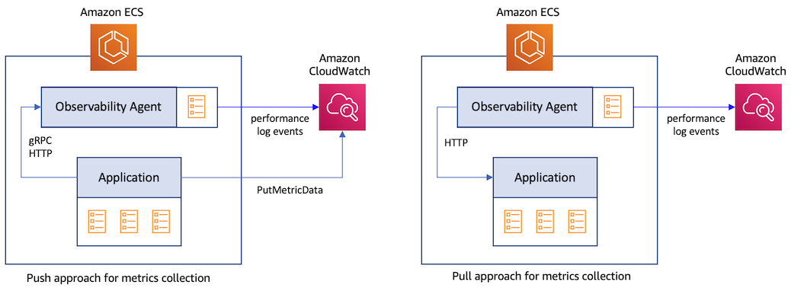

# 使用 Container Insights 收集服务 metrics
服务 metrics 是通过在代码中添加检测来捕获的应用级别 metrics。可以使用两种不同的方法从应用中捕获这些 metrics。

1. 推送方式：这里，应用直接将 metrics 数据发送到目标。例如，使用 CloudWatch PutMetricData API，应用可以将 metrics 数据点发布到 CloudWatch。应用也可以使用 OpenTelemetry Protocol (OTLP) 通过 gRPC 或 HTTP 将数据发送到代理（如 OpenTelemetry Collector）。后者随后将 metrics 数据发送到最终目标。
2. 拉取方式：这里，应用在 HTTP endpoint 以预定义格式暴露 metrics 数据。然后，有权访问此 endpoint 的代理抓取数据并发送到目标。



## CloudWatch Container Insights 的 Prometheus 监控
[Prometheus](https://prometheus.io/docs/introduction/overview/) 是一个流行的开源系统监控和告警工具包。它已成为使用拉取方式从容器化应用收集 metrics 的事实标准。要使用 Prometheus 捕获 metrics，您首先需要使用 Prometheus [客户端库](https://prometheus.io/docs/instrumenting/clientlibs/)（所有主要编程语言都有提供）对应用代码进行检测。metrics 通常由应用通过 HTTP 暴露，供 Prometheus 服务器读取。
当 Prometheus 服务器抓取您应用的 HTTP endpoint 时，客户端库将所有跟踪 metrics 的当前状态发送到服务器。服务器可以将 metrics 存储在其管理的本地存储中，或将 metrics 数据发送到远程目标（如 CloudWatch）。

[CloudWatch Container Insights 的 Prometheus 监控](https://docs.aws.amazon.com/AmazonCloudWatch/latest/monitoring/ContainerInsights-Prometheus.html)使您能够在 Amazon ECS 集群中利用 Prometheus 的功能。它适用于部署在 EC2 和 Fargate 上的 Amazon ECS 集群。CloudWatch 代理可以作为 Prometheus 服务器的直接替代品使用，减少了提高可观测性所需的监控工具数量。它自动发现部署到 Amazon ECS 的容器化应用中的 Prometheus metrics，并将 metrics 数据作为性能日志事件发送到 CloudWatch。

:::info
    在 Amazon ECS 集群上部署带有 Prometheus metrics 收集功能的 CloudWatch 代理的步骤记录在 [Amazon CloudWatch 用户指南](https://docs.aws.amazon.com/AmazonCloudWatch/latest/monitoring/ContainerInsights-Prometheus-install-ECS.html)中
:::
:::warning
    Container Insights 的 Prometheus 监控收集的 metrics 按自定义 metrics 收费。有关 CloudWatch 定价的更多信息，请参阅 [Amazon CloudWatch 定价](https://aws.amazon.com/cloudwatch/pricing/)
:::
### Amazon ECS 集群上的目标自动发现
CloudWatch 代理支持 Prometheus 文档中 [scrape_config](https://prometheus.io/docs/prometheus/latest/configuration/configuration/#scrape_config) 部分下的标准 Prometheus 抓取配置。Prometheus 使用数十种受支持的[服务发现机制](https://prometheus.io/docs/prometheus/latest/configuration/configuration/#scrape_config)支持静态和动态的抓取目标发现。由于 Amazon ECS 没有内置的服务发现机制，代理依赖 Prometheus 对基于文件的目标发现支持。要设置代理进行基于文件的目标发现，代理需要两个[配置参数](https://docs.aws.amazon.com/AmazonCloudWatch/latest/monitoring/ContainerInsights-Prometheus-Setup-configure-ECS.html)，这两个参数都在用于启动代理的任务定义中定义。您可以自定义这些参数来精细控制代理收集的 metrics。

第一个参数包含如下所示的 Prometheus 全局配置：

```
global:
  scrape_interval: 30s
  scrape_timeout: 10s
scrape_configs:
  - job_name: cwagent_ecs_auto_sd
    sample_limit: 10000
    file_sd_configs:
      - files: [ "/tmp/cwagent_ecs_auto_sd.yaml" ] 
```

第二个参数包含帮助代理发现抓取目标的配置。代理定期调用 Amazon ECS API 来检索与此配置中 *ecs_service_discovery* 部分定义的任务定义模式匹配的运行 ECS 任务的元数据。所有发现的目标都写入结果文件 */tmp/cwagent_ecs_auto_sd.yaml*，该文件位于挂载到 CloudWatch 代理容器的文件系统上。下面的示例配置将导致代理从所有名称前缀为 *BackendTask* 的任务中抓取 metrics。请参阅[详细指南](https://docs.aws.amazon.com/AmazonCloudWatch/latest/monitoring/ContainerInsights-Prometheus-Setup-autodiscovery-ecs.html)了解 Amazon ECS 集群中的目标自动发现。

```
{
   "logs":{
      "metrics_collected":{
         "prometheus":{
            "log_group_name":"/aws/ecs/containerinsights/{ClusterName}/prometheus"
            "prometheus_config_path":"env:PROMETHEUS_CONFIG_CONTENT",
            "ecs_service_discovery":{
               "sd_frequency":"1m",
               "sd_result_file":"/tmp/cwagent_ecs_auto_sd.yaml",
               "task_definition_list":[
                  {
                     "sd_job_name":"backends",
                     "sd_metrics_ports":"3000",
                     "sd_task_definition_arn_pattern":".*:task-definition/BackendTask:[0-9]+",
                     "sd_metrics_path":"/metrics"
                  }
               ]
            },
            "emf_processor":{
               "metric_declaration":[
                  {
                     "source_labels":[
                        "job"
                     ],
                     "label_matcher":"^backends$",
                     "dimensions":[
                        [
                           "ClusterName",
                           "TaskGroup"
                        ]
                     ],
                     "metric_selectors":[
                        "^http_requests_total$"
                     ]
                  }
               ]
            }
         }
      },
      "force_flush_interval":5
   }
}
```

### 将 Prometheus metrics 导入 CloudWatch
代理收集的 metrics 根据配置中 *metric_declaration* 部分指定的过滤规则作为性能日志事件发送到 CloudWatch。此部分还用于指定要生成的带有嵌入式 metrics 格式的日志数组。上面的示例配置将仅为标签为 *job:backends* 的名为 *http_requests_total* 的 metrics 生成日志事件，如下所示。使用此数据，CloudWatch 将在 CloudWatch 命名空间 *ECS/ContainerInsights/Prometheus* 下创建 metrics *http_requests_total*，维度为 *ClusterName* 和 *TaskGroup*。
```
{
   "CloudWatchMetrics":[
      {
         "Metrics":[
            {
               "Name":"http_requests_total"
            }
         ],
         "Dimensions":[
            [
               "ClusterName",
               "TaskGroup"
            ]
         ],
         "Namespace":"ECS/ContainerInsights/Prometheus"
      }
   ],
   "ClusterName":"ecs-sarathy-cluster",
   "LaunchType":"EC2",
   "StartedBy":"ecs-svc/4964126209508453538",
   "TaskDefinitionFamily":"BackendAlarmTask",
   "TaskGroup":"service:BackendService",
   "TaskRevision":"4",
   "Timestamp":"1678226606712",
   "Version":"0",
   "container_name":"go-backend",
   "exported_job":"storebackend",
   "http_requests_total":36,
   "instance":"10.10.100.191:3000",
   "job":"backends",
   "path":"/popular/category",
   "prom_metric_type":"counter"
}
```
