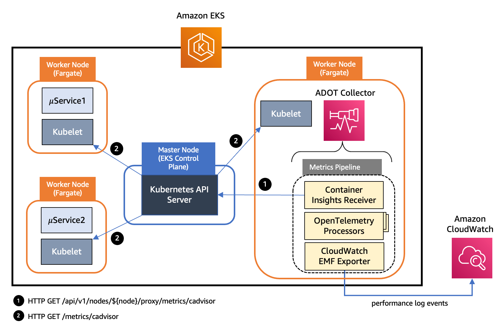

# Amazon CloudWatch Container Insights

在 Observability 最佳实践指南的这一部分中，我们将深入探讨以下与 Amazon CloudWatch Container Insights 相关的主题：

* Amazon CloudWatch Container Insights 简介
* 将 Amazon CloudWatch Container Insights 与 AWS Distro for Open Telemetry 配合使用
* CloudWatch Container Insights 中的 Fluent Bit 集成（适用于 Amazon EKS）
* 使用 Container Insights 在 Amazon EKS 上节省成本
* 使用 EKS Blueprints 设置 Container Insights

### 简介

[Amazon CloudWatch Container Insights](https://docs.aws.amazon.com/AmazonCloudWatch/latest/monitoring/ContainerInsights.html) 帮助客户收集、聚合和汇总来自容器化应用程序和微服务的 metrics 和 logs。Metrics 数据以性能日志事件的形式收集，使用[嵌入式 metric 格式](https://docs.aws.amazon.com/AmazonCloudWatch/latest/monitoring/CloudWatch_Embedded_Metric_Format.html)。这些性能日志事件使用结构化 JSON schema，能够大规模地摄取和存储高基数数据。CloudWatch 基于这些数据在 cluster、node、pod、任务和 service 级别创建聚合 metrics 作为 CloudWatch metrics。Container Insights 收集的 metrics 可在 CloudWatch 自动 dashboard 中查看。Container Insights 适用于具有自管理节点组、托管节点组和 AWS Fargate 配置文件的 Amazon EKS 集群。

从成本优化的角度出发，为了帮助您管理 Container Insights 的成本，CloudWatch 不会自动从日志数据中创建所有可能的 metrics。但是，您可以通过使用 CloudWatch Logs Insights 分析原始性能日志事件来查看更多 metrics 和更精细的粒度级别。Container Insights 收集的 metrics 按自定义 metrics 计费。有关 CloudWatch 定价的更多信息，请参阅 [Amazon CloudWatch 定价](https://aws.amazon.com/cloudwatch/pricing/)。

在 Amazon EKS 中，Container Insights 使用由 Amazon 通过 Amazon Elastic Container Registry 提供的容器化版本的 [CloudWatch agent](https://gallery.ecr.aws/cloudwatch-agent/cloudwatch-agent) 来发现集群中所有正在运行的容器。然后它在性能堆栈的每一层收集性能数据。Container Insights 支持使用 AWS KMS 密钥对其收集的 logs 和 metrics 进行加密。要启用此加密，您必须手动为接收 Container Insights 数据的日志组启用 AWS KMS 加密。这将导致 CloudWatch Container Insights 使用提供的 AWS KMS 密钥加密此数据。仅支持对称密钥，不支持非对称 AWS KMS 密钥来加密日志组。Container Insights 仅在 Linux 实例上受支持。Amazon EKS 的 Container Insights 在[这些](https://docs.aws.amazon.com/AmazonCloudWatch/latest/monitoring/ContainerInsights.html#:~:text=Container%20Insights%20for%20Amazon%20EKS%20and%20Kubernetes%20is%20supported%20in%20the%20following%20Regions%3A) AWS 区域中受支持。

### 将 Amazon CloudWatch Container Insights 与 AWS Distro for Open Telemetry 配合使用

我们现在将深入了解 [AWS Distro for OpenTelemetry (ADOT)](https://aws-otel.github.io/docs/introduction)，这是从 Amazon EKS 工作负载启用 Container Insight metrics 收集的选项之一。[AWS Distro for OpenTelemetry (ADOT)](https://aws-otel.github.io/docs/introduction) 是 [OpenTelemetry](https://opentelemetry.io/docs/) 项目的安全、AWS 支持的发行版。使用 ADOT，用户只需对应用程序进行一次 instrument 即可将相关的 metrics 和 traces 发送到多个监控解决方案。借助 ADOT 对 CloudWatch Container Insights 的支持，客户可以从运行在 [Amazon Elastic Cloud Compute](https://aws.amazon.com/pm/ec2/?trk=ps_a134p000004f2ZFAAY&trkCampaign=acq_paid_search_brand&sc_channel=PS&sc_campaign=acquisition_US&sc_publisher=Google&sc_category=Cloud%20Computing&sc_country=US&sc_geo=NAMER&sc_outcome=acq&sc_detail=amazon%20ec2&sc_content=EC2_e&sc_matchtype=e&sc_segment=467723097970&sc_medium=ACQ-P|PS-GO|Brand|Desktop|SU|Cloud%20Computing|EC2|US|EN|Text&s_kwcid=AL!4422!3!467723097970!e!!g!!amazon%20ec2&ef_id=Cj0KCQiArt6PBhCoARIsAMF5waj-FXPUD0G-cm0dJ05Mz6aXDvqEGu-S7pCXwvVusULN6ZbPbc_Alg8aArOHEALw_wcB:G:s&s_kwcid=AL!4422!3!467723097970!e!!g!!amazon%20ec2) (Amazon EC2) 上的 Amazon EKS 集群收集系统 metrics，如 CPU、内存、磁盘和网络使用情况，提供与 Amazon CloudWatch agent 相同的体验。ADOT Collector 现已支持 Amazon EKS 和 Amazon EKS 的 AWS Fargate 配置文件的 CloudWatch Container Insights。客户现在可以收集部署到 Amazon EKS 集群的 pod 的容器和 pod metrics（如 CPU 和内存利用率），并在 CloudWatch dashboard 中查看它们，而无需更改现有的 CloudWatch Container Insights 体验。这将使客户能够确定是否需要扩展或缩减以响应流量并节省成本。

ADOT Collector 具有 [pipeline 的概念](https://opentelemetry.io/docs/collector/configuration/)，它由三种关键类型的组件组成，即 receiver、processor 和 exporter。[receiver](https://opentelemetry.io/docs/collector/configuration/#receivers) 是数据进入 collector 的方式。它以指定格式接受数据，将其转换为内部格式，并传递给 pipeline 中定义的 [processor](https://opentelemetry.io/docs/collector/configuration/#processors) 和 [exporter](https://opentelemetry.io/docs/collector/configuration/#exporters)。它可以是拉取或推送模式。Processor 是一个可选组件，用于在数据被接收和导出之间执行批处理、过滤和转换等任务。Exporter 用于确定将 metrics、logs 或 traces 发送到哪个目标。Collector 架构允许通过 YAML 配置定义多个这样的 pipeline 实例。下图说明了部署到 Amazon EKS 和带有 Fargate 配置文件的 Amazon EKS 的 ADOT Collector 实例中的 pipeline 组件。



*图：部署到 Amazon EKS 的 ADOT Collector 实例中的 pipeline 组件*

在上述架构中，我们在 pipeline 中使用了一个 [AWS Container Insights Receiver](https://github.com/open-telemetry/opentelemetry-collector-contrib/tree/main/receiver/awscontainerinsightreceiver) 实例，直接从 Kubelet 收集 metrics。AWS Container Insights Receiver (`awscontainerinsightreceiver`) 是一个 AWS 特定的 receiver，支持 [CloudWatch Container Insights](https://docs.aws.amazon.com/AmazonCloudWatch/latest/monitoring/ContainerInsights.html)。CloudWatch Container Insights 收集、聚合和汇总来自容器化应用程序和微服务的 metrics 和 logs。数据以性能日志事件的形式收集，使用[嵌入式 metric 格式](https://docs.aws.amazon.com/AmazonCloudWatch/latest/monitoring/CloudWatch_Embedded_Metric_Format.html)。从 EMF 数据中，Amazon CloudWatch 可以在 cluster、node、pod、任务和 service 级别创建聚合的 CloudWatch metrics。以下是 `awscontainerinsightreceiver` 配置的示例：

```
receivers:
  awscontainerinsightreceiver:
    # all parameters are optional
    collection_interval: 60s
    container_orchestrator: eks
    add_service_as_attribute: true 
    prefer_full_pod_name: false 
    add_full_pod_name_metric_label: false 
```

这需要使用上述配置在 Amazon EKS 上将 collector 部署为 DaemonSet。您还可以访问此 receiver 直接从 Kubelet 收集的更完整的 metrics 集。拥有多个 ADOT Collector 实例足以从集群中所有节点收集资源 metrics。单个 ADOT Collector 实例在较高负载时可能会不堪重负，因此始终建议部署多个 collector。


*图：部署到带有 Fargate 配置文件的 Amazon EKS 的 ADOT Collector 实例中的 pipeline 组件*

在上述架构中，Kubernetes 集群中工作节点上的 kubelet 在 */metrics/cadvisor* endpoint 公开资源 metrics，如 CPU、内存、磁盘和网络使用情况。但是，在 EKS Fargate 网络架构中，pod 不允许直接访问该工作节点上的 kubelet。因此，ADOT Collector 调用 Kubernetes API Server 来代理到工作节点上 kubelet 的连接，并收集该节点上工作负载的 kubelet cAdvisor metrics。这些 metrics 以 Prometheus 格式提供。因此，collector 使用 [Prometheus Receiver](https://github.com/open-telemetry/opentelemetry-collector-contrib/tree/main/receiver/prometheusreceiver) 实例作为 Prometheus 服务器的替代，从 Kubernetes API server endpoint 抓取这些 metrics。通过 Kubernetes 服务发现，receiver 可以发现 EKS 集群中的所有工作节点。因此，拥有多个 ADOT Collector 实例足以从集群中所有节点收集资源 metrics。单个 ADOT Collector 实例在较高负载时可能会不堪重负，因此始终建议部署多个 collector。

然后 metrics 经过一系列 processor 进行过滤、重命名、数据聚合和转换等操作。以下是上面展示的 Amazon EKS ADOT Collector 实例 pipeline 中使用的 processor 列表。

* [Filter Processor](https://github.com/open-telemetry/opentelemetry-collector-contrib/tree/main/processor/filterprocessor) 是 AWS OpenTelemetry 发行版的一部分，用于根据名称包含或排除 metrics。它可以作为 metrics 收集 pipeline 的一部分来过滤不需要的 metrics。例如，假设您希望 Container Insights 仅收集 pod 级别的 metrics（名称前缀为 `pod_`），但排除网络相关的 metrics（名称前缀为 `pod_network`）。

```
      # filter out only renamed metrics which we care about
      filter:
        metrics:
          include:
            match_type: regexp
            metric_names:
              - new_container_.*
              - pod_.*
```

* [Metrics Transform Processor](https://github.com/open-telemetry/opentelemetry-collector-contrib/tree/main/processor/metricstransformprocessor) 可用于重命名 metrics，以及添加、重命名或删除标签键和值。它还可用于对 metrics 跨标签或标签值执行缩放和聚合。

```
     metricstransform/rename:
        transforms:
          - include: container_spec_cpu_quota
            new_name: new_container_cpu_limit_raw
            action: insert
            match_type: regexp
            experimental_match_labels: {"container": "\\S"}
```

* [Cumulative to Delta Processor](https://github.com/open-telemetry/opentelemetry-collector-contrib/tree/main/processor/cumulativetodeltaprocessor) 将单调递增的累积求和 metrics 和直方图 metrics 转换为单调递增的增量 metrics。非单调求和和指数直方图被排除在外。

```
` # convert cumulative sum datapoints to delta
 cumulativetodelta:
    metrics:
        - pod_cpu_usage_seconds_total 
        - pod_network_rx_errors`
```

* [Delta to Rate Processor](https://github.com/open-telemetry/opentelemetry-collector-contrib/tree/main/processor/deltatorateprocessor) 将增量求和 metrics 转换为速率 metrics。此速率是一个 gauge。

```
` # convert delta to rate
    deltatorate:
        metrics:
            - pod_memory_hierarchical_pgfault 
            - pod_memory_hierarchical_pgmajfault 
            - pod_network_rx_bytes 
            - pod_network_rx_dropped 
            - pod_network_rx_errors 
            - pod_network_tx_errors 
            - pod_network_tx_packets 
            - new_container_memory_pgfault 
            - new_container_memory_pgmajfault 
            - new_container_memory_hierarchical_pgfault 
            - new_container_memory_hierarchical_pgmajfault`
```

* [Metrics Generation Processor](https://github.com/open-telemetry/opentelemetry-collector-contrib/tree/main/processor/metricsgenerationprocessor) 可用于按照给定规则使用现有 metrics 创建新的 metrics。

```
      experimental_metricsgeneration/1:
        rules:
          - name: pod_memory_utilization_over_pod_limit
            unit: Percent
            type: calculate
            metric1: pod_memory_working_set
            metric2: pod_memory_limit
            operation: percent
```

Pipeline 中的最后一个组件是 [AWS CloudWatch EMF Exporter](https://github.com/open-telemetry/opentelemetry-collector-contrib/tree/main/exporter/awsemfexporter)，它将 metrics 转换为嵌入式 metric 格式 (EMF)，然后使用 [PutLogEvents](https://docs.aws.amazon.com/AmazonCloudWatchLogs/latest/APIReference/API_PutLogEvents.html) API 直接发送到 CloudWatch Logs。以下是 ADOT Collector 为 Amazon EKS 上运行的每个工作负载发送到 CloudWatch 的 metrics 列表。

* pod_cpu_utilization_over_pod_limit
* pod_cpu_usage_total
* pod_cpu_limit
* pod_memory_utilization_over_pod_limit
* pod_memory_working_set
* pod_memory_limit
* pod_network_rx_bytes
* pod_network_tx_bytes

每个 metric 将与以下维度集关联，并收集在名为 *ContainerInsights* 的 CloudWatch namespace 下。

* ClusterName, LaunchType
* ClusterName, Namespace, LaunchType
* ClusterName, Namespace, PodName, LaunchType

此外，请了解 [Container Insights Prometheus 对 ADOT 的支持](https://aws.amazon.com/blogs/containers/introducing-cloudwatch-container-insights-prometheus-support-with-aws-distro-for-opentelemetry-on-amazon-ecs-and-amazon-eks/)以及[在 Amazon EKS 上部署 ADOT collector 以使用 CloudWatch Container Insights 可视化 Amazon EKS 资源 metrics](https://aws.amazon.com/blogs/containers/introducing-amazon-cloudwatch-container-insights-for-amazon-eks-fargate-using-aws-distro-for-opentelemetry/)，了解如何在 Amazon EKS 集群中设置 ADOT collector pipeline 以及如何在 CloudWatch Container Insights 中可视化 Amazon EKS 资源 metrics。另外，请参考[使用 Amazon CloudWatch Container Insights 轻松监控容器化应用程序](https://community.aws/tutorials/navigating-amazon-eks/eks-monitor-containerized-applications#step-3-use-cloudwatch-logs-insights-query-to-search-and-analyze-container-logs)，其中包含配置 Amazon EKS 集群、部署容器化应用程序以及使用 Container Insights 监控应用程序性能的分步说明。

### CloudWatch Container Insights 中的 Fluent Bit 集成（适用于 Amazon EKS）

[Fluent Bit](https://fluentbit.io/) 是一个开源的多平台日志处理器和转发器，允许您从不同来源收集数据和日志，统一并发送到不同的目标，包括 CloudWatch Logs。它还与 [Docker](https://www.docker.com/) 和 [Kubernetes](https://kubernetes.io/) 环境完全兼容。使用新推出的 Fluent Bit daemonset，您可以将 EKS 集群的容器日志发送到 CloudWatch logs 进行日志存储和分析。

由于其轻量级特性，在 EKS 工作节点上的 Container Insights 中使用 Fluent Bit 作为默认日志转发器将使您能够高效且可靠地将应用程序日志流式传输到 CloudWatch logs。借助 Fluent Bit，Container Insights 能够以资源高效的方式大规模传送数千条关键业务日志，特别是在 pod 级别的 CPU 和内存利用率方面。换句话说，与之前使用的日志转发器 FluentD 相比，Fluent Bit 资源占用更小，因此在内存和 CPU 方面更加高效。另一方面，[AWS for Fluent Bit 镜像](https://github.com/aws/aws-for-fluent-bit)（包含 Fluent Bit 和相关插件）为 Fluent Bit 提供了更快采用新 AWS 功能的灵活性，因为该镜像旨在在 AWS 生态系统中提供统一的体验。

下面的架构图展示了 CloudWatch Container Insights 用于 EKS 的各个组件：


*图：CloudWatch Container Insights 用于 EKS 的各个组件。*

在使用容器时，建议尽可能通过标准输出 (stdout) 和标准错误输出 (stderr) 方法使用 Docker JSON 日志驱动程序推送所有日志，包括应用程序日志。因此，在 EKS 中，日志驱动程序默认已配置，容器化应用程序写入 `stdout` 或 `stderr` 的所有内容都会流式传输到工作节点上 `"/var/log/containers"` 下的 JSON 文件中。Container Insights 默认将这些日志分为三个不同的类别，并在 Fluent Bit 中为每个类别创建专用的输入流，在 CloudWatch Logs 中创建独立的日志组。这些类别是：

* 应用程序日志：存储在 `"/var/log/containers/*.log"` 下的所有应用程序日志都会流式传输到专用的 `/aws/containerinsights/Cluster_Name/application` 日志组。默认情况下排除所有非应用程序日志，如 kube-proxy 和 aws-node 日志。但是，额外的 Kubernetes 附加组件日志（如 CoreDNS 日志）也会被处理并流式传输到此日志组。
* 主机日志：每个 EKS 工作节点的系统日志会流式传输到 `/aws/containerinsights/Cluster_Name/host` 日志组。这些系统日志包括 `"/var/log/messages,/var/log/dmesg,/var/log/secure"` 文件的内容。考虑到容器化工作负载的无状态和动态特性（EKS 工作节点在扩展活动期间经常被终止），使用 Fluent Bit 实时流式传输这些日志并在节点终止后仍能在 CloudWatch logs 中获取这些日志，对于 EKS 工作节点的 observability 和健康监控至关重要。它还使您能够在许多情况下无需登录工作节点即可调试或排查集群问题，并以更系统的方式分析这些日志。
* 数据平面日志：EKS 已经提供了[控制平面日志](https://docs.aws.amazon.com/eks/latest/userguide/control-plane-logs.html)。通过 Container Insights 中的 Fluent Bit 集成，在每个工作节点上运行并负责维护运行中 pod 的 EKS 数据平面组件生成的日志会被捕获为数据平面日志。这些日志也会流式传输到 CloudWatch 中的专用日志组 `'/aws/containerinsights/Cluster_Name/dataplane`。kube-proxy、aws-node 和 Docker 运行时日志保存在此日志组中。除了控制平面日志外，将数据平面日志存储在 CloudWatch Logs 中有助于提供 EKS 集群的完整视图。

此外，请从 [Fluent Bit 与 Amazon EKS 集成](https://aws.amazon.com/blogs/containers/fluent-bit-integration-in-cloudwatch-container-insights-for-eks/)了解更多关于 Fluent Bit 配置、Fluent Bit 监控和日志分析的主题。

### 使用 Container Insights 在 Amazon EKS 上节省成本

使用默认配置时，Container Insights receiver 会收集 [receiver 文档](https://github.com/open-telemetry/opentelemetry-collector-contrib/tree/main/receiver/awscontainerinsightreceiver#available-metrics-and-resource-attributes)中定义的完整 metrics 集。收集的 metrics 和维度数量很多，对于大型集群，这将显著增加 metric 摄取和存储的成本。我们将演示两种不同的方法，您可以使用它们来配置 ADOT Collector，以仅发送有价值的 metrics 并节省成本。

#### 使用 processor

此方法涉及引入上面讨论的 OpenTelemetry processor 来过滤 metrics 或属性，以减少 [EMF 日志](https://docs.aws.amazon.com/AmazonCloudWatch/latest/monitoring/CloudWatch_Embedded_Metric_Format.html)的大小。我们将演示两个 processor（即 *Filter* 和 *Resource*）的基本用法。

[Filter processor](https://github.com/open-telemetry/opentelemetry-collector-contrib/blob/main/processor/filterprocessor/README.md) 可以包含在名为 `otel-agent-conf` 的 `ConfigMap` 中：

```
processors:
  # filter processors example
  filter/include:
    # any names NOT matching filters are excluded from remainder of pipeline
    metrics:
      include:
        match_type: regexp
        metric_names:
          # re2 regexp patterns
          - ^pod_.*
  filter/exclude:
    # any names matching filters are excluded from remainder of pipeline
    metrics:
      exclude:
        match_type: regexp
        metric_names:
          - ^pod_network.*
```

[Resource processor](https://github.com/open-telemetry/opentelemetry-collector-contrib/blob/main/processor/resourceprocessor/README.md) 也内置于 AWS OpenTelemetry 发行版中，可用于删除不需要的 metric 属性。例如，如果您想从 EMF 日志中删除 `Kubernetes` 和 `Sources` 字段，可以将 resource processor 添加到 pipeline：

```
  # resource processors example
  resource:
    attributes:
    - key: Sources
      action: delete
    - key: kubernetes
      action: delete
```

#### 自定义 Metrics 和维度

在此方法中，您将配置 CloudWatch EMF exporter 以仅生成您想要发送到 CloudWatch Logs 的 metrics 集。CloudWatch EMF exporter 配置的 [metric_declaration](https://github.com/open-telemetry/opentelemetry-collector-contrib/blob/5ccdbe08c6a2a43b7c6c7f9c0031a4b0348394a9/exporter/awsemfexporter/README.md#metric_declaration) 部分可用于定义您想要导出的 metrics 和维度集。例如，您可以仅保留默认配置中的 pod metrics。此 `metric_declaration` 部分将如下所示，为了减少 metrics 数量，如果您不关心其他维度，可以仅保留维度集 `[PodName, Namespace, ClusterName]`：

```
  awsemf:
    namespace: ContainerInsights
    log_group_name: '/aws/containerinsights/{ClusterName}/performance'
    log_stream_name: '{NodeName}'
    resource_to_telemetry_conversion:
      enabled: true
    dimension_rollup_option: NoDimensionRollup
    parse_json_encoded_attr_values: [Sources, kubernetes]
    # Customized metric declaration section
    metric_declarations:
      # pod metrics
      - dimensions: [[PodName, Namespace, ClusterName]]
        metric_name_selectors:
          - pod_cpu_utilization
          - pod_memory_utilization
          - pod_cpu_utilization_over_pod_limit
          - pod_memory_utilization_over_pod_limit
```

此配置将在单一维度 `[PodName, Namespace, ClusterName]` 中生成并流式传输以下四个 metrics，而不是默认配置中多个维度的 55 个不同 metrics：

* pod_cpu_utilization
* pod_memory_utilization
* pod_cpu_utilization_over_pod_limit
* pod_memory_utilization_over_pod_limit

使用此配置，您将仅发送您感兴趣的 metrics，而不是默认配置的所有 metrics。因此，您将能够大幅降低 Container Insights 的 metric 摄取成本。拥有这种灵活性将为 Container Insights 客户提供对导出 metrics 的高度控制。通过修改 `awsemf` exporter 配置来自定义 metrics 也具有高度灵活性，您可以自定义要发送的 metrics 及其维度。请注意，这仅适用于发送到 CloudWatch 的日志。

上面演示的两种方法并不相互排斥。事实上，它们都可以结合使用，以高度灵活地自定义我们想要摄取到监控系统中的 metrics。我们使用这种方法来降低与 metric 存储和处理相关的成本，如下图所示。


*图：AWS Cost Explorer*

在上面的 AWS Cost Explorer 图表中，我们可以看到在小型 EKS 集群（20 个工作节点，220 个 pod）上使用 ADOT Collector 不同配置的 CloudWatch 每日成本。*8 月 15 日*显示使用默认配置的 ADOT Collector 的 CloudWatch 账单。在 *8 月 16 日*，我们使用了[自定义 EMF exporter](https://aws.amazon.com/blogs/containers/cost-savings-by-customizing-metrics-sent-by-container-insights-in-amazon-eks/#customize-emf-exporter) 方法，可以看到约 30% 的成本节省。在 *8 月 17 日*，我们使用了 [Processor](https://aws.amazon.com/blogs/containers/cost-savings-by-customizing-metrics-sent-by-container-insights-in-amazon-eks/#processors) 方法，实现了约 45% 的成本节省。
您必须考虑自定义 Container Insights 发送的 metrics 的权衡，因为您将通过牺牲被监控集群的可见性来降低监控成本。但同时，AWS 控制台中 Container Insights 提供的内置 dashboard 可能会受到自定义 metrics 的影响，因为您可以选择不发送 dashboard 使用的 metrics 和维度。如需进一步了解，请查看[通过自定义 Container Insights 在 Amazon EKS 中发送的 metrics 来节省成本](https://aws.amazon.com/blogs/containers/cost-savings-by-customizing-metrics-sent-by-container-insights-in-amazon-eks/)。

### 使用 EKS Blueprints 设置 Container Insights

[EKS Blueprints](https://aws.amazon.com/blogs/containers/bootstrapping-clusters-with-eks-blueprints/) 是一组基础设施即代码 (IaC) 模块，可帮助您跨账户和区域配置和部署一致的、功能齐全的 EKS 集群。您可以使用 EKS Blueprints 轻松引导 EKS 集群，配合 [Amazon EKS 附加组件](https://docs.aws.amazon.com/eks/latest/userguide/eks-add-ons.html)以及广泛的流行开源附加组件，包括 Prometheus、Karpenter、Nginx、Traefik、AWS Load Balancer Controller、Container Insights、Fluent Bit、Keda、Argo CD 等。EKS Blueprints 在两个流行的 IaC 框架中实现，即 [HashiCorp Terraform](https://github.com/aws-ia/terraform-aws-eks-blueprints) 和 [AWS Cloud Development Kit (AWS CDK)](https://github.com/aws-quickstart/cdk-eks-blueprints)，帮助您自动化基础设施部署。

作为使用 EKS Blueprints 创建 Amazon EKS 集群过程的一部分，您可以设置 Container Insights 作为 Day 2 运维工具，将容器化应用程序和微服务的 metrics 和 logs 收集、聚合和汇总到 Amazon CloudWatch 控制台。

### 结论

在 Observability 最佳实践指南的这一部分中，我们涵盖了 CloudWatch Container Insights 的许多深入细节，包括 Amazon CloudWatch Container Insights 简介以及它如何帮助您观察 Amazon EKS 上的容器化工作负载。我们深入介绍了将 Amazon CloudWatch Container Insights 与 AWS Distro for Open Telemetry 配合使用，以启用 Container Insight metrics 的收集，在 Amazon CloudWatch 控制台上可视化容器化工作负载的 metrics。接下来，我们详细介绍了 CloudWatch Container Insights 中的 Fluent Bit 集成（适用于 Amazon EKS），以在 Fluent Bit 中创建专用输入流，并在 CloudWatch Logs 中为应用程序、主机和数据平面日志创建独立的日志组。然后，我们讨论了两种不同的方法（如 processor 和 metrics 维度）来实现 CloudWatch Container Insights 的成本节省。最后，我们简要介绍了如何使用 EKS Blueprints 作为在 Amazon EKS 集群创建过程中设置 Container Insights 的工具。您可以通过 [One Observability Workshop](https://catalog.workshops.aws/observability/en-US) 中的 [CloudWatch Container Insights 模块](https://catalog.workshops.aws/observability/en-US/aws-native/insights/containerinsights)获得实践经验。
