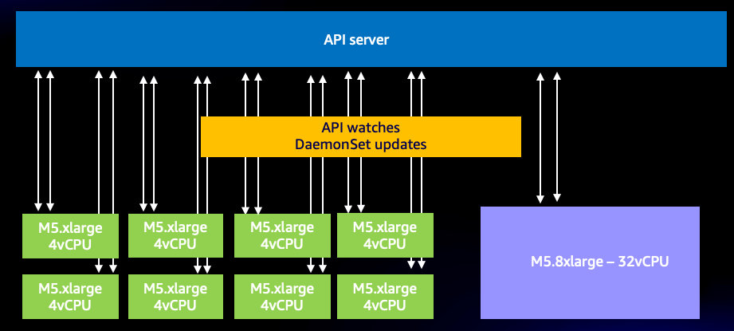
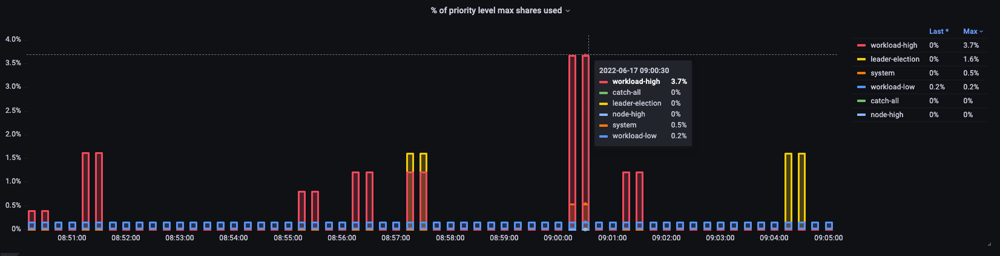
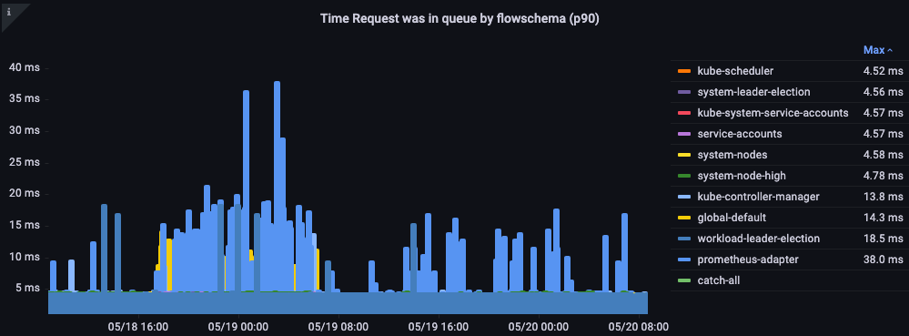

# Amazon EKS API Server 监控

在可观测性最佳实践指南的这一部分中，我们将深入探讨以下与 API Server 监控相关的主题：

* Amazon EKS API Server 监控简介
* 设置 API Server 故障排查 Dashboard
* 使用 API 故障排查 Dashboard 理解 API Server 问题
* 理解对 API Server 的无界 list 调用
* 阻止对 API Server 的不良行为
* API 优先级和公平性
* 识别最慢的 API 调用和 API Server 延迟问题

### 简介

监控 Amazon EKS 托管控制平面是非常重要的 Day 2 运维活动，用于主动识别 EKS 集群健康状况的问题。Amazon EKS 控制平面监控帮助您根据收集的 metrics 采取主动措施。这些 metrics 将帮助我们排查 API server 问题并精确定位底层问题。

我们将在本节中使用 Amazon Managed Service for Prometheus (AMP) 来演示 Amazon EKS API server 监控，并使用 Amazon Managed Grafana (AMG) 来可视化 metrics。Prometheus 是一个流行的开源监控工具，提供强大的查询功能并广泛支持各种工作负载。Amazon Managed Service for Prometheus 是一项完全托管的 Prometheus 兼容服务，使监控环境（如 Amazon EKS、[Amazon Elastic Container Service (Amazon ECS)](http://aws.amazon.com/ecs) 和 [Amazon Elastic Compute Cloud (Amazon EC2)](http://aws.amazon.com/ec2)）变得更加安全和可靠。[Amazon Managed Grafana](https://aws.amazon.com/grafana/) 是一项完全托管和安全的数据可视化服务，适用于开源 Grafana，使客户能够即时查询、关联和可视化来自多个数据源的应用程序运维 metrics、logs 和 traces。

我们将首先使用 Amazon Managed Service for Prometheus 和 Amazon Managed Grafana 设置一个入门 dashboard，帮助您使用 Prometheus 排查 [Amazon Elastic Kubernetes Service (Amazon EKS)](https://aws.amazon.com/eks) API Server。我们将在后续章节中深入了解排查 EKS API Server 时的问题理解、API 优先级和公平性、阻止不良行为。最后，我们将深入识别最慢的 API 调用和 API server 延迟问题，这有助于我们采取措施保持 Amazon EKS 集群的健康状态。

### 设置 API Server 故障排查 Dashboard

我们将设置一个入门 dashboard 来帮助您使用 AMP 排查 [Amazon Elastic Kubernetes Service (Amazon EKS)](https://aws.amazon.com/eks) API Server。我们将使用它来帮助您在排查生产 EKS 集群时理解 metrics。我们将进一步专注于收集的 metrics，以理解其在排查 Amazon EKS 集群时的重要性。

首先，设置一个 [ADOT collector 从 Amazon EKS 集群收集 metrics 到 Amazon Managed Service for Prometheus](https://aws.amazon.com/blogs/containers/metrics-and-traces-collection-using-amazon-eks-add-ons-for-aws-distro-for-opentelemetry/)。在此设置中，您将使用 EKS ADOT 附加组件，它允许用户在 EKS 集群启动并运行后随时将 ADOT 作为附加组件启用。ADOT 附加组件包含最新的安全补丁和错误修复，并经过 AWS 验证可与 Amazon EKS 配合使用。此设置将向您展示如何在 EKS 集群中安装 ADOT 附加组件，然后使用它从集群收集 metrics。

接下来，[设置 Amazon Managed Grafana 工作区以使用 AMP 可视化 metrics](https://aws.amazon.com/blogs/mt/amazon-managed-grafana-getting-started/)，AMP 是您在第一步中设置的数据源。最后，下载 [API 故障排查 dashboard](https://github.com/RiskyAdventure/Troubleshooting-Dashboards/blob/main/api-troubleshooter.json)，导航到 Amazon Managed Grafana 上传 API 故障排查 dashboard JSON 以可视化 metrics 进行进一步排查。

### 使用 API 故障排查 Dashboard 理解问题

假设您发现了一个有趣的开源项目想要安装到集群中。该 operator 向集群部署了一个 DaemonSet，它可能使用了格式错误的请求、不必要的高频 LIST 调用，或者可能每个 DaemonSet 跨所有 1,000 个节点每分钟都在请求集群上所有 50,000 个 pod 的状态！
这种情况真的经常发生吗？是的！让我们简要了解一下这是如何发生的。

#### 理解 LIST 与 WATCH

某些应用程序需要了解集群中对象的状态。例如，您的机器学习 (ML) 应用程序想要通过了解有多少 pod 不在 *Completed* 状态来知道作业状态。在 Kubernetes 中，有一种使用 WATCH 的良好方式，也有一些不太好的方式来列出集群上的每个对象以获取这些 pod 的最新状态。

#### 良好的 WATCH 行为

使用 WATCH 或单个长期连接通过推送模型接收更新是 Kubernetes 中最可扩展的更新方式。简单来说，我们请求系统的完整状态，然后在收到对象更改时只更新缓存中的该对象，定期运行重新同步以确保没有遗漏更新。

在下图中，我们使用 `apiserver_longrunning_gauge` 来了解跨两个 API server 的这些长期连接的数量。

*图：`apiserver_longrunning_gauge` metric*

即使使用这种高效的系统，我们仍然可能过度使用。例如，如果我们使用许多非常小的节点，每个节点使用两个或更多需要与 API server 通信的 DaemonSet，很容易不必要地大幅增加系统上的 WATCH 调用数量。例如，让我们看看八个 xlarge 节点与单个 8xlarge 节点之间的差异。在这里我们看到系统上 WATCH 调用增加了 8 倍。

*图：8 个 xlarge 节点之间的 WATCH 调用。*

现在这些是高效的调用，但如果它们是我们之前提到的不良行为调用呢？想象一下，如果 1,000 个节点上的某个 DaemonSet 正在请求集群中所有 50,000 个 pod 的更新。我们将在下一节中探讨无界 list 调用的概念。

在继续之前需要注意的是，上述示例中的整合类型必须非常谨慎地进行，并有许多其他因素需要考虑。从系统上有限数量 CPU 上竞争的线程数量造成的延迟、Pod 流转率到节点可以安全处理的最大卷挂载数量。然而，我们的重点将放在引导我们采取可操作步骤的 metrics 上，这些步骤可以防止问题发生，也许还能为我们的设计提供新的洞察。

WATCH metric 是一个简单的 metric，但如果这对您来说是一个问题，它可以用来跟踪和减少 watch 的数量。以下是您可以考虑减少此数量的一些选项：

* 限制 Helm 创建的用于跟踪历史记录的 ConfigMap 数量
* 使用不使用 WATCH 的不可变 ConfigMap 和 Secret
* 合理的节点大小和整合

### 理解对 API Server 的无界 list 调用

现在来看我们一直在讨论的 LIST 调用。List 调用是每次需要了解对象状态时拉取 Kubernetes 对象的完整历史记录，这次没有任何东西被保存在缓存中。

这一切的影响有多大？这将取决于有多少 agent 在请求数据、它们请求的频率以及请求的数据量。它们是在请求集群上的所有内容，还是只是单个 namespace？这是每分钟在每个节点上发生的吗？让我们以一个日志 agent 为例，它在从节点发送的每条日志上附加 Kubernetes 元数据。在较大的集群中，这可能是压倒性的数据量。Agent 有多种方式通过 list 调用获取该数据，让我们看看几种。

以下请求是从特定 namespace 请求 pod。

`/api/v1/namespaces/my-namespace/pods`

接下来，我们请求集群上所有 50,000 个 pod，但每次分批 500 个 pod。

`/api/v1/pods?limit=500`

下一个调用是最具破坏性的。一次获取集群上所有 50,000 个 pod。

`/api/v1/pods`

这种情况在实际环境中非常常见，可以在日志中看到。

### 阻止对 API Server 的不良行为

我们如何保护集群免受此类不良行为的影响？在 Kubernetes 1.20 之前，API server 通过限制每秒处理的*进行中*请求数量来保护自己。由于 etcd 一次只能以高性能方式处理有限数量的请求，我们需要确保请求数量限制在每秒一个值内，使 etcd 的读写保持在合理的延迟范围内。不幸的是，在撰写本文时，没有动态方法来做到这一点。

在下面的图表中，我们看到了读取请求的细分，每个 API server 的默认最大值为 400 个进行中请求，默认最大并发写入请求为 200 个。在默认的 EKS 集群中，您将看到两个 API server，总共 800 个读取和 400 个写入。但是需要注意的是，这些服务器在不同时间（如升级后）可能有不对称的负载。

*图：显示读取请求细分的 Grafana 图表。*

事实证明，上述方案并不完美。例如，我们如何防止刚安装的不良行为 operator 占用 API server 上所有进行中的写入请求，从而可能延迟重要请求（如节点保活消息）？

### API 优先级和公平性

与其担心每秒有多少读/写请求是打开的，不如将容量视为一个总数，集群上的每个应用程序获得该总最大数的公平百分比或份额？

要有效地做到这一点，我们需要识别谁向 API server 发送了请求，然后给该请求一个类似名称标签的东西。有了这个新的名称标签，我们就可以看到所有这些请求来自我们称之为 "Chatty" 的新 agent。现在我们可以将 Chatty 的所有请求分组到一个称为*流*的东西中，该流标识这些请求来自同一个 DaemonSet。这个概念现在使我们能够限制这个不良 agent 并确保它不会消耗整个集群。

然而，并非所有请求都是平等的。保持集群运行所需的控制平面流量应比我们的新 operator 具有更高的优先级。这就是优先级级别概念的用武之地。如果默认情况下我们有几个用于关键、高和低优先级流量的"桶"或队列会怎样？我们不希望 chatty agent 流在关键流量队列中获得公平份额的流量。但是我们可以将该流量放入低优先级队列中，以便该流与其他 chatty agent 竞争。然后我们需要确保每个优先级级别拥有正确数量的份额或 API server 可以处理的总最大值的百分比，以确保请求不会延迟太多。

#### 优先级和公平性实践

由于这是一个相对较新的功能，许多现有的 dashboard 将使用较旧的最大进行中读取和最大进行中写入模型。为什么这可能有问题？

如果我们给 kube-system namespace 中的所有内容都赋予高优先级名称标签，但随后将那个不良 agent 安装到该重要 namespace 中，或者甚至只是在该 namespace 中部署了太多应用程序怎么办？我们最终可能会遇到我们试图避免的同样问题！所以最好密切关注这种情况。

我整理了一些我认为最有趣的 metrics 来跟踪这类问题。

* 优先级组份额使用百分比是多少？
* 请求在队列中等待的最长时间是多少？
* 哪个流使用了最多的份额？
* 系统是否有意外的延迟？

#### 使用百分比

在这里我们看到集群上不同的默认优先级组以及使用了最大值的百分比。

*图：集群上的优先级组。*

#### 请求在队列中的时间

请求在被处理之前在优先级队列中等待了多长时间（以秒为单位）。

*图：请求在优先级队列中的时间。*

#### 按流排列的最高执行请求

哪个流占用了最多的份额？

*图：按流排列的最高执行请求。*

#### 请求执行时间

处理中是否有任何意外的延迟？

*图：流量控制请求执行时间。*

### 识别最慢的 API 调用和 API Server 延迟问题

现在我们了解了导致 API 延迟的原因，我们可以退后一步看看整体情况。重要的是要记住，我们的 dashboard 设计只是试图快速获取是否有需要调查的问题的快照。对于详细分析，我们会使用 PromQL 进行临时查询，或者更好的是使用日志查询。

我们想要查看哪些高级 metrics？

* 哪个 API 调用花费最多时间完成？
    * 该调用在做什么？（列出对象、删除它们等）
    * 它试图对哪些对象执行该操作？（Pod、Secret、ConfigMap 等）
* API server 本身是否存在延迟问题？
    * 我的优先级队列之一是否存在延迟导致请求积压？
* 是否只是因为 etcd server 正在经历延迟所以 API server 看起来很慢？

#### 最慢的 API 调用

在下面的图表中，我们查找在该时段内花费最多时间完成的 API 调用。在这种情况下，我们看到一个自定义资源定义 (CRD) 正在调用 LIST 函数，这是 05:40 时间段内延迟最高的调用。有了这些数据，我们可以使用 CloudWatch Insights 从该时间段的审计日志中提取 LIST 请求，以查看这可能是哪个应用程序。

*图：最慢的 5 个 API 调用。*

#### API 请求持续时间

此 API 延迟图表帮助我们了解是否有任何请求正在接近一分钟的超时值。我喜欢下面的随时间变化的直方图格式，因为我可以看到折线图会隐藏的数据异常值。

*图：API 请求持续时间热力图。*

只需将鼠标悬停在一个桶上，就可以看到大约花费 25 毫秒的调用的确切数量。
[Image: Image.jpg]*图：超过 25 毫秒的调用。*

当我们与其他缓存请求的系统一起工作时，这个概念很重要。缓存请求会很快；我们不想将这些请求延迟与较慢的请求合并。在这里我们可以看到两个不同的延迟带，已缓存的请求和未缓存的请求。

*图：延迟，已缓存的请求。*

#### ETCD 请求持续时间

ETCD 延迟是 Kubernetes 性能中最重要的因素之一。Amazon EKS 允许您通过查看 `request_duration_seconds_bucket` metric 从 API server 的角度查看此性能。

*图：`request_duration_seconds_bucket` metric。*

我们现在可以开始将学到的东西结合在一起，看看某些事件是否相关。在下面的图表中，我们看到了 API server 延迟，但我们也看到这种延迟的大部分来自 etcd server。能够一眼就快速转移到正确的问题区域是使 dashboard 强大的原因。

*图：Etcd 请求*

## 结论

在可观测性最佳实践指南的这一部分中，我们使用了一个[入门 dashboard](https://github.com/RiskyAdventure/Troubleshooting-Dashboards/blob/main/api-troubleshooter.json)，该 dashboard 使用 Amazon Managed Service for Prometheus 和 Amazon Managed Grafana 来帮助您排查 [Amazon Elastic Kubernetes Service (Amazon EKS)](https://aws.amazon.com/eks) API Server。此外，我们深入了解了排查 EKS API Server 时的问题理解、API 优先级和公平性、阻止不良行为。最后，我们深入识别了最慢的 API 调用和 API server 延迟问题，这有助于我们采取措施保持 Amazon EKS 集群的健康状态。如需进一步深入了解，我们强烈建议您在 AWS [https://catalog.workshops.aws/observability/en-US](https://catalog.workshops.aws/observability/en-US) 的 AWS 原生可观测性类别下练习应用程序监控模块。
