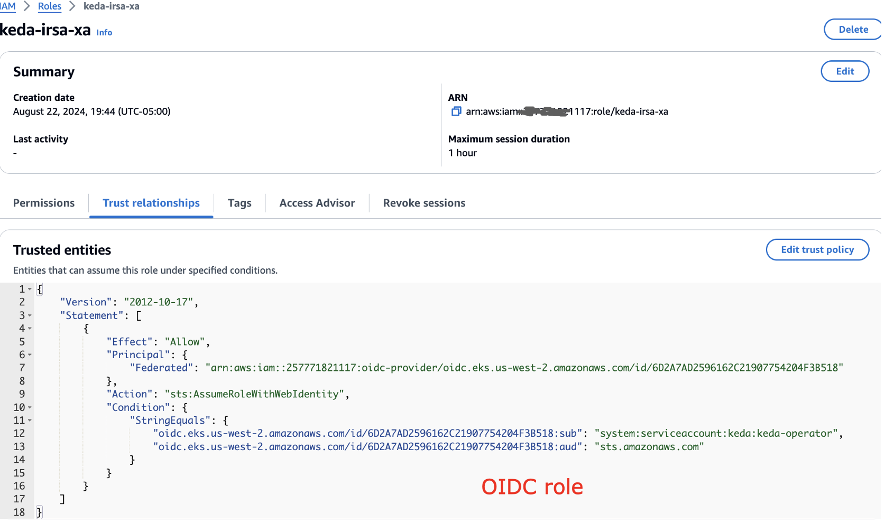
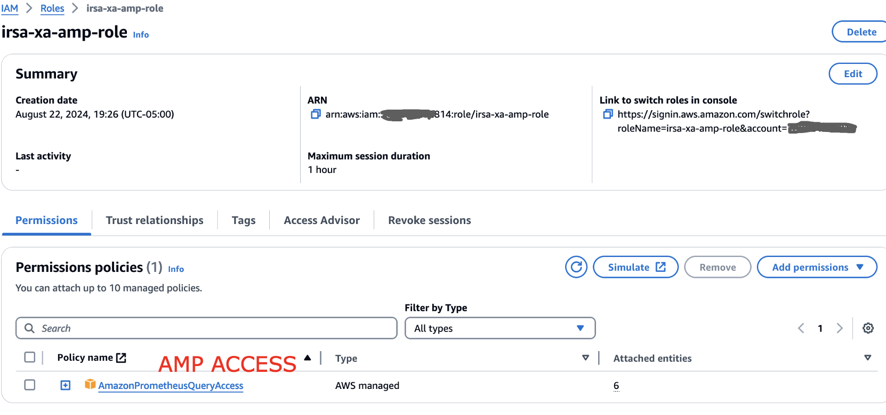

# 使用 KEDA 基于 AMP 和 EKS 进行应用自动扩缩

# 现状

在 Amazon EKS 应用上处理增加的流量是一项挑战，手动扩缩既低效又容易出错。自动扩缩为资源分配提供了更好的解决方案。KEDA 支持基于各种 metrics 和事件的 Kubernetes 自动扩缩，而 Amazon Managed Service for Prometheus 为 EKS 集群提供安全的 metrics 监控。此解决方案将 KEDA 与 Amazon Managed Service for Prometheus 结合，演示基于每秒请求数 (RPS) metrics 的自动扩缩。该方法提供针对工作负载需求量身定制的自动扩缩，用户可以将其应用于自己的 EKS 工作负载。Amazon Managed Grafana 用于监控和可视化扩缩模式，使用户能够深入了解自动扩缩行为并将其与业务事件关联。

# 基于 AMP metrics 使用 KEDA 进行应用自动扩缩

此解决方案演示了 AWS 与开源软件的集成，以创建自动化扩缩管道。它结合了 Amazon EKS 用于托管 Kubernetes、AWS Distro for Open Telemetry (ADOT) 用于 metrics 收集、KEDA 用于事件驱动的自动扩缩、Amazon Managed Service for Prometheus 用于 metrics 存储以及 Amazon Managed Grafana 用于可视化。该架构涉及在 EKS 上部署 KEDA、配置 ADOT 抓取 metrics、使用 KEDA ScaledObject 定义自动扩缩规则，以及使用 Grafana dashboard 监控扩缩。自动扩缩过程从用户对微服务的请求开始，ADOT 收集 metrics 并将其发送到 Prometheus。KEDA 定期查询这些 metrics，确定扩缩需求，并与 Horizontal Pod Autoscaler (HPA) 交互来调整 pod 副本数。此设置为 Kubernetes 微服务实现了 metrics 驱动的自动扩缩，提供灵活的云原生架构，可以基于各种利用率指标进行扩缩。

# 使用 KEDA 基于 AMP metrics 进行跨账户 EKS 应用扩缩
在此场景中，假设 KEDA EKS 运行在 AWS 账户 ID 以 117 结尾的账户中，中央 AMP 账户 ID 以 814 结尾。在 KEDA EKS 账户中，按如下方式设置跨账户 IAM 角色：

同时需要更新信任关系如下：

在 EKS 集群中，您可以看到我们没有使用 Pod identity，因为这里使用的是 IRSA

在中央 AMP 账户中，我们设置了如下的 AMP 访问权限

信任关系中也包含了相应的访问权限

请记下如下所示的 workspace ID

## KEDA 配置
完成上述设置后，确保 KEDA 正在运行如下所示。有关设置说明，请参阅下方分享的博客链接

确保在配置中使用上面定义的中央 AMP 角色

在 KEDA scaler 配置中，指向中央 AMP 账户如下

现在您可以看到 pod 已经按预期进行了扩缩

## 博客

[https://aws.amazon.com/blogs/mt/autoscaling-kubernetes-workloads-with-keda-using-amazon-managed-service-for-prometheus-metrics/](https://aws.amazon.com/blogs/mt/autoscaling-kubernetes-workloads-with-keda-using-amazon-managed-service-for-prometheus-metrics/)
