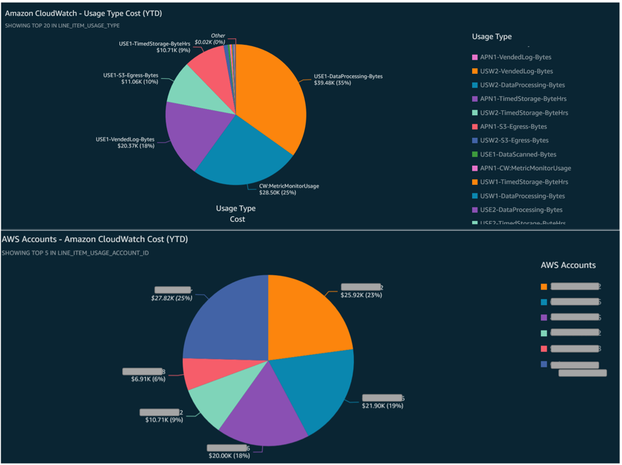

# Amazon CloudWatch

Amazon CloudWatch 成本和使用量可视化将帮助您深入了解各个 AWS 账户、AWS 区域以及所有 CloudWatch 操作的成本，如 GetMetricData、PutLogEvents、GetMetricStream、ListMetrics、MetricStorage、HourlyStorageMetering 和 ListMetrics 等！

要可视化和分析 CloudWatch 成本及使用量数据，您需要创建一个自定义 Athena 视图。Amazon Athena [视图][view]是一个逻辑表，它从原始 CUR 表创建列的子集以简化数据查询。

1.	在继续之前，请确保您已创建 CUR（步骤 #1）并部署了[实施概述][cid-implement]中提到的 AWS CloudFormation 模板（步骤 #2）。

2.	现在，使用以下查询创建一个新的 Amazon Athena [视图][view]。此查询获取组织中所有 AWS 账户的 Amazon CloudWatch 成本和使用量。

        CREATE OR REPLACE VIEW "cloudwatch_cost" AS 
        SELECT
        line_item_usage_type
        , line_item_resource_id
        , line_item_operation
        , line_item_usage_account_id
        , month
        , year
        , "sum"(line_item_usage_amount) "Usage"
        , "sum"(line_item_unblended_cost) cost
        FROM
        database.tablename #replace database.tablename with your database and table name
        WHERE ("line_item_product_code" = 'AmazonCloudWatch')
        GROUP BY 1, 2, 3, 4, 5, 6

### 创建 Amazon QuickSight dashboard

现在，让我们创建一个 QuickSight dashboard 来可视化 Amazon CloudWatch 的成本和使用量。

1.	在 AWS 管理控制台上，导航到 QuickSight 服务，然后从右上角选择您的 AWS 区域。请注意，QuickSight Dataset 应与 Amazon Athena 表位于相同的 AWS 区域。
2.	确保 QuickSight 可以[访问][access] Amazon S3 和 AWS Athena。
3.	通过选择您之前创建的 Amazon Athena 视图作为数据源来[创建 QuickSight Dataset][create-dataset]。使用此步骤每天[计划刷新][schedule-refresh] Dataset。
4.	创建 QuickSight [分析][analysis]。
5.	创建 QuickSight [可视化][visuals]以满足您的需求。
6.	[格式化][format]可视化以满足您的需求。
7.	现在，您可以从分析中[发布][publish]您的 dashboard。
8.	您可以将 dashboard 以[报告][report]格式发送给个人或组，一次性或按计划发送。

以下 **QuickSight dashboard** 显示了 AWS Organizations 中所有 AWS 账户的 Amazon CloudWatch 成本和使用量，以及 GetMetricData、PutLogEvents、GetMetricStream、ListMetrics、MetricStorage、HourlyStorageMetering 和 ListMetrics 等 CloudWatch 操作。

通过上述 dashboard，您现在可以识别组织中各 AWS 账户的 Amazon CloudWatch 成本。您可以使用其他 QuickSight [可视化类型][types]来构建不同的 dashboard 以满足您的需求。

[view]: https://athena-in-action.workshop.aws/30-basics/303-create-view.html
[access]: https://docs.aws.amazon.com/quicksight/latest/user/accessing-data-sources.html
[create-dataset]: https://docs.aws.amazon.com/quicksight/latest/user/create-a-data-set-athena.html
[schedule-refresh]: https://docs.aws.amazon.com/quicksight/latest/user/refreshing-imported-data.html
[analysis]: https://docs.aws.amazon.com/quicksight/latest/user/creating-an-analysis.html
[visuals]: https://docs.aws.amazon.com/quicksight/latest/user/creating-a-visual.html
[format]: https://docs.aws.amazon.com/quicksight/latest/user/formatting-a-visual.html
[publish]: https://docs.aws.amazon.com/quicksight/latest/user/creating-a-dashboard.html
[report]: https://docs.aws.amazon.com/quicksight/latest/user/sending-reports.html
[types]: https://docs.aws.amazon.com/quicksight/latest/user/working-with-visual-types.html
[cid-implement]: ../../../guides/cost/cost-visualization/cost.md#implementation
