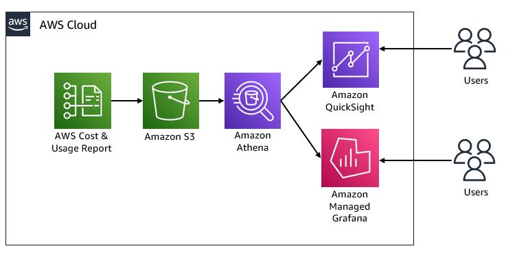

# AWS Observability 服务与成本

当您投资 Observability 技术栈时，定期监控 observability 产品的**成本**非常重要。这使您能够确保只产生需要的成本，并且不会在不需要的资源上超支。

## AWS 成本优化工具

大多数组织的核心重点在于在云上扩展其 IT 基础设施，通常对实际或即将到来的云支出缺乏控制、准备和认识。为帮助您跟踪、报告和分析一段时间内的成本，AWS 提供了多种成本优化工具：

[AWS Cost Explorer][cost-explorer] — 查看 AWS 支出随时间变化的模式，预测未来成本，识别需要进一步调查的领域，观察 Reserved Instance 利用率，观察 Reserved Instance 覆盖率，以及接收 Reserved Instance 建议。

[AWS Cost and Usage Report (CUR)][CUR] — 详细的细粒度原始数据文件，描述您跨账户的每小时 AWS 使用情况，用于自助分析。AWS Cost and Usage Report 具有动态列，根据您使用的服务进行填充。

## 架构概述：可视化 AWS Cost and Usage Report

您可以在 Amazon Managed Grafana 或 Amazon QuickSight 中构建 AWS 成本和使用量 dashboard。以下架构图说明了这两种解决方案。

*架构图*

## Cloud Intelligence Dashboards

[Cloud Intelligence Dashboards][cid] 是基于 AWS Cost and Usage Report (CUR) 构建的一系列 [Amazon QuickSight][quicksight] dashboard。这些 dashboard 充当您自己的成本管理和优化 (FinOps) 工具。您可以获得深入、细粒度和基于建议的 dashboard，帮助您详细了解 AWS 使用量和成本。

### 实施

1.	创建启用了 [Amazon Athena][amazon-athnea] 集成的 [CUR 报告][cur-report]。
*在初始配置期间，AWS 可能需要最多 24 小时才能开始向您的 Amazon S3 存储桶传送报告。报告每天传送一次。为了简化和自动化 Cost and Usage Reports 与 Athena 的集成，AWS 提供了一个 AWS CloudFormation 模板，其中包含多个关键资源以及您为 Athena 集成设置的报告。*

2.	部署 [AWS CloudFormation 模板][cloudformation]。
*此模板包含一个 AWS Glue 爬虫程序、一个 AWS Glue 数据库和一个 AWS Lambda 事件。此时，CUR 数据可通过 Amazon Athena 中的表进行查询。*

    - 直接对 CUR 数据运行 [Amazon Athena][athena-query] 查询。
*要对数据运行 Athena 查询，首先使用 Athena 控制台检查 AWS 是否正在刷新您的数据，然后在 Athena 控制台上运行查询。*

3.	部署 Cloud Intelligence dashboards。
    - 手动部署请参考 AWS Well-Architected **[成本优化实验室][cost-optimization-lab]**。
    - 自动化部署请参考 [GitHub 仓库][GitHub-repo]。

Cloud Intelligence dashboards 非常适合财务团队、高管和 IT 经理。然而，我们从客户那里收到的一个常见问题是如何深入了解 Amazon CloudWatch、AWS X-Ray、Amazon Managed Service for Prometheus 和 Amazon Managed Grafana 等各个 AWS Observability 产品的组织范围成本。

在下一节中，您将深入了解每个产品的成本和使用量。任何规模的公司都可以采用这种主动的云成本优化策略，通过云成本分析和数据驱动的决策提高业务效率，而不会影响性能或产生运营开销。

[cost-explorer]: https://docs.aws.amazon.com/awsaccountbilling/latest/aboutv2/ce-what-is.html
[CUR]: https://docs.aws.amazon.com/cur/latest/userguide/what-is-cur.html
[cid]: https://wellarchitectedlabs.com/cost/200_labs/200_cloud_intelligence/
[quicksight]: https://aws.amazon.com/quicksight/
[cur-report]: https://docs.aws.amazon.com/cur/latest/userguide/cur-create.html
[amazon-athnea]: https://aws.amazon.com/athena/
[cloudformation]: https://docs.aws.amazon.com/cur/latest/userguide/use-athena-cf.html
[athena-query]: https://docs.aws.amazon.com/cur/latest/userguide/cur-ate-run.html
[cost-optimization-lab]: https://www.wellarchitectedlabs.com/cost/200_labs/200_cloud_intelligence/
[GitHub-repo]: https://github.com/aws-samples/aws-cudos-framework-deployment
