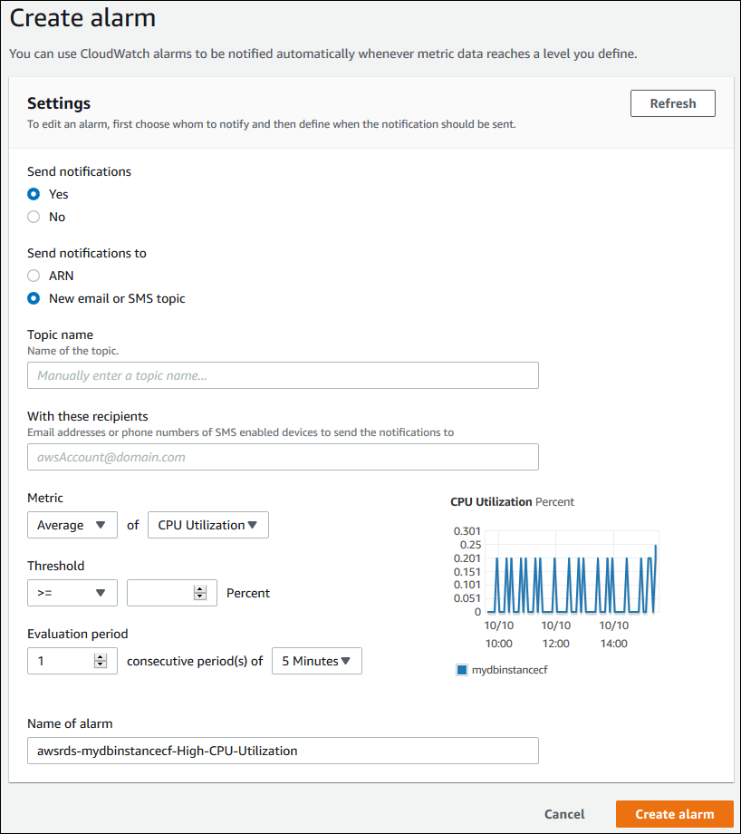
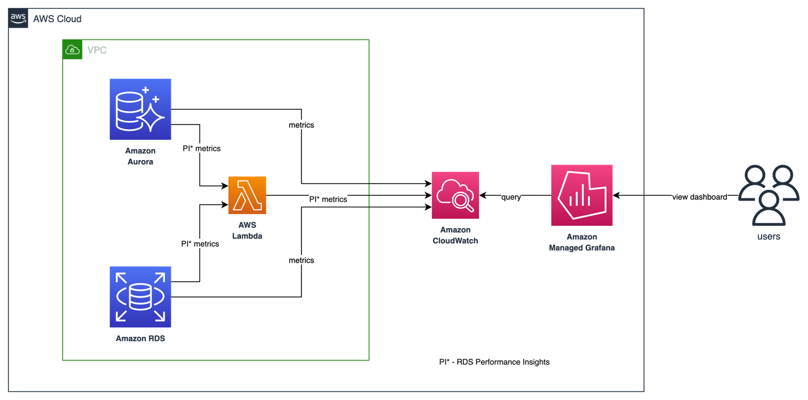

# 监控 Amazon RDS 和 Aurora 数据库

监控是维护 Amazon RDS 和 Aurora 数据库集群可靠性、可用性和性能的关键环节。AWS 提供了多种工具来监控 Amazon RDS 和 Aurora 数据库资源的健康状况，在问题变得严重之前检测到它们，并优化性能以确保一致的用户体验。本指南提供了可观测性最佳实践，以确保您的数据库平稳运行。

## 性能指导方针

作为最佳实践，您需要首先为工作负载建立性能基线。当您设置数据库实例并使用典型工作负载运行它时，请捕获所有性能指标的平均值、最大值和最小值。在多个不同的时间间隔（例如一小时、24 小时、一周、两周）进行此操作。这可以让您了解什么是正常的。获取高峰和非高峰运行时段的比较数据会很有帮助。然后，您可以使用这些信息来确定性能何时低于标准水平。

## 监控选项

### Amazon CloudWatch metrics

[Amazon CloudWatch](https://docs.aws.amazon.com/AmazonRDS/latest/UserGuide/monitoring-cloudwatch.html) 是监控和管理 [RDS](https://aws.amazon.com/rds/) 和 [Aurora](https://aws.amazon.com/rds/aurora/) 数据库的关键工具。它提供了有关数据库性能的有价值见解，帮助您快速识别和解决问题。Amazon RDS 和 Aurora 数据库都以 1 分钟的粒度为每个活动数据库实例向 CloudWatch 发送 metrics。监控默认启用，metrics 可保留 15 天。RDS 和 Aurora 将实例级 metrics 发布到 Amazon CloudWatch 的 **AWS/RDS** 命名空间。

使用 CloudWatch Metrics，您可以识别数据库性能中的趋势或模式，并利用这些信息优化配置和提高应用程序的性能。以下是需要监控的关键 metrics：

* **CPU Utilization** - 已使用的计算处理能力百分比。
* **DB Connections** - 连接到数据库实例的客户端会话数量。如果您看到大量用户连接同时伴随着实例性能和响应时间下降，请考虑限制数据库连接。数据库实例的最佳用户连接数将根据实例类别和执行操作的复杂性而有所不同。要确定数据库连接数，请将数据库实例与参数组关联。
* **Freeable Memory** - 数据库实例上可用的 RAM 大小（以兆字节为单位）。监控选项卡 metrics 中的红线标记在 CPU、内存和存储 Metrics 的 75%。如果实例内存消耗经常超过该线，则表明您应该检查工作负载或升级实例。
* **Network throughput** - 数据库实例的网络流量速率（以每秒字节数表示）。
* **Read/Write Latency** - 读取或写入操作的平均时间（以毫秒为单位）。
* **Read/Write IOPS** - 每秒平均磁盘读取或写入操作数。
* **Free Storage Space** - 数据库实例当前未使用的磁盘空间（以兆字节为单位）。如果已用空间持续达到或超过总磁盘空间的 85%，请调查磁盘空间消耗情况。查看是否可以从实例中删除数据或将数据归档到其他系统以释放空间。


对于性能相关问题的故障排除，第一步是调优使用最频繁且开销最大的查询。调优它们以查看是否可以降低系统资源的压力。有关更多信息，请参阅 [Tuning queries](https://docs.aws.amazon.com/AmazonRDS/latest/UserGuide/CHAP_BestPractices.html#CHAP_BestPractices.TuningQueries)。

如果您的查询已经调优但问题仍然存在，请考虑升级数据库实例类别。您可以将其升级到具有更多资源（CPU、RAM、磁盘空间、网络带宽、I/O 容量）的实例。

然后，您可以设置告警，在这些 metrics 达到临界阈值时发出警报，并尽快采取措施解决任何问题。

有关 CloudWatch metrics 的更多信息，请参阅 [Amazon CloudWatch metrics for Amazon RDS](https://docs.aws.amazon.com/AmazonRDS/latest/UserGuide/rds-metrics.html) 和 [Viewing DB instance metrics in the CloudWatch console and AWS CLI](https://docs.aws.amazon.com/AmazonRDS/latest/UserGuide/metrics_dimensions.html)。

#### CloudWatch Logs Insights

[CloudWatch Logs Insights](https://docs.aws.amazon.com/AmazonCloudWatch/latest/logs/AnalyzingLogData.html) 使您能够以交互方式搜索和分析 Amazon CloudWatch Logs 中的日志数据。您可以执行查询来帮助您更高效地响应运维问题。如果发生问题，您可以使用 CloudWatch Logs Insights 来识别潜在原因并验证已部署的修复。

要将 RDS 或 Aurora 数据库集群的日志发布到 CloudWatch，请参阅 [Publish logs for Amazon RDS or Aurora for MySQL instances to CloudWatch](https://repost.aws/knowledge-center/rds-aurora-mysql-logs-cloudwatch)

有关使用 CloudWatch 监控 RDS 或 Aurora 日志的更多信息，请参阅 [Monitoring Amazon RDS log file](https://docs.aws.amazon.com/AmazonRDS/latest/UserGuide/USER_LogAccess.html)。

#### CloudWatch Alarms

为了识别数据库集群何时性能下降，您应该定期监控关键性能 metrics 并设置告警。使用 [Amazon CloudWatch alarms](https://docs.aws.amazon.com/AmazonCloudWatch/latest/monitoring/AlarmThatSendsEmail.html)，您可以在指定的时间段内监视单个 metric。如果该 metric 超过给定阈值，则会向 Amazon SNS 主题或 AWS Auto Scaling 策略发送通知。CloudWatch 告警不会仅仅因为处于特定状态而调用操作。而是状态必须已更改并保持指定数量的周期。告警仅在告警状态发生变化时才调用操作。仅处于告警状态是不够的。

要设置 CloudWatch 告警：

* 导航到 AWS Management Console 并在 [https://console.aws.amazon.com/rds/](https://console.aws.amazon.com/rds/) 打开 Amazon RDS 控制台。
* 在导航窗格中，选择"Databases"，然后选择一个数据库实例。
* 选择"Logs & events"。

在 CloudWatch alarms 部分，选择"Create alarm"。



* 对于"Send notifications"，选择"Yes"，对于"Send notifications to"，选择"New email or SMS topic"。
* 对于"Topic name"，输入通知名称，对于"With these recipients"，输入逗号分隔的电子邮件地址和电话号码列表。
* 对于"Metric"，选择告警统计信息和要设置的 metric。
* 对于"Threshold"，指定 metric 必须大于、小于或等于阈值，并指定阈值。
* 对于"Evaluation period"，选择告警的评估周期。对于"consecutive period(s) of"，选择必须达到阈值才能触发告警的持续时间。
* 对于"Name of alarm"，输入告警名称。
* 选择"Create Alarm"。

该告警将显示在 CloudWatch alarms 部分。

查看此[示例](https://docs.aws.amazon.com/AmazonRDS/latest/UserGuide/multi-az-db-cluster-cloudwatch-alarm.html)以创建用于 Multi-AZ 数据库集群副本延迟的 Amazon CloudWatch 告警。

#### 数据库审计日志

数据库审计日志提供了对 RDS 和 Aurora 数据库上所有操作的详细记录，使您能够监控未经授权的访问、数据更改和其他潜在有害活动。以下是使用数据库审计日志的一些最佳实践：

* 为所有 RDS 和 Aurora 实例启用数据库审计日志，并配置它们以捕获所有相关数据。
* 使用集中式日志管理解决方案（如 Amazon CloudWatch Logs 或 Amazon Kinesis Data Streams）来收集和分析数据库审计日志。
* 定期监控数据库审计日志以发现可疑活动，并尽快采取措施调查和解决任何问题。

有关如何配置数据库审计日志的更多信息，请参阅 [Configuring an Audit Log to Capture database activities for Amazon RDS and Aurora](https://aws.amazon.com/blogs/database/configuring-an-audit-log-to-capture-database-activities-for-amazon-rds-for-mysql-and-amazon-aurora-with-mysql-compatibility/)。

#### 数据库慢查询和错误日志

慢查询日志帮助您发现数据库中执行缓慢的查询，以便您可以调查原因并在需要时调优查询。错误日志帮助您发现查询错误，进而帮助您发现由于这些错误导致的应用程序更改。

您可以通过使用 Amazon CloudWatch Logs Insights（使您能够以交互方式搜索和分析 Amazon CloudWatch Logs 中的日志数据）创建 CloudWatch dashboard 来监控慢查询日志和错误日志。

要激活和监控 Amazon RDS 的错误日志、慢查询日志和常规日志，请参阅 [Manage slow query logs and general logs for RDS MySQL](https://repost.aws/knowledge-center/rds-mysql-logs)。要激活 Aurora PostgreSQL 的慢查询日志，请参阅 [Enable slow query logs for PostgreSQL](https://catalog.us-east-1.prod.workshops.aws/workshops/31babd91-aa9a-4415-8ebf-ce0a6556a216/en-US/postgresql-logs/enable-slow-query-log)。

## Performance Insights 和操作系统 metrics

#### Enhanced Monitoring

[Enhanced Monitoring](https://docs.aws.amazon.com/AmazonRDS/latest/UserGuide/USER_Monitoring.OS.html) 使您能够实时获取数据库实例运行的操作系统（OS）的细粒度 metrics。

RDS 将 Enhanced Monitoring 的 metrics 发送到您的 Amazon CloudWatch Logs 账户中。默认情况下，这些 metrics 存储 30 天，并存储在 Amazon CloudWatch 的 **RDSOSMetrics** 日志组中。您可以选择 1 秒到 60 秒之间的粒度。您可以在 CloudWatch 中从 CloudWatch Logs 创建自定义 metrics 过滤器，并在 CloudWatch dashboard 上显示图表。


Enhanced Monitoring 还包括操作系统级别的进程列表。目前，Enhanced Monitoring 可用于以下数据库引擎：

* MariaDB
* Microsoft SQL Server
* MySQL
* Oracle
* PostgreSQL

**CloudWatch 和 Enhanced Monitoring 的区别**
CloudWatch 从虚拟机管理程序收集数据库实例的 CPU 利用率 metrics。相比之下，Enhanced Monitoring 从数据库实例上的代理收集 metrics。虚拟机管理程序创建和运行虚拟机（VM）。使用虚拟机管理程序，实例可以通过虚拟共享内存和 CPU 来支持多个客户虚拟机。您可能会发现 CloudWatch 和 Enhanced Monitoring 测量值之间存在差异，因为虚拟机管理程序层执行少量工作。如果您的数据库实例使用较小的实例类别，差异可能会更大。在这种情况下，单个物理实例上可能由虚拟机管理程序层管理更多的虚拟机（VM）。


要了解 Enhanced Monitoring 提供的所有 metrics，请参阅 [OS metrics in Enhanced Monitoring](https://docs.aws.amazon.com/AmazonRDS/latest/UserGuide/USER_Monitoring-Available-OS-Metrics.html)


#### Performance Insights

[Amazon RDS Performance Insights](https://aws.amazon.com/rds/performance-insights/) 是一项数据库性能调优和监控功能，可帮助您快速评估数据库上的负载，并确定何时何地采取措施。借助 Performance Insights dashboard，您可以可视化数据库集群上的数据库负载，并按等待事件、SQL 语句、主机或用户过滤负载。它允许您精确定位根本原因，而不是追踪症状。Performance Insights 使用轻量级数据收集方法，不会影响应用程序的性能，并且可以轻松查看哪些 SQL 语句导致了负载以及原因。

Performance Insights 提供七天的免费性能历史保留，您可以付费将其延长至 2 年。您可以从 RDS 管理控制台或 AWS CLI 启用 Performance Insights。Performance Insights 还公开了一个公共 API，使客户和第三方能够将 Performance Insights 与自己的自定义工具集成。

:::note
	目前，RDS Performance Insights 仅适用于 Aurora（PostgreSQL 和 MySQL 兼容版本）、Amazon RDS for PostgreSQL、MySQL、MariaDB、SQL Server 和 Oracle。
:::

**DBLoad** 是表示数据库活动会话平均数量的关键 metric。在 Performance Insights 中，此数据以 **db.load.avg** metric 进行查询。


有关将 Performance Insights 与 Aurora 配合使用的更多信息，请参阅：[Monitoring DB load with Performance Insights on Amazon Aurora](https://docs.aws.amazon.com/AmazonRDS/latest/AuroraUserGuide/USER_PerfInsights.html)。


## 开源可观测性工具

#### Amazon Managed Grafana
[Amazon Managed Grafana](https://aws.amazon.com/grafana/) 是一项完全托管的服务，可轻松可视化和分析 RDS 和 Aurora 数据库的数据。

Amazon CloudWatch 中的 **AWS/RDS 命名空间** 包含适用于在 Amazon RDS 和 Amazon Aurora 上运行的数据库实体的关键 metrics。要在 Amazon Managed Grafana 中可视化和跟踪 RDS/Aurora 数据库的健康状况和潜在性能问题，我们可以利用 CloudWatch 数据源。



目前，CloudWatch 中只有基本的 Performance Insights metrics 可用，这不足以分析数据库性能和识别数据库瓶颈。为了在 Amazon Managed Grafana 中可视化 RDS Performance Insight metrics 并获得统一的可视性，客户可以使用自定义 Lambda 函数来收集所有 RDS Performance Insights metrics 并将它们发布到自定义 CloudWatch metrics 命名空间中。一旦这些 metrics 在 Amazon CloudWatch 中可用，您就可以在 Amazon Managed Grafana 中可视化它们。

要部署收集 RDS Performance Insights metrics 的自定义 Lambda 函数，请克隆以下 GitHub 仓库并运行 install.sh 脚本。

```
$ git clone https://github.com/aws-observability/observability-best-practices.git
$ cd sandbox/monitor-aurora-with-grafana

$ chmod +x install.sh
$ ./install.sh
```

上述脚本使用 AWS CloudFormation 部署自定义 Lambda 函数和 IAM 角色。Lambda 函数每 10 分钟自动触发一次，调用 RDS Performance Insights API 并将自定义 metrics 发布到 Amazon CloudWatch 中的 /AuroraMonitoringGrafana/PerformanceInsights 自定义命名空间。


有关自定义 Lambda 函数部署和 Grafana dashboard 的详细分步信息，请参阅 [Performance Insights in Amazon Managed Grafana](https://aws.amazon.com/blogs/mt/monitoring-amazon-rds-and-amazon-aurora-using-amazon-managed-grafana/)。

通过快速识别数据库中的意外更改并使用告警通知，您可以采取措施最大限度地减少中断。Amazon Managed Grafana 支持多种通知渠道，如 SNS、Slack、PagerDuty 等，您可以向这些渠道发送告警通知。[Grafana Alerting](https://docs.aws.amazon.com/grafana/latest/userguide/alerts-overview.html) 将为您提供有关如何在 Amazon Managed Grafana 中设置告警的更多信息。

<!-- blank line -->
<figure class="video_container">
  <iframe width="560" height="315" src="https://www.youtube.com/embed/Uj9UJ1mXwEA" title="YouTube video player" frameborder="0" allow="accelerometer; autoplay; clipboard-write; encrypted-media; gyroscope; picture-in-picture; web-share" allowfullscreen></iframe>
</figure>
<!-- blank line -->

## AIOps - 基于机器学习的性能瓶颈检测

#### Amazon DevOps Guru for RDS

借助 [Amazon DevOps Guru for RDS](https://aws.amazon.com/devops-guru/features/devops-guru-for-rds/)，您可以监控数据库的性能瓶颈和运维问题。它使用 Performance Insights metrics，通过机器学习（ML）进行分析，以提供数据库特定的性能问题分析并推荐纠正措施。DevOps Guru for RDS 可以识别和分析各种与性能相关的数据库问题，例如主机资源过度利用、数据库瓶颈或 SQL 查询行为异常等。当检测到问题或异常行为时，DevOps Guru for RDS 会在 DevOps Guru 控制台上显示发现，并使用 [Amazon EventBridge](https://aws.amazon.com/pm/eventbridge) 或 [Amazon Simple Notification Service (SNS)](https://aws.amazon.com/pm/sns) 发送通知，使 DevOps 或 SRE 团队能够在性能和运维问题影响客户之前实时采取行动。

DevOps Guru for RDS 为数据库 metrics 建立基线。基线建立涉及在一段时间内分析数据库性能 metrics 以建立正常行为。然后，Amazon DevOps Guru for RDS 使用机器学习检测相对于已建立基线的异常。如果您的工作负载模式发生变化，DevOps Guru for RDS 会建立新的基线，用于检测相对于新常态的异常。

:::note
	对于新的数据库实例，Amazon DevOps Guru for RDS 需要长达 2 天的时间来建立初始基线，因为它需要分析数据库使用模式并确定什么被认为是正常行为。
:::


有关如何开始的更多信息，请访问 [Amazon DevOps Guru for RDS to Detect, Diagnose, and Resolve Amazon Aurora-Related Issues using ML](https://aws.amazon.com/blogs/aws/new-amazon-devops-guru-for-rds-to-detect-diagnose-and-resolve-amazon-aurora-related-issues-using-ml/)

<!-- blank line -->
<figure class="video_container">
  <iframe width="560" height="315" src="https://www.youtube.com/embed/N3NNYgzYUDA" title="YouTube video player" frameborder="0" allow="accelerometer; autoplay; clipboard-write; encrypted-media; gyroscope; picture-in-picture; web-share" allowfullscreen></iframe>
</figure>
<!-- blank line -->

## 审计与治理

#### AWS CloudTrail Logs

[AWS CloudTrail](https://docs.aws.amazon.com/awscloudtrail/latest/userguide/cloudtrail-user-guide.html) 提供了用户、角色或 AWS 服务在 RDS 中执行的操作记录。CloudTrail 将 RDS 的所有 API 调用捕获为事件，包括来自控制台和代码调用 RDS API 操作的调用。使用 CloudTrail 收集的信息，您可以确定向 RDS 发出的请求、发出请求的 IP 地址、请求发起者、请求时间以及其他详细信息。有关更多信息，请参阅 [Monitoring Amazon RDS API calls in AWS CloudTrail](https://docs.aws.amazon.com/AmazonRDS/latest/UserGuide/logging-using-cloudtrail.html)。

有关更多信息，请参阅 [Monitoring Amazon RDS API calls in AWS CloudTrail](https://docs.aws.amazon.com/AmazonRDS/latest/UserGuide/logging-using-cloudtrail.html)。

## 更多信息参考

[博客 - Monitor RDS and Aurora databases with Amazon Managed Grafana](https://aws.amazon.com/blogs/mt/monitoring-amazon-rds-and-amazon-aurora-using-amazon-managed-grafana/)

[视频 - Monitor RDS and Aurora databases with Amazon Managed Grafana](https://www.youtube.com/watch?v=Uj9UJ1mXwEA)

[博客 - Monitor RDS and Aurora databases with Amazon CloudWatch](https://aws.amazon.com/blogs/database/creating-an-amazon-cloudwatch-dashboard-to-monitor-amazon-rds-and-amazon-aurora-mysql/)

[博客 - Build proactive database monitoring for Amazon RDS with Amazon CloudWatch Logs, AWS Lambda, and Amazon SNS](https://aws.amazon.com/blogs/database/build-proactive-database-monitoring-for-amazon-rds-with-amazon-cloudwatch-logs-aws-lambda-and-amazon-sns/)

[官方文档 - Amazon Aurora Monitoring Guide](https://docs.aws.amazon.com/AmazonRDS/latest/AuroraUserGuide/MonitoringOverview.html)

[动手实验 - Observe and Identify SQL Performance Issues in Amazon Aurora](https://catalog.workshops.aws/awsauroramysql/en-US/provisioned/perfobserve)

