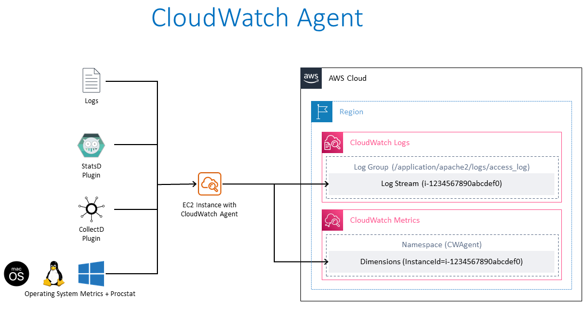

# EC2 监控和 Observability

## 介绍

持续监控和 Observability 提高了敏捷性，改善了客户体验并降低了云环境的风险。根据维基百科，[Observability](https://en.wikipedia.org/wiki/Observability) 是衡量系统内部状态能从其外部输出中推断出来的程度的指标。Observability 这个术语本身源于控制理论领域，基本上意味着您可以通过了解系统产生的外部信号/输出来推断系统中各组件的内部状态。

监控和 Observability 之间的区别在于，监控告诉您系统是否正常工作，而 Observability 告诉您系统为什么不正常工作。监控通常是一种被动措施，而 Observability 的目标是能够以主动方式改善您的关键绩效指标。一个系统如果没有被观察就无法被控制或优化。通过收集 metrics、日志或 traces 来插桩工作负载，并使用正确的监控和 observability 工具获得有意义的洞察和详细上下文，帮助客户控制和优化环境。

AWS 帮助客户从监控转变为 observability，使他们能够拥有完整的端到端服务可见性。在本文中，我们重点关注 Amazon Elastic Compute Cloud (Amazon EC2) 以及通过 AWS 原生和开源工具在 AWS 云环境中改善服务监控和 observability 的最佳实践。

## Amazon EC2

[Amazon Elastic Compute Cloud](https://aws.amazon.com/ec2/) (Amazon EC2) 是 Amazon Web Services (AWS) 云中高度可扩展的计算平台。Amazon EC2 消除了前期硬件投资的需要，因此客户可以更快地开发和部署应用程序，同时只需为使用的部分付费。EC2 提供的一些关键功能包括称为实例的虚拟计算环境、称为 Amazon Machine Images 的预配置实例模板、以及作为实例类型提供的各种 CPU、内存、存储和网络容量配置。

## 使用 AWS 原生工具进行监控和 Observability

### Amazon CloudWatch

[Amazon CloudWatch](https://aws.amazon.com/cloudwatch/) 是一项监控和管理服务，为 AWS、混合和本地应用程序及基础设施资源提供数据和可操作洞察。CloudWatch 以日志、metrics 和事件的形式收集监控和运营数据。它还提供了在 AWS 和本地服务器上运行的 AWS 资源、应用程序和服务的统一视图。CloudWatch 帮助您获得系统范围的资源利用率、应用程序性能和运营健康状况的可见性。

### 统一 CloudWatch Agent

统一 CloudWatch Agent 是 MIT 许可证下的开源软件，支持使用 x86-64 和 ARM64 架构的大多数操作系统。CloudWatch Agent 帮助从 Amazon EC2 实例和混合环境中的本地服务器收集系统级 metrics，从应用程序或服务检索自定义 metrics，以及从 Amazon EC2 实例和本地服务器收集日志。

### 在 Amazon EC2 实例上安装 CloudWatch Agent

#### 命令行安装

CloudWatch Agent 可以通过[命令行](https://docs.aws.amazon.com/AmazonCloudWatch/latest/monitoring/installing-cloudwatch-agent-commandline.html)安装。各种架构和各种操作系统所需的软件包可供[下载](https://docs.aws.amazon.com/AmazonCloudWatch/latest/monitoring/download-cloudwatch-agent-commandline.html)。创建必要的 [IAM 角色](https://docs.aws.amazon.com/AmazonCloudWatch/latest/monitoring/create-iam-roles-for-cloudwatch-agent-commandline.html)，为 CloudWatch Agent 提供从 Amazon EC2 实例读取信息并将其写入 CloudWatch 的权限。创建所需的 IAM 角色后，您可以在所需的 Amazon EC2 实例上[安装并运行](https://docs.aws.amazon.com/AmazonCloudWatch/latest/monitoring/install-CloudWatch-Agent-commandline-fleet.html) CloudWatch Agent。

:::info
    文档：[使用命令行安装 CloudWatch Agent](https://docs.aws.amazon.com/AmazonCloudWatch/latest/monitoring/installing-cloudwatch-agent-commandline.html)

    AWS Observability Workshop：[设置和安装 CloudWatch Agent](https://catalog.workshops.aws/observability/en-US/aws-native/ec2-monitoring/install-ec2)
:::

#### 通过 AWS Systems Manager 安装

CloudWatch Agent 也可以通过 [AWS Systems Manager](https://docs.aws.amazon.com/AmazonCloudWatch/latest/monitoring/installing-cloudwatch-agent-ssm.html) 安装。创建必要的 IAM 角色，为 CloudWatch Agent 提供从 Amazon EC2 实例读取信息并将其写入 CloudWatch 以及与 AWS Systems Manager 通信的权限。在 EC2 实例上安装 CloudWatch Agent 之前，需要在所需的 EC2 实例上[安装或更新](https://docs.aws.amazon.com/AmazonCloudWatch/latest/monitoring/download-CloudWatch-Agent-on-EC2-Instance-SSM-first.html#update-SSM-Agent-EC2instance-first) SSM Agent。CloudWatch Agent 可以通过 AWS Systems Manager 下载。可以创建 JSON 配置文件来指定要收集的 metrics（包括自定义 metrics）和日志。创建所需的 IAM 角色和配置文件后，您可以在所需的 Amazon EC2 实例上安装并运行 CloudWatch Agent。

:::info
    文档：[使用 AWS Systems Manager 安装 CloudWatch Agent](https://docs.aws.amazon.com/AmazonCloudWatch/latest/monitoring/installing-cloudwatch-agent-ssm.html)

    AWS Observability Workshop：[使用 AWS Systems Manager Quick Setup 安装 CloudWatch Agent](https://catalog.workshops.aws/observability/en-US/aws-native/ec2-monitoring/install-ec2/ssm-quicksetup)

    相关博客文章：[Amazon CloudWatch Agent with AWS Systems Manager Integration – Unified Metrics & Log Collection for Linux & Windows](https://aws.amazon.com/blogs/aws/new-amazon-cloudwatch-agent-with-aws-systems-manager-integration-unified-metrics-log-collection-for-linux-windows/)

    YouTube 视频：[Collect Metrics and Logs from Amazon EC2 instances with the CloudWatch Agent](https://www.youtube.com/watch?v=vAnIhIwE5hY)
:::

#### 在混合环境中的本地服务器上安装 CloudWatch Agent

在混合客户环境中，服务器既在本地又在云中。可以采用类似的方法在 Amazon CloudWatch 中实现统一的 observability。CloudWatch Agent 可以直接从 Amazon S3 下载或通过 AWS Systems Manager 下载。为本地服务器创建 IAM 用户以将数据发送到 Amazon CloudWatch。在本地服务器上安装并启动 Agent。

:::note
    文档：[在本地服务器上安装 CloudWatch Agent](https://docs.aws.amazon.com/AmazonCloudWatch/latest/monitoring/install-CloudWatch-Agent-on-premise.html)
:::

### 使用 Amazon CloudWatch 监控 Amazon EC2 实例

维护 Amazon EC2 实例和应用程序的可靠性、可用性和性能的一个关键方面是通过[持续监控](https://catalog.workshops.aws/observability/en-US/aws-native/ec2-monitoring)。在所需的 Amazon EC2 实例上安装了 CloudWatch Agent 后，监控实例的健康状况和性能对于维护稳定的环境是必要的。作为基线，建议监控 EC2 实例的 CPU 利用率、网络利用率、磁盘性能、磁盘读写、内存利用率、磁盘交换利用率、磁盘空间利用率、页面文件利用率和日志收集等项目。

#### 基本和详细监控

Amazon CloudWatch 从 Amazon EC2 收集和处理原始数据为可读的近实时 metrics。默认情况下，Amazon EC2 以 5 分钟间隔将 metric 数据发送到 CloudWatch，作为实例的基本监控。要以 1 分钟间隔将实例的 metric 数据发送到 CloudWatch，可以在实例上启用[详细监控](https://docs.aws.amazon.com/AWSEC2/latest/UserGuide/using-cloudwatch-new.html)。

#### 自动化和手动监控工具

AWS 提供两种类型的工具——自动化和手动——帮助客户监控其 Amazon EC2 并在出现问题时报告。其中一些工具需要少量配置，另一些则需要手动干预。
[自动化监控工具](https://docs.aws.amazon.com/AWSEC2/latest/UserGuide/monitoring_automated_manual.html#monitoring_automated_tools)包括 AWS 系统状态检查、实例状态检查、Amazon CloudWatch 告警、Amazon EventBridge、Amazon CloudWatch Logs、CloudWatch Agent、AWS Management Pack for Microsoft System Center Operations Manager。[手动监控](https://docs.aws.amazon.com/AWSEC2/latest/UserGuide/monitoring_automated_manual.html#monitoring_manual_tools)工具包括 Dashboard，我们将在本文下面的单独部分中详细介绍。

:::note
    文档：[自动化和手动监控](https://docs.aws.amazon.com/AWSEC2/latest/UserGuide/monitoring_automated_manual.html)
:::
### 使用 CloudWatch Agent 从 Amazon EC2 实例获取 Metrics

Metrics 是 CloudWatch 中的基本概念。metric 表示发布到 CloudWatch 的按时间排序的数据点集合。将 metric 视为要监控的变量，数据点表示该变量随时间变化的值。例如，特定 EC2 实例的 CPU 使用率是 Amazon EC2 提供的一个 metric。

#### 使用 CloudWatch Agent 的默认 Metrics

Amazon CloudWatch 从 Amazon EC2 实例收集 metrics，可通过 AWS Management Console、AWS CLI 或 API 查看。可用 metrics 是通过基本监控的 5 分钟间隔或详细监控的 1 分钟间隔（如已开启）覆盖的数据点。

#### 使用 CloudWatch Agent 的自定义 Metrics

客户还可以使用 API 或 CLI 通过标准 1 分钟粒度分辨率或低至 1 秒间隔的高分辨率粒度将自己的自定义 metrics 发布到 CloudWatch。统一 CloudWatch Agent 支持通过 [StatsD](https://docs.aws.amazon.com/AmazonCloudWatch/latest/monitoring/CloudWatch-Agent-custom-metrics-statsd.html) 和 [collectd](https://docs.aws.amazon.com/AmazonCloudWatch/latest/monitoring/CloudWatch-Agent-custom-metrics-collectd.html) 检索自定义 metrics。

使用 CloudWatch Agent 配合 StatsD 协议可以从应用程序或服务检索自定义 metrics。StatsD 是一个流行的开源解决方案，可以从各种应用程序收集 metrics。StatsD 特别适用于插桩您自己的 metrics，同时支持基于 Linux 和 Windows 的服务器。

使用 CloudWatch Agent 配合 collectd 协议也可以从应用程序或服务检索自定义 metrics，这是一个仅在 Linux 服务器上支持的流行开源解决方案，具有可以为各种应用程序收集系统统计信息的插件。通过将 CloudWatch Agent 已经可以收集的系统 metrics 与 collectd 的额外 metrics 相结合，您可以更好地监控、分析和排除系统和应用程序故障。

#### 使用 CloudWatch Agent 的其他自定义 Metrics

CloudWatch Agent 支持从 EC2 实例收集自定义 metrics。一些流行的示例：

- 使用 Elastic Network Adapter (ENA) 的 Linux EC2 实例的网络性能 metrics。
- Linux 服务器的 Nvidia GPU metrics。
- 使用 procstat 插件从 Linux 和 Windows 服务器上的单个进程获取进程 metrics。

### 使用 CloudWatch Agent 从 Amazon EC2 实例获取日志

Amazon CloudWatch Logs 帮助客户使用现有的系统、应用程序和自定义日志文件近实时地监控和排除系统和应用程序故障。要从 Amazon EC2 实例和本地服务器收集日志到 CloudWatch，需要安装统一 CloudWatch Agent。建议使用最新的统一 CloudWatch Agent，因为它可以同时收集日志和高级 metrics。它还支持多种操作系统。如果实例使用实例元数据服务版本 2 (IMDSv2)，则需要统一 Agent。

统一 CloudWatch Agent 收集的日志在 Amazon CloudWatch Logs 中处理和存储。可以从 Windows 或 Linux 服务器以及 Amazon EC2 和本地服务器收集日志。CloudWatch Agent 配置向导可用于设置定义 CloudWatch Agent 配置的 JSON 文件。

:::note
    AWS Observability Workshop：[Logs](https://catalog.workshops.aws/observability/en-US/aws-native/logs)
:::

### Amazon EC2 实例事件

事件表示 AWS 环境中的变化。AWS 资源和应用程序在其状态发生变化时可以生成事件。CloudWatch Events 提供描述 AWS 资源和应用程序变化的系统事件的近实时流。例如，当 EC2 实例的状态从 pending 变为 running 时，Amazon EC2 会生成一个事件。客户还可以生成自定义应用程序级别的事件并将其发布到 CloudWatch Events。

客户可以通过查看状态检查和计划事件来[监控 Amazon EC2 实例的状态](https://docs.aws.amazon.com/AWSEC2/latest/UserGuide/monitoring-instances-status-check.html)。状态检查提供 Amazon EC2 执行的自动化检查的结果。这些自动化检查检测是否存在影响实例的特定问题。状态检查信息与 Amazon CloudWatch 提供的数据一起，为每个实例提供详细的运营可见性。

#### 用于 Amazon EC2 实例事件的 Amazon EventBridge 规则

Amazon CloudWatch Events 可以使用 Amazon EventBridge 自动化系统事件，对资源变化或问题等操作自动响应。来自 AWS 服务（包括 Amazon EC2）的事件近实时地传递到 CloudWatch Events，客户可以创建 EventBridge 规则在事件匹配规则时采取适当的操作。
操作可以是：调用 AWS Lambda 函数、调用 Amazon EC2 Run Command、将事件中继到 Amazon Kinesis Data Streams、激活 AWS Step Functions 状态机、通知 Amazon SNS 主题、通知 Amazon SQS 队列、管道传输到内部或外部事件响应应用程序或 SIEM 工具。

:::note
    AWS Observability Workshop：[事件响应 - EventBridge 规则](https://catalog.workshops.aws/observability/en-US/aws-native/ec2-monitoring/incident-response/create-eventbridge-rule)
:::

#### Amazon EC2 实例的 Amazon CloudWatch 告警

Amazon [CloudWatch 告警](https://docs.aws.amazon.com/AmazonCloudWatch/latest/monitoring/AlarmThatSendsEmail.html)可以在您指定的时间段内监视 metric，并根据 metric 值相对于给定阈值在多个时间段内执行一个或多个操作。告警仅在状态改变时才调用操作。操作可以是发送到 Amazon Simple Notification Service (Amazon SNS) 主题的通知或 Amazon EC2 Auto Scaling 或采取其他适当操作，如[停止、终止、重启或恢复 EC2 实例](https://docs.aws.amazon.com/AmazonCloudWatch/latest/monitoring/UsingAlarmActions.html)。

告警触发后，电子邮件通知作为操作发送到 SNS 主题。

#### Auto Scaling 实例的监控

Amazon EC2 Auto Scaling 帮助客户确保有正确数量的 Amazon EC2 实例可用来处理应用程序的负载。[Amazon EC2 Auto Scaling metrics](https://docs.aws.amazon.com/autoscaling/ec2/userguide/ec2-auto-scaling-cloudwatch-monitoring.html) 收集 Auto Scaling 组的信息，位于 AWS/AutoScaling 命名空间中。代表 Auto Scaling 实例 CPU 和其他使用数据的 Amazon EC2 实例 metrics 位于 AWS/EC2 命名空间中。

### CloudWatch 中的 Dashboard

了解 AWS 账户中资源的清单详情、资源性能和健康检查对于稳定的资源管理很重要。[Amazon CloudWatch dashboards](https://docs.aws.amazon.com/AmazonCloudWatch/latest/monitoring/CloudWatch_Dashboards.html) 是 CloudWatch 控制台中可自定义的主页，可用于在单个视图中监控您的资源，即使这些资源分布在不同区域。有多种方法可以获得 Amazon EC2 实例的良好视图和详细信息。

#### CloudWatch 中的自动 Dashboard

自动 Dashboard 在所有 AWS 公共区域可用，提供所有 AWS 资源（包括 CloudWatch 下的 Amazon EC2 实例）的健康和性能的聚合视图。这帮助客户快速开始监控、获得基于资源的 metrics 和告警视图，并轻松深入了解性能问题的根因。自动 Dashboard 使用 AWS 服务推荐的[最佳实践](https://docs.aws.amazon.com/prescriptive-guidance/latest/implementing-logging-monitoring-cloudwatch/cloudwatch-dashboards-visualizations.html)预构建，保持资源感知，并动态更新以反映重要性能 metrics 的最新状态。

#### CloudWatch 中的自定义 Dashboard

通过[自定义 Dashboard](https://docs.aws.amazon.com/AmazonCloudWatch/latest/monitoring/create_dashboard.html)，客户可以创建任意数量的附加 dashboard，使用不同的小部件并相应地自定义。Dashboard 可以配置为跨区域和跨账户视图，并可以添加到收藏夹列表中。

#### CloudWatch 中的资源健康 Dashboard

CloudWatch ServiceLens 中的资源健康是一个完全托管的解决方案，客户可以使用它来自动发现、管理和可视化其应用程序中 [Amazon EC2 主机的健康和性能](https://aws.amazon.com/blogs/mt/introducing-cloudwatch-resource-health-monitor-ec2-hosts/)。客户可以按 CPU 或内存等性能维度可视化其主机的健康状况，并使用实例类型、实例状态或安全组等过滤器在单个视图中切分数百个主机。它支持一组 EC2 主机的并排比较，并提供对单个主机的精细洞察。

## 使用开源工具进行监控和 Observability

### 使用 AWS Distro for OpenTelemetry 监控 Amazon EC2 实例

[AWS Distro for OpenTelemetry (ADOT)](https://aws.amazon.com/otel) 是 OpenTelemetry 项目的安全、生产就绪、AWS 支持的发行版。作为 Cloud Native Computing Foundation 的一部分，OpenTelemetry 提供开源 API、库和代理来收集分布式 traces 和 metrics 用于应用程序监控。通过 AWS Distro for OpenTelemetry，客户只需插桩应用程序一次即可将相关的 metrics 和 traces 发送到多个 AWS 和合作伙伴监控解决方案。

AWS Distro for OpenTelemetry (ADOT) 提供了一个分布式监控框架，能够以简便的方式关联数据以监控应用程序性能和健康状况，这对于更好的服务可见性和维护至关重要。

ADOT 的关键组件是 SDKs、自动插桩代理、collectors 和 exporters，用于将数据发送到后端服务。

[OpenTelemetry SDK](https://github.com/aws-observability)：为了支持 AWS 资源特定元数据的收集，对 OpenTelemetry SDKs 添加了对 X-Ray trace 格式和上下文的支持。OpenTelemetry SDKs 现在可以关联从 AWS X-Ray 和 CloudWatch 摄入的 trace 和 metrics 数据。

[自动插桩代理](https://aws-otel.github.io/docs/getting-started/java-sdk/auto-instr)：在 OpenTelemetry Java 自动插桩代理中添加了对 AWS SDK 和 AWS X-Ray trace 数据的支持。

[OpenTelemetry Collector](https://github.com/open-telemetry/opentelemetry-collector)：发行版中的 collector 使用上游 OpenTelemetry collector 构建。向上游 collector 添加了 AWS 特定的 exporters 以将数据发送到 AWS 服务，包括 AWS X-Ray、Amazon CloudWatch 和 Amazon Managed Service for Prometheus。

#### 通过 ADOT Collector 和 Amazon CloudWatch 获取 Metrics 和 Traces

AWS Distro for OpenTelemetry (ADOT) Collector 可以与 CloudWatch Agent 并行安装在 Amazon EC2 实例上，OpenTelemetry SDKs 可用于从在 Amazon EC2 实例上运行的工作负载收集应用程序 traces 和 metrics。

为了在 Amazon CloudWatch 中支持 OpenTelemetry metrics，[AWS EMF Exporter for OpenTelemetry Collector](https://github.com/open-telemetry/opentelemetry-collector-contrib/tree/main/exporter/awsemfexporter) 将 OpenTelemetry 格式的 metrics 转换为 CloudWatch Embedded Metric Format (EMF)，使集成了 OpenTelemetry metrics 的应用程序能够将高基数应用程序 metrics 发送到 CloudWatch。[X-Ray exporter](https://aws-otel.github.io/docs/getting-started/x-ray#configuring-the-aws-x-ray-exporter) 允许以 OTLP 格式收集的 traces 导出到 [AWS X-Ray](https://aws.amazon.com/xray/)。

Amazon EC2 上的 ADOT Collector 可以通过 AWS CloudFormation 或使用 [AWS Systems Manager Distributor](https://catalog.workshops.aws/observability/en-US/aws-managed-oss/ec2-monitoring/configure-adot-collector) 安装来收集应用程序 metrics。

### 使用 Prometheus 监控 Amazon EC2 实例

[Prometheus](https://prometheus.io/) 是一个独立的开源项目，独立维护，用于系统监控和告警。Prometheus 以时间序列数据的形式收集和存储 metrics，即 metrics 信息与记录时的时间戳一起存储，以及称为标签的可选键值对。

Prometheus 通过命令行标志进行配置，所有配置详情都维护在 prometheus.yaml 文件中。配置文件中的 'scrape_config' 部分指定要抓取的目标和参数。[Prometheus Service Discovery](https://github.com/prometheus/prometheus/tree/main/discovery) (SD) 是一种查找要抓取 metrics 的 endpoint 的方法。允许从 AWS EC2 实例检索抓取目标的 Amazon EC2 服务发现配置在 `ec2_sd_config` 中配置。

#### 通过 Prometheus 和 Amazon CloudWatch 获取 Metrics

EC2 实例上的 CloudWatch Agent 可以安装并配置 Prometheus 来抓取 metrics 以在 CloudWatch 中进行监控。这对于在 EC2 上运行容器工作负载并需要与开源 Prometheus 监控兼容的自定义 metrics 的客户很有帮助。CloudWatch Agent 的安装可以按照上面较早部分解释的步骤进行。带有 Prometheus 监控的 CloudWatch Agent 需要两个配置来抓取 Prometheus metrics。一个用于标准 Prometheus 配置，如 Prometheus 文档中 'scrape_config' 所述。另一个用于 [CloudWatch Agent 配置](https://docs.aws.amazon.com/AmazonCloudWatch/latest/monitoring/CloudWatch-Agent-PrometheusEC2.html#CloudWatch-Agent-PrometheusEC2-configure)。

#### 通过 Prometheus 和 ADOT Collector 获取 Metrics

客户可以选择为其 observability 需求建立全开源设置。为此，可以配置 AWS Distro for OpenTelemetry (ADOT) Collector 从 Prometheus 插桩的应用程序抓取数据并将 metrics 发送到 Prometheus Server。此流程涉及三个 OpenTelemetry 组件：Prometheus Receiver、Prometheus Remote Write Exporter 和 Sigv4 Authentication Extension。Prometheus Receiver 以 Prometheus 格式接收 metric 数据。Prometheus Exporter 以 Prometheus 格式导出数据。Sigv4 Authenticator 扩展为向 AWS 服务发出请求提供 Sigv4 认证。

#### Prometheus Node Exporter

[Prometheus Node Exporter](https://github.com/prometheus/node_exporter) 是一个用于云环境的开源时间序列监控和告警系统。Amazon EC2 实例可以使用 Node Exporter 进行插桩，以收集和存储节点级 metrics 作为时间序列数据，随时间戳记录信息。Node Exporter 是一个 Prometheus exporter，可以通过 URL http://localhost:9100/metrics 暴露各种主机 metrics。

 创建 metrics 后，可以将它们发送到 [Amazon Managed Prometheus](https://aws.amazon.com/prometheus/)。

### 使用 Fluent Bit 插件从 Amazon EC2 实例流式传输日志

[Fluent Bit](https://fluentbit.io/) 是一个开源多平台日志处理工具，用于大规模处理数据收集、收集和聚合涉及各种信息源、多种数据格式、数据可靠性、安全性、灵活路由和多目标的各种数据。

Fluent Bit 帮助创建一个简单的扩展点，将日志从 Amazon EC2 流式传输到 AWS 服务，包括用于日志保留和分析的 Amazon CloudWatch。新推出的 [Fluent Bit 插件](https://github.com/aws/amazon-cloudwatch-logs-for-fluent-bit#new-higher-performance-core-fluent-bit-plugin)可以将日志路由到 Amazon CloudWatch。

### 使用 Amazon Managed Grafana 进行 Dashboard 展示

[Amazon Managed Grafana](https://aws.amazon.com/grafana/) 是一个基于开源 Grafana 项目的完全托管服务，具有丰富、交互式和安全的数据可视化功能，帮助客户即时查询、关联、分析、监控和告警跨多个数据源的 metrics、日志和 traces。客户可以创建交互式 dashboard 并与组织中的任何人共享，使用自动扩展、高可用性和企业安全的服务。通过 Amazon Managed Grafana，客户可以管理跨 AWS 账户、AWS 区域和数据源的用户和团队对 dashboard 的访问。

可以通过使用 Grafana 工作区控制台中的 AWS 数据源配置选项将 Amazon CloudWatch 作为数据源添加到 Amazon Managed Grafana。此功能通过发现现有的 CloudWatch 账户并管理访问 CloudWatch 所需的认证凭证配置来简化将 CloudWatch 添加为数据源的过程。Amazon Managed Grafana 还支持 [Prometheus 数据源](https://docs.aws.amazon.com/grafana/latest/userguide/prometheus-data-source.html)，即自管理的 Prometheus 服务器和 Amazon Managed Service for Prometheus 工作区都可作为数据源。

Amazon Managed Grafana 附带各种面板，可以轻松构建正确的查询并自定义显示属性，允许客户创建所需的 dashboard。

## 结论

监控让您了解系统是否正常工作。Observability 让您了解系统为什么不正常工作。良好的 observability 允许您回答您不知道需要注意的问题。监控和 Observability 为衡量系统的内部状态铺平了道路，这些状态可以从其输出中推断出来。

现代应用程序——运行在云中的微服务、无服务器和异步架构——以 metrics、日志、traces 和事件的形式生成大量数据。Amazon CloudWatch 以及开源工具（如 AWS Distro for OpenTelemetry、Amazon Managed Prometheus 和 Amazon Managed Grafana）使客户能够在统一平台上收集、访问和关联这些数据。帮助客户打破数据孤岛，轻松获得系统范围的可见性并快速解决问题。
