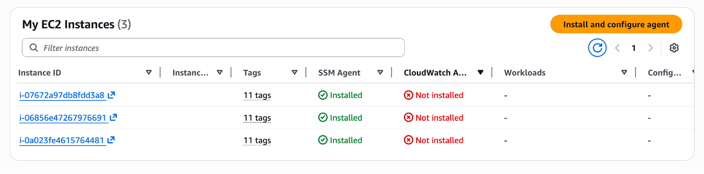

# 配置 Agents/Collectors

一旦您的监控账户结构就位，您将需要配置应用程序、服务和其他基础设施组件以将遥测数据发送到 CloudWatch。

这是配置 agents 和 collectors 的高级指南。如需深入指导，请参阅本最佳实践指南中的各个部分。

## Amazon EKS

对于 EKS，配置 Observability 最简单的方式是使用 Amazon EKS add-on。这将安装具有增强 Observability 功能的 Container Insights for Amazon EKS。该 add-on 安装 CloudWatch agent 以从集群发送基础设施 metrics，安装 Fluent Bit 以发送容器日志，还启用 CloudWatch Application Signals 以发送应用程序性能遥测数据。（如果您不需要 Application Signals、Container Insights 等，这是可配置的。）

通常，Amazon CloudWatch Observability EKS add-on 作为 DaemonSet 安装。

EKS 的一些选项：

### CloudWatch Agent for EKS

- Amazon CloudWatch Observability EKS add-on
- Amazon CloudWatch Observability Helm Chart

### OTEL Collector for EKS

或者，如果您想使用 OTEL collector，您可以：
- 配置 AWS Exporters
- 将 OTLP exporter 指向 log 和 traces OTLP endpoints
- 定义处理管道
- 使用 OTEL 库检测您的应用程序（如果需要）

## Amazon ECS

对于 ECS，您可以启用 Container Insights 来收集集群的基础设施 metrics。您还可以部署 Application Signals 来收集应用程序性能遥测数据和相关 traces。对于日志，您可以使用 awslogs 驱动程序将日志数据发送到 CloudWatch，或者可以使用 OpenTelemetry collectors 来发送数据。

ECS 的一些选项：

### CloudWatch Agent for ECS

- 启用 Container Insights
- 部署 Application Signals（可选）
- 使用 awslogs log driver

### OTEL Collector for ECS

或者，您可以：
- 作为 sidecar 运行
- 配置 AWS Exporters
- 设置 OTLP endpoints
- 定义处理管道
- 检测应用程序（如果需要）

## Amazon EC2 和本地环境

CloudWatch agent 可用于从 EC2 实例、其他虚拟机和本地服务器向 CloudWatch 发送遥测数据。

### 部署选项

- **Workload Detection for EC2** – 提供部署 agent 的自动化方式

- **Systems Manager** – 使用 AWS Systems Manager 部署和配置 agent
- **Custom Automation** – 使用您自己的自动化工具
- **Manual Installation** – 针对特定用例手动安装

您可以通过配置文件（自动或手动）配置/自定义遥测，并且有向导可帮助您微调设置。

### OTEL Collector for EC2

您还可以使用 OTEL collector：

**OTLP Exporters：**

使用 OTLP exporters 将数据发送到 trace 和 log OTLP endpoints。

**AWS 特定 Exporters：**

使用 AWS 特定的 exporters 和处理管道。

## 总结

总结：
1. 为您的计算平台（EKS、ECS、EC2）选择适当的 agent/collector
2. 使用自动化方法（add-ons、Helm charts、Systems Manager）或手动安装进行部署
3. 根据您的需求配置遥测收集
4. 可选择使用 OpenTelemetry 进行供应商中立的检测

有关详细配置指南，请参阅本最佳实践指南中关于您的计算平台和 Observability 工具的特定部分。

## 后续步骤

继续前往 [Dashboard 和告警](./dashboards-alerts.md)
