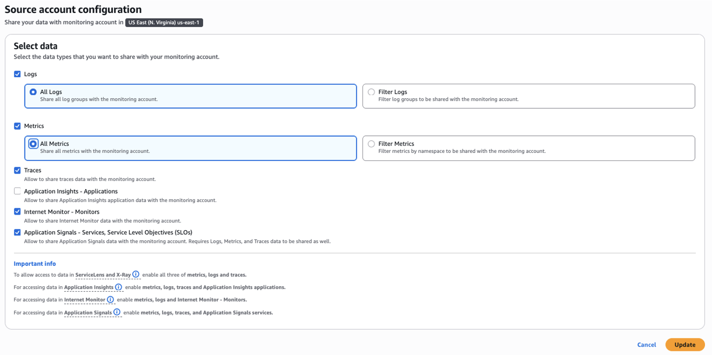

# 设置监控账户和源账户

在大多数情况下，客户需要可视化和关联来自多个 AWS 账户的遥测数据，因为他们的服务运行在多个账户中，有时还跨越多个区域。

如果您只计划在单个账户中运行可观测性和服务，可以跳过此步骤。

第一步是设置您的监控账户和源账户，并精确指定要共享的遥测数据。您将利用跨账户可观测性来实现这一点。请注意，这是按区域工作的。

有关如何设置跨账户可观测性的更详细说明，请参阅 [CloudWatch 跨账户可观测性](../cloudwatch_cross_account_observability.md) 指南。

## 监控账户

指定一个监控账户，您将从中以集中方式查看遥测数据。

然后定义哪些账户将与您的监控账户共享数据。您可以选择 AWS 组织中的所有账户或选择单个源账户。您还将指定要与监控账户共享的遥测数据类型（例如 logs、metrics、traces、Application Signals 等）。

然后您将[链接源账户](../cloudwatch_cross_account_observability.md#step-2-link-the-source-accounts)以完成设置。

您典型的监控账户结构将类似于：

您将在 CloudWatch 设置中按区域[配置](../cloudwatch_cross_account_observability.md#step-1-set-up-a-monitoring-account)此项。

:::info
通过跨账户可观测性，logs 和 metrics 不会从源账户复制，但 trace 数据会复制到监控账户（第一个监控账户的 trace 复制不收取额外费用）。您只是集中查看 logs、metrics、traces 和其他遥测数据。
:::

## 多个监控账户

每个监控账户最多可以链接 100,000 个源账户。

但是，可能存在需要多个监控账户的运营场景。您可以根据自己的需求拥有多个监控账户。这种设置可能如下所示：

:::info
如果您需要将单个源账户的数据共享给多个监控账户，这也是可配置的，因为每个源账户最多可以向 5 个监控账户共享数据。
:::

## 遥测控制

您还可以控制共享的遥测数据，能够指定 metric 和 log 过滤器，为您提供额外的粒度。

现在您将能够在单个监控账户（每个区域）中[可视化和查询跨账户](../cloudwatch_cross_account_observability.md#querying-cross-account-telemetry-data)数据。

## 总结

总结如下：
1. 指定和配置监控账户
2. 配置源账户
3. 微调要共享的遥测数据
4. 从监控账户可视化和查询所有源账户数据

## 后续步骤

继续阅读 [设置统一数据存储](./setup-unified-data-store.md)
