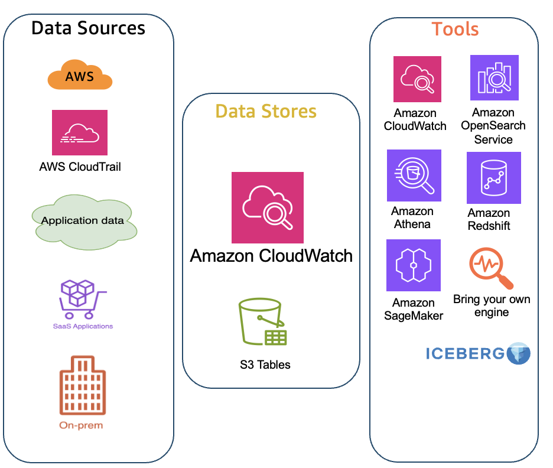

# 设置统一数据存储

除了跨账户可观测性之外，您还可以将日志集中（复制）到中心区域和中心账户。

CloudWatch 统一数据存储帮助您为组织大规模构建统一的存储库。您可以在此处收集、整理和分析遥测数据。

## 概述

CloudWatch 统一数据存储允许您将应用程序、运营、安全和合规数据集中到一个地方。这意味着您可以将来自多个 AWS 账户/区域以及第三方工具的日志数据集中到单个账户和区域，进行集中查询和分析。

您可以将统一数据存储与跨账户可观测性结合使用，也可以单独使用。

## 主要优势

- **集中所有可观测性数据** – 将来自 AWS 服务和第三方来源的运营、安全和合规数据整合到跨多个账户和区域的统一存储中

- **消除数据孤岛和重复** – 去除不必要的 ETL 管道，降低存储成本，通过将数据一次性存储在单个位置来简化管理

- **加速故障排除并缩短 MTTR** – 通过直观的分面查询、自然语言搜索以及 CloudWatch Logs Insights 和 Amazon OpenSearch Service 的高级可视化功能，更快获取洞察

- **利用灵活的分析解锁商业智能** – 使用您选择的工具（包括 Amazon Athena、QuickSight、SageMaker、Apache Spark 和第三方兼容 Iceberg 的平台）分析统一数据，无需数据重复

## 配置步骤

这在组织级别进行配置：

### 步骤 1：配置根账户

在您的根账户中：
1. 开启可信访问
2. 指定一个委托账户作为集中化数据存储

### 步骤 2：配置集中化账户

在您的集中化账户中，创建集中化规则，包括：
- 组织 ID 或源账户
- 源区域

## 集中化规则

您可以决定和配置：

1. **源账户** – 选择要从哪些源账户复制数据，并按组织、OU 或账户 ID 进行过滤
2. **源区域** – 选择要从哪些源区域复制数据
3. **目标账户和区域** - 指定要存储集中遥测数据的 AWS 账户和区域
4. **备份区域** – 配置备份区域以获得数据的第二副本（可选）
5. **日志组过滤器** – 使用多种运算符按名称、前缀或关键字过滤日志组
6. **多条规则** – 根据您的需求配置多条集中化规则
7. **KMS 加密日志组选项** - 选择 KMS 加密日志组的集中化行为

您的集中化日志账户结构可能如下所示：

## 总结

总结如下：
1. 在根账户中启用可信访问并指定委托账户
2. 在集中化账户中创建集中化规则
3. 配置源账户、区域和日志组过滤器
4. 可选配置备份区域以实现冗余

## 后续步骤

继续阅读 [配置 Agent/收集器](./configure-agents-collectors.md)
