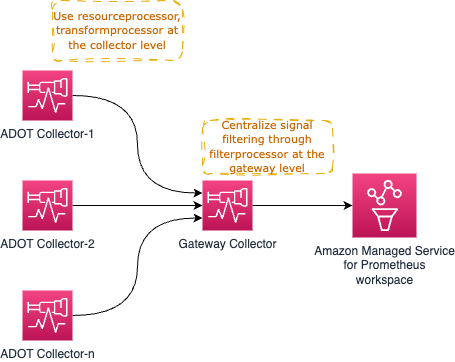
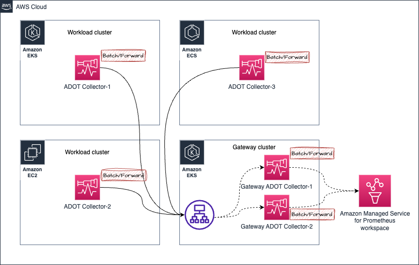

# 运维 AWS Distro for OpenTelemetry (ADOT) Collector

[ADOT collector](https://aws-otel.github.io/) 是 [CNCF](https://www.cncf.io/) 开源 [OpenTelemetry Collector](https://opentelemetry.io/docs/collector/) 的下游发行版。

客户可以使用 ADOT Collector 从不同环境（包括本地、AWS 和其他云提供商）收集 metrics 和 traces 等信号。

要在实际生产环境中大规模运维 ADOT Collector，运维人员应监控 collector 的健康状况，并根据需要进行扩展。在本指南中，您将了解在生产环境中运维 ADOT Collector 可以采取的措施。

## 部署架构

根据您的需求，有几种部署选项可供考虑：

* 不使用 Collector
* Agent 模式
* Gateway 模式


:::tip
    查阅 [OpenTelemetry 文档](https://opentelemetry.io/docs/collector/deployment/)
    以获取关于这些概念的更多信息。
:::

### 不使用 Collector
此选项完全跳过 collector。如果您不了解，可以直接从 OTEL SDK 调用目标服务的 API 来发送信号。例如，您可以直接从应用程序进程调用 AWS X-Ray 的 [PutTraceSegments](https://docs.aws.amazon.com/xray/latest/api/API_PutTraceSegments.html) API，而不是将 spans 发送到 ADOT Collector 等外部进程代理。

我们强烈建议您查看上游文档中的[相关章节](https://opentelemetry.io/docs/collector/deployment/no-collector/)以获取更多详情，因为没有任何 AWS 特定方面会改变此方法的指导建议。


### Agent 模式
在此方法中，您将以分布式方式运行 collector 并将信号收集到目标中。与"不使用 Collector"选项不同，这里我们分离了关注点，将应用程序从远程 API 调用中解耦，改为与本地可访问的 agent 通信。

在 Amazon EKS 环境中，本质上看起来如下所示——**将 collector 作为 Kubernetes sidecar 运行：**


在上述架构中，您的抓取配置实际上不需要使用任何服务发现机制，因为您将从 `localhost` 抓取目标，因为 collector 与应用容器运行在同一个 pod 中。

相同的架构也适用于收集 traces。您只需按照[此处所示](https://aws-otel.github.io/docs/getting-started/x-ray#sample-collector-configuration-putting-it-together)创建一个 OTEL pipeline 即可。

##### 优缺点
* 支持此设计的一个论点是，您不需要为 Collector 分配大量资源（CPU、内存）来完成其工作，因为目标仅限于 localhost 来源。

* 使用此方法的缺点是，collector pod 配置的变体数量与您在集群上运行的应用程序数量成正比。
这意味着，您必须根据 Pod 预期的工作负载为每个 Pod 单独管理 CPU、内存和其他资源分配。如果不注意这一点，您可能会为 Collector Pod 过度或不足分配资源，导致性能不佳或锁定本可被节点中其他 Pod 使用的 CPU 周期和内存。

您还可以根据需要以 Deployments、Daemonset、Statefulset 等模型部署 collector。

#### 在 Amazon EKS 上以 Daemonset 方式运行 collector

您可以选择以 [Daemonset](https://kubernetes.io/docs/concepts/workloads/controllers/daemonset/) 方式运行 collector，以便将 collector 的负载（抓取并将 metrics 发送到 Amazon Managed Service for Prometheus 工作区）均匀分布在 EKS 节点上。


确保您有 `keep` 操作，使 collector 仅抓取其自身主机/节点上的目标。

请参阅以下示例作为参考。在[此处](https://aws-otel.github.io/docs/getting-started/adot-eks-add-on/config-advanced#daemonset-collector-configuration)查找更多此类配置详情。

```yaml
scrape_configs:
    - job_name: kubernetes-apiservers
    bearer_token_file: /var/run/secrets/kubernetes.io/serviceaccount/token
    kubernetes_sd_configs:
    - role: endpoints
    relabel_configs:
    - action: keep
        regex: $K8S_NODE_NAME
        source_labels: [__meta_kubernetes_endpoint_node_name]
    scheme: https
    tls_config:
        ca_file: /var/run/secrets/kubernetes.io/serviceaccount/ca.crt
        insecure_skip_verify: true
```

相同的架构也可用于收集 traces。在这种情况下，不是由 Collector 主动抓取 endpoints 获取 Prometheus metrics，而是由应用程序 pods 将 trace spans 发送到 Collector。

##### 优缺点
**优势**

* 扩展问题最小化
* 配置高可用性是一个挑战
* 使用了过多的 Collector 副本
* 对 Logs 支持较为简单

**劣势**

* 在资源利用方面不是最优的
* 资源分配不均衡


#### 在 Amazon EC2 上运行 collector
由于在 EC2 上运行 collector 没有 sidecar 方法，您需要在 EC2 实例上以 agent 方式运行 collector。您可以设置如下所示的静态抓取配置来发现实例中要抓取 metrics 的目标。

以下配置抓取 localhost 上端口 `9090` 和 `8081` 的 endpoints。

通过我们的 [One Observability Workshop 中以 EC2 为重点的模块](https://catalog.workshops.aws/observability/en-US/aws-managed-oss/ec2-monitoring)获取关于此主题的深入实践体验。

```yaml
global:
  scrape_interval: 15s # By default, scrape targets every 15 seconds.

scrape_configs:
- job_name: 'prometheus'
  static_configs:
  - targets: ['localhost:9090', 'localhost:8081']
```

#### 在 Amazon EKS 上以 Deployment 方式运行 collector

以 Deployment 方式运行 collector 在您需要为 collector 提供高可用性时特别有用。根据目标数量、可用于抓取的 metrics 数量等，应调整 Collector 的资源以确保 collector 不会因资源不足而导致信号收集出现问题。

[在此处的指南中阅读更多关于此主题的内容。](https://aws-observability.github.io/observability-best-practices/guides/containers/oss/eks/best-practices-metrics-collection)

以下架构展示了 collector 如何部署在工作负载节点之外的独立节点上来收集 metrics 和 traces。


要设置 metric 收集的高可用性，[请阅读我们的文档，其中提供了如何设置的详细说明](https://docs.aws.amazon.com/prometheus/latest/userguide/Send-high-availability-prom-community.html)。

#### 在 Amazon ECS 上以中心任务方式运行 collector 用于 metrics 收集

您可以使用 [ECS Observer 扩展](https://github.com/open-telemetry/opentelemetry-collector-contrib/tree/main/extension/observer/ecsobserver)来收集 ECS 集群中不同任务或跨集群的 Prometheus metrics。


扩展的示例 collector 配置：

```yaml
extensions:
  ecs_observer:
    refresh_interval: 60s # format is https://golang.org/pkg/time/#ParseDuration
    cluster_name: 'Cluster-1' # cluster name need manual config
    cluster_region: 'us-west-2' # region can be configured directly or use AWS_REGION env var
    result_file: '/etc/ecs_sd_targets.yaml' # the directory for file must already exists
    services:
      - name_pattern: '^retail-.*$'
    docker_labels:
      - port_label: 'ECS_PROMETHEUS_EXPORTER_PORT'
    task_definitions:
      - job_name: 'task_def_1'
        metrics_path: '/metrics'
        metrics_ports:
          - 9113
          - 9090
        arn_pattern: '.*:task-definition/nginx:[0-9]+'
```


##### 优缺点
* 此模型的优势是需要管理的 collector 和配置较少。
* 当集群较大且有数千个目标需要抓取时，您需要仔细设计架构，使负载在 collector 之间均衡分布。加上必须出于高可用原因运行几乎相同的 collector 副本，需要仔细执行以避免运维问题。

### Gateway 模式


## 管理 Collector 健康状况
OTEL Collector 暴露了多个信号供我们监控其健康状况和性能。密切监控 collector 的健康状况至关重要，以便采取纠正措施，例如：

* 水平扩展 collector
* 为 collector 提供额外资源以使其按预期运行


### 从 Collector 收集健康 metrics

OTEL Collector 可以通过简单地在 `service` pipeline 中添加 `telemetry` 部分来配置以 Prometheus Exposition Format 暴露 metrics。collector 还可以将自身的 logs 输出到 stdout。

有关遥测配置的更多详情，请参阅 [OpenTelemetry 文档](https://opentelemetry.io/docs/collector/configuration/#service)。

collector 的示例遥测配置：

```yaml
service:
  telemetry:
    logs:
      level: debug
    metrics:
      level: detailed
      address: 0.0.0.0:8888
```
配置完成后，collector 将开始在 `http://localhost:8888/metrics` 暴露如下 metrics。

```bash
# HELP otelcol_exporter_enqueue_failed_spans Number of spans failed to be added to the sending queue.
# TYPE otelcol_exporter_enqueue_failed_spans counter
otelcol_exporter_enqueue_failed_spans{exporter="awsxray",service_instance_id="523a2182-539d-47f6-ba3c-13867b60092a",service_name="aws-otel-collector",service_version="v0.25.0"} 0

# HELP otelcol_process_runtime_total_sys_memory_bytes Total bytes of memory obtained from the OS (see 'go doc runtime.MemStats.Sys')
# TYPE otelcol_process_runtime_total_sys_memory_bytes gauge
otelcol_process_runtime_total_sys_memory_bytes{service_instance_id="523a2182-539d-47f6-ba3c-13867b60092a",service_name="aws-otel-collector",service_version="v0.25.0"} 2.4462344e+07

# HELP otelcol_process_memory_rss Total physical memory (resident set size)
# TYPE otelcol_process_memory_rss gauge
otelcol_process_memory_rss{service_instance_id="523a2182-539d-47f6-ba3c-13867b60092a",service_name="aws-otel-collector",service_version="v0.25.0"} 6.5675264e+07

# HELP otelcol_exporter_enqueue_failed_metric_points Number of metric points failed to be added to the sending queue.
# TYPE otelcol_exporter_enqueue_failed_metric_points counter
otelcol_exporter_enqueue_failed_metric_points{exporter="awsxray",service_instance_id="d234b769-dc8a-4b20-8b2b-9c4f342466fe",service_name="aws-otel-collector",service_version="v0.25.0"} 0
otelcol_exporter_enqueue_failed_metric_points{exporter="logging",service_instance_id="d234b769-dc8a-4b20-8b2b-9c4f342466fe",service_name="aws-otel-collector",service_version="v0.25.0"} 0
```

在上面的示例输出中，您可以看到 collector 暴露了一个名为 `otelcol_exporter_enqueue_failed_spans` 的 metric，显示未能添加到发送队列的 spans 数量。这是一个需要关注的 metric，用于了解 collector 在向配置的目标发送 trace 数据时是否存在问题。在本例中，您可以看到 `exporter` 标签的值为 `awsxray`，表示正在使用的 trace 目标。

另一个 metric `otelcol_process_runtime_total_sys_memory_bytes` 用于了解 collector 使用的内存量。如果此内存接近 `otelcol_process_memory_rss` metric 的值，则表明 Collector 接近耗尽为该进程分配的内存，您可能需要采取措施（如为 collector 分配更多内存）以避免问题。

同样，您可以看到另一个名为 `otelcol_exporter_enqueue_failed_metric_points` 的计数器 metric，指示未能发送到远程目标的 metrics 数量。

#### Collector 健康检查
Collector 暴露了一个存活探针，供您检查 collector 是否存活。建议使用该 endpoint 定期检查 collector 的可用性。

[`healthcheck`](https://github.com/open-telemetry/opentelemetry-collector-contrib/tree/main/extension/healthcheckextension) 扩展可用于让 collector 暴露该 endpoint。请参阅以下示例配置：

```yaml
extensions:
  health_check:
    endpoint: 0.0.0.0:13133
```

有关完整配置选项，请参阅 [GitHub 仓库](https://github.com/open-telemetry/opentelemetry-collector-contrib/tree/main/extension/healthcheckextension)。

```bash
❯ curl -v http://localhost:13133
*   Trying 127.0.0.1:13133...
* Connected to localhost (127.0.0.1) port 13133 (#0)
> GET / HTTP/1.1
> Host: localhost:13133
> User-Agent: curl/7.79.1
> Accept: */*
>
* Mark bundle as not supporting multiuse
< HTTP/1.1 200 OK
< Date: Fri, 24 Feb 2023 19:09:22 GMT
< Content-Length: 0
<
* Connection #0 to host localhost left intact
```

#### 设置限制以防止灾难性故障
鉴于任何环境中的资源（CPU、内存）都是有限的，您应该为 collector 组件设置限制以避免因不可预见的情况导致故障。

当您运维 ADOT Collector 收集 Prometheus metrics 时，这一点尤为重要。
考虑这样一个场景——您在 DevOps 团队中，负责在 Amazon EKS 集群中部署和运维 ADOT Collector。您的应用程序团队可以在一天中的任何时间随意部署其应用程序 Pod，他们期望从其 pod 暴露的 metrics 被收集到 Amazon Managed Service for Prometheus 工作区中。

现在您有责任确保此 pipeline 无故障运行。从高层次来看，有两种方法可以解决此问题：

* 无限扩展 collector（因此如果需要则向集群添加节点）以支持此需求
* 设置 metric 收集限制并向应用程序团队公布上限阈值

两种方法各有优缺点。如果您完全致力于支持不断增长的业务需求而不考虑成本或可能带来的开销，您可以选择选项 1。虽然无限支持不断增长的业务需求听起来像是"云是为无限可扩展性而生"的观点，但如果没有无限的时间和人力资源来确保持续不间断运营（在大多数情况下是不切实际的），这可能会带来大量运维开销，并可能导致更具灾难性的情况。

更务实和节俭的方法是选择选项 2，即在任何给定时间设置上限（并可能根据需要逐步增加），以确保运维边界明确。

以下是如何在 ADOT Collector 中使用 Prometheus receiver 来实现的示例。

在 Prometheus [scrape_config](https://prometheus.io/docs/prometheus/latest/configuration/configuration/#relabel_config) 中，您可以为任何特定的抓取作业设置多个限制。您可以限制：

* 抓取的总体大小
* 限制接受的标签数量（如果超过此限制，抓取将被丢弃，您可以在 Collector logs 中看到）
* 限制要抓取的目标数量
* ...更多

您可以在 [Prometheus 文档](https://prometheus.io/docs/prometheus/latest/configuration/configuration/#relabel_config)中查看所有可用选项。

##### 限制内存使用
Collector pipeline 可以配置使用 [`memorylimiterprocessor`](https://github.com/open-telemetry/opentelemetry-collector/tree/main/processor/memorylimiterprocessor) 来限制处理器组件使用的内存量。客户通常希望 Collector 执行需要大量内存和 CPU 的复杂操作。

虽然使用 [`redactionprocessor`](https://github.com/open-telemetry/opentelemetry-collector-contrib/tree/main/processor/redactionprocessor)、[`filterprocessor`](https://github.com/open-telemetry/opentelemetry-collector-contrib/tree/main/processor/filterprocessor)、[`spanprocessor`](https://github.com/open-telemetry/opentelemetry-collector-contrib/tree/main/processor/spanprocessor) 等处理器令人兴奋且非常有用，但您也应记住，处理器通常处理数据转换任务，需要将数据保存在内存中以完成任务。这可能导致特定处理器完全崩溃 Collector，并且 Collector 没有足够的内存来暴露其自身的健康 metrics。

您可以通过使用 [`memorylimiterprocessor`](https://github.com/open-telemetry/opentelemetry-collector/tree/main/processor/memorylimiterprocessor) 限制 Collector 可以使用的内存量来避免这种情况。建议为 Collector 提供缓冲内存，用于暴露健康 metrics 和执行其他任务，这样处理器就不会占用所有分配的内存。

例如，如果您的 EKS Pod 内存限制为 `10Gi`，则将 `memorylimitprocessor` 设置为小于 `10Gi`，例如 `9Gi`，这样 `1Gi` 的缓冲区可用于执行其他操作，如暴露健康 metrics、receiver 和 exporter 任务。

#### 背压管理

某些架构模式（Gateway 模式），如下所示，可用于集中一些运维任务，例如（但不限于）从信号数据中过滤敏感数据以满足合规要求。


然而，过多的_处理_任务可能会使 Gateway Collector 不堪重负并导致问题。建议的方法是在各个 collector 和 gateway 之间分配处理/内存密集型任务，以分担工作负载。

例如，您可以使用 [`resourceprocessor`](https://github.com/open-telemetry/opentelemetry-collector-contrib/tree/main/processor/resourceprocessor) 处理资源属性，使用 [`transformprocessor`](https://github.com/open-telemetry/opentelemetry-collector-contrib/tree/main/processor/transformprocessor) 在信号收集发生时立即在各个 Collector 内转换信号数据。

然后您可以使用 [`filterprocessor`](https://github.com/open-telemetry/opentelemetry-collector-contrib/tree/main/processor/filterprocessor) 过滤信号数据的某些部分，使用 [`redactionprocessor`](https://github.com/open-telemetry/opentelemetry-collector-contrib/tree/main/processor/redactionprocessor) 对敏感信息（如信用卡号码等）进行脱敏。

高层架构图如下所示：



正如您可能已经注意到的，Gateway Collector 很快可能成为单点故障。一个明显的选择是启动多个 Gateway Collector，并通过 [AWS Application Load Balancer (ALB)](https://aws.amazon.com/elasticloadbalancing/application-load-balancer/) 等负载均衡器代理请求，如下所示。


##### 处理 Prometheus metric 收集中的乱序样本

考虑以下架构中的场景：



1. 假设来自 Amazon EKS 集群中 **ADOT Collector-1** 的 metrics 被发送到 Gateway 集群，被定向到 **Gateway ADOT Collector-1**
1. 稍后，来自同一个 **ADOT Collector-1**（收集相同的目标，因此处理的是相同的 metric 样本）的 metrics 被发送到 **Gateway ADOT Collector-2**
1. 现在如果 **Gateway ADOT Collector-2** 先将 metrics 发送到 Amazon Managed Service for Prometheus 工作区，然后 **Gateway ADOT Collector-1** 才发送包含相同 metrics 系列的旧样本，您将收到 Amazon Managed Service for Prometheus 的 `out of order sample` 错误。

请参阅以下示例错误：

```bash
Error message:
 2023-03-02T21:18:54.447Z        error   exporterhelper/queued_retry.go:394      Exporting failed. The error is not retryable. Dropping data.    {"kind": "exporter", "data_type": "metrics", "name": "prometheusremotewrite", "error": "Permanent error: Permanent error: remote write returned HTTP status 400 Bad Request; err = %!w(<nil>): user=820326043460_ws-5f42c3b6-3268-4737-b215-1371b55a9ef2: err: out of order sample. timestamp=2023-03-02T21:17:59.782Z, series={__name__=\"otelcol_exporter_send_failed_metric_points\", exporter=\"logging\", http_scheme=\"http\", instance=\"10.195.158.91:28888\", ", "dropped_items": 6474}
go.opentelemetry.io/collector/exporter/exporterhelper.(*retrySender).send
        go.opentelemetry.io/collector@v0.66.0/exporter/exporterhelper/queued_retry.go:394
go.opentelemetry.io/collector/exporter/exporterhelper.(*metricsSenderWithObservability).send
        go.opentelemetry.io/collector@v0.66.0/exporter/exporterhelper/metrics.go:135
go.opentelemetry.io/collector/exporter/exporterhelper.(*queuedRetrySender).start.func1
        go.opentelemetry.io/collector@v0.66.0/exporter/exporterhelper/queued_retry.go:205
go.opentelemetry.io/collector/exporter/exporterhelper/internal.(*boundedMemoryQueue).StartConsumers.func1
        go.opentelemetry.io/collector@v0.66.0/exporter/exporterhelper/internal/bounded_memory_queue.go:61
```

###### 解决乱序样本错误

在此特定设置中，您可以通过以下几种方式解决乱序样本错误：

* 使用粘性负载均衡器，根据 IP 地址将来自特定来源的请求定向到同一目标。

  参阅[此链接](https://aws.amazon.com/premiumsupport/knowledge-center/elb-route-requests-with-source-ip-alb/)了解更多详情。


* 作为替代选项，您可以在 Gateway Collector 中添加外部标签来区分 metric 系列，使 Amazon Managed Service for Prometheus 认为这些是独立的 metric 系列而非来自同一来源。

:::warning
        使用此解决方案将导致 metric 系列按 Gateway Collector 数量成比例增加。这意味着您可能会超出某些限制，如 [`Active time series limits`](https://docs.aws.amazon.com/prometheus/latest/userguide/AMP_quotas.html)
:::

* **如果您以 Daemonset 方式部署 ADOT Collector**：确保使用 `relabel_configs` 仅保留来自每个 ADOT Collector pod 运行所在同一节点的样本。查看以下链接了解更多信息。
    - [Amazon Managed Prometheus 的高级 Collector 配置](https://aws-otel.github.io/docs/getting-started/adot-eks-add-on/config-advanced) - 展开 *Click to View* 部分，查找类似以下的条目：
        ```yaml
            relabel_configs:
            - action: keep
              regex: $K8S_NODE_NAME
        ```
    - [ADOT Add-On 高级配置](https://aws-otel.github.io/docs/getting-started/adot-eks-add-on/add-on-configuration) - 了解如何使用 ADOT Add-On for EKS 高级配置部署 ADOT Collector。
    - [ADOT Collector 部署策略](https://aws-otel.github.io/docs/getting-started/adot-eks-add-on/installation#deploy-the-adot-collector) - 了解更多关于大规模部署 ADOT Collector 的不同替代方案及每种方法的优势。


#### Open Agent Management Protocol (OpAMP)

OpAMP 是一种客户端/服务器协议，支持通过 HTTP 和 WebSockets 进行通信。OpAMP 在 OTel Collector 中实现，因此 OTel Collector 可以作为控制平面的一部分用作服务器，来管理支持 OpAMP 的其他 agent（如 OTel Collector 本身）。这里的"管理"涉及能够更新 collector 的配置、监控健康状况甚至升级 Collector。

此协议的详细信息在[上游 OpenTelemetry 网站中有详细记录](https://opentelemetry.io/docs/collector/management/)。

### 水平扩展
根据您的工作负载，可能需要水平扩展 ADOT Collector。水平扩展的需求完全取决于您的用例、Collector 配置和遥测吞吐量。

平台特定的水平扩展技术可以像应用于任何其他应用程序一样应用于 Collector，同时注意有状态、无状态和抓取器 Collector 组件。

大多数 collector 组件是`无状态`的，这意味着它们不在内存中保持状态，或者即使保持状态也与扩展目的无关。无状态 Collector 的额外副本可以在应用程序负载均衡器后面进行扩展。

`有状态` Collector 组件是在内存中保留对该组件运行至关重要的信息的 collector 组件。

ADOT Collector 中有状态组件的示例包括但不限于：

* [Tail Sampling Processor](https://github.com/open-telemetry/opentelemetry-collector-contrib/tree/main/processor/tailsamplingprocessor) - 需要一个 trace 的所有 spans 才能做出准确的采样决策。高级采样扩展技术已在 [ADOT 开发者门户网站中记录](https://aws-otel.github.io/docs/getting-started/advanced-sampling)。
* [AWS EMF Exporter](https://github.com/open-telemetry/opentelemetry-collector-contrib/tree/main/exporter/awsemfexporter) - 对某些 metric 类型执行累积到增量的转换。此转换需要将先前的 metric 值存储在内存中。
* [Cumulative to Delta Processor](https://github.com/open-telemetry/opentelemetry-collector-contrib/tree/main/processor/cumulativetodeltaprocessor#cumulative-to-delta-processor) - 累积到增量转换需要将先前的 metric 值存储在内存中。

`抓取器`类型的 Collector 组件主动获取遥测数据而非被动接收。目前，[Prometheus receiver](https://github.com/open-telemetry/opentelemetry-collector-contrib/tree/main/receiver/prometheusreceiver) 是 ADOT Collector 中唯一的抓取器类型组件。水平扩展包含 prometheus receiver 的 collector 配置需要将抓取作业拆分到每个 collector，以确保没有两个 Collector 抓取相同的 endpoint。未能做到这一点可能会导致 Prometheus 乱序样本错误。

Collector 扩展的过程和技术在[上游 OpenTelemetry 网站中有更详细的记录](https://opentelemetry.io/docs/collector/scaling/)。
