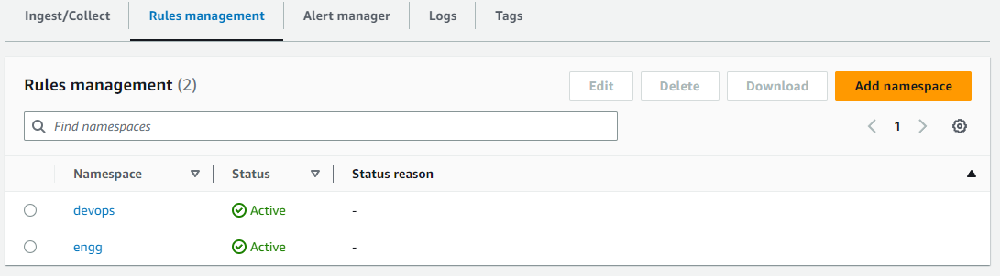

# Amazon Managed Service for Prometheus Alert Manager

## 简介

[Amazon Managed Service for Prometheus](https://aws.amazon.com/prometheus/) (AMP) 支持两种类型的规则，即"**记录规则**"和"**告警规则**"，可以从现有的 Prometheus 服务器导入，并按固定间隔进行评估。

[告警规则](https://prometheus.io/docs/prometheus/latest/configuration/alerting_rules/)允许客户基于 [PromQL](https://prometheus.io/docs/prometheus/latest/querying/basics/) 和阈值定义告警条件。当告警规则的值超过阈值时，会向 Amazon Managed Service for Prometheus 中的 Alert Manager 发送通知，其功能与独立 Prometheus 中的 Alert Manager 类似。告警是 Prometheus 中告警规则处于活动状态时的结果。

## 告警规则文件

Amazon Managed Service for Prometheus 中的告警规则由 YAML 格式的规则文件定义，其格式与独立 Prometheus 中的规则文件相同。客户可以在一个 Amazon Managed Service for Prometheus workspace 中拥有多个规则文件。Workspace 是专用于 Prometheus metrics 存储和查询的逻辑空间。

规则文件通常包含以下字段：

```
groups:
  - name:
  rules:
  - alert:
  expr:
  for:
  labels:
  annotations:
```

```console
Groups: A collection of rules that are run sequentially at a regular interval
Name: Name of the group
Rules: The rules in a group
Alert: Name of the alert
Expr: The expression for the alert to trigger
For: Minimum duration for an alert\'s expression to be exceeding threshold before updating to a firing status
Labels: Any additional labels attached to the alert
Annotations: Contextual details such as a description or link
```

示例规则文件如下所示：

```
groups:
  - name: test
    rules:
    - record: metric:recording_rule
      expr: avg(rate(container_cpu_usage_seconds_total[5m]))
  - name: alert-test
    rules:
    - alert: metric:alerting_rule
      expr: avg(rate(container_cpu_usage_seconds_total[5m])) > 0
      for: 2m
```

## Alert Manager 配置文件

Amazon Managed Service for Prometheus Alert Manager 使用 YAML 格式的配置文件来设置告警（针对接收服务），其结构与独立 Prometheus 中的 Alert Manager 配置文件相同。配置文件由 Alert Manager 和模板的两个关键部分组成：

1.  [template_files](https://prometheus.io/docs/prometheus/latest/configuration/template_reference/)，包含告警中注释和标签的模板，以 `$value`、`$labels`、`$externalLabels` 和 `$externalURL` 变量的形式公开以便使用。`$labels` 变量保存告警实例的标签键/值对。可以通过 `$externalLabels` 变量访问全局配置的外部标签。`$value` 变量保存告警实例的评估值。`.Value`、`.Labels`、`.ExternalLabels` 和 `.ExternalURL` 分别包含告警值、告警标签、全局配置的外部标签和外部 URL（通过 `--web.external-url` 配置）。

2.  [alertmanager_config](https://prometheus.io/docs/alerting/latest/configuration/)，包含 Alert Manager 配置，使用与独立 Prometheus 中 Alert Manager 配置文件相同的结构。

同时包含 template_files 和 alertmanager_config 的示例 Alert Manager 配置文件如下所示：

```
template_files:
  default_template: |
    {{ define "sns.default.subject" }}[{{ .Status | toUpper }}{{ if eq .Status "firing" }}:{{ .Alerts.Firing | len }}{{ end }}]{{ end }}
    {{ define "__alertmanager" }}AlertManager{{ end }}
    {{ define "__alertmanagerURL" }}{{ .ExternalURL }}/#/alerts?receiver={{ .Receiver | urlquery }}{{ end }}
alertmanager_config: |
  global:
  templates:
    - \'default_template\'
  route:
    receiver: default
  receivers:
    - name: \'default\'
      sns_configs:
      - topic_arn: arn:aws:sns:us-east-2:accountid:My-Topic
        sigv4:
          region: us-east-2
        attributes:
          key: severity
          value: SEV2
```

## 告警的关键方面

创建 Amazon Managed Service for Prometheus [Alert Manager 配置文件](https://docs.aws.amazon.com/prometheus/latest/userguide/AMP-alert-manager.html)时，需要注意三个重要方面。

- **分组**：这有助于将相似的告警收集到单个通知中，当故障或中断的爆炸半径较大影响多个系统且多个告警同时触发时非常有用。这也可用于按类别分组（例如节点告警、pod 告警）。Alert Manager 配置文件中的 [route](https://prometheus.io/docs/alerting/latest/configuration/#route) 块可用于配置此分组。
- **抑制**：这是一种抑制某些通知的方式，以避免发送与已活动和已触发的告警相似的垃圾告警。[inhibit_rules](https://prometheus.io/docs/alerting/latest/configuration/#inhibit_rule) 块可用于编写抑制规则。
- **静默**：告警可以在指定的持续时间内被静音，例如在维护窗口或计划中断期间。传入的告警在静默之前会被验证是否匹配所有相等或正则表达式条件。[PutAlertManagerSilences](https://docs.aws.amazon.com/prometheus/latest/userguide/AMP-APIReference.html#AMP-APIReference-PutAlertManagerSilences) API 可用于创建静默。

## 通过 Amazon Simple Notification Service (SNS) 路由告警

目前 [Amazon Managed Service for Prometheus Alert Manager 支持 Amazon SNS](https://docs.aws.amazon.com/prometheus/latest/userguide/AMP-alertmanager-receiver-AMPpermission.html) 作为唯一的接收器。alertmanager_config 块中的关键部分是 receivers，它允许客户配置 [Amazon SNS 来接收告警](https://docs.aws.amazon.com/prometheus/latest/userguide/AMP-alertmanager-receiver-config.html)。以下部分可用作 receivers 块的模板。

```
- name: name_of_receiver
  sns_configs:
    - sigv4:
        region: <AWS_Region>
    topic_arn: <ARN_of_SNS_topic>
    subject: somesubject
    attributes:
       key: <somekey>
       value: <somevalue>
```

Amazon SNS 配置使用以下模板作为默认值，除非被明确覆盖。

```
{{ define "sns.default.message" }}{{ .CommonAnnotations.SortedPairs.Values | join " " }}
  {{ if gt (len .Alerts.Firing) 0 -}}
  Alerts Firing:
    {{ template "__text_alert_list" .Alerts.Firing }}
  {{- end }}
  {{ if gt (len .Alerts.Resolved) 0 -}}
  Alerts Resolved:
    {{ template "__text_alert_list" .Alerts.Resolved }}
  {{- end }}
{{- end }}
```

附加参考：[Notification Template Examples](https://prometheus.io/docs/alerting/latest/notification_examples/)

## 将告警路由到 Amazon SNS 以外的其他目标

Amazon Managed Service for Prometheus Alert Manager 可以使用 [Amazon SNS 连接到其他目标](https://docs.aws.amazon.com/prometheus/latest/userguide/AMP-alertmanager-SNS-otherdestinations.html)，如电子邮件、webhook (HTTP)、Slack、PagerDuty 和 OpsGenie。

- **电子邮件** 成功通知将导致通过 Amazon SNS 主题从 Amazon Managed Service for Prometheus Alert Manager 收到一封包含告警详细信息的电子邮件作为目标之一。
- Amazon Managed Service for Prometheus Alert Manager 可以[以 JSON 格式发送告警](https://docs.aws.amazon.com/prometheus/latest/userguide/AMP-alertmanager-receiver-JSON.html)，以便它们可以在 Amazon SNS 下游的 AWS Lambda 或 webhook 接收端点中处理。
- **Webhook** 现有的 Amazon SNS 主题可以配置为将消息输出到 webhook 端点。Webhook 是以序列化表单编码 JSON 或 XML 格式在应用程序之间基于事件驱动触发器交换的消息。这可用于连接任何现有的 [SIEM 或协作工具](https://repost.aws/knowledge-center/sns-lambda-webhooks-chime-slack-teams)进行告警、工单或事件管理系统。
- **Slack** 客户可以集成 [Slack](https://aws.amazon.com/blogs/mt/how-to-integrate-amazon-managed-service-for-prometheus-with-slack/) 的邮件到频道集成，其中 Slack 可以接收电子邮件并将其转发到 Slack 频道，或使用 Lambda 函数将 SNS 通知重写为 Slack 格式。
- **PagerDuty** `alertmanager_config` 定义中 `template_files` 块中使用的模板可以自定义为将负载发送到 [PagerDuty](https://aws.amazon.com/blogs/mt/using-amazon-managed-service-for-prometheus-alert-manager-to-receive-alerts-with-pagerduty/) 作为 Amazon SNS 的目标。

附加参考：[Custom Alert manager Templates](https://prometheus.io/blog/2016/03/03/custom-alertmanager-templates/)

## 告警状态

告警规则基于表达式定义告警条件，以便在设定的阈值被超过时向任何通知服务发送告警。示例规则及其表达式如下所示。

```
rules:
- alert: metric:alerting_rule
  expr: avg(rate(container_cpu_usage_seconds_total[5m])) > 0
  for: 2m

```

每当告警表达式在给定时间点产生一个或多个向量元素时，该告警被视为活动状态。告警具有活动（pending | firing）或已解决状态。

- **Pending**：自阈值被突破以来经过的时间小于记录间隔
- **Firing**：自阈值被突破以来经过的时间大于记录间隔，且 Alert Manager 正在路由告警。
- **Resolved**：告警不再触发，因为阈值不再被突破。

这可以通过使用 [awscurl](https://docs.aws.amazon.com/prometheus/latest/userguide/AMP-compatible-APIs.html) 命令查询 Amazon Managed Service for Prometheus Alert Manager 端点的 [ListAlerts](https://docs.aws.amazon.com/prometheus/latest/userguide/AMP-APIReference.html#AMP-APIReference-ListAlerts) API 来手动验证。示例请求如下所示。

```
awscurl https://aps-workspaces.us-east-1.amazonaws.com/workspaces/$WORKSPACE_ID/alertmanager/api/v2/alerts --service="aps" -H "Content-Type: application/json"
```

## Amazon Managed Grafana 中的 Amazon Managed Service for Prometheus Alert Manager 规则

Amazon Managed Grafana (AMG) 告警功能允许客户从其 Amazon Managed Grafana workspace 中获得 Amazon Managed Service for Prometheus Alert Manager 告警的可见性。使用 Amazon Managed Service for Prometheus workspace 收集 Prometheus metrics 的客户利用该服务中完全托管的 Alert Manager 和 Ruler 功能来配置告警和记录规则。借助此功能，他们可以可视化在其 Amazon Managed Service for Prometheus workspace 中配置的所有告警和记录规则。可以在 Amazon Managed Grafana (AMG) 控制台中通过在 Workspace 配置选项选项卡中选中 Grafana 告警复选框来查看 Prometheus 告警视图。启用后，这也会将之前在 Grafana dashboard 中创建的原生 Grafana 告警迁移到 Grafana workspace 中的新告警页面。

参考：[Announcing Prometheus Alert Manager rules in Amazon Managed Grafana](https://aws.amazon.com/blogs/mt/announcing-prometheus-alertmanager-rules-in-amazon-managed-grafana/)


## 基线监控的推荐告警

告警是强大的监控和 Observability 最佳实践的关键方面。告警机制应在告警疲劳和遗漏关键告警之间取得平衡。以下是一些推荐的告警，可以提高工作负载的整体可靠性。组织中的各个团队从不同角度来监控其基础设施和工作负载，因此可以根据需求和场景进行扩展或更改，这当然不是一个全面的列表。

- 容器节点使用超过一定比例（例如 80%）的分配内存限制。
- 容器节点使用超过一定比例（例如 80%）的分配 CPU 限制。
- 容器节点使用超过一定比例（例如 90%）的分配磁盘空间。
- 命名空间中 pod 中的容器使用超过一定比例（例如 80%）的分配 CPU 限制。
- 命名空间中 pod 中的容器使用超过一定比例（例如 80%）的内存限制。
- 命名空间中 pod 中的容器重启次数过多。
- 命名空间中的持久卷使用超过一定比例（最大 75%）的磁盘空间。
- Deployment 当前没有活动的 pod 运行。
- 命名空间中的 Horizontal Pod Autoscaler (HPA) 正在以最大容量运行。

为上述或任何类似场景设置告警的关键是需要根据需要更改表达式。例如：

```
expr: |
        ((sum(irate(container_cpu_usage_seconds_total{image!="",container!="POD", namespace!="kube-sys"}[30s])) by (namespace,container,pod) /
sum(container_spec_cpu_quota{image!="",container!="POD", namespace!="kube-sys"} /
container_spec_cpu_period{image!="",container!="POD", namespace!="kube-sys"}) by (namespace,container,pod) ) * 100)  > 80
      for: 5m
```

## Amazon Managed Service for Prometheus 的 ACK Controller

Amazon Managed Service for Prometheus [AWS Controller for Kubernetes](https://github.com/aws-controllers-k8s/community) (ACK) controller 可用于 Workspace、Alert Manager 和 Ruler 资源，允许客户使用[自定义资源定义](https://kubernetes.io/docs/concepts/extend-kubernetes/api-extension/custom-resources/) (CRD) 和原生对象或服务来利用 Prometheus，这些服务提供支持功能，而无需在 Kubernetes cluster 之外定义任何资源。[Amazon Managed Service for Prometheus 的 ACK controller](https://aws.amazon.com/blogs/mt/introducing-the-ack-controller-for-amazon-managed-service-for-prometheus/) 可用于直接从您正在监控的 Kubernetes cluster 管理所有资源，允许 Kubernetes 充当工作负载所需状态的"单一事实来源"。[ACK](https://aws-controllers-k8s.github.io/community/docs/community/overview/) 是 Kubernetes CRD 和自定义控制器的集合，协同工作以扩展 Kubernetes API 并管理 AWS 资源。

使用 ACK 配置的告警规则片段如下所示：

```
apiVersion: prometheusservice.services.k8s.aws/v1alpha1
kind: RuleGroupsNamespace
metadata:
  name: default-rule
spec:
  workspaceID: WORKSPACE-ID
  name: default-rule
  configuration: |
    groups:
    - name: example
      rules:
      - alert: HostHighCpuLoad
        expr: 100 - (avg(rate(node_cpu_seconds_total{mode="idle"}[2m])) * 100) > 60
        for: 5m
        labels:
          severity: warning
          event_type: scale_up
        annotations:
          summary: Host high CPU load (instance {{ $labels.instance }})
          description: "CPU load is > 60%\n  VALUE = {{ $value }}\n  LABELS = {{ $labels }}"
      - alert: HostLowCpuLoad
        expr: 100 - (avg(rate(node_cpu_seconds_total{mode="idle"}[2m])) * 100) < 30
        for: 5m
        labels:
          severity: warning
          event_type: scale_down
        annotations:
          summary: Host low CPU load (instance {{ $labels.instance }})
          description: "CPU load is < 30%\n  VALUE = {{ $value }}\n  LABELS = {{ $labels }}"
```

## 使用 IAM 策略限制对规则的访问

组织要求各团队拥有自己的规则，以便为其记录和告警需求进行创建和管理。Amazon Managed Service for Prometheus 中的规则管理允许使用 AWS Identity and Access Management (IAM) 策略对规则进行访问控制，以便每个团队可以控制自己按 rulegroupnamespaces 分组的规则和告警集。

下图显示了添加到 Amazon Managed Service for Prometheus 规则管理中的两个示例 rulegroupnamespaces，名为 devops 和 engg。



以下 JSON 是一个示例 IAM 策略，它限制对 devops rulegroupnamespace（如上所示）的访问，并指定了资源 ARN。以下 IAM 策略中值得注意的操作是 [PutRuleGroupsNamespace](https://docs.aws.amazon.com/cli/latest/reference/amp/put-rule-groups-namespace.html) 和 [DeleteRuleGroupsNamespace](https://docs.aws.amazon.com/cli/latest/reference/amp/delete-rule-groups-namespace.html)，它们被限制为 AMP workspace 的 rulegroupsnamespace 的指定资源 ARN。创建策略后，可以将其分配给任何所需的用户、组或角色以满足所需的访问控制要求。IAM 策略中的 Action 可以根据[IAM 权限](https://docs.aws.amazon.com/prometheus/latest/userguide/AMP-APIReference.html)中所需和允许的操作进行修改/限制。

```json
{
  "Version": "2012-10-17",
  "Statement": [
    {
      "Sid": "VisualEditor0",
      "Effect": "Allow",
      "Action": [
        "aps:RemoteWrite",
        "aps:DescribeRuleGroupsNamespace",
        "aps:PutRuleGroupsNamespace",
        "aps:DeleteRuleGroupsNamespace"
      ],
      "Resource": [
        "arn:aws:aps:us-west-2:XXXXXXXXXXXX:workspace/ws-8da31ad6-f09d-44ff-93a3-xxxxxxxxxx",
        "arn:aws:aps:us-west-2:XXXXXXXXXXXX:rulegroupsnamespace/ws-8da31ad6-f09d-44ff-93a3-xxxxxxxxxx/devops"
      ]
    }
  ]
}
```

以下 awscli 交互显示了一个 IAM 用户通过 IAM 策略中的资源 ARN 获得对指定 rulegroupnamespace（即 devops rulegroupnamespace）的有限访问权限，以及同一用户如何被拒绝访问没有访问权限的其他资源（即 engg rulegroupnamespace）的示例。

```
$ aws amp describe-rule-groups-namespace --workspace-id ws-8da31ad6-f09d-44ff-93a3-xxxxxxxxxx --name devops
{
    "ruleGroupsNamespace": {
        "arn": "arn:aws:aps:us-west-2:XXXXXXXXXXXX:rulegroupsnamespace/ws-8da31ad6-f09d-44ff-93a3-xxxxxxxxxx/devops",
        "createdAt": "2023-04-28T01:50:15.408000+00:00",
        "data": "Z3JvdXBzOgogIC0gbmFtZTogZGV2b3BzX3VwZGF0ZWQKICAgIHJ1bGVzOgogICAgLSByZWNvcmQ6IG1ldHJpYzpob3N0X2NwdV91dGlsCiAgICAgIGV4cHI6IGF2ZyhyYXRlKGNvbnRhaW5lcl9jcHVfdXNhZ2Vfc2Vjb25kc190b3RhbFsybV0pKQogICAgLSBhbGVydDogaGlnaF9ob3N0X2NwdV91c2FnZQogICAgICBleHByOiBhdmcocmF0ZShjb250YWluZXJfY3B1X3VzYWdlX3NlY29uZHNfdG90YWxbNW1dKSkKICAgICAgZm9yOiA1bQogICAgICBsYWJlbHM6CiAgICAgICAgICAgIHNldmVyaXR5OiBjcml0aWNhbAogIC0gbmFtZTogZGV2b3BzCiAgICBydWxlczoKICAgIC0gcmVjb3JkOiBjb250YWluZXJfbWVtX3V0aWwKICAgICAgZXhwcjogYXZnKHJhdGUoY29udGFpbmVyX21lbV91c2FnZV9ieXRlc190b3RhbFs1bV0pKQogICAgLSBhbGVydDogY29udGFpbmVyX2hvc3RfbWVtX3VzYWdlCiAgICAgIGV4cHI6IGF2ZyhyYXRlKGNvbnRhaW5lcl9tZW1fdXNhZ2VfYnl0ZXNfdG90YWxbNW1dKSkKICAgICAgZm9yOiA1bQogICAgICBsYWJlbHM6CiAgICAgICAgc2V2ZXJpdHk6IGNyaXRpY2FsCg==",
        "modifiedAt": "2023-05-01T17:47:06.409000+00:00",
        "name": "devops",
        "status": {
            "statusCode": "ACTIVE",
            "statusReason": ""
        },
        "tags": {}
    }
}
```

用户使用规则的权限也可以使用 [IAM 策略](https://docs.aws.amazon.com/prometheus/latest/userguide/AMP-alertmanager-IAM-permissions.html)（文档示例）进行限制。

有关更多信息，客户可以阅读 [AWS 文档](https://docs.aws.amazon.com/prometheus/latest/userguide/AMP-alert-manager.html)，并查看关于 Amazon Managed Service for Prometheus Alert Manager 的 [AWS Observability Workshop](https://catalog.workshops.aws/observability/en-US/aws-managed-oss/amp/setup-alert-manager)。

附加参考：[Amazon Managed Service for Prometheus Is Now Generally Available with Alert Manager and Ruler](https://aws.amazon.com/blogs/aws/amazon-managed-service-for-prometheus-is-now-generally-available-with-alert-manager-and-ruler/)
