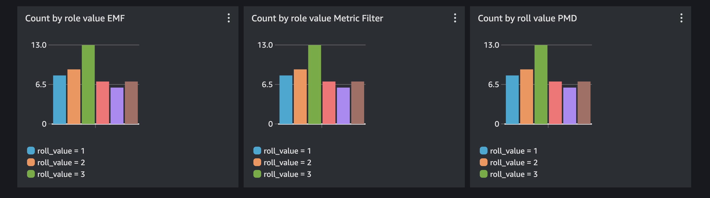

# 使用 AWS Rust SDK 创建自定义 Metrics

## 简介

Rust 是一种专注于安全性、性能和并发的系统编程语言，在软件开发领域越来越受欢迎。其独特的内存管理和线程安全方法使其成为构建健壮高效应用程序的理想选择，特别是在云端。随着无服务器架构的兴起以及对高性能、可扩展服务的需求，Rust 的能力使其成为构建云原生应用程序的绝佳选择。在本指南中，我们将探索如何利用 AWS Rust SDK 创建自定义 CloudWatch metrics，使您能够更深入地了解应用程序在 AWS 生态系统中的性能和行为。

## 前提条件

要使用本指南，我们需要安装 Rust，并创建一个 CloudWatch 日志组和日志流来存储稍后使用的一些数据。

### 安装 Rust

在 Mac 或 Linux 上：

```
curl --proto '=https' --tlsv1.2 -sSf https://sh.rustup.rs | sh
```

在 Windows 上，下载并运行 [rustup-init.exe](https://static.rust-lang.org/rustup/dist/i686-pc-windows-gnu/rustup-init.exe)

### 创建 CloudWatch 日志组和日志流

1. 创建 CloudWatch 日志组：

```
aws logs create-log-group --log-group-name rust_custom
```

2. 创建 CloudWatch 日志流：

```
aws logs create-log-stream --log-group-name rust_custom --log-stream-name diceroll_log_stream
```

## 代码

您可以在此仓库的 sandbox 部分找到完整代码。

```
git clone https://github.com/aws-observability/observability-best-practices.git
cd observability-best-practices/sandbox/rust-custom-metrics
```

此代码将首先模拟掷骰子，我们假设我们关心这个骰子值作为自定义 metric。然后我们将展示 3 种不同的方式将 metric 添加到 CloudWatch 并在 dashboard 上查看它。

### 设置应用程序

首先我们需要导入一些 crate 在应用程序中使用。

```rust
use crate::cloudwatch::types::Dimension;
use crate::cloudwatchlogs::types::InputLogEvent;
use aws_sdk_cloudwatch as cloudwatch;
use aws_sdk_cloudwatch::config::BehaviorVersion;
use aws_sdk_cloudwatch::types::MetricDatum;
use aws_sdk_cloudwatchlogs as cloudwatchlogs;
use rand::prelude::*;
use serde::Serialize;
use serde_json::json;
use std::time::{SystemTime, UNIX_EPOCH};
```

在这个导入块中，我们主要导入将要使用的 AWS SDK 库。我们还引入了 'rand' crate 以便创建随机骰子值。最后，我们有一些库如 'serde' 和 'time' 来处理用于填充 SDK 调用的数据创建。

现在我们可以在 main 函数中创建骰子值，此值将被所有 3 个 AWS SDK 调用使用。

```rust
//select a random number 1-6 to represent a diceroll
let mut rng = rand::thread_rng();
let roll_value = rng.gen_range(1..7);
```

现在我们有了骰子数字，让我们探索 3 种不同的方式将该值作为自定义 metric 添加到 CloudWatch。一旦该值成为自定义 metric，我们就能够对该值设置告警、设置异常检测、在 dashboard 上绘制该值等等。

### Put Metric Data

我们将使用的第一种方法是 PutMetricData 将值添加到 CloudWatch。通过使用 PutMetricData，我们将 metric 的时间序列值直接写入 CloudWatch。这是添加值的最高效方式。当我们使用 PutMetricData 时，需要在每次 AWS SDK 调用中提供命名空间以及任何维度以及 metric 值。以下是代码：

首先我们将设置一个接收 metric（骰子值）的函数，它返回一个 Result 类型，在 Rust 中表示成功或失败。函数内部我们做的第一件事是初始化 AWS Rust SDK 客户端。我们的客户端将从本地环境继承凭证和区域。因此，请确保在运行此代码之前通过命令行运行 `aws configure` 来配置这些。

```rust
async fn put_metric_data(roll_value: i32) -> Result<(), cloudwatch::Error> {
    //Create a reusable aws config that we can pass to our clients
    let config = aws_config::load_defaults(BehaviorVersion::v2023_11_09()).await;

    //Create a cloudwatch client
    let client = cloudwatch::Client::new(&config);
```

初始化客户端后，我们可以开始设置 PutMetricData API 调用所需的输入。我们需要定义维度，然后是 MetricDatum 本身（维度和值的组合）。

```rust
//Use fluent builders to build the required input for pmd call, starting with dimensions.
let dimensions = Dimension::builder()
    .name("roll_value_pmd_dimension")
    .value(roll_value.to_string())
    .build();

let put_metric_data_input = MetricDatum::builder()
    .metric_name("roll_value_pmd")
    .dimensions(dimensions)
    .value(f64::from(roll_value))
    .build();
```

最后我们可以使用之前定义的输入进行 PutMetricData API 调用。

```rust
let response = client
    .put_metric_data()
    .namespace("rust_custom_metrics")
    .metric_data(put_metric_data_input)
    .send()
    .await?;
println!("Metric Submitted: {:?}", response);
Ok(())
```
注意 SDK 调用在异步函数中。由于函数异步完成，我们需要 `await` 其完成。然后我们返回函数顶层定义的 Result 类型。

当从 main 调用我们的函数时，它看起来像这样：

```rust
//call the put_metric_data function with the roll value
println!("First we will write a custom metric with PutMetricData API call");
put_metric_data(roll_value).await.unwrap();
```
同样，我们等待函数调用完成，然后 `unwrap` 值，因为在我们的情况下只对 'Ok' 结果感兴趣而不是错误。在生产场景中，您可能会以不同的方式处理错误。

### PutLogEvent + Metric Filter

创建自定义 metric 的下一种方式是简单地将其写入 CloudWatch 日志组。一旦 metric 在 CloudWatch 日志组中，我们可以使用 [Metric Filter](https://docs.aws.amazon.com/AmazonCloudWatch/latest/logs/MonitoringPolicyExamples.html) 从日志数据中提取 metric 数据。

首先我们将为日志消息定义一个 struct。这是可选的，因为我们可以只手动构建 JSON。但在更复杂的应用程序中，您可能会希望这个日志 struct 具有可重用性。

```rust
//Make a simple struct for the log message. We could also just create a json string manually.
#[derive(Serialize)]
struct DicerollValue {
    welcome_message: String,
    roll_value: i32,
}
```

一旦我们的 struct 定义好了，我们就准备好进行 AWS API 调用了。同样，我们将创建一个 API 客户端，这次使用 logs SDK。我们还将使用 unix epoch 时间定义系统时间。

```rust
//Create a reusable aws config that we can pass to our clients
let config = aws_config::load_defaults(BehaviorVersion::v2023_11_09()).await;

//Create a cloudwatch logs client
let client = cloudwatchlogs::Client::new(&config);

//Let's get the time in ms from unix epoch, this is required for CWlogs
let time_now = SystemTime::now()
    .duration_since(UNIX_EPOCH)
    .unwrap()
    .as_millis() as i64;
```

首先我们将从之前定义的 struct 的新实例创建 JSON。然后使用它来创建日志事件。

```rust
let log_json = json!(DicerollValue {
    welcome_message: String::from("Hello from rust!"),
    roll_value
});

let log_event = InputLogEvent::builder()
    .timestamp(time_now)
    .message(log_json.to_string())
    .build();
```

现在我们可以以类似于 PutMetricData 的方式完成 API 调用：

```rust
let response = client
    .put_log_events()
    .log_group_name("rust_custom")
    .log_stream_name("diceroll_log_stream")
    .log_events(log_event.unwrap())
    .send()
    .await?;

println!("Log event submitted: {:?}", response);
Ok(())
```

日志事件提交后，我们需要转到 CloudWatch 为日志组创建 Metric Filter 以正确提取 metric。

在 CloudWatch 控制台中，转到我们创建的 rust_custom 日志组。然后创建 metric filter。过滤模式应为 `{$.roll_value = *}`。然后对于 Metric Value 使用 `$.roll_value`。您可以使用任何喜欢的命名空间和 metric 名称。此 Metric Filter 可以这样解释：

"每当我们收到一个名为 'roll_value' 的字段时触发过滤器，无论值是什么。触发后，使用 'roll_value' 作为写入 CloudWatch Metrics 的数字"。

这种创建 metrics 的方式对于在无法控制日志格式时从日志数据中提取时间序列值非常强大。由于我们直接检测代码，我们确实可以控制日志数据的格式，因此更好的方法可能是使用 CloudWatch Embedded Metric Format，我们将在下一步中讨论。

### PutLogEvent + Embedded Metric Format

CloudWatch [Embedded Metric Format](https://docs.aws.amazon.com/AmazonCloudWatch/latest/monitoring/CloudWatch_Embedded_Metric_Format_Specification.html)(EMF) 是一种将时间序列 metrics 直接嵌入日志的方式。CloudWatch 将提取 metrics 而无需 Metric Filter。让我们看看代码。

再次创建 logs 客户端并获取 unix epoch 系统时间。

```rust
//Create a reusable aws config that we can pass to our clients
let config = aws_config::load_defaults(BehaviorVersion::v2023_11_09()).await;

//Create a cloudwatch logs client
let client = cloudwatchlogs::Client::new(&config);

//get the time in unix epoch ms
let time_now = SystemTime::now()
    .duration_since(UNIX_EPOCH)
    .unwrap()
    .as_millis() as i64;
```

现在我们可以创建 EMF JSON 字符串。这需要包含 CloudWatch 创建自定义 metric 所需的所有数据，因此我们在字符串中嵌入命名空间、维度和值。

```rust
//Create a json string in embedded metric format with our diceroll value.
let json_emf = json!(
    {
        "_aws": {
        "Timestamp": time_now,
        "CloudWatchMetrics": [
            {
            "Namespace": "rust_custom_metrics",
            "Dimensions": [["roll_value_emf_dimension"]],
            "Metrics": [
                {
                "Name": "roll_value_emf"
                }
            ]
            }
        ]
        },
        "roll_value_emf_dimension": roll_value.to_string(),
        "roll_value_emf": roll_value
    }
);
```

注意我们实际上将骰子值作为维度创建，同时也用它作为值。这让我们可以对骰子值执行 GroupBy，以便查看每个骰子值被命中了多少次。

现在我们可以像之前一样进行 API 调用来写入日志事件：

```rust
let log_event = InputLogEvent::builder()
    .timestamp(time_now)
    .message(json_emf.to_string())
    .build();

let response = client
    .put_log_events()
    .log_group_name("rust_custom")
    .log_stream_name("diceroll_log_stream_emf")
    .log_events(log_event.unwrap())
    .send()
    .await?;

println!("EMF Log event submitted: {:?}", response);
Ok(())
```

日志事件提交到 CloudWatch 后，metric 将被提取而无需 metric filter。这是创建高基数 metrics 的好方法，将这些值作为日志消息写入可能比使用所有不同维度进行 PutMetricData API 调用更容易。

### 组合在一起

我们最终的 main 函数将这样调用所有三个 API 调用：

```rust
#[::tokio::main]
async fn main() {
    println!("Let's have some fun by creating custom metrics with the Rust SDK");

    //select a random number 1-6 to represent a dicerolll
    let mut rng = rand::thread_rng();
    let roll_value = rng.gen_range(1..7);

    //call the put_metric_data function with the roll value
    println!("First we will write a custom metric with PutMetricData API call");
    put_metric_data(roll_value).await.unwrap();

    println!("Now let's write a log event, which we will then extract a custom metric from.");
    //call the put_log_data function with the roll value
    put_log_event(roll_value).await.unwrap();

    //call the put_log_emf function with the roll value
    println!("Now we will put a log event with embedded metric format to directly submit the custom metric.");
    put_log_event_emf(roll_value).await.unwrap();
}
```

为了生成一些测试数据，我们可以构建应用程序然后循环运行它来生成一些可以在 CloudWatch 中查看的数据。从根目录运行以下命令：

```
cargo build
```

现在我们将运行 50 次，间隔 2 秒。休眠只是为了稍微分散 metrics 使其在 CloudWatch Dashboard 上更容易查看。

```
for run in {1..50}; do ./target/debug/custom-metrics; sleep 2; done
```

现在我们可以在 CloudWatch 中查看结果。我喜欢对维度进行 GroupBy，这让我看到每个骰子值被选中了多少次。Metric Insights 查询应如下所示。根据您是否更改了任何内容来更改 metric 名称和维度名称。

```
SELECT COUNT(roll_value_emf) FROM rust_custom_metrics GROUP BY roll_value_emf_dimension
```

现在我们可以将所有三个放在 dashboard 上，如预期看到相同的图表。



## 清理

确保删除您的 `rust_custom` 日志组。

```
aws logs delete-log-group --log-group-name rust_custom
```
