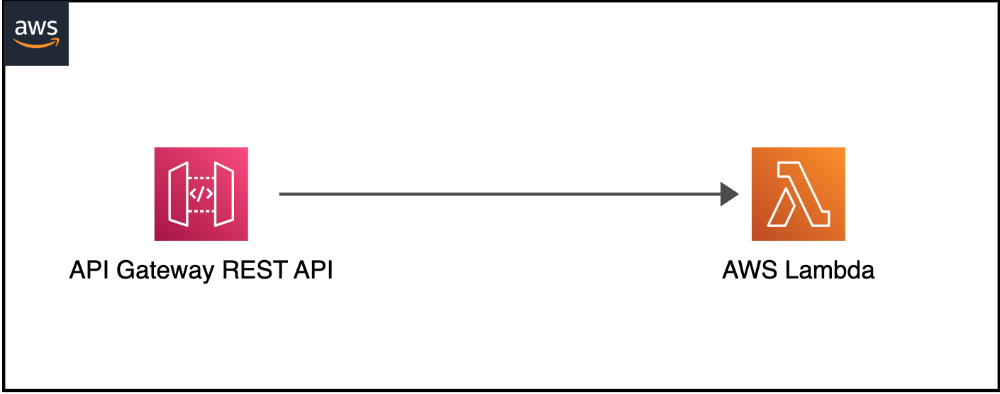
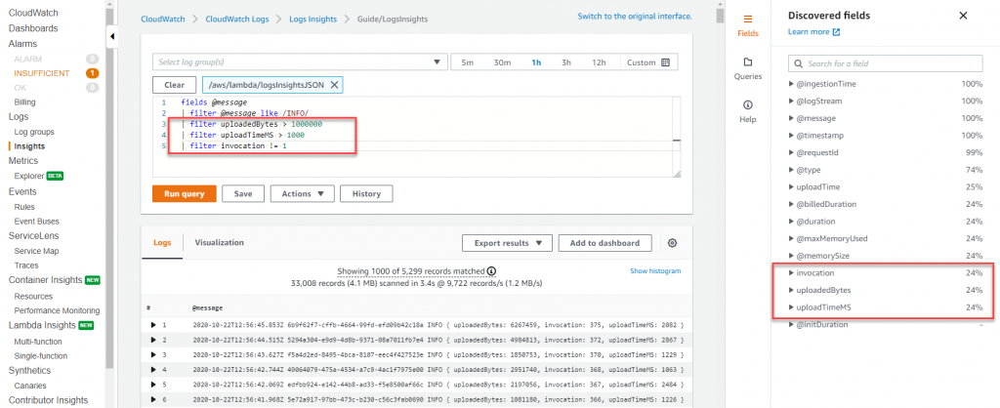
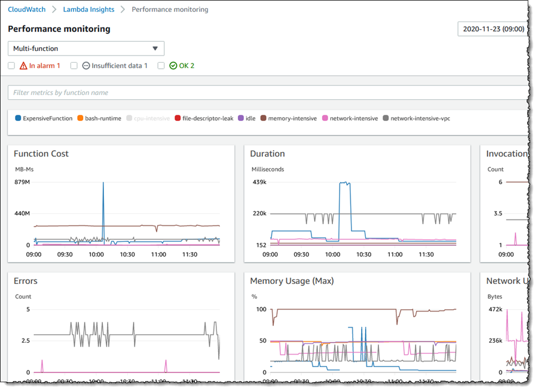

# 基于 AWS Lambda 的无服务器 Observability

在分布式系统和无服务器计算的世界中，实现 observability 是确保应用程序可靠性和性能的关键。它不仅仅是传统监控。通过利用 Amazon CloudWatch 和 AWS X-Ray 等 AWS observability 工具，您可以深入了解无服务器应用程序、排查问题并优化应用程序性能。在本指南中，我们将学习为基于 Lambda 的无服务器应用程序实施 Observability 的基本概念、工具和最佳实践。

实施基础设施或应用程序 observability 之前的第一步是确定您的关键目标。这可能是增强用户体验、提高开发者生产力、满足服务级别目标 (SLOs)、增加业务收入或任何其他取决于应用程序类型的特定目标。因此，明确定义这些关键目标并确定如何衡量它们。然后从这些目标倒推来设计您的 observability 策略。参考"[监控重要的事项](https://aws-observability.github.io/observability-best-practices/guides/#monitor-what-matters)"了解更多信息。

## Observability 的三大支柱

Observability 有三个主要支柱：

* Logs：在应用程序或系统中发生的离散事件的时间戳记录，如故障、错误或状态转换
* Metrics：在不同时间间隔测量的数字数据（时间序列数据）；SLIs（请求率、错误率、持续时间、CPU% 等）
* Traces：Trace 代表单个用户跨多个应用程序和系统（通常是微服务）的旅程


AWS 提供原生和开源工具来促进日志记录、metrics 监控和追踪，以获取 AWS Lambda 应用程序的可操作洞察。

## **Logs**

在 observability 最佳实践指南的这一部分中，我们将深入探讨以下主题：

* 非结构化与结构化日志
* CloudWatch Logs Insights
* 记录关联 ID
* 使用 Lambda Powertools 的代码示例
* 使用 CloudWatch Dashboards 进行日志可视化
* CloudWatch Logs 保留策略


Logs 是应用程序中发生的离散事件。这些可以包括故障、错误、执行路径或其他事件。Logs 可以以非结构化、半结构化或结构化格式记录。

### **非结构化与结构化日志**

我们经常看到开发者在应用程序中使用 `print` 或 `console.log` 语句开始记录简单的日志消息。这些在大规模时难以编程方式解析和分析，特别是在基于 AWS Lambda 的应用程序中，这些应用程序可能跨不同日志组生成许多行日志消息。因此，在 CloudWatch 中整合这些日志变得具有挑战性且难以分析。您需要进行文本匹配或正则表达式来查找日志中的相关信息。以下是非结构化日志的示例：

```
[2023-07-19T19:59:07Z]  INFO  Request started
[2023-07-19T19:59:07Z]  INFO  AccessDenied: Could not access resource
[2023-07-19T19:59:08Z]  INFO  Request finished
```

如您所见，日志消息缺乏一致的结构，使得从中获取有用洞察变得困难。同时，也很难向其中添加上下文信息。

而结构化日志是一种以一致格式（通常是 JSON）记录信息的方式，允许将日志视为数据而不是文本，这使得查询和过滤变得简单。它使开发者能够高效地以编程方式存储、检索和分析日志。它还有助于更好的调试。结构化日志通过日志级别提供了一种更简单的方式来修改不同环境中日志的详细程度。**注意日志级别。** 记录过多会增加成本并降低应用程序吞吐量。确保在记录之前对个人身份信息进行脱敏处理。以下是结构化日志的示例：

```
{
   "correlationId": "9ac54d82-75e0-4f0d-ae3c-e84ca400b3bd",
   "requestId": "58d9c96e-ae9f-43db-a353-c48e7a70bfa8",
   "level": "INFO",
   "message": "AccessDenied",
   "function-name": "demo-observability-function",
   "cold-start": true
}
```


**`优先使用结构化和集中化日志记录到 CloudWatch logs`**，以输出有关事务的操作信息、不同组件之间的关联标识符以及应用程序的业务结果。

### **CloudWatch Logs Insights**
使用 CloudWatch Logs Insights，它可以自动发现 JSON 格式日志中的字段。此外，JSON 日志可以扩展为记录特定于应用程序的自定义元数据，这些元数据可用于搜索、过滤和聚合日志。


### **记录关联 ID**

例如，对于来自 API Gateway 的 HTTP 请求，关联 ID 设置在 `requestContext.requestId` 路径中，可以使用 Lambda Powertools 在下游 Lambda 函数中轻松提取和记录。分布式系统通常涉及多个服务和组件协同处理请求。因此，记录关联 ID 并将其传递给下游系统对于端到端追踪和调试变得至关重要。关联 ID 是在请求开始时分配的唯一标识符。当请求通过不同服务时，关联 ID 包含在日志中，允许您追踪请求的整个路径。您可以手动将关联 ID 插入 AWS Lambda 日志，或使用 [AWS Lambda Powertools](https://docs.powertools.aws.dev/lambda/python/latest/core/logger/#setting-a-correlation-id) 等工具从 API Gateway 轻松获取关联 ID 并将其与应用程序日志一起记录。例如，对于 HTTP 请求，关联 ID 可以是在 API Gateway 发起的 request-id，然后传递给后端服务（如 Lambda 函数）。

### **使用 Lambda Powertools 的代码示例**
作为最佳实践，尽早在请求生命周期中生成关联 ID，最好在无服务器应用程序的入口点，如 API Gateway 或 Application Load Balancer。使用 UUID、request id 或任何其他可用于跨分布式系统跟踪请求的唯一属性。将关联 ID 作为自定义 header、body 或元数据的一部分随每个请求传递。确保关联 ID 包含在下游服务的所有日志条目和 traces 中。

您可以手动捕获并将关联 ID 作为 Lambda 函数日志的一部分包含，或使用 [AWS Lambda Powertools](https://docs.powertools.aws.dev/lambda/python/latest/core/logger/#setting-a-correlation-id) 等工具。使用 Lambda Powertools，您可以从受支持的上游服务的预定义请求[路径映射](https://github.com/aws-powertools/powertools-lambda-python/blob/08a0a7b68d2844d36c33ab8156640f4ea9632d0c/aws_lambda_powertools/logging/correlation_paths.py)中轻松获取关联 ID，并自动将其添加到应用程序日志中。同时，确保将关联 ID 添加到所有错误消息中，以便在发生故障时轻松调试和识别根本原因，并将其关联回原始请求。

让我们看一下代码示例，演示以下无服务器架构中带有关联 ID 的结构化日志记录以及在 CloudWatch 中查看：



```
// Initializing Logger
Logger log = LogManager.getLogger();

// Uses @Logger annotation from Lambda Powertools, which takes optional parameter correlationIdPath to extract correlation Id from the API Gateway header and inserts correlation_id to the Lambda function logs in a structured format.
@Logging(correlationIdPath = "/headers/path-to-correlation-id")
public APIGatewayProxyResponseEvent handleRequest(final APIGatewayProxyRequestEvent input, final Context context) {
  ...
  // The log statement below will also have additional correlation_id
  log.info("Success")
  ...
}
```

在此示例中，基于 Java 的 Lambda 函数使用 Lambda Powertools 库来记录来自 API Gateway 请求的 `correlation_id`。

代码示例的 CloudWatch 日志样本：

```
{
   "level": "INFO",
   "message": "Success",
   "function-name": "demo-observability-function",
   "cold-start": true,
   "lambda_request_id": "52fdfc07-2182-154f-163f-5f0f9a621d72",
   "correlation_id": "<correlation_id_value>"
}_
```

### **使用 CloudWatch Dashboards 进行日志可视化**

一旦您以结构化 JSON 格式记录数据，[CloudWatch Logs Insights](https://docs.aws.amazon.com/AmazonCloudWatch/latest/logs/AnalyzingLogData.html) 将自动发现 JSON 输出中的值并将消息解析为字段。CloudWatch Logs Insights 提供专门构建的[类 SQL 查询](https://serverlessland.com/snippets?type=CloudWatch+Logs+Insights)语言来搜索和过滤多个日志流。您可以使用 glob 和正则表达式模式匹配对多个日志组执行查询。此外，您还可以编写自定义查询并保存它们以便再次运行，无需每次重新创建。


在 CloudWatch Logs Insights 中，您可以通过包含一个或多个聚合函数的查询生成折线图、柱状图和堆叠面积图等可视化。然后您可以轻松地将这些可视化添加到 CloudWatch Dashboards。下面的示例 dashboard 显示了 Lambda 函数执行持续时间的百分位报告。此类 dashboard 将快速为您提供有关应该在哪里集中精力改善应用程序性能的洞察。平均延迟是一个很好的 metrics，但**`您应该以优化 p99 而不是平均延迟为目标。`**


要将（平台、函数和扩展）日志发送到 CloudWatch 以外的位置，您可以使用 [Lambda Telemetry API](https://docs.aws.amazon.com/lambda/latest/dg/telemetry-api.html) 与 Lambda Extensions。许多[合作伙伴解决方案](https://docs.aws.amazon.com/lambda/latest/dg/extensions-api-partners.html)提供使用 Lambda Telemetry API 的 Lambda Layer，使与其系统的集成更加容易。

为了最好地利用 CloudWatch Logs Insights，请考虑您必须以结构化日志的形式将哪些数据摄入到日志中，这将帮助更好地监控应用程序的健康状况。


### **CloudWatch Logs 保留策略**

默认情况下，Lambda 函数中写入 stdout 的所有消息都保存到 Amazon CloudWatch 日志流中。Lambda 函数的执行角色应具有创建 CloudWatch 日志流和向流写入日志事件的权限。重要的是要注意，CloudWatch 按摄入的数据量和使用的存储量计费。因此，减少日志记录量将帮助您最小化相关成本。**`默认情况下，CloudWatch 日志会无限期保留且永不过期。建议配置日志保留策略以降低日志存储成本`**，并将其应用于所有日志组。您可能希望每个环境有不同的保留策略。日志保留可以在 AWS 控制台中手动配置，但为了确保一致性和最佳实践，您应该将其作为基础设施即代码 (IaC) 部署的一部分进行配置。以下是一个示例 CloudFormation 模板，演示如何为 Lambda 函数配置日志保留：

```
Resources:
  Function:
    Type: AWS::Serverless::Function
    Properties:
      CodeUri: .
      Runtime: python3.8
      Handler: main.handler
      Tracing: Active

  # Explicit log group that refers to the Lambda function
  LogGroup:
    Type: AWS::Logs::LogGroup
    Properties:
      LogGroupName: !Sub "/aws/lambda/${Function}"
      # Explicit retention time
      RetentionInDays: 7
```

在此示例中，我们创建了一个 Lambda 函数和相应的日志组。**`RetentionInDays`** 属性**设置为 7 天**，意味着该日志组中的日志将保留 7 天后自动删除，从而帮助控制日志存储成本。


## **Metrics**

在 Observability 最佳实践指南的这一部分中，我们将深入探讨以下主题：

* 监控和告警开箱即用的 metrics
* 发布自定义 metrics
* 使用嵌入式 metrics 从日志中自动生成 metrics
* 使用 CloudWatch Lambda Insights 监控系统级 metrics
* 创建 CloudWatch 告警

### **监控和告警开箱即用的 metrics**

Metrics 是在不同时间间隔测量的数字数据（时间序列数据）和服务级别指标（请求率、错误率、持续时间、CPU 等）。AWS 服务提供了许多开箱即用的标准 metrics，帮助监控应用程序的运营健康状况。确定适用于您应用程序的关键 metrics，并使用它们来监控应用程序性能。关键 metrics 的示例可能包括函数错误、队列深度、失败的状态机执行和 API 响应时间。

开箱即用 metrics 的一个挑战是知道如何在 CloudWatch dashboard 中分析它们。例如，查看并发时，我应该看最大值、平均值还是百分位？每个 metrics 的正确统计量都不同。

作为最佳实践，对于 Lambda 函数的 `ConcurrentExecutions` metrics，查看 `Count` 统计量以检查它是否接近账户和区域限制或接近 Lambda 预留并发限制（如适用）。
对于 `Duration` metrics（指示函数处理事件所需的时间），查看 `Average` 或 `Max` 统计量。要测量 API 的延迟，查看 API Gateway `Latency` metrics 的 `Percentile` 统计量。P50、P90 和 P99 是比平均值更好的延迟监控方法。

一旦您知道要监控哪些 metrics，请在这些关键 metrics 上配置告警，以便在应用程序组件不健康时通知您。例如：

* 对于 AWS Lambda，告警 Duration、Errors、Throttling 和 ConcurrentExecutions。对于基于流的调用，告警 IteratorAge。对于异步调用，告警 DeadLetterErrors。
* 对于 Amazon API Gateway，告警 IntegrationLatency、Latency、5XXError、4XXError
* 对于 Amazon SQS，告警 ApproximateAgeOfOldestMessage、ApproximateNumberOfMessageVisible
* 对于 AWS Step Functions，告警 ExecutionThrottled、ExecutionsFailed、ExecutionsTimedOut

### **发布自定义 metrics**

根据应用程序所需的业务和客户成果确定关键绩效指标 (KPIs)。评估 KPIs 以确定应用程序成功和运营健康状况。关键 metrics 可能因应用程序类型而异，但示例包括网站访问量、订单数量、购买的航班、页面加载时间、独立访客等。

发布自定义 metrics 到 AWS CloudWatch 的一种方式是调用 CloudWatch metrics SDK 的 `putMetricData` API。但是，`putMetricData` API 调用是同步的。它将增加 Lambda 函数的持续时间，并可能阻止应用程序中的其他 API 调用，导致性能瓶颈。此外，Lambda 函数执行时间的增加将产生更高的成本。另外，您还需要为发送到 CloudWatch 的自定义 metrics 数量和进行的 API 调用数量（即 PutMetricData API 调用）付费。

**`发布自定义 metrics 的更高效和经济的方式是使用`** [CloudWatch Embedded Metrics Format](https://docs.aws.amazon.com/AmazonCloudWatch/latest/monitoring/CloudWatch_Embedded_Metric_Format.html) (EMF)。CloudWatch Embedded Metric Format 允许您以写入 CloudWatch logs 的日志方式**`异步`**生成自定义 metrics，从而以更低的成本提高应用程序性能。使用 EMF，您可以将自定义 metrics 与详细的日志事件数据一起嵌入，CloudWatch 会自动提取这些自定义 metrics，以便您像开箱即用的 metrics 一样对其进行可视化和设置告警。通过以嵌入式 metric 格式发送日志，您可以使用 [CloudWatch Logs Insights](https://docs.aws.amazon.com/AmazonCloudWatch/latest/logs/AnalyzingLogData.html) 进行查询，您只需为查询付费，而不是 metrics 的费用。

为实现这一目标，您可以使用 [EMF 规范](https://docs.aws.amazon.com/AmazonCloudWatch/latest/monitoring/CloudWatch_Embedded_Metric_Format_Specification.html)生成日志，并使用 `PutLogEvents` API 将其发送到 CloudWatch。为简化此过程，有**两个客户端库支持以 EMF 格式创建 metrics**。

* 低级客户端库 ([aws-embedded-metrics](https://docs.aws.amazon.com/AmazonCloudWatch/latest/monitoring/CloudWatch_Embedded_Metric_Format_Libraries.html))
* Lambda Powertools [Metrics](https://docs.aws.amazon.com/powertools/java/latest/core/metrics/)。


### **使用 [CloudWatch Lambda Insights](https://docs.aws.amazon.com/AmazonCloudWatch/latest/monitoring/Lambda-Insights.html) 监控系统级 metrics**

CloudWatch Lambda Insights 为您提供系统级 metrics，包括 CPU 时间、内存使用量、磁盘利用率和网络性能。Lambda Insights 还收集、聚合和汇总诊断信息，如**`冷启动`**和 Lambda worker 关闭。Lambda Insights 利用 CloudWatch Lambda 扩展（打包为 Lambda Layer）。启用后，它收集系统级 metrics，并以嵌入式 metrics 格式为该 Lambda 函数的每次调用向 CloudWatch Logs 发出单个性能日志事件。

:::note
    CloudWatch Lambda Insights 默认未启用，需要按 Lambda 函数逐一开启。
:::

您可以通过 AWS 控制台或基础设施即代码 (IaC) 启用它。以下是使用 AWS Serverless Application Model (SAM) 启用它的示例。您将 `LambdaInsightsExtension` 扩展 Layer 添加到 Lambda 函数，并添加托管 IAM 策略 `CloudWatchLambdaInsightsExecutionRolePolicy`，该策略授予 Lambda 函数创建日志流和调用 `PutLogEvents` API 以写入日志的权限。

```
// Add LambdaInsightsExtension Layer to your function resource
Resources:
  MyFunction:
    Type: AWS::Serverless::Function
    Properties:
      Layers:
        - !Sub "arn:aws:lambda:${AWS::Region}:580247275435:layer:LambdaInsightsExtension:14"
        
// Add IAM policy to enable Lambda function to write logs to CloudWatch
Resources:
  MyFunction:
    Type: AWS::Serverless::Function
    Properties:
      Policies:
        - `CloudWatchLambdaInsightsExecutionRolePolicy`
```

然后您可以使用 CloudWatch 控制台在 Lambda Insights 下查看这些系统级性能 metrics。




### **创建 CloudWatch 告警**
创建 CloudWatch 告警并在 metrics 异常时采取必要行动是 observability 的关键部分。Amazon [CloudWatch 告警](https://docs.aws.amazon.com/AmazonCloudWatch/latest/monitoring/AlarmThatSendsEmail.html)用于在应用程序和基础设施 metrics 超过静态或动态设置的阈值时提醒您或自动执行修复操作。

要为 metrics 设置告警，您选择一个触发一组操作的阈值。固定阈值称为静态阈值。例如，您可以在 Lambda 函数的 `Throttles` metrics 上配置告警，如果在 5 分钟期间内超过 10% 的时间则激活。这可能意味着 Lambda 函数已达到您账户和区域的最大并发限制。

在无服务器应用程序中，通常使用 SNS（Simple Notification Service）发送告警。这使用户能够通过电子邮件、短信或其他渠道接收告警。此外，您可以将 Lambda 函数订阅到 SNS 主题，使其能够自动修复导致告警触发的任何问题。

例如，假设您有一个 Lambda 函数 A，它轮询 SQS 队列并调用下游服务。如果下游服务宕机且没有响应，Lambda 函数将继续从 SQS 轮询并尝试调用下游服务但失败。虽然您可以监控这些错误并使用 SNS 生成 CloudWatch 告警来通知相应团队，但您也可以调用另一个 Lambda 函数 B（通过 SNS 订阅），它可以禁用 Lambda 函数 A 的事件源映射，从而停止轮询 SQS 队列，直到下游服务恢复运行。

虽然对单个 metrics 设置告警很好，但有时需要监控多个 metrics 才能更好地理解应用程序的运营健康状况和性能。在这种情况下，您应该使用[数学表达式](https://docs.aws.amazon.com/AmazonCloudWatch/latest/monitoring/using-metric-math.html)设置基于多个 metrics 的告警。

例如，如果您想监控 AWS Lambda 错误但允许少量错误而不触发告警，您可以创建百分比形式的错误率表达式。即 ErrorRate = errors / invocation * 100，然后创建告警，如果 ErrorRate 在配置的评估期间内超过 20% 则发送提醒。


## **Tracing**

在 Observability 最佳实践指南的这一部分中，我们将深入探讨以下主题：

* 分布式追踪和 AWS X-Ray 简介
* 应用适当的采样规则
* 使用 X-Ray SDK 追踪与其他服务的交互
* 使用 X-Ray SDK 追踪集成服务的代码示例

### 分布式追踪和 AWS X-Ray 简介

大多数无服务器应用程序由多个微服务组成，每个微服务使用多个 AWS 服务。由于无服务器架构的特性，分布式追踪至关重要。为了有效监控性能和跟踪错误，重要的是追踪从源调用方到所有下游服务的整个应用程序流中的事务。虽然可以使用各个服务的日志来实现这一点，但使用 AWS X-Ray 等追踪工具更快、更高效。更多信息请参阅[使用 AWS X-Ray 检测应用程序](https://docs.aws.amazon.com/xray/latest/devguide/xray-instrumenting-your-app.html)。

AWS X-Ray 使您能够在请求通过涉及的微服务时追踪它们。X-Ray Service Map 使您能够了解不同的集成点并识别应用程序的任何性能下降。只需几次点击，您就可以快速隔离应用程序中哪个组件导致错误、限流或延迟问题。在服务图下，您还可以查看各个 traces 以精确定位每个微服务花费的确切时间。


**`作为最佳实践，在代码中为下游调用创建自定义子段`**或任何需要监控的特定功能。例如，您可以创建子段来监控对外部 HTTP API 或 SQL 数据库查询的调用。

例如，要为调用下游服务的函数创建自定义子段，使用 `captureAsyncFunc` 函数（在 Node.js 中）

```
var AWSXRay = require('aws-xray-sdk');

app.use(AWSXRay.express.openSegment('MyApp'));

app.get('/', function (req, res) {
  var host = 'api.example.com';

  // start of the subsegment
  AWSXRay.captureAsyncFunc('send', function(subsegment) {
    sendRequest(host, function() {
      console.log('rendering!');
      res.render('index');

      // end of the subsegment
      subsegment.close();
    });
  });
});
```

在此示例中，应用程序为调用 `sendRequest` 函数创建了一个名为 `send` 的自定义子段。`captureAsyncFunc` 传递一个子段，当其进行的异步调用完成时，您必须在回调函数中关闭它。


### **应用适当的采样规则**

AWS X-Ray SDK 默认不追踪所有请求。它应用保守的采样规则来提供请求的代表性样本，而不产生高成本。但是，您可以[自定义](https://docs.aws.amazon.com/xray/latest/devguide/xray-console-sampling.html#xray-console-config)默认采样规则或完全禁用采样，根据您的特定需求开始追踪所有请求。

需要注意的是，AWS X-Ray 不适合用作审计或合规工具。您应该考虑对**`不同类型的应用程序使用不同的采样率`**。例如，高频只读调用（如后台轮询或健康检查）可以以较低的速率采样，同时仍然提供足够的数据来识别可能出现的潜在问题。您可能还想对**`每个环境使用不同的采样率`**。例如，在开发环境中，您可能希望追踪所有请求以便轻松排查错误或性能问题，而对于生产环境，您可能有较少的 traces。**`您还应该记住，大量追踪可能导致成本增加`**。有关采样规则的更多信息，请参阅[_在 X-Ray 控制台中配置采样规则_](https://docs.aws.amazon.com/xray/latest/devguide/xray-console-sampling.html)。

### **使用 X-Ray SDK 追踪与其他 AWS 服务的交互**

虽然可以通过几次点击或 IaC 工具中的几行代码轻松为 AWS Lambda 和 Amazon API Gateway 等服务启用 X-Ray 追踪，但其他服务需要额外的步骤来检测其代码。以下是[与 X-Ray 集成的 AWS 服务](https://docs.aws.amazon.com/xray/latest/devguide/xray-services.html)的完整列表。

要检测对未与 X-Ray 集成的服务（如 DynamoDB）的调用，您可以通过使用 AWS X-Ray SDK 包装 AWS SDK 调用来捕获 traces。例如，在使用 Node.js 时，您可以按照以下代码示例捕获所有 AWS SDK 调用：

### **使用 X-Ray SDK 追踪集成服务的代码示例**

```
//... FROM (old code)
const AWS = require('aws-sdk');

//... TO (new code)
const AWSXRay = require('aws-xray-sdk-core');
const AWS = AWSXRay.captureAWS(require('aws-sdk'));
...
```

:::note
    要检测单个客户端，请将 AWS SDK 客户端包装在对 `AWSXRay.captureAWSClient` 的调用中。不要同时使用 `captureAWS` 和 `captureAWSClient`。这将导致重复的 traces。
:::

## **其他资源**

[CloudWatch Logs Insights](https://docs.aws.amazon.com/AmazonCloudWatch/latest/logs/AnalyzingLogData.html)

[CloudWatch Lambda Insights](https://docs.aws.amazon.com/AmazonCloudWatch/latest/monitoring/Lambda-Insights.html)

[Embedded Metrics Library](https://github.com/awslabs/aws-embedded-metrics-java)


## 总结

在本基于 AWS Lambda 的无服务器应用程序 observability 最佳实践指南中，我们重点介绍了使用 Amazon CloudWatch 和 AWS X-Ray 等 AWS 原生服务进行日志记录、metrics 和追踪的关键方面。我们推荐使用 AWS Lambda Powertools 库来轻松地将 observability 最佳实践添加到您的应用程序中。通过采用这些最佳实践，您可以解锁有关无服务器应用程序的宝贵洞察，实现更快的错误检测和性能优化。

如需进一步深入了解，我们强烈建议您练习 AWS [One Observability Workshop](https://catalog.workshops.aws/observability/en-US) 中的 AWS 原生 Observability 模块。
