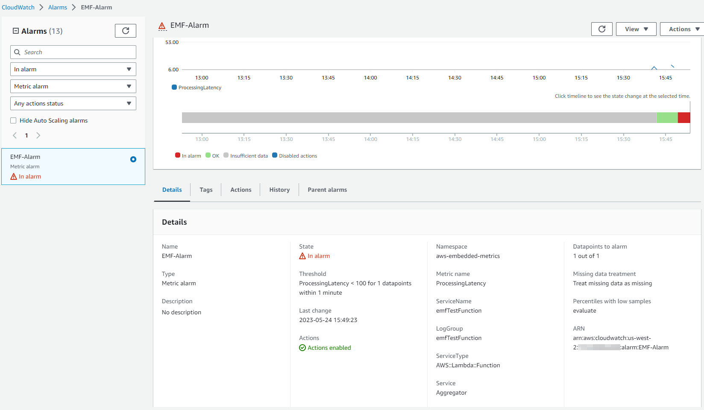

# CloudWatch Embedded Metric Format

## 简介

CloudWatch Embedded Metric Format (EMF) 使客户能够将复杂的高基数应用数据以日志形式摄入 Amazon CloudWatch，并生成可操作的 metrics。使用 Embedded Metric Format，客户无需依赖复杂的架构或使用任何第三方工具即可获得环境洞察。虽然此功能可在所有环境中使用，但对于具有临时资源的工作负载特别有用，如 AWS Lambda 函数或 Amazon Elastic Container Service (Amazon ECS)、Amazon Elastic Kubernetes Service (Amazon EKS) 或 EC2 上的 Kubernetes 中的容器。Embedded Metric Format 让客户无需编写或维护单独的代码即可轻松创建自定义 metrics，同时获得对日志数据的强大分析能力。

## Embedded Metric Format (EMF) 日志的工作原理

Amazon EC2、本地服务器、Amazon Elastic Container Service (Amazon ECS)、Amazon Elastic Kubernetes Service (Amazon EKS) 或 EC2 上的 Kubernetes 中的容器等计算环境可以通过 CloudWatch Agent 生成并发送 Embedded Metric Format (EMF) 日志到 Amazon CloudWatch。

AWS Lambda 允许客户轻松生成自定义 metrics，无需任何自定义代码、阻塞网络调用或依赖任何第三方软件来生成和摄入 Embedded Metric Format (EMF) 日志到 Amazon CloudWatch。

客户可以在详细日志事件数据旁边异步嵌入自定义 metrics，无需在发布符合 [EMF 规范](https://docs.aws.amazon.com/AmazonCloudWatch/latest/monitoring/CloudWatch_Embedded_Metric_Format_Specification.html)的结构化日志时提供特殊的头部声明。CloudWatch 自动提取自定义 metrics，使客户可以进行可视化并设置告警以实现实时事件检测。与提取的 metrics 关联的详细日志事件和高基数上下文可以使用 CloudWatch Logs Insights 进行查询，以深入了解运营事件的根本原因。

用于 [Fluent Bit](https://docs.fluentbit.io/manual/pipeline/outputs/cloudwatch) 的 Amazon CloudWatch 输出插件允许客户将 metrics 和 logs 数据摄入 Amazon CloudWatch 服务，包括对 [Embedded Metric Format](https://github.com/aws/aws-for-fluent-bit) (EMF) 的支持。


## 何时使用 Embedded Metric Format (EMF) 日志

传统上，监控被分为三类。第一类是应用程序的经典健康检查。第二类是"metrics"，客户通过计数器、计时器和仪表等模型来检测其应用程序。第三类是"logs"，对应用程序的整体可观测性非常宝贵。Logs 为客户提供有关其应用程序行为的持续信息。现在，客户有了一种方式来显著改善观察应用程序的方式，无需在数据粒度或丰富度方面做出牺牲，通过统一和简化应用程序的所有检测来获得难以置信的分析能力——这就是 Embedded Metric Format (EMF) 日志。

[Embedded Metric Format (EMF) 日志](https://aws.amazon.com/blogs/mt/enhancing-workload-observability-using-amazon-cloudwatch-embedded-metric-format/)非常适合生成高基数应用数据的环境，这些数据可以作为 EMF 日志的一部分而无需增加 metric 维度。这仍然允许客户通过 CloudWatch Logs Insights 和 CloudWatch Metrics Insights 查询 EMF 日志来切片和切块应用数据，而无需将每个属性都作为 metric 维度。

需要从[数百万电信或物联网设备聚合遥测数据](https://aws.amazon.com/blogs/mt/how-bt-uses-amazon-cloudwatch-to-monitor-millions-of-devices/)的客户需要深入了解其设备性能，并能够快速深入到设备报告的唯一遥测数据。他们还需要更轻松、更快速地排查问题，而无需在大量数据中挖掘以提供优质服务。通过使用 Embedded Metric Format (EMF) 日志，客户可以通过将 metrics 和 logs 合并为单个实体来实现大规模可观测性，并以更高的成本效率和更好的性能改进故障排除。

## 生成 Embedded Metric Format (EMF) 日志

以下方法可用于生成 Embedded Metric Format 日志：

1. 使用开源客户端库通过 agent（如 [CloudWatch](https://docs.aws.amazon.com/AmazonCloudWatch/latest/monitoring/CloudWatch_Embedded_Metric_Format_Generation_CloudWatch_Agent.html)、Fluent-Bit 或 Firelens）生成并发送 EMF 日志。

   - 以下语言的开源客户端库可用于创建 EMF 日志：
     - [Node.Js](https://github.com/awslabs/aws-embedded-metrics-node)
     - [Python](https://github.com/awslabs/aws-embedded-metrics-python)
     - [Java](https://github.com/awslabs/aws-embedded-metrics-java)
     - [C#](https://github.com/awslabs/aws-embedded-metrics-dotnet)
   - EMF 日志可以使用 AWS Distro for OpenTelemetry (ADOT) 生成。ADOT 是 OpenTelemetry 项目的安全、生产就绪的 AWS 支持发行版，是 Cloud Native Computing Foundation (CNCF) 的一部分。OpenTelemetry 是一个开源倡议，提供 API、库和 agent 来收集分布式 traces、logs 和 metrics 用于应用监控，并消除供应商特定格式之间的边界和限制。这需要两个组件：一个符合 OpenTelemetry 标准的数据源和启用 [CloudWatch EMF](https://aws-otel.github.io/docs/getting-started/cloudwatch-metrics#cloudwatch-emf-exporter-awsemf) 日志的 [ADOT Collector](https://github.com/open-telemetry/opentelemetry-collector-contrib/tree/main/exporter/awsemfexporter)。

2. 符合[已定义 JSON 格式规范](https://docs.aws.amazon.com/AmazonCloudWatch/latest/monitoring/CloudWatch_Embedded_Metric_Format_Specification.html)的手动构建日志，可以通过 [CloudWatch agent](https://docs.aws.amazon.com/AmazonCloudWatch/latest/monitoring/CloudWatch_Embedded_Metric_Format_Generation_CloudWatch_Agent.html) 或 [PutLogEvents API](https://docs.aws.amazon.com/AmazonCloudWatch/latest/monitoring/CloudWatch_Embedded_Metric_Format_Generation_PutLogEvents.html) 发送到 CloudWatch。

## 在 CloudWatch 控制台中查看 Embedded Metric Format 日志

生成提取 metrics 的 Embedded Metric Format (EMF) 日志后，客户可以在 CloudWatch 控制台的 Metrics 下[查看它们](https://docs.aws.amazon.com/AmazonCloudWatch/latest/monitoring/CloudWatch_Embedded_Metric_Format_View.html)。嵌入的 metrics 具有生成日志时指定的维度。使用客户端库生成的嵌入 metrics 默认具有 ServiceType、ServiceName、LogGroup 维度。

- **ServiceName**：服务名称被覆盖，但对于无法推断名称的服务（例如在 EC2 上运行的 Java 进程），如果未明确设置，则使用默认值 Unknown。
- **ServiceType**：服务类型被覆盖，但对于无法推断类型的服务（例如在 EC2 上运行的 Java 进程），如果未明确设置，则使用默认值 Unknown。
- **LogGroupName**：客户可以选择配置 metrics 应发送到的目标日志组（适用于基于 agent 的平台）。此值从库传递到 Embedded Metric 有效负载中的 agent。如果未提供 LogGroup，则默认值将从服务名称派生：-metrics
- **LogStreamName**：客户可以选择配置 metrics 应发送到的目标日志流（适用于基于 agent 的平台）。此值将从库传递到 Embedded Metric 有效负载中的 agent。如果未提供 LogStreamName，则默认值将由 agent 派生（这可能是主机名）。
- **NameSpace**：覆盖 CloudWatch 命名空间。如果未设置，则使用默认值 aws-embedded-metrics。

CloudWatch Console logs 中的示例 EMF 日志如下所示：

```json
2023-05-19T15:20:39.391Z 238196b6-c8da-4341-a4b7-0c322e0ef5bb INFO
{
    "LogGroup": "emfTestFunction",
    "ServiceName": "emfTestFunction",
    "ServiceType": "AWS::Lambda::Function",
    "Service": "Aggregator",
    "AccountId": "XXXXXXXXXXXX",
    "RequestId": "422b1569-16f6-4a03-b8f0-fe3fd9b100f8",
    "DeviceId": "61270781-c6ac-46f1-baf7-22c808af8162",
    "Payload": {
        "sampleTime": 123456789,
        "temperature": 273,
        "pressure": 101.3
    },
    "executionEnvironment": "AWS_Lambda_nodejs18.x",
    "memorySize": "256",
    "functionVersion": "$LATEST",
    "logStreamId": "2023/05/19/[$LATEST]f3377848231140c185570caa9f97abc8",
    "_aws": {
        "Timestamp": 1684509639390,
        "CloudWatchMetrics": [
            {
                "Dimensions": [
                    [
                        "LogGroup",
                        "ServiceName",
                        "ServiceType",
                        "Service"
                    ]
                ],
                "Metrics": [
                    {
                        "Name": "ProcessingLatency",
                        "Unit": "Milliseconds"
                    }
                ],
                "Namespace": "aws-embedded-metrics"
            }
        ]
    },
    "ProcessingLatency": 100
}
```

对于相同的 EMF 日志，提取的 metrics 如下所示，可以在 **CloudWatch Metrics** 中查询。


客户可以使用 **CloudWatch Logs Insights** 查询与提取的 metrics 关联的详细日志事件，以深入了解运营事件的根本原因。从 EMF 日志中提取 metrics 的好处之一是，客户可以按唯一 metric（metric 名称加唯一维度集）和 metric 值过滤 logs，以获取有关导致聚合 metric 值的事件的上下文。

对于上面讨论的相同 EMF 日志，以下是在 CloudWatch Logs Insights 中以 ProcessingLatency 作为 metric 和 Service 作为维度来获取受影响的请求 ID 或设备 ID 的示例查询。

```json
filter ProcessingLatency < 200 and Service = "Aggregator"
| fields @requestId, @ingestionTime, @DeviceId
```


## 基于 EMF 日志创建的 metrics 告警

对 [EMF 生成的 metrics 创建告警](https://docs.aws.amazon.com/AmazonCloudWatch/latest/monitoring/CloudWatch_Embedded_Metric_Format_Alarms.html)遵循与对任何其他 metrics 创建告警相同的模式。这里需要注意的关键点是，EMF metric 生成依赖于日志发布流程，因为 CloudWatch Logs 处理 EMF 日志并转换 metrics。因此，及时发布日志非常重要，以便在评估告警的时间段内创建 metric 数据点。

对于上面讨论的相同 EMF 日志，以下是使用 ProcessingLatency metric 作为数据点并设置阈值创建的告警示例。



## EMF 日志的最新功能

客户可以使用 [PutLogEvents API](https://docs.aws.amazon.com/AmazonCloudWatch/latest/monitoring/CloudWatch_Embedded_Metric_Format_Generation_PutLogEvents.html) 将 EMF 日志发送到 CloudWatch Logs，可以选择包含 HTTP 头 `x-amzn-logs-format: json/emf` 来指示 CloudWatch Logs 应提取 metrics，但这不再是必需的。

Amazon CloudWatch 支持从使用 Embedded Metric Format (EMF) 的结构化日志中[高分辨率 metric 提取](https://aws.amazon.com/about-aws/whats-new/2023/02/amazon-cloudwatch-high-resolution-metric-extraction-structured-logs/)，精度可达 1 秒。客户可以在 EMF 规范日志中提供可选的 [StorageResolution](https://docs.aws.amazon.com/AmazonCloudWatch/latest/monitoring/cloudwatch_concepts.html#Resolution_definition) 参数，值为 1 或 60（默认），以指示 metric 的所需分辨率（以秒为单位）。客户可以通过 EMF 发布标准分辨率（60 秒）和高分辨率（1 秒）metrics，从而实现对应用程序健康和性能的精细可见性。

Amazon CloudWatch 通过两个错误 metrics（[EMFValidationErrors 和 EMFParsingErrors](https://docs.aws.amazon.com/AmazonCloudWatch/latest/logs/CloudWatch-Logs-Monitoring-CloudWatch-Metrics.html)）为 Embedded Metric Format (EMF) 提供了[增强的错误可见性](https://aws.amazon.com/about-aws/whats-new/2023/01/amazon-cloudwatch-enhanced-error-visibility-embedded-metric-format-emf/)。这种增强的可见性帮助客户在使用 EMF 时快速识别和修复错误，从而简化检测过程。

随着管理现代应用程序复杂性的增加，客户在定义和分析自定义 metrics 时需要更多的灵活性。因此，metric 维度的最大数量已从 10 增加到 30。客户可以使用[最多 30 个维度的 EMF 日志](https://aws.amazon.com/about-aws/whats-new/2022/08/amazon-cloudwatch-metrics-increases-throughput/)创建自定义 metrics。

## 其他参考资料：

- https://catalog.workshops.aws/observability/en-US/aws-native/metrics/emf/clientlibrary 关于[使用 AWS Lambda 函数的 Embedded Metric Format](https://catalog.workshops.aws/observability/en-US/aws-native/metrics/emf/clientlibrary) 示例（使用 NodeJS Library）。
- Serverless 可观测性 Workshop 关于[使用 Embedded Metrics Format 的异步 metrics](https://serverless-observability.workshop.aws/en/030_cloudwatch/async_metrics_emf.html) (EMF)
- [使用 PutLogEvents API 的 Java 代码示例](https://catalog.workshops.aws/observability/en-US/aws-native/metrics/emf/putlogevents)将 EMF 日志发送到 CloudWatch Logs
- 博客文章：[Lowering costs and focusing on our customers with Amazon CloudWatch embedded custom metrics](https://aws.amazon.com/blogs/mt/lowering-costs-and-focusing-on-our-customers-with-amazon-cloudwatch-embedded-custom-metrics/)
