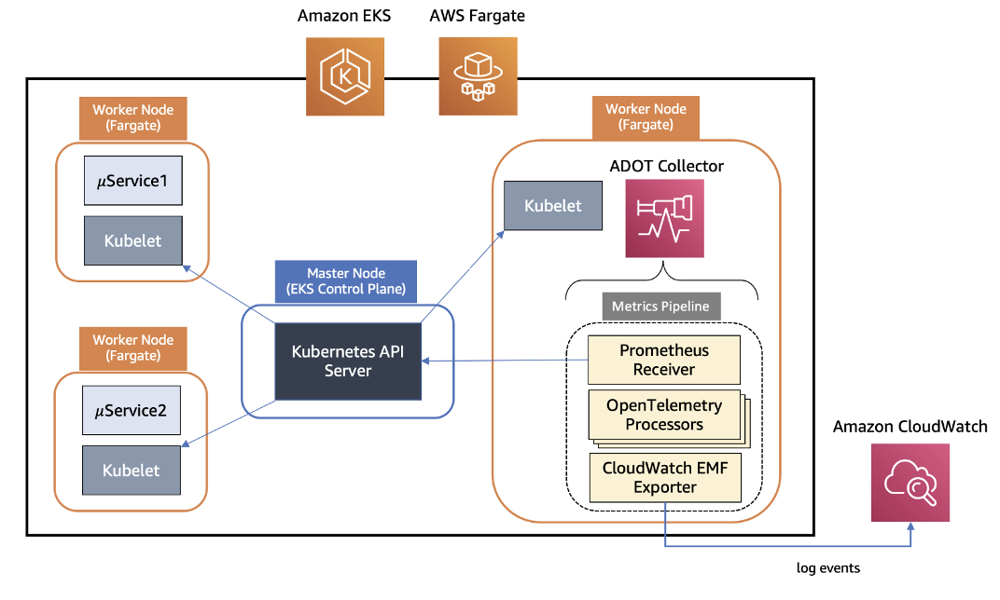

# CloudWatch Container Insights

## 简介

Amazon CloudWatch Container Insights 是一个强大的工具，用于收集、聚合和汇总来自容器化应用程序和微服务的 metrics 和日志。本文概述了 ADOT 与 CloudWatch Container Insights 在 EKS Fargate 工作负载中的集成，包括其设计、部署过程和优势。

## EKS Fargate 的 ADOT Collector 设计

ADOT Collector 使用由三个主要组件组成的管道架构：

1. Receiver：以指定格式接收数据并将其转换为内部格式。
2. Processor：对数据执行批处理、过滤和转换等任务。
3. Exporter：确定发送 metrics、日志或 traces 的目标位置。

对于 EKS Fargate，ADOT Collector 使用 Prometheus Receiver 从 Kubernetes API server 抓取 metrics，API server 充当工作节点上 kubelet 的代理。由于 EKS Fargate 中的网络限制阻止了对 kubelet 的直接访问，这种方法是必要的。收集的 metrics 经过一系列 processor 进行过滤、重命名、数据聚合和转换。最后，AWS CloudWatch EMF Exporter 将 metrics 转换为嵌入式 metric 格式（EMF）并发送到 CloudWatch Logs。

*图 1: 在 EKS Fargate 上使用 ADOT 的 Container Insights*
<!--https://aws.amazon.com/blogs/containers/introducing-amazon-cloudwatch-container-insights-for-amazon-eks-fargate-using-aws-distro-for-opentelemetry/
-->
## 部署过程

要在 EKS Fargate 集群上部署 ADOT Collector：

1. 创建一个带有 Kubernetes 的 EKS 集群
2. 设置 Fargate pod 执行角色。
3. 为必要的 namespace 定义 Fargate profile。
4. 为 ADOT Collector 创建具有所需权限的 IAM 角色。
5. 使用提供的清单将 ADOT Collector 部署为 Kubernetes StatefulSet。
6. 部署示例工作负载以测试 metrics 收集。

## 优缺点

### 优点：

1. 统一监控：为 EKS EC2 和 Fargate 工作负载提供一致的监控体验。
2. 可扩展性：单个 ADOT Collector 实例可以发现和收集 EKS 集群中所有工作节点的 metrics。
3. 丰富的 Metrics：收集全面的系统 metrics，包括 CPU、内存、磁盘和网络使用情况。
4. 轻松集成：与现有的 CloudWatch dashboard 和告警无缝集成。
5. 经济高效：无需额外的监控基础设施即可监控 Fargate 工作负载。

### 缺点：

1. 配置复杂性：设置 ADOT Collector 需要仔细配置 IAM 角色、Fargate profile 和 Kubernetes 资源。
2. 资源开销：ADOT Collector 本身会消耗 Fargate 集群上的资源，需要在容量规划中予以考虑。

AWS Distro for OpenTelemetry 与 EKS Fargate 工作负载的 CloudWatch Container Insights 的集成，为监控容器化应用程序提供了强大的解决方案。它在不同的 EKS 部署选项之间提供统一的监控体验，并利用 OpenTelemetry 框架的可扩展性和灵活性。通过支持从 Fargate 工作负载收集系统 metrics，此集成使客户能够更深入地了解其应用程序性能，做出明智的扩展决策，并优化资源利用。
