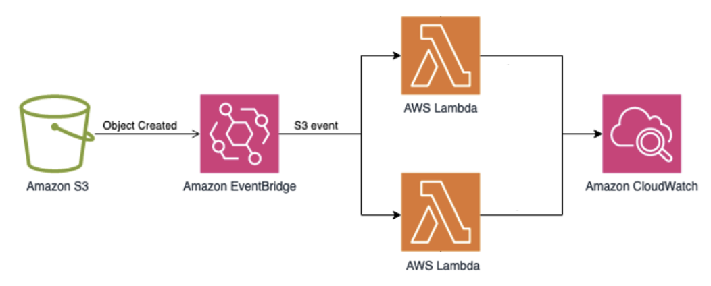

# Lambda 日志记录
<!-- Observability for Serverless Applications with CloudWatch Logs-->

在无服务器计算领域，observability 是确保应用程序可靠性、性能和效率的关键方面。AWS Lambda 是无服务器架构的基石，提供了一个强大且可扩展的平台来运行事件驱动的代码，无需管理底层基础设施。然而，与任何应用程序一样，日志记录对于监控、故障排除和深入了解 Lambda 函数的行为和健康状况至关重要。

AWS Lambda 与 Amazon CloudWatch Logs（一项完全托管的日志管理服务）无缝集成，允许您集中分析 Lambda 函数的日志。通过配置 Lambda 函数将日志输出到 CloudWatch Logs，您可以解锁一系列增强无服务器应用程序 observability 的优势和功能。

1. 集中日志管理：CloudWatch Logs 整合来自多个 Lambda 函数的日志数据，为日志管理和分析提供集中位置。这种集中化简化了分布式无服务器应用程序的监控和故障排除过程。

2. 实时日志流：CloudWatch Logs 支持实时日志流，使您能够在 Lambda 函数生成日志数据时即时查看和分析。这种实时可见性确保您可以快速检测和响应问题或错误，最大限度地减少潜在的停机时间或性能下降。

3. 日志保留和归档：CloudWatch Logs 允许您为日志数据定义保留策略，确保日志在所需时间内被保留，以满足合规要求或便于长期分析和审计。

4. 日志过滤和搜索：CloudWatch Logs 提供强大的日志过滤和搜索功能，使您能够根据特定条件或模式快速定位和分析相关日志条目。此功能简化了故障排除过程，帮助您快速识别问题的根本原因。

5. 监控和告警：通过将 CloudWatch Logs 与 Amazon CloudWatch 等其他 AWS 服务集成，您可以根据日志数据设置自定义 metrics、告警和触发器。这种集成支持主动监控和告警，确保您在发生关键事件或偏离预期行为时收到通知。

6. 与 AWS 服务集成：CloudWatch Logs 与其他 AWS 服务无缝集成，如 AWS Lambda Insights、AWS X-Ray 和 AWS CloudTrail，使您能够将日志数据与应用程序性能 metrics、分布式追踪和安全审计相关联，提供无服务器应用程序的全面视图。

*图 1: Lambda 日志记录，展示从 S3 捕获到 AWS CloudWatch 的事件*

要利用 Lambda 日志记录与 CloudWatch Logs，您需要遵循以下一般步骤：

1. 通过指定适当的日志组和日志流设置，配置 Lambda 函数将日志输出到 CloudWatch Logs。
2. 根据组织的要求和合规法规定义日志保留策略。
3. 利用 CloudWatch Logs Insights 分析和查询日志数据，使您能够识别模式、趋势和潜在问题。
4. 可选地，将 CloudWatch Logs 与 CloudWatch、X-Ray 或 CloudTrail 等其他 AWS 服务集成，以增强监控、追踪和安全审计能力。
5. 根据日志数据设置自定义 metrics、告警和通知，以实现主动监控和告警。

虽然 CloudWatch Logs 为 Lambda 函数提供了强大的日志记录功能，但需要考虑日志数据量和成本管理等潜在挑战。随着无服务器应用程序的扩展，日志数据量可能大幅增加，可能影响性能并产生额外成本。实施日志轮换、压缩和保留策略可以帮助缓解这些挑战。

此外，确保对日志数据的适当访问控制和数据安全至关重要。CloudWatch Logs 提供精细的访问控制机制和加密功能，以保护日志数据的机密性和完整性。

总之，配置 Lambda 函数将日志输出到 CloudWatch Logs 是确保无服务器应用程序 observability 的基本实践。通过集中和分析日志数据，您可以获得有价值的洞察，简化故障排除过程，并维护强大且安全的无服务器基础设施。通过 CloudWatch Logs 与其他 AWS 服务的集成，您可以解锁高级监控、追踪和安全功能，使您能够构建和维护高度可观测且可靠的无服务器应用程序。
