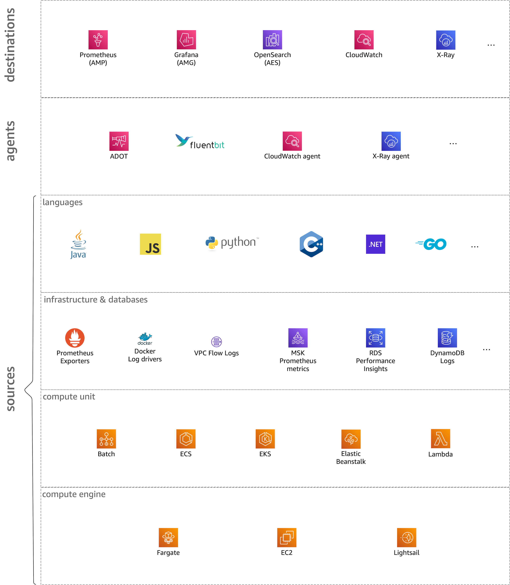

# 维度

在本站的语境中，我们从六个维度来看待 o11y 领域。独立审视每个维度有利于从综合的角度出发——也就是说，当您尝试为特定工作负载构建具体的 o11y 解决方案时，需要跨越开发相关的方面（如所使用的编程语言）以及运营主题（例如容器或 Lambda 函数等运行时环境）。

:::note
    "什么是信号？"
    当我们在这里说信号时，指的是任何类型的 o11y 数据和元数据点，包括日志条目、metrics 和 traces。除非我们需要或必须更加具体，否则我们使用"信号"这个术语，具体的限制条件应从上下文中理解。
:::

现在让我们逐一了解六个维度：

## 目的地

在这个维度中，我们考虑所有类型的信号目的地，包括长期存储和让您消费信号的图形界面。作为开发人员，您希望访问 UI 或 API 来发现、查找和关联信号以排查服务问题。在基础设施或平台角色中，您希望访问 UI 或 API 来管理、发现、查找和关联信号以了解基础设施的状态。

从人的角度来看，这最终是最有趣的维度。然而，为了能够收获这些好处，我们首先需要投入一些工作：我们需要对软件和外部依赖进行埋点，并将信号摄入到目的地。

那么，信号是如何到达目的地的呢？很高兴您问到了，答案是...

## 代理

信号如何被收集并路由到分析系统。信号可以来自两个来源：您的应用程序源代码（另见语言部分）或您的应用程序所依赖的事物，例如数据存储中管理的状态以及 VPC 等基础设施（另见基础设施与数据部分）。

代理是遥测的一部分，用于收集和摄入信号。另一部分是经过埋点的应用程序和数据库等基础设施组件。

## 语言

这个维度涉及您用于编写服务或应用程序的编程语言。在这里，我们处理的是 SDK 和库，例如 [X-Ray SDKs][xraysdks] 或 OpenTelemetry 在[埋点][otelinst]方面提供的内容。您需要确保 o11y 解决方案支持您针对特定信号类型（如 logs 或 metrics）所选择的编程语言。

## 基础设施与数据库

这个维度指的是任何类型的应用程序外部依赖，无论是服务运行所在的 VPC 等基础设施，还是 RDS、DynamoDB 等数据存储，或者 SQS 等队列。

:::tip
    "共同点"
    这个维度中所有来源的一个共同点是，它们位于您的应用程序之外（以及您的应用程序运行的计算环境之外），因此您必须将它们视为不透明的黑盒。
:::

这个维度包括但不限于：

- AWS 基础设施，例如 [VPC flow logs][vpcfl]。
- 辅助 API，例如 [Kubernetes 控制平面日志][kubecpl]。
- 来自数据存储的信号，例如 [S3][s3mon]、[RDS][rdsmon] 或 [SQS][sqstrace]。

## 计算单元

您打包、调度和运行代码的方式。例如，在 Lambda 中是函数，在 [ECS][ecs] 和 [EKS][eks] 中，该单元是运行在任务（ECS）或 Pod（EKS）中的容器。像 Kubernetes 这样的容器化环境通常为遥测部署提供两种选择：作为 sidecar 或作为每节点（实例）的守护进程。

## 计算引擎

这个维度指的是基础运行时环境，它可能是（例如 EC2 实例）也可能不是（Fargate 或 Lambda 等无服务器产品）您负责配置和修补的。根据您使用的计算引擎，遥测部分可能已经是产品的一部分，例如，[EKS on Fargate][firelensef] 通过 Fluent Bit 集成了日志路由。

[aes]: https://aws.amazon.com/elasticsearch-service/ "Amazon Elasticsearch Service"
[adot]: https://aws-otel.github.io/ "AWS Distro for OpenTelemetry"
[amg]: https://aws.amazon.com/grafana/ "Amazon Managed Grafana"
[amp]: https://aws.amazon.com/prometheus/ "Amazon Managed Service for Prometheus"
[batch]: https://aws.amazon.com/batch/ "AWS Batch"
[beans]: https://aws.amazon.com/elasticbeanstalk/ "AWS Elastic Beanstalk"
[cw]: https://aws.amazon.com/cloudwatch/ "Amazon CloudWatch"
[dimensions]: ../dimensions
[ec2]: https://aws.amazon.com/ec2/ "Amazon EC2"
[ecs]: https://aws.amazon.com/ecs/ "Amazon Elastic Container Service"
[eks]: https://aws.amazon.com/eks/ "Amazon Elastic Kubernetes Service"
[fargate]: https://aws.amazon.com/fargate/ "AWS Fargate"
[fluentbit]: https://fluentbit.io/ "Fluent Bit"
[firelensef]: https://aws.amazon.com/blogs/containers/fluent-bit-for-amazon-eks-on-aws-fargate-is-here/ "Fluent Bit for Amazon EKS on AWS Fargate is here"
[jaeger]: https://www.jaegertracing.io/ "Jaeger"
[kafka]: https://kafka.apache.org/ "Apache Kafka"
[kubecpl]: https://docs.aws.amazon.com/eks/latest/userguide/control-plane-logs.html "Amazon EKS control plane logging"
[lambda]: https://aws.amazon.com/lambda/ "AWS Lambda"
[lightsail]: https://aws.amazon.com/lightsail/ "Amazon Lightsail"
[otel]: https://opentelemetry.io/ "OpenTelemetry"
[otelinst]: https://opentelemetry.io/docs/concepts/instrumenting/
[promex]: https://prometheus.io/docs/instrumenting/exporters/ "Prometheus exporters and integrations"
[rdsmon]: https://docs.aws.amazon.com/AmazonRDS/latest/UserGuide/Overview.LoggingAndMonitoring.html "Logging and monitoring in Amazon RDS"
[s3]: https://aws.amazon.com/s3/ "Amazon S3"
[s3mon]: https://docs.aws.amazon.com/AmazonS3/latest/userguide/s3-incident-response.html "Logging and monitoring in Amazon S3"
[sqstrace]: https://docs.aws.amazon.com/xray/latest/devguide/xray-services-sqs.html "Amazon SQS and AWS X-Ray"
[vpcfl]: https://docs.aws.amazon.com/vpc/latest/userguide/flow-logs.html "VPC Flow Logs"
[xray]: https://aws.amazon.com/xray/ "AWS X-Ray"
[xraysdks]: https://docs.aws.amazon.com/xray/index.html
