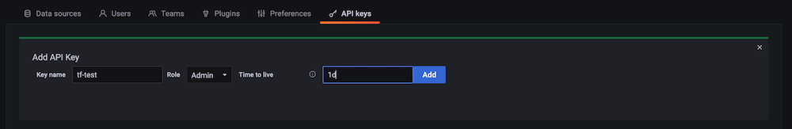

# 使用 Terraform 实现 Amazon Managed Grafana 自动化

本文介绍如何使用 Terraform 自动化 Amazon Managed Grafana，例如在多个工作区中一致地添加数据源或 dashboard。

:::note
    本指南大约需要 30 分钟完成。
:::
## 前提条件

* [AWS 命令行][aws-cli]已在本地环境中安装并[配置][aws-cli-conf]。
* [Terraform][tf] 命令行已在本地环境中安装。
* 您已准备好可用的 Amazon Managed Service for Prometheus 工作区。
* 您已准备好可用的 Amazon Managed Grafana 工作区。

## 设置 Amazon Managed Grafana

为了让 Terraform 能够对 Grafana 进行[身份验证][grafana-authn]，我们使用 API Key 作为密码。

:::info
    API key 是一个 [RFC 6750][rfc6750] HTTP Bearer 头部，
    包含 51 个字符的字母数字值，每次请求时用于向 Grafana API 验证调用方身份。
:::

因此，在设置 Terraform 清单之前，我们首先需要创建一个 API key。您可以通过 Grafana UI 完成此操作，步骤如下。

首先，在左侧菜单的 `Configuration` 部分选择 `API keys` 菜单项：


现在创建一个新的 API key，为其指定一个有意义的名称，分配 `Admin` 角色，并将有效期设置为例如一天：



:::note
    API key 有效期有限，在 AMG 中最长可设置为 30 天。
:::
点击 `Add` 按钮后，您应该会看到一个包含 API key 的弹出对话框：


:::warning
    这是您唯一一次看到 API key 的机会，请将其保存到安全的地方，
    稍后在 Terraform 清单中需要使用它。
:::
至此，我们已完成在 Amazon Managed Grafana 中使用 Terraform 进行自动化所需的所有设置，接下来进入下一步。

## 使用 Terraform 进行自动化

### 准备 Terraform

为了让 Terraform 能够与 Grafana 交互，我们使用官方的
[Grafana provider][tf-grafana-provider]（版本 1.13.3 或更高）。

接下来，我们要自动创建一个数据源。具体来说，我们要添加一个 Prometheus [数据源][tf-ds]，即一个 AMP 工作区。

首先，创建一个名为 `main.tf` 的文件，内容如下：

```
terraform {
  required_providers {
    grafana = {
      source  = "grafana/grafana"
      version = ">= 1.13.3"
    }
  }
}

provider "grafana" {
  url  = "INSERT YOUR GRAFANA WORKSPACE URL HERE"
  auth = "INSERT YOUR API KEY HERE"
}

resource "grafana_data_source" "prometheus" {
  type          = "prometheus"
  name          = "amp"
  is_default    = true
  url           = "INSERT YOUR AMP WORKSPACE URL HERE "
  json_data {
	http_method     = "POST"
	sigv4_auth      = true
	sigv4_auth_type = "workspace-iam-role"
	sigv4_region    = "eu-west-1"
  }
}
```
在上述文件中，您需要根据您的环境插入三个值。

在 Grafana provider 部分：

* `url` … Grafana 工作区 URL，格式类似：
      `https://xxxxxxxx.grafana-workspace.eu-west-1.amazonaws.com`。
* `auth` … 您在上一步创建的 API key。

在 Prometheus resource 部分，插入 `url`，即 AMP 工作区 URL，格式为
`https://aps-workspaces.eu-west-1.amazonaws.com/workspaces/ws-xxxxxxxxx`。

:::note
    如果您使用的 Amazon Managed Grafana 所在区域与文件中显示的不同，
    除上述内容外，还需要将 `sigv4_region` 设置为您的区域。
:::
为完成准备阶段，现在初始化 Terraform：

```
$ terraform init
Initializing the backend...

Initializing provider plugins...
- Finding grafana/grafana versions matching ">= 1.13.3"...
- Installing grafana/grafana v1.13.3...
- Installed grafana/grafana v1.13.3 (signed by a HashiCorp partner, key ID 570AA42029AE241A)

Partner and community providers are signed by their developers.
If you'd like to know more about provider signing, you can read about it here:
https://www.terraform.io/docs/cli/plugins/signing.html

Terraform has created a lock file .terraform.lock.hcl to record the provider
selections it made above. Include this file in your version control repository
so that Terraform can guarantee to make the same selections by default when
you run "terraform init" in the future.

Terraform has been successfully initialized!

You may now begin working with Terraform. Try running "terraform plan" to see
any changes that are required for your infrastructure. All Terraform commands
should now work.

If you ever set or change modules or backend configuration for Terraform,
rerun this command to reinitialize your working directory. If you forget, other
commands will detect it and remind you to do so if necessary.
```

这样就准备就绪了，可以使用 Terraform 自动创建数据源，如下所述。

### 使用 Terraform

通常，您会先查看 Terraform 的执行计划，如下所示：

```
$ terraform plan

Terraform used the selected providers to generate the following execution plan. 
Resource actions are indicated with the following symbols:
  + create

Terraform will perform the following actions:

  # grafana_data_source.prometheus will be created
  + resource "grafana_data_source" "prometheus" {
      + access_mode        = "proxy"
      + basic_auth_enabled = false
      + id                 = (known after apply)
      + is_default         = true
      + name               = "amp"
      + type               = "prometheus"
      + url                = "https://aps-workspaces.eu-west-1.amazonaws.com/workspaces/ws-xxxxxx/"

      + json_data {
          + http_method     = "POST"
          + sigv4_auth      = true
          + sigv4_auth_type = "workspace-iam-role"
          + sigv4_region    = "eu-west-1"
        }
    }

Plan: 1 to add, 0 to change, 0 to destroy.

───────────────────────────────────────────────────────────────────────────────────────────────────────────────────────────────────────────────────────────────────────────

Note: You didn't use the -out option to save this plan, so Terraform can't guarantee to take exactly these actions if you run "terraform apply" now.

```

如果您对计划满意，可以应用它：

```
$ terraform apply

Terraform used the selected providers to generate the following execution plan. 
Resource actions are indicated with the following symbols:
  + create

Terraform will perform the following actions:

  # grafana_data_source.prometheus will be created
  + resource "grafana_data_source" "prometheus" {
      + access_mode        = "proxy"
      + basic_auth_enabled = false
      + id                 = (known after apply)
      + is_default         = true
      + name               = "amp"
      + type               = "prometheus"
      + url                = "https://aps-workspaces.eu-west-1.amazonaws.com/workspaces/ws-xxxxxxxxx/"

      + json_data {
          + http_method     = "POST"
          + sigv4_auth      = true
          + sigv4_auth_type = "workspace-iam-role"
          + sigv4_region    = "eu-west-1"
        }
    }

Plan: 1 to add, 0 to change, 0 to destroy.

Do you want to perform these actions?
  Terraform will perform the actions described above.
  Only 'yes' will be accepted to approve.

  Enter a value: yes

grafana_data_source.prometheus: Creating...
grafana_data_source.prometheus: Creation complete after 1s [id=10]

Apply complete! Resources: 1 added, 0 changed, 0 destroyed.

```

现在前往 Grafana 中的数据源列表，您应该会看到类似以下内容：


要验证新创建的数据源是否正常工作，可以点击底部的蓝色 `Save &
test` 按钮，您应该会看到 `Data source is working` 的确认消息。

您还可以使用 Terraform 自动化其他内容，例如 [Grafana
provider][tf-grafana-provider] 支持管理文件夹和 dashboard。

假设您想创建一个文件夹来组织 dashboard，例如：

```
resource "grafana_folder" "examplefolder" {
  title = "devops"
}
```

进一步地，假设您有一个名为 `example-dashboard.json` 的 dashboard，并希望在上述文件夹中创建它，则可以使用以下代码片段：

```
resource "grafana_dashboard" "exampledashboard" {
  folder = grafana_folder.examplefolder.id
  config_json = file("example-dashboard.json")
}
```

Terraform 是一个强大的自动化工具，您可以如此处所示使用它来管理 Grafana 资源。

:::note
    请注意，[Terraform 中的状态][tf-state]默认在本地管理。
    这意味着，如果您计划团队协作使用 Terraform，
    需要选择一种支持跨团队共享状态的可用选项。
:::
## 清理

通过控制台删除 Amazon Managed Grafana 工作区。

[aws-cli]: https://docs.aws.amazon.com/cli/latest/userguide/cli-chap-install.html
[aws-cli-conf]: https://docs.aws.amazon.com/cli/latest/userguide/cli-chap-configure.html
[tf]: https://www.terraform.io/downloads.html
[grafana-authn]: https://grafana.com/docs/grafana/latest/http_api/auth/
[rfc6750]: https://datatracker.ietf.org/doc/html/rfc6750
[tf-grafana-provider]: https://registry.terraform.io/providers/grafana/grafana/latest/docs
[tf-ds]: https://registry.terraform.io/providers/grafana/grafana/latest/docs/resources/data_source
[tf-state]: https://www.terraform.io/docs/language/state/remote.html
