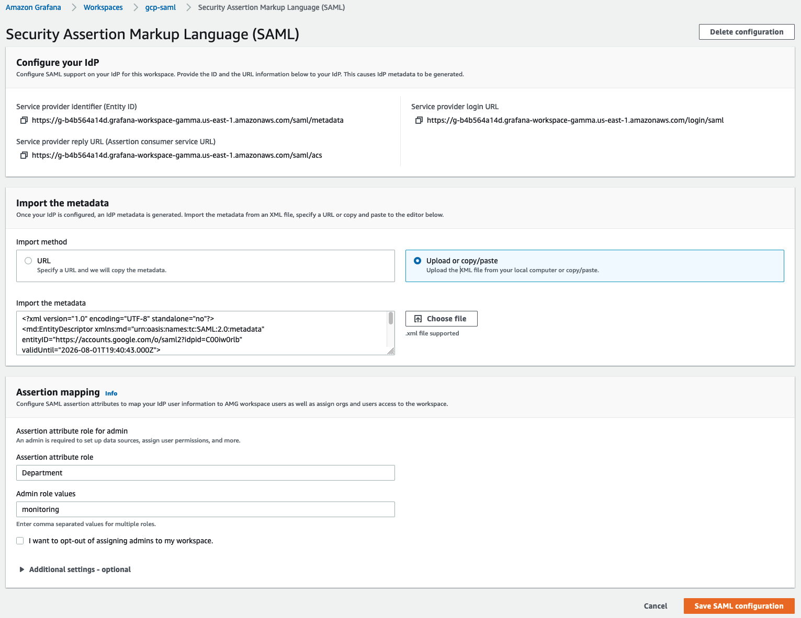
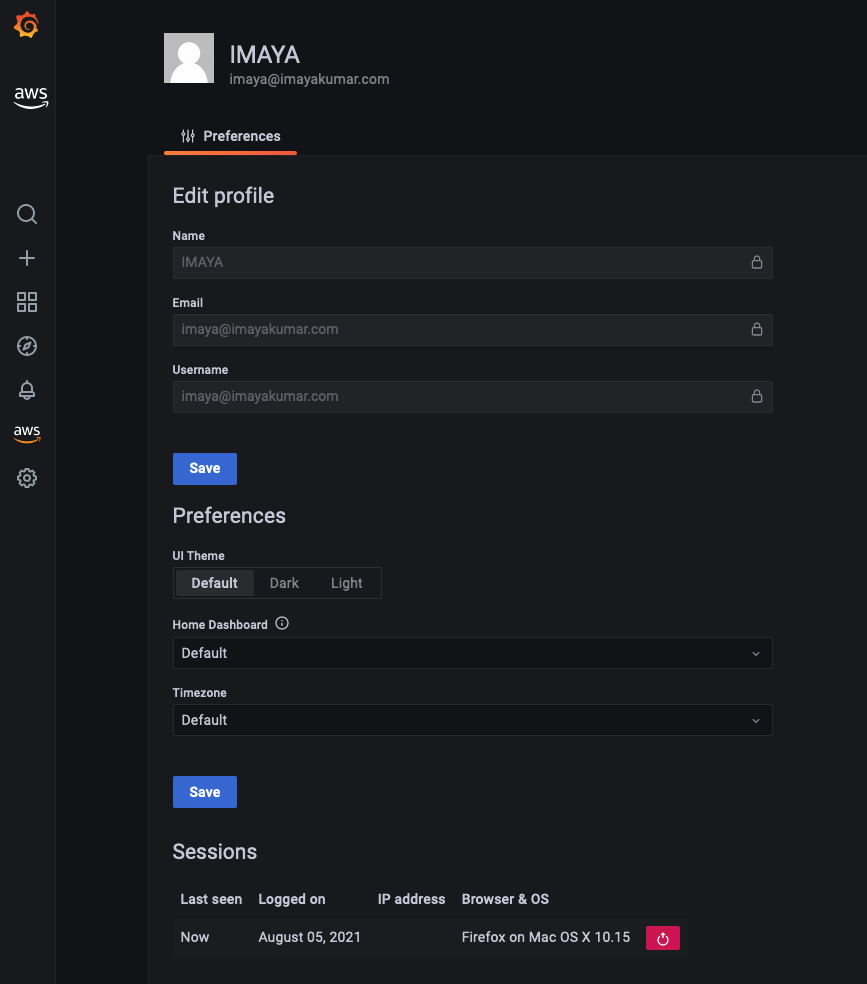

# 使用 SAML 为 Amazon Managed Grafana 配置 Google Workspaces 身份验证

本指南将引导您如何使用 SAML v2.0 协议将 Google Workspaces 设置为 Amazon Managed Grafana 的身份提供商 (IdP)。

要遵循本指南，您除了需要创建一个 [Amazon Managed Grafana 工作区][amg-ws]外，还需要一个付费的 [Google Workspaces][google-workspaces] 账户。

### 创建 Amazon Managed Grafana 工作区

登录 Amazon Managed Grafana 控制台，点击 **Create workspace**。在以下页面中，如下所示提供工作区名称，然后点击 **Next**：

在 **Configure settings** 页面中，选择 **Security Assertion Markup Language (SAML)** 选项，以便配置基于 SAML 的身份提供商供用户登录：

选择要使用的数据源，然后点击 **Next**：

在 **Review and create** 页面中，点击 **Create workspace** 按钮：

这将创建一个新的 Amazon Managed Grafana 工作区，如下所示：

### 配置 Google Workspaces

使用超级管理员权限登录 Google Workspaces，进入 **Apps** 部分下的 **Web and mobile apps**。在那里点击 **Add App** 并选择 **Add custom SAML app**。如下所示为应用程序命名，然后点击 **CONTINUE**：

在下一个页面中，点击 **DOWNLOAD METADATA** 按钮下载 SAML 元数据文件。点击 **CONTINUE**。

在下一个页面中，您将看到 ACS URL、Entity ID 和 Start URL 字段。您可以从 Amazon Managed Grafana 控制台获取这些字段的值。

在 **Name ID format** 字段的下拉列表中选择 **EMAIL**，在 **Name ID** 字段中选择 **Basic Information > Primary email**。

点击 **CONTINUE**。

在 **Attribute mapping** 页面中，按照下面的截图所示进行 **Google Directory attributes** 和 **App attributes** 之间的映射：

要使通过 Google 身份验证登录的用户在 **Amazon Managed Grafana** 中拥有 **Admin** 权限，请将 **Department** 字段的值设置为 ***monitoring***。您可以选择任何字段和任何值。无论您在 Google Workspaces 端使用什么，请确保在 Amazon Managed Grafana SAML 设置中进行相应的映射。

### 将 SAML 元数据上传到 Amazon Managed Grafana

现在在 Amazon Managed Grafana 控制台中，点击 **Upload or copy/paste** 选项，选择 **Choose file** 按钮上传之前从 Google Workspaces 下载的 SAML 元数据文件。

在 **Assertion mapping** 部分，在 **Assertion attribute role** 字段中输入 **Department**，在 **Admin role values** 字段中输入 **monitoring**。这将允许 **Department** 为 **monitoring** 的登录用户在 Grafana 中拥有 **Admin** 权限，以便执行管理员操作（如创建 dashboard 和数据源）。

按照下面截图所示设置 **Additional settings - optional** 部分下的值。点击 **Save SAML configuration**：

现在 Amazon Managed Grafana 已设置为使用 Google Workspaces 进行用户身份验证。

用户登录时将被重定向到 Google 登录页面，如下所示：

输入凭证后，用户将登录到 Grafana，如下面的截图所示。

如您所见，用户已成功使用 Google Workspaces 身份验证登录到 Grafana。

[google-workspaces]: https://workspace.google.com/
[amg-ws]: https://docs.aws.amazon.com/grafana/latest/userguide/getting-started-with-AMG.html#AMG-getting-started-workspace
