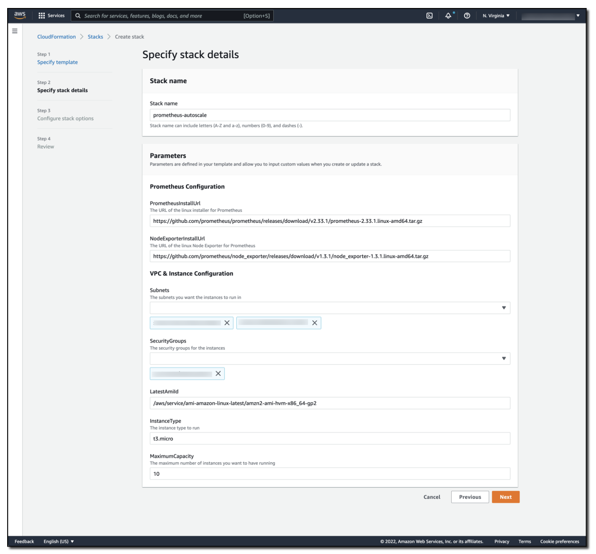

# 使用 Amazon Managed Service for Prometheus 和 Alert Manager 自动伸缩 Amazon EC2

客户希望将现有的 Prometheus 工作负载迁移到云端，并充分利用云的各种能力。AWS 提供了诸如 Amazon [EC2 Auto Scaling](https://aws.amazon.com/ec2/autoscaling/) 之类的服务，可让您根据 CPU 或内存利用率等 metrics 来横向扩展 [Amazon Elastic Compute Cloud (Amazon EC2)](https://aws.amazon.com/pm/ec2/) 实例。使用 Prometheus metrics 的应用程序可以轻松集成 EC2 Auto Scaling，而无需替换其监控堆栈。在本文中，我将引导您配置 Amazon EC2 Auto Scaling 以配合 [Amazon Managed Service for Prometheus Alert Manager](https://aws.amazon.com/prometheus/) 工作。这种方法让您可以将基于 Prometheus 的工作负载迁移到云端，同时利用自动伸缩等服务。

Amazon Managed Service for Prometheus 支持使用 [PromQL](https://prometheus.io/docs/prometheus/latest/querying/basics/) 的[告警规则](https://docs.aws.amazon.com/prometheus/latest/userguide/AMP-Ruler.html)。[Prometheus 告警规则文档](https://prometheus.io/docs/prometheus/latest/configuration/alerting_rules/)提供了有效告警规则的语法和示例。同样，Prometheus alert manager 文档也提供了有效 alert manager 配置的[语法](https://prometheus.io/docs/prometheus/latest/configuration/template_reference/)和[示例](https://prometheus.io/docs/prometheus/latest/configuration/template_examples/)。

## 解决方案概述

首先，让我们简要回顾一下 Amazon EC2 Auto Scaling 的 [Auto Scaling 组](https://docs.aws.amazon.com/autoscaling/ec2/userguide/auto-scaling-groups.html)概念，它是 Amazon EC2 实例的逻辑集合。Auto Scaling 组可以基于预定义的启动模板来启动 EC2 实例。[启动模板](https://docs.aws.amazon.com/AWSEC2/latest/UserGuide/ec2-launch-templates.html)包含用于启动 Amazon EC2 实例的信息，包括 AMI ID、实例类型、网络设置和 [AWS Identity and Access Management (IAM)](https://aws.amazon.com/iam/) 实例配置文件。

Amazon EC2 Auto Scaling 组具有[最小容量、最大容量和期望容量](https://docs.aws.amazon.com/autoscaling/ec2/userguide/what-is-amazon-ec2-auto-scaling.html)的概念。当 Amazon EC2 Auto Scaling 检测到 Auto Scaling 组的当前运行容量高于或低于期望容量时，它将根据需要自动扩展或缩减。这种伸缩方法让您可以在工作负载中利用弹性，同时仍然保持容量和成本的边界。

为了演示此解决方案，我创建了一个包含两个 Amazon EC2 实例的 Amazon EC2 Auto Scaling 组。这些实例将[实例 metrics 远程写入](https://docs.aws.amazon.com/prometheus/latest/userguide/AMP-onboard-ingest-metrics-remote-write-EC2.html)到 Amazon Managed Service for Prometheus 工作区。我已将 Auto Scaling 组的最小容量设置为两个（以维持高可用性），并将组的最大容量设置为 10（以帮助控制成本）。随着更多流量到达解决方案，将自动添加额外的 Amazon EC2 实例以支持负载，最多到 Amazon EC2 Auto Scaling 组的最大容量。当负载减少时，这些 Amazon EC2 实例将被终止，直到 Amazon EC2 Auto Scaling 组达到组的最小容量。这种方法通过利用云的弹性让您拥有高性能的应用程序。

请注意，随着您抓取越来越多的资源，可能会很快超出单个 Prometheus 服务器的能力。您可以通过线性扩展 Prometheus 服务器来避免这种情况。这种方法确保您可以以所需的粒度收集 metric 数据。

为了支持 Prometheus 工作负载的自动伸缩，我创建了一个 Amazon Managed Service for Prometheus 工作区，其中包含以下规则：

` YAML `
```
groups:
- name: example
  rules:
  - alert: HostHighCpuLoad
    expr: 100 - (avg(rate(node_cpu_seconds_total{mode="idle"}[2m])) * 100) > 60
    for: 5m
    labels:
      severity: warning
      event_type: scale_up
    annotations:
      summary: Host high CPU load (instance {{ $labels.instance }})
      description: "CPU load is > 60%\n  VALUE = {{ $value }}\n  LABELS = {{ $labels }}"
  - alert: HostLowCpuLoad
    expr: 100 - (avg(rate(node_cpu_seconds_total{mode="idle"}[2m])) * 100) < 30
    for: 5m
    labels:
      severity: warning
      event_type: scale_down
    annotations:
      summary: Host low CPU load (instance {{ $labels.instance }})
      description: "CPU load is < 30%\n  VALUE = {{ $value }}\n  LABELS = {{ $labels }}"

```

此规则集创建了 `HostHighCpuLoad` 和 `HostLowCpuLoad` 规则。当 CPU 在五分钟内利用率超过 60% 或低于 30% 时，这些告警将触发。

告警触发后，alert manager 将消息转发到 Amazon SNS 主题，传递 `alert_type`（告警名称）和 `event_type`（scale_down 或 scale_up）。

` YAML `
```
alertmanager_config: |
  route: 
    receiver: default_receiver
    repeat_interval: 5m
        
  receivers:
    - name: default_receiver
      sns_configs:
        - topic_arn: <ARN OF SNS TOPIC GOES HERE>
          send_resolved: false
          sigv4:
            region: us-east-1
          message: |
            alert_type: {{ .CommonLabels.alertname }}
            event_type: {{ .CommonLabels.event_type }}

```

一个 AWS [Lambda](https://aws.amazon.com/lambda/) 函数订阅了 Amazon SNS 主题。我在 Lambda 函数中编写了逻辑来检查 Amazon SNS 消息，并确定应该发生 `scale_up` 还是 `scale_down` 事件。然后，Lambda 函数增加或减少 Amazon EC2 Auto Scaling 组的期望容量。Amazon EC2 Auto Scaling 组检测到容量变更请求后，调用或释放 Amazon EC2 实例。

支持自动伸缩的 Lambda 代码如下：

` Python `
```
import json
import boto3
import os

def lambda_handler(event, context):
    print(event)
    msg = event['Records'][0]['Sns']['Message']
    
    scale_type = ''
    if msg.find('scale_up') > -1:
        scale_type = 'scale_up'
    else:
        scale_type = 'scale_down'
    
    get_desired_instance_count(scale_type)
    
def get_desired_instance_count(scale_type):
    
    client = boto3.client('autoscaling')
    asg_name = os.environ['ASG_NAME']
    response = client.describe_auto_scaling_groups(AutoScalingGroupNames=[ asg_name])

    minSize = response['AutoScalingGroups'][0]['MinSize']
    maxSize = response['AutoScalingGroups'][0]['MaxSize']
    desiredCapacity = response['AutoScalingGroups'][0]['DesiredCapacity']
    
    if scale_type == "scale_up":
        desiredCapacity = min(desiredCapacity+1, maxSize)
    if scale_type == "scale_down":
        desiredCapacity = max(desiredCapacity - 1, minSize)
    
    print('Scale type: {}; new capacity: {}'.format(scale_type, desiredCapacity))
    response = client.set_desired_capacity(AutoScalingGroupName=asg_name, DesiredCapacity=desiredCapacity, HonorCooldown=False)

```

完整的架构如下图所示。


## 测试解决方案

您可以启动 AWS CloudFormation 模板来自动部署此解决方案。

堆栈前提条件：

* 一个 [Amazon Virtual Private Cloud (Amazon VPC)](https://aws.amazon.com/vpc/)
* 一个允许出站流量的 AWS 安全组

选择"Download Launch Stack Template"链接以下载并在您的账户中设置模板。作为配置过程的一部分，您必须指定要与 Amazon EC2 实例关联的子网和安全组。详情请参见下图。

[## Download Launch Stack Template ](https://prometheus-autoscale.s3.amazonaws.com/prometheus-autoscale.template)



这是 CloudFormation 堆栈详情界面，堆栈名称已设置为 prometheus-autoscale。堆栈参数包括 Prometheus Linux 安装程序的 URL、Prometheus Linux Node Exporter 的 URL、解决方案中使用的子网和安全组、要使用的 AMI 和实例类型，以及 Amazon EC2 Auto Scaling 组的最大容量。

堆栈将大约需要八分钟来部署。完成后，您会发现两个 Amazon EC2 实例已部署并在为您创建的 Amazon EC2 Auto Scaling 组中运行。为了验证此解决方案通过 Amazon Managed Service for Prometheus Alert Manager 进行自动伸缩，您可以使用 [AWS Systems Manager Run Command](https://docs.aws.amazon.com/systems-manager/latest/userguide/execute-remote-commands.html) 和 [AWSFIS-Run-CPU-Stress 自动化文档](https://docs.aws.amazon.com/fis/latest/userguide/actions-ssm-agent.html#awsfis-run-cpu-stress)对 Amazon EC2 实例施加负载。

当 Amazon EC2 Auto Scaling 组中的 CPU 承受压力时，alert manager 发布这些告警，Lambda 函数通过扩展 Auto Scaling 组来响应。当 CPU 消耗降低时，Amazon Managed Service for Prometheus 工作区中的低 CPU 告警触发，alert manager 将告警发布到 Amazon SNS 主题，Lambda 函数通过缩减 Auto Scaling 组来响应，如下图所示。


Grafana dashboard 中有一条线显示 CPU 已飙升到 100%。尽管 CPU 很高，另一条线显示实例数量从 2 阶梯式上升到 10。一旦 CPU 下降，实例数量缓慢降回 2。

## 成本

Amazon Managed Service for Prometheus 根据导入的 metrics、存储的 metrics 和查询的 metrics 来计费。请访问 [Amazon Managed Service for Prometheus 定价页面](https://aws.amazon.com/prometheus/pricing/)了解最新定价和定价示例。

Amazon SNS 根据每月 API 请求数量计费。Amazon SNS 和 Lambda 之间的消息传递免费，但会对 Amazon SNS 和 Lambda 之间传输的数据量收费。请参阅[最新 Amazon SNS 定价详情](https://aws.amazon.com/sns/pricing/)。

Lambda 根据函数执行时长和对函数的请求数量计费。请参阅最新的 [AWS Lambda 定价详情](https://aws.amazon.com/lambda/pricing/)。

使用 Amazon EC2 Auto Scaling [无需额外费用](https://aws.amazon.com/ec2/autoscaling/pricing/)。

## 总结

通过使用 Amazon Managed Service for Prometheus、alert manager、Amazon SNS 和 Lambda，您可以控制 Amazon EC2 Auto Scaling 组的伸缩活动。本文中的解决方案演示了如何将现有的 Prometheus 工作负载迁移到 AWS，同时利用 Amazon EC2 Auto Scaling。当应用程序负载增加时，它会无缝扩展以满足需求。

在本示例中，Amazon EC2 Auto Scaling 组基于 CPU 进行伸缩，但您可以对工作负载中的任何 Prometheus metric 采用类似的方法。这种方法提供了对伸缩操作的细粒度控制，从而确保您可以根据最能提供业务价值的 metric 来扩展工作负载。

在之前的博客文章中，我们还演示了如何[使用 Amazon Managed Service for Prometheus Alert Manager 通过 PagerDuty 接收告警](https://aws.amazon.com/blogs/mt/using-amazon-managed-service-for-prometheus-alert-manager-to-receive-alerts-with-pagerduty/)以及如何[将 Amazon Managed Service for Prometheus 与 Slack 集成](https://aws.amazon.com/blogs/mt/how-to-integrate-amazon-managed-service-for-prometheus-with-slack/)。这些解决方案展示了如何以对您最有用的方式从工作区接收告警。

接下来，请了解如何为 Amazon Managed Service for Prometheus [创建自己的规则配置文件](https://docs.aws.amazon.com/prometheus/latest/userguide/AMP-rules-upload.html)，并设置您自己的[告警接收器](https://docs.aws.amazon.com/prometheus/latest/userguide/AMP-alertmanager-receiver.html)。
