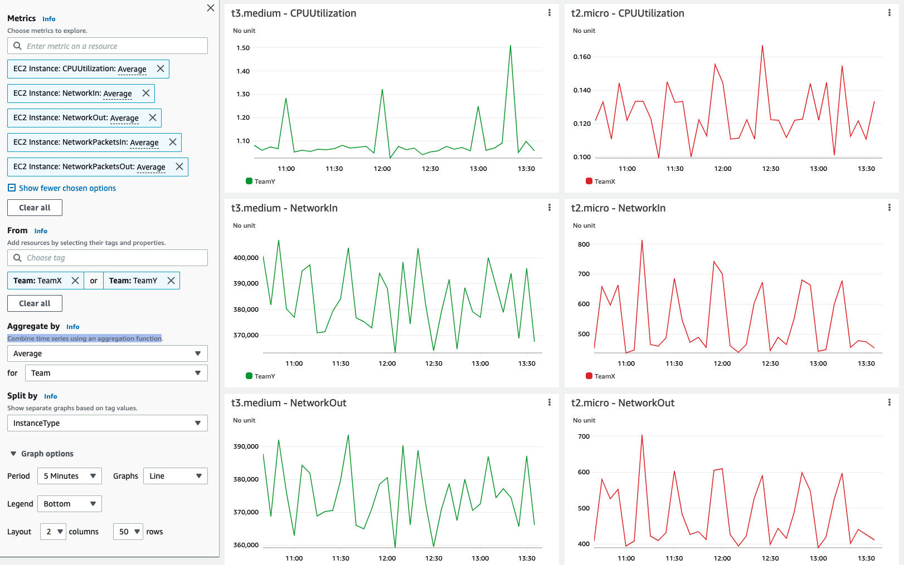

# 使用 Amazon CloudWatch Metrics explorer 按资源标签聚合和可视化 metrics

本文介绍如何使用 Metrics explorer 按资源标签和资源属性筛选、聚合和可视化 metrics - [使用 metrics explorer 按标签和属性监控资源][metrics-explorer]。

使用 Metrics explorer 创建可视化的方式有很多种；本演练中我们直接使用 AWS 控制台。

:::note
    本指南大约需要 5 分钟完成。
:::
## 前提条件

* 有 AWS 账户的访问权限
* 可以通过 AWS 控制台访问 Amazon CloudWatch Metrics explorer
* 相关资源已设置资源标签

## Metrics Explorer 基于标签的查询和可视化

*  打开 CloudWatch 控制台

*  在 <b>Metrics</b> 下，点击 <b>Explorer</b> 菜单

<!--  -->

*  您可以从 <b>Generic templates</b> 或 <b>Service based templates</b> 列表中选择；本示例中我们使用 <b>EC2 Instances by type</b> 模板

<!--  -->

*  选择要查看的 metrics；移除不需要的，添加其他想要查看的 metrics

<!--  -->

*  在 <b>From</b> 下，选择要查找的资源标签或资源属性；在下面的示例中，我们展示了带有 <b>Name: TeamX</b> 标签的不同 EC2 实例的多个 CPU 和网络相关 metrics

<!--

// width="386" height="176" -->

*  请注意，您可以使用 <b>Aggregated by</b> 下的聚合函数合并时间序列；在下面的示例中，<b>TeamX</b> 的 metrics 按 <b>Availability Zone</b> 聚合

<!--  -->

或者，您可以按 <b>Team</b> 标签聚合 <b>TeamX</b> 和 <b>TeamY</b>，或选择任何其他适合您需求的配置

<!--  -->

## 动态可视化
您可以使用 <b>From</b>、<b>Aggregated by</b> 和 <b>Split by</b> 选项轻松自定义结果可视化。Metrics explorer 可视化是动态的，任何新标记的资源都会自动出现在 explorer 小部件中。

## 参考

有关 Metrics explorer 的更多信息，请参阅以下文章：
https://docs.aws.amazon.com/AmazonCloudWatch/latest/monitoring/CloudWatch-Metrics-Explorer.html

[metrics-explorer]: https://docs.aws.amazon.com/AmazonCloudWatch/latest/monitoring/CloudWatch-Metrics-Explorer.html
