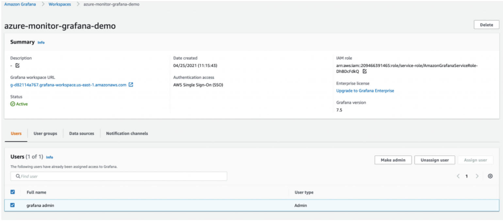
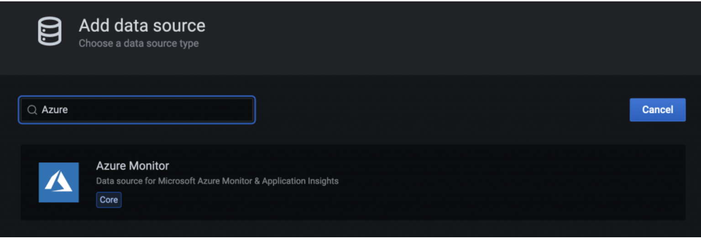

# 使用 Amazon Managed Service for Grafana 监控混合环境

本文介绍如何将 Azure Cloud 环境的 metrics 可视化到 [Amazon Managed Service for Grafana](https://aws.amazon.com/grafana/) (AMG)，并在 AMG 中配置告警通知发送到 [Amazon Simple Notification Service](https://docs.aws.amazon.com/sns/latest/dg/welcome.html) 和 Slack。


作为实施的一部分，我们将创建一个 AMG 工作区，将 Azure Monitor 插件配置为 AMG 的数据源，并配置 Grafana dashboard。我们将创建两个通知渠道：一个用于 Amazon SNS，另一个用于 Slack。我们还将在 AMG dashboard 中配置告警，将通知发送到这些通知渠道。

:::note
    本指南大约需要 30 分钟完成。
:::
## 基础设施
以下部分将设置本方案所需的基础设施。

### 前提条件

* AWS CLI 已在您的环境中[安装](https://docs.aws.amazon.com/cli/latest/userguide/cli-chap-install.html)并[配置](https://docs.aws.amazon.com/cli/latest/userguide/cli-chap-configure.html)。
* 您需要启用 [AWS-SSO](https://docs.aws.amazon.com/singlesignon/latest/userguide/step1.html)

### 架构


首先，创建一个 AMG 工作区来可视化 Azure Monitor 的 metrics。请按照 [Amazon Managed Service for Grafana 入门](https://aws.amazon.com/blogs/mt/amazon-managed-grafana-getting-started/)博客文章中的步骤操作。创建工作区后，您可以将 Grafana 工作区的访问权限分配给单个用户或用户组。默认情况下，用户的类型为查看者。根据用户角色更改用户类型。

:::note 
    您必须为工作区中的至少一个用户分配管理员角色。
:::
在图 1 中，用户名为 grafana-admin，用户类型为 Admin。在 Data sources 选项卡中，选择所需的数据源。查看配置，然后选择 Create workspace。



### 配置数据源和自定义 dashboard

现在，在 Data sources 下配置 Azure Monitor 插件，开始查询和可视化来自 Azure 环境的 metrics。选择 Data sources 以添加数据源。


在 Add data source 中，搜索 Azure Monitor，然后从 Azure 环境的应用注册控制台配置参数。


要配置 Azure Monitor 插件，您需要目录（租户）ID 和应用程序（客户端）ID。有关说明，请参阅关于[创建 Azure AD 应用程序和服务主体](https://docs.microsoft.com/en-us/azure/active-directory/develop/howto-create-service-principal-portal)的文章。它解释了如何注册应用并授予 Grafana 查询数据的访问权限。


配置数据源后，导入自定义 dashboard 以分析 Azure metrics。在左侧面板中，选择 + 图标，然后选择 Import。

在 Import via grafana.com 中，输入 dashboard ID：10532。


这将导入 Azure Virtual Machine dashboard，您可以在其中开始分析 Azure Monitor metrics。在我的设置中，Azure 环境中有一台正在运行的虚拟机。


### 在 AMG 上配置通知渠道

在本节中，您将配置两个通知渠道，然后发送告警。

使用以下命令创建名为 grafana-notification 的 SNS 主题并订阅一个电子邮件地址。

```
aws sns create-topic --name grafana-notification
aws sns subscribe --topic-arn arn:aws:sns:<region>:<account-id>:grafana-notification --protocol email --notification-endpoint <email-id>

```
在左侧面板中，选择铃铛图标以添加新的通知渠道。
现在配置 grafana-notification 通知渠道。在 Edit notification channel 中，Type 选择 AWS SNS。Topic 使用您刚刚创建的 SNS 主题 ARN。Auth Provider 选择 workspace IAM role。


### Slack 通知渠道
要配置 Slack 通知渠道，请创建一个 Slack 工作区或使用现有工作区。按照 [Sending messages using Incoming Webhooks](https://api.slack.com/messaging/webhooks) 中的说明启用 Incoming Webhooks。

配置工作区后，您应该能够获得一个 webhook URL，该 URL 将在 Grafana dashboard 中使用。


### 在 AMG 中配置告警

当 metric 超过阈值时，您可以配置 Grafana 告警。通过 AMG，您可以在 dashboard 中配置告警评估频率并发送通知。在此示例中，为 Azure 虚拟机的 CPU 利用率配置告警。当利用率超过阈值时，配置 AMG 向两个渠道发送通知。

在 dashboard 中，从下拉列表中选择 CPU utilization，然后选择 Edit。在图表面板的 Alert 选项卡中，配置告警规则的评估频率以及触发告警状态变更和通知的条件。

在以下配置中，当 CPU 利用率超过 50% 时创建告警。通知将发送到 grafana-alert-notification 和 slack-alert-notification 渠道。


现在，您可以登录 Azure 虚拟机，使用 stress 等工具进行压力测试。当 CPU 利用率超过阈值时，您将在两个渠道上收到通知。

现在为 CPU 利用率配置合适的阈值告警，以模拟发送到 Slack 渠道的告警。

## 总结

在本方案中，我们展示了如何部署 AMG 工作区、配置通知渠道、从 Azure Cloud 收集 metrics，以及在 AMG dashboard 上配置告警。由于 AMG 是完全托管的无服务器解决方案，您可以将时间专注于业务转型的应用程序，而将管理 Grafana 的繁重工作交给 AWS。
