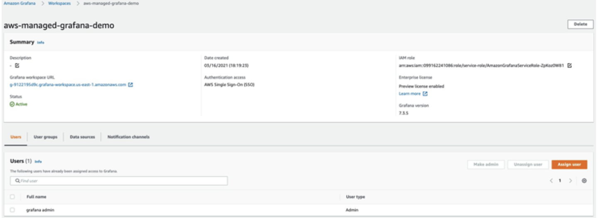
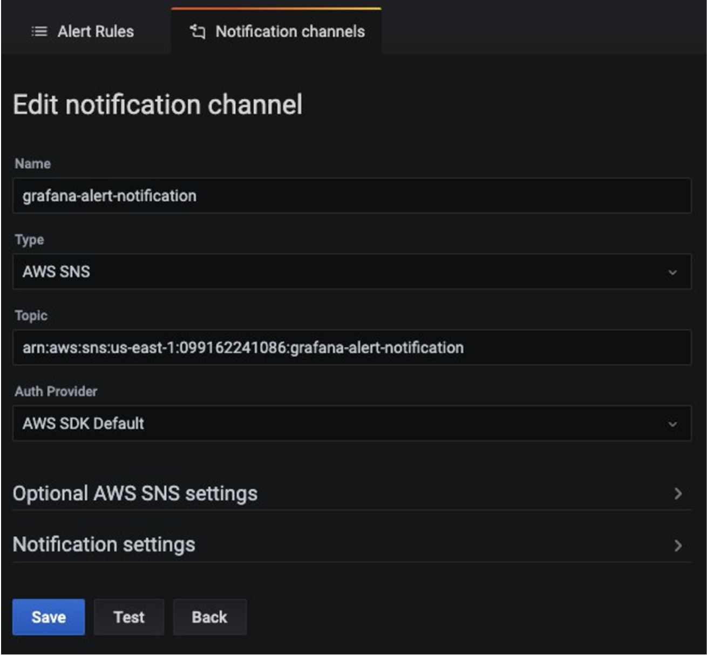

# 使用 Amazon Managed Service for Prometheus 监控 EKS 上配置的 App Mesh 环境

在本方案中，我们将展示如何将 [Amazon Elastic Kubernetes Service](https://aws.amazon.com/eks/) (EKS) 集群中的
[App Mesh](https://docs.aws.amazon.com/app-mesh/) Envoy metrics 导入到
[Amazon Managed Service for Prometheus](https://aws.amazon.com/prometheus/) (AMP)，
并在 [Amazon Managed Grafana](https://aws.amazon.com/grafana/) (AMG)
上创建自定义 dashboard 来监控微服务的健康状况和性能。

在实施过程中，我们将创建 AMP 工作区，安装适用于 Kubernetes 的 App Mesh
Controller 并将 Envoy 容器注入到 pod 中。我们将使用在 EKS 集群中配置的
[Grafana Agent](https://github.com/grafana/agent) 收集 Envoy metrics
并将其写入 AMP。最后，我们将创建 AMG 工作区，将 AMP 配置为数据源并创建自定义 dashboard。

:::note
    本指南大约需要 45 分钟完成。
:::
## 基础设施
在以下章节中，我们将搭建本方案所需的基础设施。

### 架构


Grafana agent 配置为抓取 Envoy metrics 并通过 AMP remote write endpoint 将其导入 AMP。

:::info 
    有关 Prometheus Remote Write Exporter 的更多信息，请查看
    [Getting Started with Prometheus Remote Write Exporter for AMP](https://aws-otel.github.io/docs/getting-started/prometheus-remote-write-exporter)。
:::

### 前提条件

* 在您的环境中已[安装](https://docs.aws.amazon.com/cli/latest/userguide/cli-chap-install.html)并[配置](https://docs.aws.amazon.com/cli/latest/userguide/cli-chap-configure.html)了 AWS CLI。
* 您需要在环境中安装 [eksctl](https://docs.aws.amazon.com/eks/latest/userguide/eksctl.html) 命令。
* 您需要在环境中安装 [kubectl](https://docs.aws.amazon.com/eks/latest/userguide/install-kubectl.html)。
* 您的环境中已安装 [Docker](https://docs.docker.com/get-docker/)。
* 您需要在 AWS 账户中配置 AMP 工作区。
* 您需要安装 [Helm](https://www.eksworkshop.com/beginner/060_helm/helm_intro/install/index.html)。
* 您需要启用 [AWS-SSO](https://docs.aws.amazon.com/singlesignon/latest/userguide/step1.html)。

### 设置 EKS 集群

首先，创建一个启用 App Mesh 的 EKS 集群来运行示例应用程序。
将使用 `eksctl` CLI 通过 [eks-cluster-config.yaml](./servicemesh-monitoring-ampamg/eks-cluster-config.yaml) 部署集群。
此模板将创建一个新的 EKS 集群。

编辑模板文件，将区域设置为 AMP 可用的区域之一：

* `us-east-1`
* `us-east-2`
* `us-west-2`
* `eu-central-1`
* `eu-west-1`

确保在会话中覆盖此区域，例如在 Bash shell 中：

```
export AWS_REGION=eu-west-1
```

使用以下命令创建集群：

```
eksctl create cluster -f eks-cluster-config.yaml
```
这将创建一个名为 `AMP-EKS-CLUSTER` 的 EKS 集群和一个名为
`appmesh-controller` 的服务账户，该账户将由 EKS 的 App Mesh controller 使用。

### 安装 App Mesh Controller

接下来，我们将运行以下命令来安装 [App Mesh Controller](https://docs.aws.amazon.com/app-mesh/latest/userguide/getting-started-kubernetes.html)
并配置自定义资源定义（CRDs）：

```
helm repo add eks https://aws.github.io/eks-charts
```

```
helm upgrade -i appmesh-controller eks/appmesh-controller \
     --namespace appmesh-system \
     --set region=${AWS_REGION} \
     --set serviceAccount.create=false \
     --set serviceAccount.name=appmesh-controller
```

### 设置 AMP
AMP 工作区用于导入从 Envoy 收集的 Prometheus metrics。
工作区是专用于租户的逻辑 Cortex 服务器。工作区支持
细粒度的访问控制，用于授权其管理操作（如更新、列出、
描述和删除）以及 metrics 的导入和查询。

使用 AWS CLI 创建工作区：

```
aws amp create-workspace --alias AMP-APPMESH --region $AWS_REGION
```

添加必要的 Helm 仓库：

```
helm repo add prometheus-community https://prometheus-community.github.io/helm-charts && \
helm repo add kube-state-metrics https://kubernetes.github.io/kube-state-metrics 
```

有关 AMP 的更多详情，请查看 [AMP 入门指南](https://docs.aws.amazon.com/prometheus/latest/userguide/AMP-getting-started.html)。

### 抓取和导入 metrics

AMP 不会直接从 Kubernetes 集群中的容器化工作负载抓取运行 metrics。
您必须部署和管理 Prometheus 服务器或 OpenTelemetry agent（如
[AWS Distro for OpenTelemetry Collector](https://github.com/aws-observability/aws-otel-collector)
或 Grafana Agent）来执行此任务。在本方案中，我们将引导您完成
配置 Grafana Agent 以抓取 Envoy metrics 并使用 AMP 和 AMG 进行分析的过程。

#### 配置 Grafana Agent

Grafana Agent 是运行完整 Prometheus 服务器的轻量级替代方案。
它保留了发现和抓取 Prometheus exporters 以及
将 metrics 发送到 Prometheus 兼容后端所需的部分。Grafana Agent 还包含
对 AWS Signature Version 4 (Sigv4) 的原生支持，用于 AWS Identity and Access Management (IAM)
认证。

我们现在将引导您完成配置 IAM 角色以将 Prometheus metrics 发送到 AMP 的步骤。
我们在 EKS 集群上安装 Grafana Agent 并将 metrics 转发到 AMP。

#### 配置权限
Grafana Agent 从 EKS 集群中运行的容器化工作负载抓取运行 metrics，
并将其发送到 AMP。发送到 AMP 的数据必须使用有效的 AWS 凭证
通过 Sigv4 签名，以对托管服务的每个客户端请求进行身份验证和授权。

Grafana Agent 可以部署到 EKS 集群，在 Kubernetes 服务账户的身份下运行。
通过服务账户的 IAM 角色（IRSA），您可以将 IAM 角色与 Kubernetes 服务账户关联，
从而为使用该服务账户的任何 pod 提供 IAM 权限。

按如下方式准备 IRSA 设置：

```
kubectl create namespace grafana-agent

export WORKSPACE=$(aws amp list-workspaces | jq -r '.workspaces[] | select(.alias=="AMP-APPMESH").workspaceId')
export ROLE_ARN=$(aws iam get-role --role-name EKS-GrafanaAgent-AMP-ServiceAccount-Role --query Role.Arn --output text)
export NAMESPACE="grafana-agent"
export REMOTE_WRITE_URL="https://aps-workspaces.$AWS_REGION.amazonaws.com/workspaces/$WORKSPACE/api/v1/remote_write"
```

您可以使用 [gca-permissions.sh](./servicemesh-monitoring-ampamg/gca-permissions.sh)
shell 脚本来自动化以下步骤（注意将占位符变量
`YOUR_EKS_CLUSTER_NAME` 替换为您的 EKS 集群名称）：

* 创建名为 `EKS-GrafanaAgent-AMP-ServiceAccount-Role` 的 IAM 角色，该角色具有远程写入 AMP 工作区权限的 IAM 策略。
* 在 `grafana-agent` 命名空间下创建名为 `grafana-agent` 的 Kubernetes 服务账户，并将其与 IAM 角色关联。
* 在 IAM 角色和 Amazon EKS 集群中托管的 OIDC 提供商之间建立信任关系。

您需要 `kubectl` 和 `eksctl` CLI 工具来运行 `gca-permissions.sh` 脚本。
它们必须配置为可访问您的 Amazon EKS 集群。

现在创建一个 manifest 文件 [grafana-agent.yaml](./servicemesh-monitoring-ampamg/grafana-agent.yaml)，
其中包含用于提取 Envoy metrics 的抓取配置，并部署 Grafana Agent。

:::note
    在撰写本文时，由于 Fargate 不支持 daemon sets，
    此解决方案不适用于 EKS on Fargate。
:::
该示例部署了一个名为 `grafana-agent` 的 daemon set 和一个名为
`grafana-agent-deployment` 的 deployment。`grafana-agent` daemon set
从集群上的 pod 收集 metrics，`grafana-agent-deployment` deployment
从不在集群上的服务（如 EKS 控制平面）收集 metrics。

```
kubectl apply -f grafana-agent.yaml
```
`grafana-agent` 部署后，它将收集 metrics 并将其导入到
指定的 AMP 工作区。现在在 EKS 集群上部署示例应用程序并开始分析 metrics。

## 示例应用程序

要安装应用程序并注入 Envoy 容器，我们使用适用于 Kubernetes 的 AppMesh controller。

首先，通过克隆示例仓库来安装基础应用程序：

```
git clone https://github.com/aws/aws-app-mesh-examples.git
```

然后将资源应用到您的集群：

```
kubectl apply -f aws-app-mesh-examples/examples/apps/djapp/1_base_application
```

检查 pod 状态并确保其正在运行：

```
$ kubectl -n prod get all

NAME                            READY   STATUS    RESTARTS   AGE
pod/dj-cb77484d7-gx9vk          1/1     Running   0          6m8s
pod/jazz-v1-6b6b6dd4fc-xxj9s    1/1     Running   0          6m8s
pod/metal-v1-584b9ccd88-kj7kf   1/1     Running   0          6m8s
```

接下来，安装 App Mesh controller 并对 deployment 进行 mesh 化：

```
kubectl apply -f aws-app-mesh-examples/examples/apps/djapp/2_meshed_application/
kubectl rollout restart deployment -n prod dj jazz-v1 metal-v1
```

现在我们应该看到每个 pod 中有两个容器在运行：

```
$ kubectl -n prod get all
NAME                        READY   STATUS    RESTARTS   AGE
dj-7948b69dff-z6djf         2/2     Running   0          57s
jazz-v1-7cdc4fc4fc-wzc5d    2/2     Running   0          57s
metal-v1-7f499bb988-qtx7k   2/2     Running   0          57s
```

生成 5 分钟的流量，稍后我们将在 AMG 中进行可视化：

```
dj_pod=`kubectl get pod -n prod --no-headers -l app=dj -o jsonpath='{.items[*].metadata.name}'`

loop_counter=0
while [ $loop_counter -le 300 ] ; do \
kubectl exec -n prod -it $dj_pod  -c dj \
-- curl jazz.prod.svc.cluster.local:9080 ; echo ; loop_counter=$[$loop_counter+1] ; \
done
```

### 创建 AMG 工作区

要创建 AMG 工作区，请按照 [AMG 入门](https://aws.amazon.com/blogs/mt/amazon-managed-grafana-getting-started/)博客文章中的步骤操作。
要授予用户对 dashboard 的访问权限，您必须启用 AWS SSO。创建工作区后，您可以将 Grafana 工作区的访问权限分配给单个用户或用户组。
默认情况下，用户的类型为 viewer。根据用户角色更改用户类型。将 AMP 工作区添加为数据源，然后开始创建 dashboard。

在本示例中，用户名为 `grafana-admin`，用户类型为 `Admin`。
选择所需的数据源。检查配置，然后选择 `Create workspace`。



### 配置 AMG 数据源
要将 AMP 配置为 AMG 中的数据源，在 `Data sources` 部分选择
`Configure in Grafana`，这将在浏览器中启动 Grafana 工作区。
您也可以在浏览器中手动启动 Grafana 工作区 URL。


从截图中可以看到，您可以查看 Envoy metrics，如下游延迟、
连接数、响应码等。您可以使用显示的过滤器深入了解特定应用程序的 envoy metrics。

### 配置 AMG dashboard

配置数据源后，导入自定义 dashboard 来分析 Envoy metrics。
为此我们使用预定义的 dashboard，选择 `Import`（如下所示），
然后输入 ID `11022`。这将导入 Envoy Global dashboard，以便您可以
开始分析 Envoy metrics。


### 在 AMG 上配置告警
您可以在 metric 超过预期阈值时配置 Grafana 告警。
使用 AMG，您可以在 dashboard 中配置告警评估的频率并发送通知。
在创建告警规则之前，您必须创建通知渠道。

在本示例中，将 Amazon SNS 配置为通知渠道。如果使用默认设置（即
[服务管理的权限](https://docs.aws.amazon.com/grafana/latest/userguide/AMG-manage-permissions.html#AMG-service-managed-account)），
SNS 主题必须以 `grafana` 为前缀，通知才能成功发布到该主题。

使用以下命令创建名为 `grafana-notification` 的 SNS 主题：

```
aws sns create-topic --name grafana-notification
```

并通过电子邮件地址订阅该主题。确保在以下命令中指定区域和账户 ID：

```
aws sns subscribe \
    --topic-arn arn:aws:sns:<region>:<account-id>:grafana-notification \
	--protocol email \
	--notification-endpoint <email-id>
```

现在，从 Grafana dashboard 添加新的通知渠道。
配置名为 grafana-notification 的新通知渠道。对于 Type，
从下拉菜单中选择 AWS SNS。对于 Topic，使用您刚创建的 SNS 主题的 ARN。
对于 Auth provider，选择 AWS SDK Default。



现在配置一个告警，当下游延迟在一分钟内超过五毫秒时触发。
在 dashboard 中，从下拉菜单选择 Downstream latency，然后选择 Edit。
在图表面板的 Alert 选项卡上，配置告警规则的评估频率
以及告警必须满足的条件以更改状态并启动通知。

在以下配置中，当下游延迟超过阈值时会创建告警，
通知将通过配置的 grafana-alert-notification 渠道发送到 SNS 主题。


## 清理

1. 删除资源和集群：
```
kubectl delete all --all
eksctl delete cluster --name AMP-EKS-CLUSTER
```
2. 删除 AMP 工作区：
```
aws amp delete-workspace --workspace-id `aws amp list-workspaces --alias prometheus-sample-app --query 'workspaces[0].workspaceId' --output text`
```
3. 删除 amp-iamproxy-ingest-role IAM 角色：
```
aws delete-role --role-name amp-iamproxy-ingest-role
```
4. 通过控制台删除 AMG 工作区。
