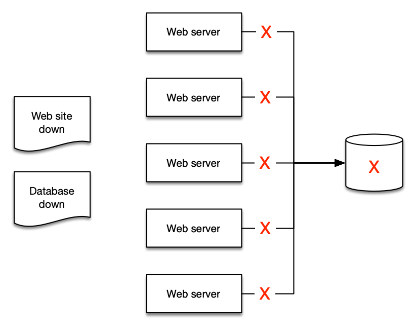

# 告警

告警是指探针、监控或值超过或低于给定阈值时的状态变化。一个简单的例子是当磁盘满了或网站宕机时发送电子邮件的告警。更复杂的告警完全是编程式的，用于驱动复杂的交互，如自动扩缩或创建整个服务器集群。

无论使用场景如何，告警表示 metric 的当前*状态*。此状态可以是 `OK`、`WARNING`、`ALERT` 或 `NO DATA`，具体取决于所讨论的系统。

告警在一段时间内反映此状态，并建立在时间序列之上。因此，它们是*从*时间序列派生的。下图显示了两个告警：一个具有警告阈值，另一个表示此时间序列的平均值。如图所示的流量变化，当值低于定义值时，警告阈值的告警应处于违规状态。


:::info
	告警的目的可以是触发操作（人工或编程式的），也可以是信息性的（表示阈值被突破）。告警提供对 metric 性能的洞察。
:::
## 对可操作的事项进行告警

告警疲劳是指人们收到太多警报以至于学会忽略它们。这不表示系统监控良好！相反，这是一种反模式。

:::info
	为可操作的事项创建告警，您应该始终从您的[目标](../guides/index.md#monitor-what-matters)反向工作。
:::

例如，如果您运营一个需要快速响应时间的网站，当您的响应时间超过给定阈值时创建告警。如果您已确定性能不佳与高 CPU 利用率相关，那么在此数据点成为问题*之前*就要*主动*告警。但是，如果高 CPU 利用率不会*危及您的成果*，则可能没有必要对环境中*所有地方*的所有 CPU 利用率进行告警。

:::info
	如果告警不需要通知您或触发自动化流程，则无需让它通知您。您应该移除多余告警的通知。
:::

## 警惕"一切正常告警"

同样，一种常见模式是"一切正常"告警，即运维人员非常习惯于收到持续的警报，以至于他们只在突然安静时才注意到！这是一种非常危险的运营模式，也是一种与卓越运营背道而驰的模式。

:::warning
	"一切正常告警"通常需要人类来解释它！这使得自愈应用程序等模式变得不可能。[^1]
:::
## 通过聚合对抗告警疲劳

Observability 是一个*人的*问题，而不是技术问题。因此，您的告警策略应该专注于减少告警而不是创建更多。随着您实施遥测收集，从环境中获得更多告警是自然的。但要谨慎，只[对可操作的事项进行告警](#对可操作的事项进行告警)。如果导致告警的条件不可操作，则无需报告它。

通过示例可以最好地说明这一点：如果您有五台 Web 服务器使用单个数据库作为后端，当数据库宕机时，您的 Web 服务器会发生什么？很多人的答案是他们会收到*至少六个*告警——Web 服务器*五个*加上数据库*一个*！


但只有两个告警是有意义的：

1. 网站宕机了，以及
1. 数据库是原因



:::info
	将告警提炼为聚合使人们更容易理解，也更容易创建运维手册和自动化。
:::
## 使用现有的 ITSM 和支持流程

无论您的监控和 observability 平台是什么，它们都必须集成到您当前的工具链中。

:::info
	使用从告警到这些工具的编程式集成来创建故障工单和问题，消除人工操作并简化流程。
:::
这使您能够获得重要的运营数据，如 [DORA metrics](https://en.wikipedia.org/wiki/DevOps)。

## 按计划启用告警操作

告警为 AWS 资源提供了重要的监控能力，使团队能够跟踪 metrics 并在阈值被突破时接收通知。虽然这种监控对于保持运营意识至关重要，但当组织实施涉及定时资源关闭的成本优化策略时，会出现一个常见挑战。在这种特定场景中，生产资源被配置为在非工作时间（周一至周五的下午 6 点到上午 6 点以及周末）自动关闭。然而，CloudWatch Alarms 在这些计划停机期间继续监控和触发通知，导致在资源故意离线时产生不必要的告警。可以实施一个利用 EventBridge Schedules 和 Lambda 函数的解决方案，根据标签以编程方式启用和禁用告警，使其与资源调度保持一致，确保在工作时间进行有效监控，同时消除计划停机期间的误报。

### 架构


### 部署

克隆仓库：
```
git clone https://github.com/aws-observability/observability-best-practices.git
```

找到 CloudFormation 模板：
```
cd observability-best-practices/sandbox/cw-alarm-scheduler
```

CloudFormation 模板是该目录中的 'cf.yaml'。

导航到 CloudFormation 控制台并从该模板创建一个堆栈：

1. 指定堆栈详情：
    1. 提供堆栈名称：
        1. Stack name: $STACK-NAME
    2. 参数：
        1. DisableAlarmsCronSchedule：（输入 cron 表达式定义何时禁用告警）
            1. 默认值 cron(00 18 ? * 1-5 *)
        2. EnableAlarmsCronSchedule：（输入 cron 表达式定义何时启用告警）
            1. 默认值 cron(00 06 ? * 1-5 *)
        3. LambdaArchitecture：选择 Lambda 函数架构（x86_64 或 arm64）
            1. 默认值 arm64
        4. ScheduleTimezone：从下拉列表中选择时区
            1. 默认值 America/New_York
        5. SuppressTagKey：用于过滤 CloudWatch Alarms 的标签键（如 'suppress' 或 'snooze'）
            1. 默认值 "suppress"
        6. SuppressTagValue：用于过滤 CloudWatch Alarms 的标签值（如 'true'）
            1. 默认值 "true"
    3. Next

这将使带有您在 CloudFormation 参数中选择的键值标签的告警遵循您选择的 Cron 计划。

例如：

如果您选择 'suppress' 作为 SuppressTagKey，'true' 作为 SuppressTagValue，那么所有带有 'suppress':'true' 标签的告警将遵循您在 DisableAlarmsCronSchedule 和 EnableAlarmsCronSchedule 中设置的计划。

:::info
行为：
当告警被禁用时：
* 不会生成任何告警或通知
* Metric 收集继续不间断

当告警被重新启用时：
* 正常的告警功能将在不久后恢复
:::

[^1]: 请参阅 https://aws.amazon.com/blogs/apn/building-self-healing-infrastructure-as-code-with-dynatrace-aws-lambda-and-aws-service-catalog/ 了解更多关于此模式的信息。
