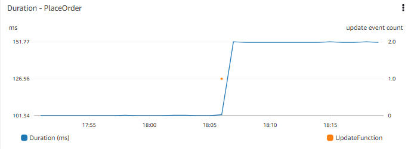

# 事件

## 事件是什么意思？
如今许多架构都是事件驱动的。在事件驱动架构中，事件是来自不同系统的信号，我们捕获并传递给其他系统。事件通常是状态的变化或更新。

例如，在电子商务系统中，当商品被添加到购物车时，您可能会产生一个事件。此事件可以被捕获并传递给系统的购物车部分，以更新购物车中的商品数量和成本以及商品详情。

:::info
	对于某些客户来说，事件可能是一个*里程碑*，例如购买的完成。将工作流结论的聚合时刻视为事件是有道理的，但就我们的目的而言，我们不将里程碑本身视为事件。
:::
## 为什么事件有用？
事件在您的可观测性解决方案中有两种主要有用的方式。一种是在其他数据的上下文中可视化事件，另一种是使您能够根据事件采取行动。

:::info
	事件旨在为人员或机器提供有关工作负载中变化和操作的有价值信息。
:::

## 可视化事件
有许多事件信号并非直接来自您的应用程序，但可能对应用程序性能产生影响，或为根因分析提供额外洞察。Dashboard 是可视化事件最常见的机制，尽管某些分析或商业智能工具也适用于此场景。甚至电子邮件或即时通讯应用程序也可以轻松接收可视化内容。

考虑应用程序性能的时间图表，例如在 Web 前端上下订单的时间。时间图表让您看到几天前响应时间发生了阶跃变化。了解最近是否有任何部署可能会很有用。考虑能否看到最近部署的时间图表在旁边或叠加在同一图表上？

:::tip
	考虑哪些事件可能有助于您理解更广泛的上下文。对您重要的事件可能包括代码部署、基础设施变更事件、添加新数据（如发布新的待售商品或批量添加新用户）或修改或添加功能（如更改人们将商品添加到购物车的方式）。
:::

:::info
	将事件与其他重要的 metric 数据一起可视化，以便您可以[关联事件](./metrics.md#correlate-with-operational-metric-data)。
:::

## 对事件采取行动
在可观测性领域，触发的告警是一个常见事件。此事件可能包含告警标识符、告警状态（如 `IN ALARM` 或 `OK`）以及触发原因的详情。在许多情况下，此告警事件将被检测到并发送电子邮件通知。这是对告警采取行动的一个示例。

告警通知在可观测性中至关重要。这是我们让正确的人知道存在问题的方式。然而，当事件操作在您的可观测性解决方案中成熟时，它可以在无需人工干预的情况下自动修复问题。

### 但应该采取什么行动？
如果不先了解什么行动可以缓解检测到的问题，我们就无法自动化操作。在您可观测性旅程的开始，这通常可能不太明显。然而，修复问题的经验越多，您就越能微调告警以捕获有已知操作的领域。您使用的告警服务中可能有内置操作，或者您可能需要自己捕获告警事件并编写解决方案脚本。

:::info
	自动扩缩系统，如 [horizontal pod autoscaling](https://kubernetes.io/docs/tasks/run-application/horizontal-pod-autoscale/)，只是此原则的一个实现。Kubernetes 只是为您抽象了这种自动化。
:::
获取告警频率和解决数据将帮助您决定是否有自动化的可能性。虽然基于问题症状的更广泛范围的告警在捕获问题方面很有效，但您可能发现需要更具体的条件来链接到自动修复。

当您这样做时，考虑将其与事件管理/工单/ITSM 工具集成。许多组织跟踪事件及相关的解决方案和 metrics，如平均修复时间 (MTTR)。如果您这样做，也考虑以类似方式捕获您的*自动化*解决方案。这让您了解自动修复的问题类型和比例，同时也允许您寻找潜在的模式和问题。

:::tip
	仅仅因为不需要有人手动修复问题，并不意味着您不应该查看根本原因。
:::
例如，考虑每次服务器变得无响应时重启它。重启使系统继续运行，但是什么导致了无响应。这种情况发生的频率，以及是否有模式（例如与报告生成、高用户量或系统备份匹配），将决定您投入到理解和修复根本原因中的优先级和资源。
:::info
	考虑将与您的[关键绩效指标](./metrics.md#know-your-key-performance-indicatorskpis-and-measure-them)相关的*每个*事件传递到消息总线中以供消费。请注意，某些可观测性解决方案无需显式配置即可透明地做到这一点。
:::
## 将事件导入您的可观测性平台
一旦您确定了对您重要的事件，就需要考虑如何最好地将它们导入您的可观测性平台。
您的平台可能有特定的方式来捕获事件，或者您可能必须将它们作为 logs 或 metric 数据导入。

:::note
	一种简单的方法是将事件写入 log 文件并以与其他 log 事件相同的方式摄取它们。
:::

探索您的系统如何让您可视化这些内容。您能否识别与应用程序相关的事件？您能否将数据组合到单个图表中？即使没有特定功能，您至少应该能够在其他数据旁边创建时间图表进行视觉关联。保持时间轴相同，并考虑将它们垂直堆叠以便于比较。

