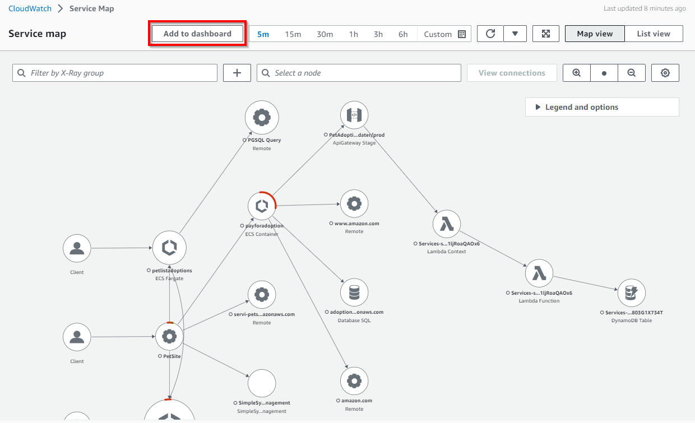
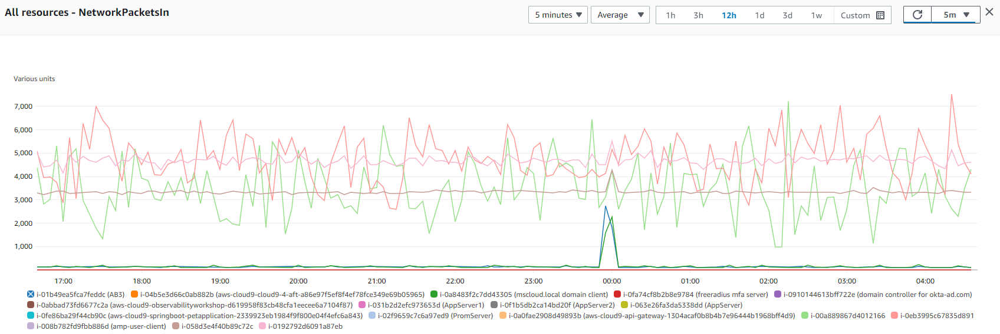
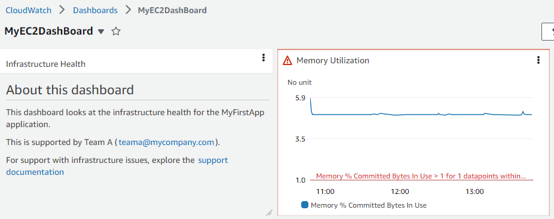

# CloudWatch Dashboard

## 简介

了解 AWS 账户中资源的清单详情、资源性能和健康检查对于稳定的资源管理非常重要。Amazon CloudWatch dashboards 是 CloudWatch 控制台中可自定义的主页，可用于在单个视图中监控您的资源，即使这些资源跨账户或分布在不同区域。

[Amazon CloudWatch dashboards](https://docs.aws.amazon.com/AmazonCloudWatch/latest/monitoring/CloudWatch_Dashboards.html) 使客户能够创建可复用的图表并在统一视图中可视化云资源和应用程序。通过 CloudWatch dashboards，客户可以将 metrics 和 logs 数据并排显示在统一视图中，以快速获取上下文并从诊断问题过渡到了解根本原因，从而减少平均恢复或解决时间 (MTTR)。例如，客户可以可视化 CPU 利用率和内存等关键 metrics 的当前利用率，并将它们与分配的容量进行比较。客户还可以关联特定 metric 的日志模式，并设置告警以提醒性能和运营问题。CloudWatch dashboard 还帮助客户显示告警的当前状态，以便快速可视化并引起注意采取行动。CloudWatch dashboards 的共享允许客户轻松地将显示的 dashboard 信息分享给组织内部或外部的团队和利益相关者。

## 小部件

#### 默认小部件

小部件构成 CloudWatch dashboards 的基本组件，在 AWS 环境中显示资源和应用程序 metrics 及 logs 的重要信息和近实时详情。客户可以通过根据需要添加、删除、重新排列或调整小部件大小来将 dashboards 自定义为所需体验。

您可以添加到 dashboard 的图表类型包括折线图、数字、仪表盘、堆叠面积图、柱状图和饼图。

默认小部件类型有**折线图、数字、仪表盘、堆叠面积图、柱状图、饼图**，属于**图表**类型，以及**文本、告警状态、Logs 表、Explorer** 等其他小部件也可供客户选择，用于添加 Metrics 或 Logs 数据来构建 dashboards。


**其他参考资料：**

- AWS Observability Workshop 中的 [Metric Number 小部件](https://catalog.workshops.aws/observability/en-US/aws-native/dashboards/metrics-number)
- AWS Observability Workshop 中的[文本小部件](https://catalog.workshops.aws/observability/en-US/aws-native/dashboards/text-widget)
- AWS Observability Workshop 中的[告警小部件](https://catalog.workshops.aws/observability/en-US/aws-native/dashboards/alarm-widgets)
- [在 CloudWatch dashboards 上创建和使用小部件](https://docs.aws.amazon.com/AmazonCloudWatch/latest/monitoring/create-and-work-with-widgets.html)的文档

#### 自定义小部件

客户还可以选择在 CloudWatch dashboards 中[添加自定义小部件](https://docs.aws.amazon.com/AmazonCloudWatch/latest/monitoring/create-and-work-with-widgets.html)，以体验自定义可视化、显示来自多个来源的信息或添加自定义控件（如按钮）直接在 CloudWatch Dashboard 中执行操作。自定义小部件完全无服务器，由 Lambda 函数提供支持，可以完全控制内容、布局和交互。自定义小部件是在 dashboard 上构建自定义数据视图或工具的简便方法，不需要学习复杂的 Web 框架。如果您可以在 Lambda 中编写代码并创建 HTML，那么您就可以创建有用的自定义小部件。


**其他参考资料：**

- AWS Observability Workshop 中的[自定义小部件](https://catalog.workshops.aws/observability/en-US/aws-native/dashboards/custom-widgets)
- GitHub 上的 [CloudWatch 自定义小部件示例](https://github.com/aws-samples/cloudwatch-custom-widgets-samples#what-are-custom-widgets)
- 博客：[使用 Amazon CloudWatch dashboards 自定义小部件](https://aws.amazon.com/blogs/mt/introducing-amazon-cloudwatch-dashboards-custom-widgets/)

## 自动 Dashboards

自动 Dashboards 在所有 AWS 公共区域可用，提供所有 AWS 资源在 Amazon CloudWatch 下的健康和性能的汇总视图。这帮助客户快速开始监控、基于资源的 metrics 和告警视图，并轻松深入了解性能问题的根本原因。自动 Dashboards 根据 AWS 服务推荐的[最佳实践](https://docs.aws.amazon.com/prescriptive-guidance/latest/implementing-logging-monitoring-cloudwatch/cloudwatch-dashboards-visualizations.html)预先构建，保持资源感知，并动态更新以反映重要性能 metrics 的最新状态。自动服务 dashboards 显示服务的所有标准 CloudWatch metrics，为每个服务 metric 绘制所有使用的资源，帮助客户快速识别跨账户的异常资源，有助于识别高或低利用率的资源，从而帮助优化成本。


**其他参考资料：**

- AWS Observability Workshop 中的[自动 dashboards](https://catalog.workshops.aws/observability/en-US/aws-native/dashboards/autogen-dashboard)
- YouTube 上的[使用 Amazon CloudWatch Dashboards 监控 AWS 资源](https://www.youtube.com/watch?v=I7EFLChc07M)

#### 自动 dashboards 中的 Container Insights

[CloudWatch Container Insights](https://docs.aws.amazon.com/AmazonCloudWatch/latest/monitoring/ContainerInsights.html) 收集、聚合和汇总来自容器化应用程序和微服务的 metrics 和 logs。Container Insights 适用于 Amazon Elastic Container Service (Amazon ECS)、Amazon Elastic Kubernetes Service (Amazon EKS) 和 Amazon EC2 上的 Kubernetes 平台。Container Insights 支持从部署在 Fargate 上的 Amazon ECS 和 Amazon EKS 集群收集 metrics。CloudWatch 自动收集许多资源的 metrics，如 CPU、内存、磁盘和网络，还提供容器重启失败等诊断信息，以帮助隔离问题并快速解决。

CloudWatch 使用[嵌入式 metric 格式](https://aws-observability.github.io/observability-best-practices/guides/signal-collection/emf/)在 cluster、node、pod、task 和 service 级别创建聚合 metrics 作为 CloudWatch metrics，这是使用结构化 JSON schema 的性能日志事件，能够大规模摄取和存储高基数数据。Container Insights 收集的 metrics 可在 [CloudWatch 自动 dashboards](https://docs.aws.amazon.com/prescriptive-guidance/latest/implementing-logging-monitoring-cloudwatch/cloudwatch-dashboards-visualizations.html) 中使用，也可在 CloudWatch 控制台的 Metrics 部分查看。


#### 自动 dashboards 中的 Lambda Insights

[CloudWatch Lambda Insights](https://docs.aws.amazon.com/lambda/latest/dg/monitoring-insights.html) 是一种用于无服务器应用程序（如 AWS Lambda）的监控和故障排除解决方案，它为 Lambda 函数创建动态的[自动 dashboards](https://docs.aws.amazon.com/prescriptive-guidance/latest/implementing-logging-monitoring-cloudwatch/cloudwatch-dashboards-visualizations.html#use-automatic-dashboards)。它还收集、聚合和汇总系统级 metrics，包括 CPU 时间、内存、磁盘和网络以及冷启动和 Lambda worker 关闭等诊断信息，以帮助隔离和快速解决 Lambda 函数的问题。[Lambda Insights](https://docs.aws.amazon.com/AmazonCloudWatch/latest/monitoring/Lambda-Insights.html) 是作为函数级别的层提供的 Lambda 扩展，启用后使用[嵌入式 metric 格式](https://aws-observability.github.io/observability-best-practices/guides/signal-collection/emf/)从日志事件中提取 metrics，不需要任何 agent。


## 自定义 Dashboards

客户还可以根据需要创建[自定义 Dashboards](https://docs.aws.amazon.com/AmazonCloudWatch/latest/monitoring/create_dashboard.html)，使用不同的小部件并进行相应自定义。Dashboards 可以配置为跨区域和跨账户视图，并可以添加到收藏夹列表中。


客户可以将自动或自定义 dashboards 添加到 CloudWatch 控制台中的[收藏夹列表](https://docs.aws.amazon.com/AmazonCloudWatch/latest/monitoring/add-dashboard-to-favorites.html)，以便从控制台页面的导航窗格中快速方便地访问。

**其他参考资料：**

- AWS Observability Workshop 中的 [CloudWatch dashboard](https://catalog.workshops.aws/observability/en-US/aws-native/dashboards/create)
- AWS Well-Architected Labs 中的性能效率——[使用 CloudWatch Dashboards 进行监控](https://www.wellarchitectedlabs.com/performance-efficiency/100_labs/100_monitoring_windows_ec2_cloudwatch/)

#### 将 Contributor Insights 添加到 CloudWatch dashboards

CloudWatch 提供 [Contributor Insights](https://docs.aws.amazon.com/AmazonCloudWatch/latest/monitoring/ContributorInsights.html) 来分析日志数据并创建显示贡献者数据的时间序列，您可以在其中查看关于前 N 个贡献者、唯一贡献者总数及其使用情况的 metrics。这帮助您找到主要流量来源并了解谁或什么在影响系统性能。例如，客户可以找到有问题的主机、识别最大的网络用户或找到生成最多错误的 URL。

Contributor Insights 报告可以添加到 CloudWatch 控制台中的任何[新的或现有 Dashboards](https://docs.aws.amazon.com/AmazonCloudWatch/latest/monitoring/ContributorInsights-ViewReports.html)。


#### 将 Application Insights 添加到 CloudWatch dashboards

[CloudWatch Application Insights](https://docs.aws.amazon.com/AmazonCloudWatch/latest/monitoring/cloudwatch-application-insights.html) 为托管在 AWS 上的应用程序及其底层 AWS 资源提供 observability 支持，增强了应用程序健康状况的可见性，有助于减少平均修复时间 (MTTR) 以排除应用程序问题。Application Insights 提供自动化 dashboards，显示被监控应用程序的潜在问题，帮助客户快速隔离正在进行的应用程序和基础设施问题。

如下所示，Application Insights 中的"导出到 CloudWatch"选项在 CloudWatch 控制台中添加了一个 dashboard，帮助客户轻松监控其关键应用程序的洞察。


#### 将 Service Map 添加到 CloudWatch dashboards

[CloudWatch ServiceLens](https://docs.aws.amazon.com/AmazonCloudWatch/latest/monitoring/ServiceLens.html) 通过将 traces、metrics、logs、告警和其他资源健康信息集成在一个地方来增强服务和应用程序的 observability。ServiceLens 将 CloudWatch 与 AWS X-Ray 集成，提供应用程序的端到端视图，帮助客户更有效地定位性能瓶颈和识别受影响的用户。[Service map](https://docs.aws.amazon.com/AmazonCloudWatch/latest/monitoring/servicelens_service_map.html) 将服务端点和资源显示为节点，并突出显示每个节点及其连接的流量、延迟和错误。每个显示的节点提供关于与该服务部分相关联的 metrics、logs 和 traces 的详细洞察。

如下所示，Service Map 中的"添加到 dashboard"选项将新 dashboard 或添加到 CloudWatch 控制台中的现有 dashboard，帮助客户轻松追踪其应用程序以获取洞察。



#### 将 Metrics Explorer 添加到 CloudWatch dashboards

CloudWatch 中的 [Metrics explorer](https://docs.aws.amazon.com/AmazonCloudWatch/latest/monitoring/CloudWatch-Metrics-Explorer.html) 是一个基于标签的工具，使客户能够按标签和资源属性过滤、聚合和可视化 metrics，以增强 AWS 服务的 observability。Metrics explorer 提供灵活的动态故障排除体验，客户可以一次创建多个图表并使用这些图表构建应用程序健康 dashboards。Metrics explorer 可视化是动态的，因此如果在您创建 metrics explorer 小部件并将其添加到 CloudWatch dashboard 之后创建了匹配的资源，新资源将自动出现在 explorer 小部件中。

如下所示，Metrics Explorer 中的"[添加到 dashboard](https://docs.aws.amazon.com/AmazonCloudWatch/latest/monitoring/add_metrics_explorer_dashboard.html)"选项将新 dashboard 或添加到 CloudWatch 控制台中的现有 dashboard，帮助客户轻松获取对 AWS 服务和资源更多的图表洞察。


## 使用 CloudWatch dashboards 可视化什么

客户可以在账户和应用程序级别创建 dashboards，以跨区域和账户监控工作负载和应用程序。客户可以快速开始使用 CloudWatch 自动 dashboards，这是预先配置了服务特定 metrics 的 AWS 服务级别 dashboards。建议创建专注于与生产环境中应用程序或工作负载相关且关键的 metrics 和资源的应用程序和工作负载特定 dashboards。

#### 可视化 metrics 数据

Metrics 数据可以通过图表小部件添加到 CloudWatch dashboards，如**折线图、数字、仪表盘、堆叠面积图、柱状图、饼图**，并通过**平均值、最小值、最大值、总和和采样计数**等 metrics 统计信息支持。[统计信息](https://docs.aws.amazon.com/AmazonCloudWatch/latest/monitoring/Statistics-definitions.html)是指定时间段内的 metric 数据聚合。



[Metric math](https://docs.aws.amazon.com/AmazonCloudWatch/latest/monitoring/using-metric-math.html) 支持查询多个 CloudWatch metrics 并使用数学表达式基于这些 metrics 创建新的时间序列。客户可以在 CloudWatch 控制台上可视化结果时间序列并将其添加到 dashboards。客户还可以使用 [GetMetricDataAPI](https://docs.aws.amazon.com/AmazonCloudWatch/latest/APIReference/API_GetMetricData.html) 操作以编程方式执行 metric math。

**其他参考资料：**

- [使用 CloudWatch 监控您的 IoT 车队](https://aws.amazon.com/blogs/iot/monitoring-your-iot-fleet-using-cloudwatch/)

#### 可视化 logs 数据

客户可以使用柱状图、折线图和堆叠面积图在 CloudWatch dashboards 中实现 [logs 数据的可视化](https://docs.aws.amazon.com/AmazonCloudWatch/latest/logs/CWL_Insights-Visualizing-Log-Data.html)，以更有效地识别模式。CloudWatch Logs Insights 为使用 stats 函数和一个或多个聚合函数的查询生成可视化，这些查询可以生成柱状图。如果查询使用 bin() 函数按一个字段随时间[对数据进行分组](https://docs.aws.amazon.com/AmazonCloudWatch/latest/logs/CWL_Insights-Visualizing-Log-Data.html#CWL_Insights-Visualizing-ByFields)，则可以使用折线图和堆叠面积图进行可视化。

如果查询包含一个或多个状态函数的聚合或查询使用 bin() 函数按一个字段对数据进行分组，则可以使用这些特征来可视化[时间序列数据](https://docs.aws.amazon.com/AmazonCloudWatch/latest/logs/CWL_Insights-Visualizing-Log-Data.html#CWL_Insights-Visualizing-TimeSeries)。

下面是使用 count() 作为 stats 函数的示例查询

```java
filter @message like /GET/
| parse @message '_ - - _ "GET _ HTTP/1.0" .*.*.*' as ip, timestamp, page, status, responseTime, bytes
| stats count() as request_count by status
```

对于上述查询，结果如下所示在 CloudWatch Logs Insights 中。


查询结果作为饼图的可视化如下所示。


**其他参考资料：**

- AWS Observability Workshop 中的[在 CloudWatch dashboard 中显示日志结果](https://catalog.workshops.aws/observability/en-US/aws-native/logs/logsinsights/displayformats)。
- [使用 Amazon CloudWatch dashboard 可视化 AWS WAF 日志](https://aws.amazon.com/blogs/security/visualize-aws-waf-logs-with-an-amazon-cloudwatch-dashboard/)

#### 可视化告警

CloudWatch 中的 Metric 告警监视单个 metric 或基于 CloudWatch metrics 的数学表达式的结果。告警根据 metric 或表达式相对于阈值在一段时间内的值执行一个或多个操作。[CloudWatch dashboards](https://docs.aws.amazon.com/AmazonCloudWatch/latest/monitoring/add_remove_alarm_dashboard.html) 可以在小部件中添加单个告警，显示告警 metric 的图表并显示告警状态。此外，可以将告警状态小部件添加到 CloudWatch dashboard，以网格形式显示多个告警的状态。仅显示告警名称和当前状态，不显示图表。

下面是在 CloudWatch dashboard 内的告警小部件中捕获的示例 metric 告警状态。



## 跨账户和跨区域

拥有多个 AWS 账户的客户可以设置 [CloudWatch 跨账户](https://docs.aws.amazon.com/AmazonCloudWatch/latest/monitoring/cloudwatch_crossaccount_dashboard.html) observability，然后在中央监控账户中创建丰富的跨账户 dashboards，通过这些 dashboards 可以无缝搜索、可视化和分析 metrics、logs 和 traces，没有账户边界。

客户还可以创建[跨账户跨区域](https://docs.aws.amazon.com/AmazonCloudWatch/latest/monitoring/cloudwatch_xaxr_dashboard.html) dashboards，将来自多个 AWS 账户和多个区域的 CloudWatch 数据汇总到单个 dashboard 中。从这个高级别 dashboard，客户可以获得整个应用程序的统一视图，还可以深入到更具体的 dashboards，而无需登入登出账户或在区域之间切换。

**其他参考资料：**

- [如何在中央 Amazon CloudWatch dashboard 中自动添加新的跨账户 Amazon EC2 实例](https://aws.amazon.com/blogs/mt/how-to-auto-add-new-cross-account-amazon-ec2-instances-in-a-central-amazon-cloudwatch-dashboard/)
- [部署多账户 Amazon CloudWatch Dashboards](https://aws.amazon.com/blogs/mt/deploy-multi-account-amazon-cloudwatch-dashboards/)
- YouTube 上的[创建跨账户和跨区域 CloudWatch Dashboards](https://www.youtube.com/watch?v=eIUZdaqColg)

## 共享 dashboards

CloudWatch dashboards 可以与跨团队的人员、利益相关者以及无法直接访问您 AWS 账户的组织外部人员共享。这些[共享 dashboards](https://docs.aws.amazon.com/AmazonCloudWatch/latest/monitoring/cloudwatch-dashboard-sharing.html) 甚至可以显示在团队区域、监控或网络运营中心 (NOC) 的大屏幕上，或嵌入到 Wiki 或公共网页中。

有三种方式可以轻松安全地共享 dashboards。

- dashboard 可以[公开共享](https://docs.aws.amazon.com/AmazonCloudWatch/latest/monitoring/cloudwatch-dashboard-sharing.html#share-cloudwatch-dashboard-public)，任何拥有链接的人都可以查看 dashboard。
- dashboard 可以[共享给特定电子邮件地址](https://docs.aws.amazon.com/AmazonCloudWatch/latest/monitoring/cloudwatch-dashboard-sharing.html#share-cloudwatch-dashboard-email-addresses)的可以查看 dashboard 的人。每个用户创建自己的密码来查看 dashboard。
- dashboards 可以通过[单点登录 (SSO) 提供商](https://docs.aws.amazon.com/AmazonCloudWatch/latest/monitoring/cloudwatch-dashboard-sharing.html#share-cloudwatch-dashboards-setup-SSO)在 AWS 账户内共享访问权限。

**公开共享 dashboards 的注意事项**

如果 dashboard 包含任何敏感或机密信息，不建议公开共享 CloudWatch dashboards。尽可能建议在共享 dashboards 时使用用户名/密码或单点登录 (SSO) 的身份验证。

当 dashboards 被设为公开可访问时，CloudWatch 会生成一个指向托管 dashboard 的网页的链接。任何查看该网页的人也将能够看到公开共享 dashboard 的内容。该网页通过链接提供临时凭证以调用 API 来查询您共享的 Dashboard 中的告警和 contributor insights 规则，以及您账户中的所有 metrics 和所有 EC2 实例的名称和标签，即使它们未显示在您共享的 Dashboard 中。我们建议您考虑是否适合将这些信息公开。

请注意，当您启用 dashboards 向网页的公开共享时，将在您的账户中创建以下 Amazon Cognito 资源：Cognito 用户池；Cognito 应用程序客户端；Cognito 身份池和 IAM 角色。

**使用凭证共享 dashboards 的注意事项（用户名和密码保护的 dashboard）**

如果 dashboard 包含您不希望与共享用户分享的任何敏感或机密信息，不建议共享 CloudWatch dashboards。

启用 dashboards 共享后，CloudWatch 会生成一个指向托管 dashboard 的网页的链接。您上面指定的用户将被授予以下权限：对您共享的 Dashboard 中的告警和 contributor insights 规则的 CloudWatch 只读权限，以及对您账户中所有 metrics 和所有 EC2 实例名称和标签的权限，即使它们未显示在您共享的 Dashboard 中。我们建议您考虑是否适合将这些信息提供给您与之共享的用户。

请注意，当您为指定用户启用 dashboards 共享以访问网页时，将在您的账户中创建以下 Amazon Cognito 资源：Cognito 用户池；Cognito 用户；Cognito 应用程序客户端；Cognito 身份池和 IAM 角色。

**使用 SSO 提供商共享 dashboards 的注意事项**

当使用单点登录 (SSO) 共享 CloudWatch dashboards 时，在所选 SSO 提供商中注册的用户将被授予访问共享账户中所有 dashboards 的权限。此外，当以此方法禁用 dashboards 共享时，所有 dashboards 将自动取消共享。

**其他参考资料：**

- AWS Observability Workshop 中的[共享 dashboards](https://catalog.workshops.aws/observability/en-US/aws-native/dashboards/sharingdashboard)
- 博客：[使用 AWS Single Sign-On 与任何人共享您的 Amazon CloudWatch Dashboards](https://aws.amazon.com/blogs/mt/share-your-amazon-cloudwatch-dashboards-with-anyone-using-aws-single-sign-on/)
- 博客：[通过共享 Amazon CloudWatch dashboards 来传达监控信息](https://aws.amazon.com/blogs/mt/communicate-monitoring-information-by-sharing-amazon-cloudwatch-dashboards/)

## 实时数据

如果工作负载的 metrics 持续发布，CloudWatch dashboards 还通过 metric 小部件显示[实时数据](https://docs.aws.amazon.com/AmazonCloudWatch/latest/monitoring/cloudwatch-live-data.html)。客户可以选择为整个 dashboard 或 dashboard 上的各个小部件启用实时数据。

如果实时数据**关闭**，则仅显示过去至少一分钟聚合周期的数据点。例如，使用 5 分钟周期时，12:35 的数据点将从 12:35 到 12:40 聚合，并在 12:41 显示。

如果实时数据**开启**，则只要在相应的聚合间隔内发布了任何数据，就会显示最新的数据点。每次刷新显示时，最新的数据点可能会随着该聚合期间内新数据的发布而变化。

## 动画 Dashboard

[动画 dashboard](https://docs.aws.amazon.com/AmazonCloudWatch/latest/monitoring/cloudwatch-animated-dashboard.html) 回放随时间捕获的 CloudWatch metric 数据，帮助客户查看趋势、制作演示或分析已发生的问题。dashboard 中的动画小部件包括折线图小部件、堆叠面积图小部件、数字小部件和 metrics explorer 小部件。饼图、柱状图、文本小部件和 logs 小部件显示在 dashboard 中但不会被动画化。

## CloudWatch Dashboard 的 API/CLI 支持

除了通过 AWS Management Console 访问 CloudWatch dashboard 外，客户还可以通过 API、AWS 命令行界面 (CLI) 和 AWS SDK 访问该服务。用于 dashboards 的 CloudWatch API 有助于通过 AWS CLI 自动化或与软件/产品集成，使您可以花更少的时间管理或管理资源和应用程序。

- [ListDashboards](https://docs.aws.amazon.com/AmazonCloudWatch/latest/APIReference/API_ListDashboards.html)：返回您账户的 dashboards 列表
- [GetDashboard](https://docs.aws.amazon.com/AmazonCloudWatch/latest/APIReference/API_GetDashboard.html)：显示您指定的 dashboard 的详细信息。
- [DeleteDashboards](https://docs.aws.amazon.com/AmazonCloudWatch/latest/APIReference/API_DeleteDashboards.html)：删除您指定的所有 dashboards。
- [PutDashboard](https://docs.aws.amazon.com/AmazonCloudWatch/latest/APIReference/API_PutDashboard.html)：如果 dashboard 尚不存在则创建，或更新现有 dashboard。如果更新 dashboard，则整个内容将替换为您在此处指定的内容。

CloudWatch API 参考中的 [Dashboard Body 结构和语法](https://docs.aws.amazon.com/AmazonCloudWatch/latest/APIReference/CloudWatch-Dashboard-Body-Structure.html)

AWS 命令行界面 (AWS CLI) 是一个开源工具，使客户能够使用命令行 shell 中的命令与 AWS 服务交互，实现与浏览器版 AWS Management Console 等效的功能。

CLI 支持：

- [list-dashboards](https://docs.aws.amazon.com/cli/latest/reference/cloudwatch/list-dashboards.html)
- [get-dashboard](https://docs.aws.amazon.com/cli/latest/reference/cloudwatch/get-dashboard.html)
- [delete-dashboards](https://docs.aws.amazon.com/cli/latest/reference/cloudwatch/delete-dashboards.html)
- [put-dashboard](https://docs.aws.amazon.com/cli/latest/reference/cloudwatch/put-dashboard.html)

**其他参考资料：** AWS Observability Workshop 中的 [CloudWatch dashboards 和 AWS CLI](https://catalog.workshops.aws/observability/en-US/aws-native/dashboards/createcli)

## CloudWatch Dashboard 自动化

为了自动化创建 CloudWatch dashboards，客户可以使用基础设施即代码 (IaaC) 工具，如 CloudFormation 或 Terraform，帮助设置 AWS 资源，使客户可以花更少的时间管理这些资源，更多时间专注于在 AWS 中运行的应用程序。

[AWS CloudFormation](https://docs.aws.amazon.com/AWSCloudFormation/latest/UserGuide/aws-resource-cloudwatch-dashboard.html) 支持通过模板创建 dashboards。AWS::CloudWatch::Dashboard 资源指定一个 Amazon CloudWatch dashboard。

[Terraform](https://registry.terraform.io/providers/hashicorp/aws/latest/docs/resources/cloudwatch_dashboard) 也有支持通过 IaaC 自动化创建 CloudWatch dashboards 的模块。

使用所需小部件手动创建 dashboards 很简单。但是，如果内容基于动态信息（如在 Auto Scaling 组的横向扩展和缩减事件期间创建或删除的 EC2 实例），则更新资源来源可能需要一些工作。如果您希望使用 Amazon EventBridge 和 AWS Lambda 自动[创建和更新 Amazon CloudWatch dashboards](https://aws.amazon.com/blogs/mt/update-your-amazon-cloudwatch-dashboards-automatically-using-amazon-eventbridge-and-aws-lambda/)，请参阅该博客文章。

**其他参考博客：**

- [自动化创建 Amazon EBS 卷 KPI 的 Amazon CloudWatch dashboard](https://aws.amazon.com/blogs/storage/automating-amazon-cloudwatch-dashboard-creation-for-amazon-ebs-volume-kpis/)
- [使用 AWS Systems Manager 和 Ansible 自动创建 Amazon CloudWatch 告警和 dashboards](https://aws.amazon.com/blogs/mt/automate-creation-of-amazon-cloudwatch-alarms-and-dashboards-with-aws-systems-manager-and-ansible/)
- [使用 AWS CDK 为 AWS Outposts 部署自动化 Amazon CloudWatch dashboard](https://aws.amazon.com/blogs/compute/deploying-an-automated-amazon-cloudwatch-dashboard-for-aws-outposts-using-aws-cdk/)

**产品常见问题解答** 关于 [CloudWatch dashboard](https://aws.amazon.com/cloudwatch/faqs/#Dashboards)
