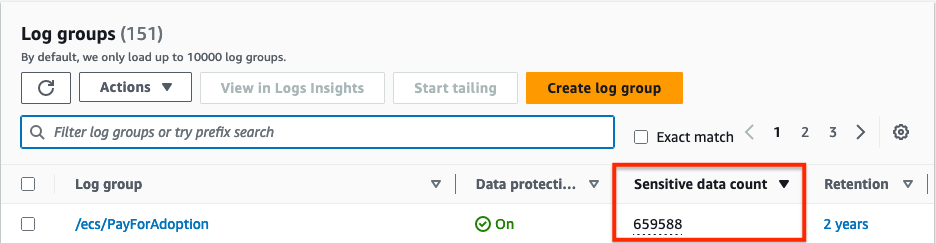
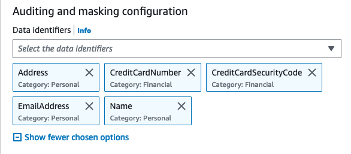
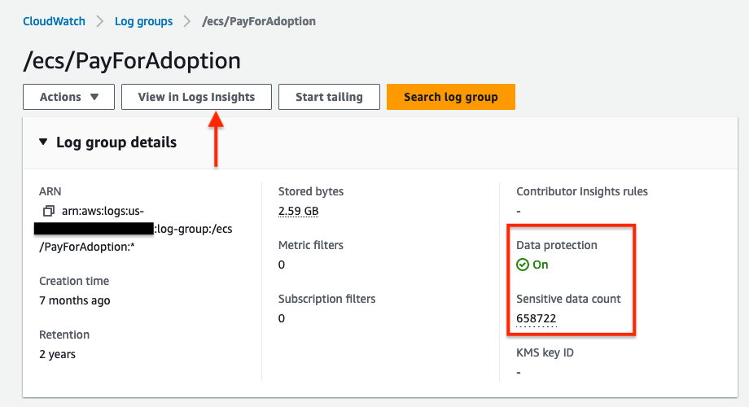

# 面向 SLG/EDU 的 CloudWatch Logs 数据保护策略

虽然记录数据通常是有益的，但对于有严格法规要求的组织来说，掩码数据是有用的，这些法规包括健康保险流通与责任法案 (HIPAA)、通用数据保护条例 (GDPR)、支付卡行业数据安全标准 (PCI-DSS) 和联邦风险和授权管理计划 (FedRAMP)。

CloudWatch Logs 中的[数据保护策略](https://docs.aws.amazon.com/AmazonCloudWatch/latest/logs/cloudwatch-logs-data-protection-policies.html)使客户能够定义和应用数据保护策略，扫描传输中的 log 数据以查找敏感数据，并掩码检测到的敏感数据。

这些策略利用模式匹配和机器学习模型来检测敏感数据，帮助您审计和掩码出现在账户中 CloudWatch log 组摄取的事件中的数据。

用于选择敏感数据的技术和标准被称为[匹配数据标识符](https://docs.aws.amazon.com/AmazonCloudWatch/latest/logs/cloudwatch-logs-data-protection-policies.html)。使用这些托管数据标识符，CloudWatch Logs 可以检测：

- 凭证，如私钥或 AWS secret access keys
- 设备标识符，如 IP 地址或 MAC 地址
- 财务信息，如银行账号、信用卡号或信用卡验证码
- 受保护健康信息 (PHI)，如健康保险卡号 (EHIC) 或个人健康号码
- 个人身份信息 (PII)，如驾照、社会安全号码或纳税人识别号码

:::note
    敏感数据在摄取到 log 组时被检测和掩码。当您设置数据保护策略时，在该时间之前摄取到 log 组的 log 事件不会被掩码。
:::
让我们展开讨论上述一些数据类型并查看一些示例：


## 数据类型

### 凭证

凭证是用于验证您身份以及您是否有权限访问所请求资源的敏感数据类型。AWS 使用这些凭证（如私钥和 secret access keys）来验证和授权您的请求。

使用 CloudWatch Logs 数据保护策略，与您选择的数据标识符匹配的敏感数据将被掩码。（我们将在本节末尾看到一个掩码示例）。





:::tip
    数据分类最佳实践从清晰定义的数据分类层级和要求开始，这些要求满足您的组织、法律和合规标准。

    作为最佳实践，基于数据分类框架使用 AWS 资源上的标签来实施与组织数据治理策略一致的合规性。
:::

:::tip
    为避免 log 事件中出现敏感数据，最佳实践是首先在代码中排除它们，只记录必要的信息。
:::


### 财务信息

根据支付卡行业数据安全标准 (PCI DSS) 的定义，银行账号、路由号码、借记卡和信用卡号码、信用卡磁条数据被视为敏感财务信息。

为检测敏感数据，一旦您设置了数据保护策略，CloudWatch Logs 会扫描您指定的数据标识符，无论 log 组所在的地理位置如何。



:::info
    查看完整的[财务数据类型和数据标识符列表](https://docs.aws.amazon.com/AmazonCloudWatch/latest/logs/protect-sensitive-log-data-types-financial.html)
:::


### 受保护健康信息 (PHI)

PHI 包含非常广泛的个人可识别健康和健康相关数据，包括保险和账单信息、诊断数据、临床护理数据（如医疗记录和数据集）以及实验室结果（如图像和测试结果）。

CloudWatch Logs 从选定的 log 组中扫描和检测健康信息并掩码该数据。


:::info
    查看完整的[PHI 数据类型和数据标识符列表](https://docs.aws.amazon.com/AmazonCloudWatch/latest/logs/protect-sensitive-log-data-types-health.html)
:::

### 个人身份信息 (PII)

PII 是对可用于识别个人的个人数据的文本引用。PII 示例包括地址、银行账号和电话号码。


:::info
    查看完整的[PII 数据类型和数据标识符列表](https://docs.aws.amazon.com/AmazonCloudWatch/latest/logs/protect-sensitive-log-data-types-pii.html)
:::

## 掩码后的 Logs

现在如果您转到设置了数据保护策略的 log 组，您将看到数据保护为 `On`，控制台还显示敏感数据的计数。



现在，点击 `View in Log Insights` 将带您进入 Log Insights 控制台。运行以下查询以检查 log 流中的 logs 事件将为您提供所有 logs 的列表。

```
fields @timestamp, @message
| sort @timestamp desc
| limit 20
```

展开查询后，您将看到如下所示的掩码结果：


:::important
    当您创建数据保护策略时，默认情况下，与您选择的数据标识符匹配的敏感数据将被掩码。只有拥有 `logs:Unmask` IAM 权限的用户才能查看未掩码的数据。
:::

:::tip
    使用 [AWS IAM and Access Management(IAM)](https://docs.aws.amazon.com/AmazonCloudWatch/latest/monitoring/auth-and-access-control-cw.html) 来管理和限制对 CloudWatch 中敏感数据的访问。
:::

:::tip
    定期监控和审计您的云环境对于保护敏感数据同样重要。当应用生成大量数据时，这变得至关重要，因此建议不要记录过多的数据。阅读此 AWS 规范性指导以了解[日志记录最佳实践](https://docs.aws.amazon.com/prescriptive-guidance/latest/logging-monitoring-for-application-owners/logging-best-practices.html)
:::

:::tip
    Log 组数据在 CloudWatch Logs 中始终是加密的。或者，您也可以使用 [AWS Key Management Service](https://docs.aws.amazon.com/AmazonCloudWatch/latest/logs/encrypt-log-data-kms.html) 来加密您的 log 数据。
:::

:::tip
    为了弹性和可扩展性，设置 CloudWatch alarm 并使用 AWS Amazon EventBridge 和 AWS Systems Manager 自动化修复。
:::


[^1]: 查看我们的 AWS 博客 [使用 Amazon CloudWatch Logs 保护敏感数据](https://aws.amazon.com/blogs/aws/protect-sensitive-data-with-amazon-cloudwatch-logs/) 以开始使用。
