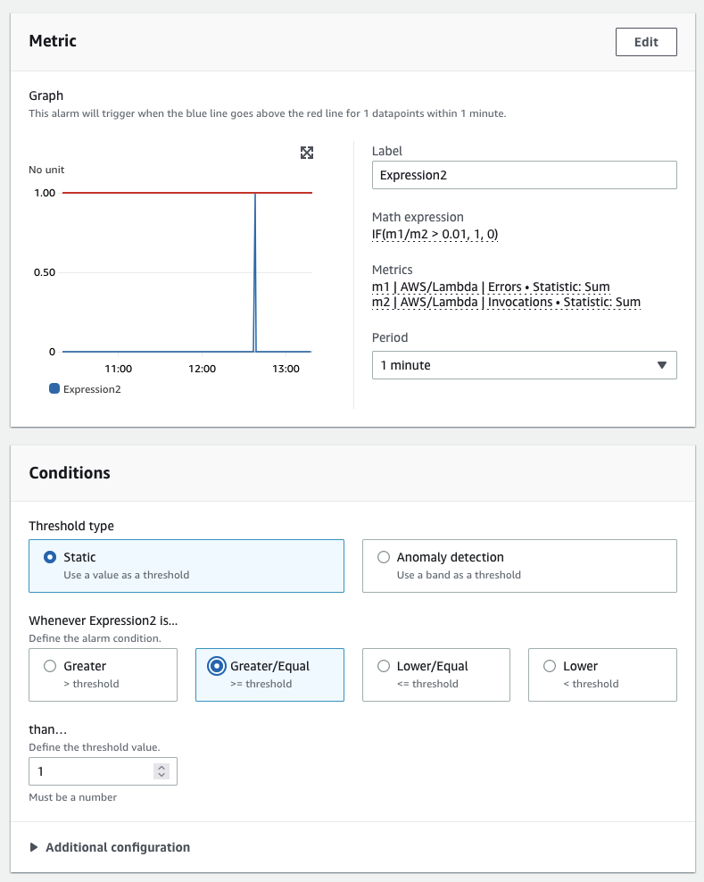

# Metrics

Metrics 是关于系统性能的数据。将所有与系统或资源相关的 metrics 集中在一个地方，使您能够比较 metrics、分析性能，并做出更好的战略决策，例如扩展或缩减资源。Metrics 对于了解资源的健康状况和采取主动措施也非常重要。

Metric 数据是基础性的，用于驱动[告警](../signals/alarms.md)、异常检测、[事件](../signals/events.md)、[dashboard](./dashboards.md) 等。

## 内置 metrics

[CloudWatch metrics](https://docs.aws.amazon.com/AmazonCloudWatch/latest/monitoring/working_with_metrics.html) 收集有关系统性能的数据。默认情况下，大多数 AWS 服务为其资源提供免费的 metrics。这包括 [Amazon EC2](https://aws.amazon.com/ec2/) 实例、[Amazon RDS](https://aws.amazon.com/rds/)、[Amazon S3](https://aws.amazon.com/s3/?p=pm&c=s3&z=4) 存储桶等。

我们将这些 metrics 称为*内置 metrics*。在您的 AWS 账户中收集内置 metrics 不收取任何费用。

:::info
	有关向 CloudWatch 发送 metrics 的 AWS 服务完整列表，请参阅[此页面](https://docs.aws.amazon.com/AmazonCloudWatch/latest/monitoring/aws-services-cloudwatch-metrics.html)。
:::
## 查询 metrics

您可以利用 CloudWatch 中的 [metric math](https://docs.aws.amazon.com/AmazonCloudWatch/latest/monitoring/using-metric-math.html) 功能来查询多个 metrics 并使用数学表达式来更精细地分析 metrics。例如，您可以编写一个 metric math 表达式来查找 Lambda 错误率：

	Errors/Requests

下面您可以看到在 CloudWatch 控制台中的示例：


:::info
	使用 metric math 从您的数据中获取最大价值，并从不同数据源的性能中推导出数值。
:::
CloudWatch 还支持条件语句。例如，要为每个延迟超过特定阈值的时间序列返回值 `1`，其他所有数据点返回 `0`，查询如下：

	IF(latency>threshold, 1, 0)

在 CloudWatch 控制台中，我们可以使用这种逻辑来创建布尔值，进而触发 [CloudWatch 告警](./alarms.md) 或其他操作。这可以从派生数据点启用自动操作。以下是 CloudWatch 控制台中的示例：



:::info
	使用条件语句在派生值的性能超过阈值时触发告警和通知。
:::
您还可以使用 `SEARCH` 函数来显示任何 metric 的前 `n` 个。当在大量时间序列（例如数千台服务器）中可视化性能最好或最差的 metrics 时，这种方法允许您只看到最重要的数据。以下是一个搜索示例，返回过去五分钟内平均 CPU 使用率最高的两个 EC2 实例：
```
	SLICE(SORT(SEARCH('{AWS/EC2,InstanceId} MetricName="CPUUtilization"', 'Average', 300), MAX, DESC),0, 2)
```
以下是在 CloudWatch 控制台中的相同视图：


:::info
	使用 `SEARCH` 方法快速显示环境中性能最好或最差的资源，然后在 [dashboard](./dashboards.md) 中展示。
:::
## 收集 metrics

如果您希望获得额外的 metrics，例如 EC2 实例的内存或磁盘空间利用率，可以使用 [CloudWatch agent](./cloudwatch_agent.md) 代您将这些数据推送到 CloudWatch。或者，如果您有需要以图形方式可视化的自定义处理数据，并且希望这些数据作为 CloudWatch metric 存在，那么可以使用 [`PutMetricData` API](https://docs.aws.amazon.com/AmazonCloudWatch/latest/APIReference/API_PutMetricData.html) 将自定义 metrics 发布到 CloudWatch。

:::info
	使用 [AWS SDK](https://aws.amazon.com/developer/tools/) 之一将 metric 数据推送到 CloudWatch，而不是直接使用裸 API。
:::
`PutMetricData` API 调用按查询次数计费。最佳实践是优化使用 `PutMetricData` API。使用此 API 中的 Values 和 Counts 方法，您可以在一次 `PutMetricData` 请求中发布每个 metric 最多 150 个值，并支持对这些数据进行百分位统计检索。因此，不要为每个数据点分别进行 API 调用，而应该将所有数据点组合在一起，然后在一次 `PutMetricData` API 调用中推送到 CloudWatch。这种方法有两个好处：

1. CloudWatch 定价优化
1. 可以防止 `PutMetricData` API 限流

:::info
	使用 `PutMetricData` 时，最佳实践是尽可能将数据批量合并到单个 `PUT` 操作中。
:::
:::info
	如果大量 metrics 被发送到 CloudWatch，则考虑使用 [Embedded Metric Format](https://docs.aws.amazon.com/AmazonCloudWatch/latest/monitoring/CloudWatch_Embedded_Metric_Format_Manual.html) 作为替代方法。请注意，Embedded Metric Format 不使用也不收取 `PutMetricData` 费用，但会因使用 [CloudWatch Logs](./logs/index.md) 而产生费用。
:::
## 异常检测

CloudWatch 有一个[异常检测](https://docs.aws.amazon.com/AmazonCloudWatch/latest/monitoring/CloudWatch_Anomaly_Detection.html)功能，它通过学习基于已记录 metrics 的*正常*行为来增强您的 Observability 策略。使用异常检测是任何 metric 信号收集系统的[最佳实践](../signals/metrics.md#use-anomaly-detection-algorithms)。

异常检测在两周的时间内构建模型。

:::warning
	异常检测仅从创建时间起向前构建模型。它不会回溯时间来查找之前的异常值。
:::

:::warning
	异常检测不知道 metric 的*好*值是什么，只知道基于标准差的*正常*值。
:::

:::info
	最佳实践是训练您的异常检测模型，使其仅分析预期正常行为的时间段。您可以定义从训练中排除的时间段（例如夜间、周末或假期）。
:::
以下是异常检测带的示例，灰色区域为检测带：


可以通过 CloudWatch 控制台、[CloudFormation](https://docs.aws.amazon.com/AWSCloudFormation/latest/UserGuide/aws-properties-cloudwatch-anomalydetector-configuration.html) 或使用 AWS SDK 之一来设置异常检测的排除窗口。
