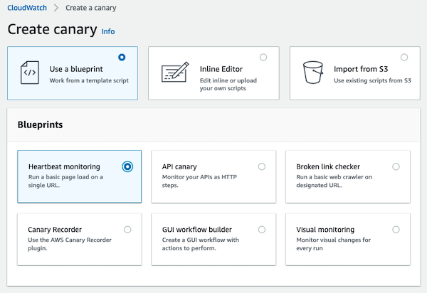

# 合成测试

Amazon CloudWatch Synthetics 允许您从客户的角度监控应用程序，即使在没有实际用户的情况下也是如此。通过持续测试您的 API 和网站体验，即使在没有用户流量时，您也能发现间歇性问题。

Canary 是可配置的脚本，您可以按计划运行，以全天候持续测试您的 API 和网站体验。它们遵循与真实用户相同的代码路径和网络路由，并可以在出现意外行为（包括延迟、页面加载错误、无效或死链接以及中断的用户工作流）时通知您。

:::note
    确保您仅使用 Synthetics canary 来监控您拥有所有权或权限的 endpoint 和 API。根据 canary 频率设置，这些 endpoint 可能会经历流量增加。
:::
## 入门

### 完整覆盖

:::tip
    在制定测试策略时，请同时考虑 Amazon VPC 内的公共和[内部私有 endpoint](https://aws.amazon.com/blogs/mt/monitor-your-private-endpoints-using-cloudwatch-synthetics/)。
:::
### 录制新的 Canary

[CloudWatch Synthetics Recorder](https://chrome.google.com/webstore/detail/cloudwatch-synthetics-rec/bhdnlmmgiplmbcdmkkdfplenecpegfno) Chrome 浏览器插件允许您从零开始快速构建具有复杂工作流的新 canary 测试脚本。录制期间的输入和点击操作将转换为 Node.js 脚本，您可以使用该脚本创建 canary。CloudWatch Synthetics Recorder 的已知限制在[此页面](https://docs.aws.amazon.com/AmazonCloudWatch/latest/monitoring/CloudWatch_Synthetics_Canaries_Recorder.html#CloudWatch_Synthetics_Canaries_Recorder-limitations)上说明。

### 查看聚合 Metrics

利用从您的 canary 脚本集收集的聚合 metrics 的开箱即用报告。CloudWatch 自动 Dashboard

## 构建 Canary

### 蓝图

使用 [canary 蓝图](https://docs.aws.amazon.com/AmazonCloudWatch/latest/monitoring/CloudWatch_Synthetics_Canaries_Blueprints.html) 来简化多种 canary 类型的设置过程。

:::info
    蓝图是开始编写 canary 的便捷方式，简单用例无需编写代码即可覆盖。
:::
### 可维护性

当您编写自己的 canary 时，它们与一个*运行时版本*绑定。这将是 Python with Selenium 或 JavaScript with Puppeteer 的特定版本。请参阅[此页面]了解我们当前支持的运行时版本和已弃用的版本列表。

:::info
    通过[使用环境变量](https://aws.amazon.com/blogs/mt/using-environment-variables-with-amazon-cloudwatch-synthetics/)来共享在 canary 执行期间可以访问的数据，从而提高脚本的可维护性。
:::

:::info
    在新运行时版本可用时，将您的 canary 升级到最新版本。
:::
### 字符串密钥

您可以编写 canary 代码，从 canary 或其环境变量之外的安全系统中拉取密钥（例如登录凭据）。任何可被 AWS Lambda 访问的系统都可以在运行时向您的 canary 提供密钥。

:::info
    执行测试并通过使用 AWS Secrets Manager 存储数据库连接详情、API 密钥和应用程序凭据等密钥来[保护敏感数据](https://aws.amazon.com/blogs/mt/secure-monitoring-of-user-workflow-experience-using-amazon-cloudwatch-synthetics-and-aws-secrets-manager/)。
:::
## 大规模管理 Canary

### 检查无效链接
:::info
    如果您的网站包含大量动态内容和链接，您可以使用 CloudWatch Synthetics 来爬取您的网站，[检测无效链接](https://aws.amazon.com/blogs/mt/cloudwatch-synthetics-to-find-broken-links-on-your-website/)，并找到失败原因。然后使用失败阈值在违反失败阈值时选择性地创建 CloudWatch 告警。
:::
### 多个心跳 URL

:::info
    通过在单个心跳监控 canary 测试中[批量处理多个 URL](https://aws.amazon.com/blogs/mt/simplify-your-canary-by-batching-multiple-urls-in-amazon-cloudwatch-synthetics/) 来简化测试并优化成本。然后，您可以在 canary 运行报告的步骤摘要中查看每个 URL 的状态、持续时间、关联的截图和失败原因。
:::
### 按组织分组

:::info
    在[分组](https://docs.aws.amazon.com/AmazonCloudWatch/latest/monitoring/CloudWatch_Synthetics_Groups.html)中组织和跟踪您的 canary，以查看聚合 metrics 并更容易地隔离和深入分析故障。
:::

:::warning
    请注意，如果您正在创建跨区域分组，分组将需要 canary 的*确切*名称。
:::
## 运行时选项

### 版本和支持

CloudWatch Synthetics 目前支持使用 Node.js 编写脚本和 [Puppeteer](https://github.com/puppeteer/puppeteer) 框架的运行时，以及使用 Python 编写脚本和 [Selenium WebDriver](https://www.selenium.dev/documentation/webdriver/) 框架的运行时。

:::info
    始终为您的 canary 使用最新的运行时版本，以便使用 Synthetics 库的最新功能和更新。
:::
CloudWatch Synthetics 会通过电子邮件通知您是否有 canary 使用[即将在 60 天内弃用的运行时](https://docs.aws.amazon.com/AmazonCloudWatch/latest/monitoring/CloudWatch_Synthetics_Canaries_Library.html#CloudWatch_Synthetics_Canaries_runtime_support)。

### 代码示例

使用 [Node.js 和 Puppeteer](https://docs.aws.amazon.com/AmazonCloudWatch/latest/monitoring/CloudWatch_Synthetics_Canaries_Samples.html#CloudWatch_Synthetics_Canaries_Samples_nodejspup) 和 [Python 和 Selenium](https://docs.aws.amazon.com/AmazonCloudWatch/latest/monitoring/CloudWatch_Synthetics_Canaries_Samples.html#CloudWatch_Synthetics_Canaries_Samples_pythonsel) 的代码示例开始入门。

### 导入 Selenium

从零开始或通过导入现有脚本并进行最少更改，使用 [Python 和 Selenium](https://aws.amazon.com/blogs/mt/create-canaries-in-python-and-selenium-using-amazon-cloudwatch-synthetics/) 创建 canary。
