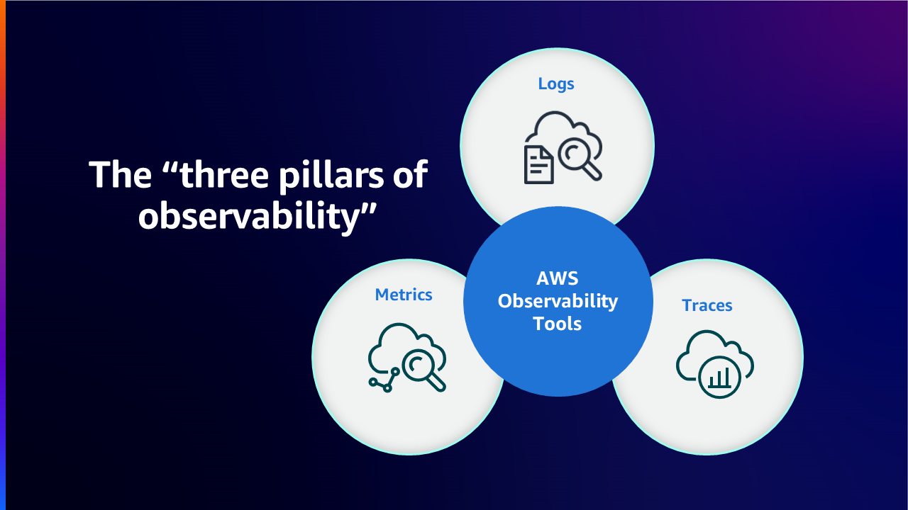

# EC2 Monitoring and Observability

## Introduction

Continuous Monitoring & Observability increases agility, improves customer experience and reduces risk of the cloud environment. According to Wikipedia, [Observability](https://en.wikipedia.org/wiki/Observability) is a measure of how well internal states of a system can be inferred from the knowledge of its external outputs. The term observability itself originates from the field of control theory, where it basically means that you can infer the internal state of the components in a system by learning about the external signals/outputs it is producing.

The difference between Monitoring and Observability is that Monitoring tells you whether a system is working or not, while Observability tells you why the system isn’t working. Monitoring is usually a reactive measure whereas the goal of Observability is to be able to improve your Key Performance Indicators in a proactive manner. A system cannot be controlled or optimized unless it is observed. Instrumenting workloads through collection of metrics, logs, or traces and gaining meaningful insights & detailed context using the right monitoring and observability tools help customers control and optimize the environment.

AWS enables customers to transform from monitoring to observability so that they can have full end-to-end service visibility. In this article we focus on Amazon Elastic Compute Cloud (Amazon EC2) and the best practices for improving the monitoring and observability of the service in AWS Cloud environment through AWS native and open-source tools.

## Amazon EC2

[Amazon Elastic Compute Cloud](https://aws.amazon.com/ec2/) (Amazon EC2) is a highly scalable compute platform in Amazon Web Services (AWS) Cloud. Amazon EC2 eliminates the need for up front hardware investment, so customers can develop and deploy applications faster while paying just for what they use. Some of the key features that EC2 provide are virtual computing environments called Instances, pre-configured templates of Instances called Amazon Machine Images, various configurations of resources like CPU, Memory, Storage and Networking capacity available as Instance Types.

## Monitoring and Observability using AWS Native Tools

### Amazon CloudWatch

[Amazon CloudWatch](https://aws.amazon.com/cloudwatch/) is a monitoring and management service that provides data and actionable insights for AWS, hybrid, and on-premises applications and infrastructure resources. CloudWatch collects monitoring and operational data in the form of logs, metrics, and events. It also provides a unified view of AWS resources, applications, and services that run on AWS and on-premises servers. CloudWatch helps you gain system-wide visibility into resource utilization, application performance, and operational health.

### Unified CloudWatch Agent

The Unified CloudWatch Agent is an open-source software under the MIT license which supports most  operating systems utilizing x86-64 and ARM64 architectures. The CloudWatch Agent helps collect system-level metrics from Amazon EC2 Instances & on-premise servers in a hybrid environment across operating systems, retrieve custom metrics from applications or services and collect logs from Amazon EC2 instances and on-premises servers.

### Installing CloudWatch Agent on Amazon EC2 Instances

#### Command Line Install

The CloudWatch Agent can be installed through the [command line](https://docs.aws.amazon.com/AmazonCloudWatch/latest/monitoring/installing-cloudwatch-agent-commandline.html). The required package for various architectures and various operating systems are available for [download](https://docs.aws.amazon.com/AmazonCloudWatch/latest/monitoring/download-cloudwatch-agent-commandline.html). Create the necessary [IAM role](https://docs.aws.amazon.com/AmazonCloudWatch/latest/monitoring/create-iam-roles-for-cloudwatch-agent-commandline.html) which provides permissions for CloudWatch agent to read information from the Amazon EC2 instance and write it to CloudWatch. Once the required IAM role is created, you can [install and run](https://docs.aws.amazon.com/AmazonCloudWatch/latest/monitoring/install-CloudWatch-Agent-commandline-fleet.html) the CloudWatch agent on the required Amazon EC2 Instance. 

!!! note "References"

    Documentation: [Installing the CloudWatch agent using the command line](https://docs.aws.amazon.com/AmazonCloudWatch/latest/monitoring/installing-cloudwatch-agent-commandline.html)

    AWS Observability Workshop: [Setup and install CloudWatch agent](https://catalog.workshops.aws/observability/en-US/aws-native/ec2-monitoring/install-ec2)

#### Installation through AWS Systems Manager

The CloudWatch Agent can also be installed through [AWS Systems Manager](https://docs.aws.amazon.com/AmazonCloudWatch/latest/monitoring/installing-cloudwatch-agent-ssm.html). Create the necessary IAM role which provides permissions for CloudWatch agent to read information from the Amazon EC2 instance and write it to CloudWatch & communicate with AWS Systems Manager. Before installing the CloudWatch agent on the EC2 instances, [install or update](https://docs.aws.amazon.com/AmazonCloudWatch/latest/monitoring/download-CloudWatch-Agent-on-EC2-Instance-SSM-first.html#update-SSM-Agent-EC2instance-first) the SSM agent on the required EC2 instances. The CloudWatch agent can be downloaded through the AWS Systems Manager. JSON Configuration file can be created to specify what metrics (including custom metrics), logs are to be collected. Once the required IAM role is created & the configuration file is created, you can install and run the CloudWatch agent on the required Amazon EC2 Instances. 

!!! note "References"

    References:
    Documentation: [Installing the CloudWatch agent using AWS Systems Manager](https://docs.aws.amazon.com/AmazonCloudWatch/latest/monitoring/installing-cloudwatch-agent-ssm.html)

    AWS Observability Workshop: [Install CloudWatch agent using AWS Systems Manager Quick Setup](https://catalog.workshops.aws/observability/en-US/aws-native/ec2-monitoring/install-ec2/ssm-quicksetup)

    Related Blog Article: [Amazon CloudWatch Agent with AWS Systems Manager Integration – Unified Metrics & Log Collection for Linux & Windows](https://aws.amazon.com/blogs/aws/new-amazon-cloudwatch-agent-with-aws-systems-manager-integration-unified-metrics-log-collection-for-linux-windows/)

    YouTube Video: [Collect Metrics and Logs from Amazon EC2 instances with the CloudWatch Agent](https://www.youtube.com/watch?v=vAnIhIwE5hY)

#### Installing CloudWatch Agent on on-premise servers in hybrid environment. 

In hybrid customer environments, where servers are on-premisis as well as in the cloud. A similar approach of can be taken to accomplish unified observability in Amazon CloudWatch. The CloudWatch agent can be directly downloaded from Amazon S3 or through AWS Systems Manager. Create an IAM User for the on-premise server to send data to Amazon CloudWatch. Install and Start the Agent on the on-premise servers. 

!!! note "Reference"

    Documentation: [Installing the CloudWatch agent on on-premises servers](https://docs.aws.amazon.com/AmazonCloudWatch/latest/monitoring/install-CloudWatch-Agent-on-premise.html)

### Monitoring of Amazon EC2 Instances using Amazon CloudWatch

A key aspect of maintaining the reliability, availability, and performance of your Amazon EC2 Instances and your applications is through [continuous monitoring](https://catalog.workshops.aws/observability/en-US/aws-native/ec2-monitoring). With CloudWatch Agent installed on the required Amazon EC2 instances, monitoring the health of the instances and their performance is necessary to maintain a stable environment. As a baseline, items like CPU utilization, Network utilization, Disk performance, Disk Reads/Writes, Memory utilization, disk swap utilization, disk space utilization, page file utilization, and log collection of EC2 Instances are recommended.

#### Basic & Detailed Monitoring

Amazon CloudWatch collects and processes raw data from Amazon EC2 into readable near real-time metrics. By default, Amazon EC2 sends metric data to CloudWatch in 5-minute periods as Basic Monitoring for an instance. To send metric data for your instance to CloudWatch in 1-minute periods, [detailed monitoring](https://docs.aws.amazon.com/AWSEC2/latest/UserGuide/using-cloudwatch-new.html) can be enabled on the instance.

#### Automated & Manual Tools for Monitoring

AWS provides two types of tools, automated and manual that help customers monitor their Amazon EC2 and report back when something is wrong. Some of these tools require a little configuration and a few require manual intervention. 
[Automated Monitoring tools](https://docs.aws.amazon.com/AWSEC2/latest/UserGuide/monitoring_automated_manual.html#monitoring_automated_tools) include AWS System status checks, Instance status checks, Amazon CloudWatch alarms, Amazon EventBridge, Amazon CloudWatch Logs, CloudWatch agent, AWS Management Pack for Microsoft System Center Operations Manager. [Manual monitoring](https://docs.aws.amazon.com/AWSEC2/latest/UserGuide/monitoring_automated_manual.html#monitoring_manual_tools) tools include Dashboards which we’ll look in detail a separate section below in this article.

!!! note "Reference"

    Documentation: [Automated and manual monitoring](https://docs.aws.amazon.com/AWSEC2/latest/UserGuide/monitoring_automated_manual.html)

### Metrics from Amazon EC2 Instances using CloudWatch Agent

Metrics are the fundamental concept in CloudWatch. A metric represents a time-ordered set of data points that are published to CloudWatch. Think of a metric as a variable to monitor, and the data points as representing the values of that variable over time. For example, the CPU usage of a particular EC2 instance is one metric provided by Amazon EC2.

#### Default Metrics using CloudWatch Agent

Amazon CloudWatch collects metrics from Amazon EC2 instance which can be viewed through AWS Management Console, AWS CLI, or an API. The available metrics are data points which are covered for 5 minute interval through Basic Monitoring or at a 1 minute interval for detailed monitoring (if turned on).

#### Custom Metrics using CloudWatch Agent

Customers can also publish their own custom metrics to CloudWatch using the API or CLI through standard resolution of 1 minute granularity or high resolution granularity down to 1 sec interval. The unified CloudWatch agent supports retrieval of custom metrics through [StatsD](https://docs.aws.amazon.com/AmazonCloudWatch/latest/monitoring/CloudWatch-Agent-custom-metrics-statsd.html) and [collectd](https://docs.aws.amazon.com/AmazonCloudWatch/latest/monitoring/CloudWatch-Agent-custom-metrics-collectd.html). 

Custom metrics from applications or services can be retrieved using the CloudWatch agent with StatsD protocol. StatsD is a popular open-source solution that can gather metrics from a wide variety of applications. StatsD is especially useful for instrumenting own metrics, which supports both Linux and Windows based servers.

Custom metrics from applications or services can also be retrieved using the CloudWatch agent with the collectd protocol, which is a popular open-source solution supported only on Linux Servers with plugins that can gather system statistics for a wide variety of applications. By combining the system metrics that the CloudWatch agent can already collect with the additional metrics from collectd, you can better monitor, analyze, and troubleshoot your systems and applications.

#### Additional Custom Metrics using CloudWatch Agent

The CloudWatch agent supports collecting custom metrics from your EC2 instances. A few popular examples are:

- Network performance metrics for EC2 instances running on Linux that use the Elastic Network Adapter (ENA).
- Nvidia GPU metrics from Linux servers.
- Process metrics using procstat plugin from individual processes on Linux & Windows servers.

### Logs from Amazon EC2 Instances using CloudWatch Agent

Amazon CloudWatch Logs helps customers monitor and troubleshoot systems and applications in near real time using existing system, application and custom log files. To collect logs from Amazon EC2 Instances and on-premise servers to CloudWatch, the unified CloudWatch Agent needs to be installed. The latest unified CloudWatch Agent is recommended, since it can collect both logs and advanced metrics. It also supports a variety of operating systems. If the instance uses Instance Metadata Service Version 2 (IMDSv2) then the unified agent is required.

The logs collected by the unified CloudWatch agent are processed and stored in Amazon CloudWatch Logs. Logs can be collected from Windows or Linux Servers and from both Amazon EC2 and on-premise servers. The CloudWatch agent configuration wizard can be used to setup the config JSON file which defines the setup of the CloudWatch agent.

!!! note "Reference"

    AWS Observability Workshop: [Logs](https://catalog.workshops.aws/observability/en-US/aws-native/logs)

### Amazon EC2 Instance Events

An event indicates a change in your AWS environment. AWS resources and applications can generate events when their state changes. CloudWatch Events provides a near real-time stream of system events that describe changes to your AWS resources and applications. For example, Amazon EC2 generates an event when the state of an EC2 instance changes from pending to running. Customers can also generate custom application-level events and publish them to CloudWatch Events. 

Customers can [monitor the status of Amazon EC2 Instances](https://docs.aws.amazon.com/AWSEC2/latest/UserGuide/monitoring-instances-status-check.html) by viewing status checks and scheduled events. A status check provides the results from automated checks performed by Amazon EC2. These automated checks detect whether specific issues are affecting the instances. The status check information, together with the data provided by Amazon CloudWatch, gives detailed operational visibility into each of the instances.

#### Amazon EventBridge Rule for Amazon EC2 Instance Events

Amazon CloudWatch Events can use Amazon EventBridge to automate system events to respond automatically for actions such as resource changes or issues. Events from AWS services including Amazon EC2 are delivered to CloudWatch Events in near real time and customers can create EventBridge rules to take appropriate actions when an event matches a rule. 
Actions can be, Invoke an AWS Lambda function, Invoke Amazon EC2 Run Command, Relay the event to Amazon Kinesis Data Streams, Activate an AWS Step Functions state machine, Notify an Amazon SNS topic, Notify an Amazon SQS queue, piping to internal or external incident response application or SIEM tool.

!!! note "Reference"

    AWS Observability Workshop: [Incident Response - EventBridge Rule](https://catalog.workshops.aws/observability/en-US/aws-native/ec2-monitoring/incident-response/create-eventbridge-rule)

#### Amazon CloudWatch Alarms for Amazon EC2 Instances

Amazon [CloudWatch alarms](https://docs.aws.amazon.com/AmazonCloudWatch/latest/monitoring/AlarmThatSendsEmail.html) can watch a metric over a time period you specify, and perform one or more actions based on the value of the metric relative to a given threshold over a number of time periods. An alarm invokes actions only when the alarmchanges state. The action can be a notification sent to an Amazon Simple Notification Service (Amazon SNS) topic or Amazon EC2 Auto Scaling or take other appropriate actions like [stop, terminate, reboot, or recover an EC2 instance.](https://docs.aws.amazon.com/AmazonCloudWatch/latest/monitoring/UsingAlarmActions.html)

Once the alarm is triggered an Email notification is sent to an SNS Topic as an action.

#### Monitoring for Auto Scaling Instances

Amazon EC2 Auto Scaling helps customer ensure that you have the correct number of Amazon EC2 instances are available to handle the load for your application. [Amazon EC2 Auto Scaling metrics](https://docs.aws.amazon.com/autoscaling/ec2/userguide/ec2-auto-scaling-cloudwatch-monitoring.html) collect information about Auto Scaling groups and are in the AWS/AutoScaling namespace. Amazon EC2 instance metrics representing CPU and other usage data from Auto Scaling instances are in the AWS/EC2 namespace. 

### Dashboarding in CloudWatch

Getting to know the inventory details of resources in AWS accounts, the resources performance and health checks is important for a stable resource management. [Amazon CloudWatch dashboards](https://docs.aws.amazon.com/AmazonCloudWatch/latest/monitoring/CloudWatch_Dashboards.html) are customizable home pages in the CloudWatch console that you can be used to monitor your resources in a single view, even those resources that are spread across different Regions. There are ways to get a good view and details of the Amazon EC2 Instances that are available

#### Automatic Dashboards in CloudWatch

Automatic Dashboards are available in all AWS public regions which provides an aggregated view of the health and performance of all AWS resources including Amazon EC2 instances under CloudWatch. This helps customers quickly get started with monitoring, resource-based view of metrics and alarms, and easily drill-down to understand the root cause of performance issues. Automatic Dashboards are pre-built with AWS service recommended [best practices](https://docs.aws.amazon.com/prescriptive-guidance/latest/implementing-logging-monitoring-cloudwatch/cloudwatch-dashboards-visualizations.html), remain resource aware, and dynamically update to reflect the latest state of important performance metrics.

#### Custom Dashboards in CloudWatch

With [Custom Dashboards](https://docs.aws.amazon.com/AmazonCloudWatch/latest/monitoring/create_dashboard.html) Customers can create as many additional dashboards as they want with different widgets and customize it accordingly . Dashboards can be configured for cross-region and cross account view and can be added to a favorites list.

#### Resource Health Dashboards in CloudWatch

Resource Health in CloudWatch ServiceLens is a fully managed solution that customers can use to automatically discover, manage, and visualize the [health and performance of Amazon EC2 hosts](https://aws.amazon.com/blogs/mt/introducing-cloudwatch-resource-health-monitor-ec2-hosts/) across their applications. Customers can visualize the health of their hosts by performance dimension such as CPU or memory, and slice and dice hundreds of hosts in a single view using filters such as instance type, instance state, or security groups. It enables a side-by-side comparison of a group of EC2 hosts and provides granular insights into an individual host.

## Monitoring And Observability using Open Source Tools

### Monitoring of Amazon EC2 Instances using AWS Distro for OpenTelemetry

[AWS Distro for OpenTelemetry (ADOT)](https://aws.amazon.com/otel) is a secure, production-ready, AWS-supported distribution of the OpenTelemetry project. Part of the Cloud Native Computing Foundation, OpenTelemetry provides open source APIs, libraries, and agents to collect distributed traces and metrics for application monitoring. With AWS Distro for OpenTelemetry, customers can instrument applications just once to send correlated metrics and traces to multiple AWS and Partner monitoring solutions.

AWS Distro for OpenTelemetry (ADOT) provides a distributed monitoring framework that enables correlating data for monitoring application performance and health in an easy way which is critical for greater service visibility and maintenance.

The key components of ADOT are SDKs, auto-instrumentation agents, collectors and exporters to send data to back-end services.

[OpenTelemetry SDK](https://github.com/aws-observability): To enable the collection of AWS resource-specific metadata, support to the OpenTelemetry SDKs for the X-Ray trace format and context. OpenTelemetry SDKs now correlate ingested trace and metrics data from AWS X-Ray and CloudWatch.

[Auto-instrumentation agent](https://aws-otel.github.io/docs/getting-started/java-sdk/auto-instr): Support in the OpenTelemetry Java auto-instrumentation agent are added for AWS SDK and AWS X-Ray trace data.

[OpenTelemetry Collector](https://github.com/open-telemetry/opentelemetry-collector): The collector in the distribution is built using the upstream OpenTelemetry collector. Added AWS-specific exporters to the upstream collector to send data to AWS services including AWS X-Ray, Amazon CloudWatch and Amazon Managed Service for Prometheus. 

#### Metrics & Traces through ADOT Collector & Amazon CloudWatch

AWS Distro for OpenTelemetry (ADOT) Collector along with the CloudWatch agent can be installed side-by-side on Amazon EC2 Instance and OpenTelemetry SDKs can be used to collect application traces & metrics from your workloads running on Amazon EC2 Instances. 

To support OpenTelemetry metrics in Amazon CloudWatch, [AWS EMF Exporter for OpenTelemetry Collector](https://github.com/open-telemetry/opentelemetry-collector-contrib/tree/main/exporter/awsemfexporter) converts OpenTelemetry format metrics to CloudWatch Embedded Metric Format(EMF) which enables applications integrated in  OpenTelemetry metrics to be able to send high-cardinality application metrics to CloudWatch. [The X-Ray exporter](https://aws-otel.github.io/docs/getting-started/x-ray#configuring-the-aws-x-ray-exporter) allows traces collected in an OTLP format to be exported to [AWS X-ray](https://aws.amazon.com/xray/).

ADOT Collector on Amazon EC2 can be installed through AWS CloudFormation or using [AWS Systems Manager Distributor](https://catalog.workshops.aws/observability/en-US/aws-managed-oss/ec2-monitoring/configure-adot-collector) to collect application metrics.

### Monitoring of Amazon EC2 Instances using Prometheus

[Prometheus](https://prometheus.io/) is a standalone open-source project and maintained independently for systems monitoring and alerting. Prometheus collects and stores metrics as time series data, i.e. metrics information is stored with the timestamp at which it was recorded, alongside optional key-value pairs called labels.

Prometheus is configured via command line flags and all the configuration details are maintained in the prometheus.yaml file. The 'scrape_config' section within the configuration file specifies the targets and parameters specifying how to scrape them. [Prometheus Service Discovery](https://github.com/prometheus/prometheus/tree/main/discovery) (SD) is a methodology of finding endpoints to scrape for metrics. Amazon EC2 service discovery configurations allow retrieving scrape targets from AWS EC2 instances are configured in the `ec2_sd_config`.

#### Metrics through Prometheus & Amazon CloudWatch

The CloudWatch agent on EC2 instances can be installed & configured with Prometheus to scrape metrics for monitoring in CloudWatch. This can be helpful to customers who prefer container workloads on EC2 and require custom metrics that are compatible with open source Prometheus monitoring. Installation of CloudWatch Agent can be done by following the steps explained in the earlier section above. The CloudWatch agent with Prometheus monitoring needs two configurations to scrape the Prometheus metrics. One is for the standard Prometheus configurations as documented in 'scrape_config' in the Prometheus documentation. The other is for the [CloudWatch agent configuration](https://docs.aws.amazon.com/AmazonCloudWatch/latest/monitoring/CloudWatch-Agent-PrometheusEC2.html#CloudWatch-Agent-PrometheusEC2-configure).

#### Metrics through Prometheus & ADOT Collector

Customers can choose to have an all open-source setup for their observability needs. For which, AWS Distro for OpenTelemetry (ADOT) Collector can be configured to scrape from a Prometheus-instrumented application and send the metrics to Prometheus Server. There are three OpenTelemetry components involved in this flow, that are the Prometheus Receiver, the Prometheus Remote Write Exporter, and the Sigv4 Authentication Extension. Prometheus Receiver receives metric data in Prometheus format. Prometheus Exporter exports data in Prometheus format. Sigv4 Authenticator extension provides Sigv4 authentication for making requests to AWS services.

#### Prometheus Node Exporter

[Prometheus Node Exporter](https://github.com/prometheus/node_exporter) is an open-source time series monitoring and alerting system for cloud environments. Amazon EC2 Instances can be instrumented with Node Exporter to collect and store node-level metrics as time-series data, recording information with a timestamp. Node exporter is a Prometheus exporter which can expose variety of host metrics via URL http://localhost:9100/metrics.

 Once the metrics are created, they can be sent to [Amazon Managed Prometheus](https://aws.amazon.com/prometheus/).

### Streaming Logs from Amazon EC2 Instances using Fluent Bit Plugin

[Fluent Bit](https://fluentbit.io/) is an open source and multi-platform log processor tool for handling data collection at scale, collecting & aggregating diverse data that deal with various sources of information, variety of data formats, data reliability, security, flexible routing and multiple destinations.

Fluent Bit helps create an easy extension point for streaming logs from Amazon EC2 to AWS services including Amazon CloudWatch for log retention and analytics. The newly-launched [Fluent Bit plugin](https://github.com/aws/amazon-cloudwatch-logs-for-fluent-bit#new-higher-performance-core-fluent-bit-plugin) can route logs to Amazon CloudWatch.

### Dashboarding with Amazon Managed Grafana

[Amazon Managed Grafana](https://aws.amazon.com/grafana/) is a fully managed service based on the open source Grafana project, with rich, interactive & secure data visualizations to help customers instantly query, correlate, analyze, monitor, and alarm on metrics, logs, and traces across multiple data sources. Customers can create interactive dashboards and share them with anyone in their organization with an automatically scaled, highly available, and enterprise-secure service. With Amazon Managed Grafana, customers can manage user and team access to dashboards across AWS accounts, AWS regions, and data sources.

Amazon Managed Grafana can be added with Amazon CloudWatch as a data source by using the AWS data source configuration option in the Grafana workspace console. This feature simplifies adding CloudWatch as a data source by discovering existing CloudWatch accounts and manage the configuration of the authentication credentials that are required to access CloudWatch. Amazon Managed Grafana also supports [Prometheus data sources](https://docs.aws.amazon.com/grafana/latest/userguide/prometheus-data-source.html), i.e. both self-managed Prometheus servers and Amazon Managed Service for Prometheus workspaces as data sources.

Amazon Managed Grafana comes with a variety of panels, makes it easy to construct the right queries and customize the display properties allowing customers to create the dashboards they need.

## Conclusion

Monitoring keeps you informed of whether a system is working properly. Observability lets you understand why the system is not working properly. Good observability allows you to answer the questions you didn't know that you needed to be aware of. Monitoring & Observability paves way for measuring the internal states of a system which can be inferred from its outputs.

Modern applications, those running on cloud in microservices, serverless and asynchronous architectures, generate large volumes of data in the form of metrics, logs, traces and events. Amazon CloudWatch along with open source tools such as Amazon Distro for OpenTelemetry, Amazon Managed Prometheus, and Amazon Managed Grafana, enable customers to collect, access, and correlate this data on a unified platform. Helping customers break down data silos so you can easily gain system-wide visibility and quickly resolve issues. 

