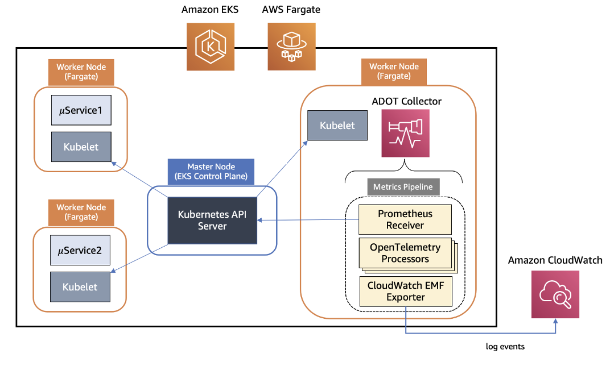

# CloudWatch Container Insights 

## Introduction

Amazon CloudWatch Container Insights is a powerful tool for collecting, aggregating, and summarizing metrics and logs from containerized applications and microservices. This document provides an overview of the integration between ADOT and CloudWatch Container Insights for EKS Fargate workloads, including its design, deployment process, and benefits.

## ADOT Collector Design for EKS Fargate

The ADOT Collector uses a pipeline architecture consisting of three main components:

1. Receiver: Accepts data in a specified format and translates it into an internal format.
2. Processor: Performs tasks such as batching, filtering, and transformations on the data.
3. Exporter: Determines the destination for sending metrics, logs, or traces.

For EKS Fargate, the ADOT Collector uses a Prometheus Receiver to scrape metrics from the Kubernetes API server, which acts as a proxy for the kubelet on worker nodes. This approach is necessary due to the networking limitations in EKS Fargate that prevent direct access to the kubelet. The collected metrics go through a series of processors for filtering, renaming, data aggregation, and conversion. Finally, the AWS CloudWatch EMF Exporter converts the metrics to the embedded metric format (EMF) and sends them to CloudWatch Logs.

*Figure 1: Container Insights with ADOT on EKS Fargate*
<!--https://aws.amazon.com/blogs/containers/introducing-amazon-cloudwatch-container-insights-for-amazon-eks-fargate-using-aws-distro-for-opentelemetry/
-->
## Deployment Process

To deploy the ADOT Collector on an EKS Fargate cluster:

1. Create an EKS cluster with Kubernetes
2. Set up a Fargate pod execution role.
3. Define Fargate profiles for the necessary namespaces.
4. Create an IAM role for the ADOT Collector with the required permissions.
5. Deploy the ADOT Collector as a Kubernetes StatefulSet using the provided manifest.
6. Deploy sample workloads to test the metrics collection.

## Pros and Cons

### Pros:

1. Unified Monitoring: Provides a consistent monitoring experience across EKS EC2 and Fargate workloads.
2. Scalability: A single ADOT Collector instance can discover and collect metrics from all worker nodes in an EKS cluster.
3. Rich Metrics: Collects a comprehensive set of system metrics, including CPU, memory, disk, and network usage.
4. Easy Integration: Seamlessly integrates with existing CloudWatch dashboards and alarms.
5. Cost-Effective: Enables monitoring of Fargate workloads without the need for additional monitoring infrastructure.

### Cons:

1.  Configuration Complexity: Setting up the ADOT Collector requires careful configuration of IAM roles, Fargate profiles, and Kubernetes resources.
2. Resource Overhead: The ADOT Collector itself consumes resources on the Fargate cluster, which needs to be accounted for in capacity planning.

The integration of AWS Distro for OpenTelemetry with CloudWatch Container Insights for EKS Fargate workloads provides a powerful solution for monitoring containerized applications. It offers a unified monitoring experience across different EKS deployment options and leverages the scalability and flexibility of the OpenTelemetry framework. By enabling the collection of system metrics from Fargate workloads, this integration allows customers to gain deeper insights into their application performance, make informed scaling decisions, and optimize resource utilization.