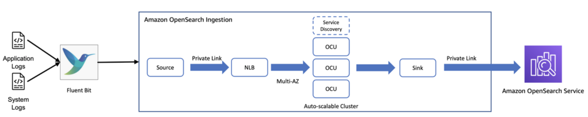

# Opensearch Logging on AWS 

## Introduction
Opensearch is a popular open-source search and analytics engine that enables log aggregation, analysis and visualization. AWS provides several compute services like ECS (Elastic Container Service), EKS (Elastic Kubernetes Service) and EC2 (Elastic Compute Cloud) that can be used to deploy and run applications generating logs. Integrating Opensearch with these compute services allows centralized logging to monitor applications and infrastructure effectively.

*Figure 1: Opensearch Pipleine*

## Architecture Overview
Here is a high-level architecture of Opensearch logging on AWS using ECS, EKS and EC2:

1. Applications running on ECS, EKS or EC2 generate logs 
2. A log agent (e.g. Fluentd, Fluent Bit, Logstash etc.) collects logs from the compute services
3. The log agent sends the logs to Amazon Opensearch Service, a managed Opensearch cluster
4. Opensearch indexes and stores the log data
5. Kibana, integrated with Opensearch, is used to search, analyze and visualize the log data

Some key components:
- Amazon Opensearch Service: Managed Opensearch cluster for log aggregation and analytics
- Compute Services (ECS, EKS, EC2): Where applications generating logs are deployed  
- Log Agents: Collect logs from compute and send to Opensearch
- Opensearch Index: Stores the log data
- Kibana: Visualization and analysis of log data

## Pros
1. **Centralized Logging**: Aggregates logs from all compute services into Opensearch, enabling a single pane for log analysis
2. **Scalability**: Amazon Opensearch Service scales to ingest and analyze high volumes of log data
3. **Fully Managed**: Opensearch Service eliminates operational overhead of managing Opensearch  
4. **Real-time Monitoring**: Ingest and visualize logs in near real-time for proactive monitoring
5. **Rich Analytics**: Kibana provides powerful tools to search, filter, analyze and visualize logs
6. **Extensibility**: Flexible to integrate with various log agents and AWS services

## Cons
1. **Cost**: Log aggregation at scale to Opensearch can incur significant data transfer and storage costs
2. **Complex Setup**: Initial setup to stream logs from compute services to Opensearch can be involved 
3. **Learning Curve**: Requires knowledge of Opensearch and Kibana for efficient utilization
4. **Large-scale Limitations**: For very large log volumes, Opensearch can face scalability and performance challenges
5. **Security Overhead**: Ensuring secure log transmission and access to Opensearch requires careful configuration

## Conclusion
Integrating Opensearch with AWS compute services like ECS, EKS and EC2 enables powerful log aggregation and analytics capabilities. While it provides a scalable, centralized and near real-time logging solution, it's important to design the architecture carefully considering costs, security, scalability and performance. With the right implementation, Opensearch logging on AWS can greatly enhance observability into applications and infrastructure.