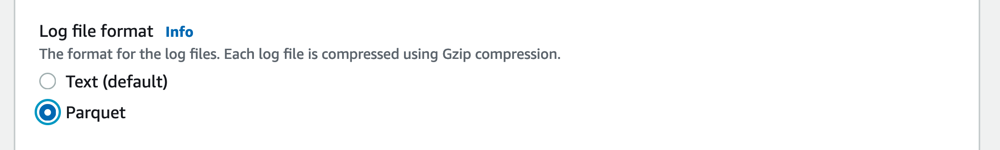

# Using Athena in Amazon Managed Grafana

In this recipe we show you how to use [Amazon Athena][athena]—a serverless, 
interactive query service allowing you to analyze data in Amazon S3 using 
standard SQL—in [Amazon Managed Grafana][amg]. This integration
is enabled by the [Athena data source for Grafana][athena-ds], an open source
plugin available for you to use in any DIY Grafana instance as well as 
pre-installed in Amazon Managed Grafana.

!!! note
    This guide will take approximately 20 minutes to complete.

## Prerequisites

* The [AWS CLI][aws-cli] is installed and [configured][aws-cli-conf] in your environment.
* You have access to Amazon Athena from your account.

## Infrastructure

Let's first set up the necessary infrastructure.

### Set up Amazon Athena

We want to see how to use Athena in two different scenarios: one scenario around
geographical data along with the Geomap plugin, and one in a security-relevant
scenario around VPC flow logs.

First, let's make sure Athena is set up and the datasets are loaded.

!!! warning
    You have to use the Amazon Athena console to execute these queries. Grafana
	in general has read-only access to the data sources, so can not be used
	to create or update data.

#### Load geographical data

In this first use case we use a dataset from the [Registry of Open Data on AWS][awsod].
More specifically, we will use [OpenStreetMap][osm] (OSM) to demonstrate
the usage of the Athena plugin for a geographical data motivated use case.
For that to work, we need to first get the OSM data into Athena.

So, first off, create a new database in Athena. Go to the [Athena
console][athena-console] and there use the following three 
SQL queries to import the OSM data into the database.

Query 1:

```sql
CREATE EXTERNAL TABLE planet (
  id BIGINT,
  type STRING,
  tags MAP<STRING,STRING>,
  lat DECIMAL(9,7),
  lon DECIMAL(10,7),
  nds ARRAY<STRUCT<ref: BIGINT>>,
  members ARRAY<STRUCT<type: STRING, ref: BIGINT, role: STRING>>,
  changeset BIGINT,
  timestamp TIMESTAMP,
  uid BIGINT,
  user STRING,
  version BIGINT
)
STORED AS ORCFILE
LOCATION 's3://osm-pds/planet/';
```

Query 2:

```sql
CREATE EXTERNAL TABLE planet_history (
    id BIGINT,
    type STRING,
    tags MAP<STRING,STRING>,
    lat DECIMAL(9,7),
    lon DECIMAL(10,7),
    nds ARRAY<STRUCT<ref: BIGINT>>,
    members ARRAY<STRUCT<type: STRING, ref: BIGINT, role: STRING>>,
    changeset BIGINT,
    timestamp TIMESTAMP,
    uid BIGINT,
    user STRING,
    version BIGINT,
    visible BOOLEAN
)
STORED AS ORCFILE
LOCATION 's3://osm-pds/planet-history/';
```

Query 3:

```sql
CREATE EXTERNAL TABLE changesets (
    id BIGINT,
    tags MAP<STRING,STRING>,
    created_at TIMESTAMP,
    open BOOLEAN,
    closed_at TIMESTAMP,
    comments_count BIGINT,
    min_lat DECIMAL(9,7),
    max_lat DECIMAL(9,7),
    min_lon DECIMAL(10,7),
    max_lon DECIMAL(10,7),
    num_changes BIGINT,
    uid BIGINT,
    user STRING
)
STORED AS ORCFILE
LOCATION 's3://osm-pds/changesets/';
```

#### Load VPC flow logs data

The second use case is a security-motivated one: analyzing network traffic
using [VPC Flow Logs][vpcflowlogs].

First, we need to tell EC2 to generate VPC Flow Logs for us. So, if you have 
not done this already, you go ahead now and [create VPC flow logs][createvpcfl] 
either on the network interfaces level, subnet level, or VPC level.

!!! note
    To improve query performance and minimize the storage footprint, we store
    the VPC flow logs in [Parquet][parquet], a columnar storage format
    that supports nested data.

For our setup it doesn't matter what option you choose (network interfaces, 
subnet, or VPC), as long as you publish them to an S3 bucket in Parquet format
as shown below:



Now, again via the [Athena console][athena-console], create the table for the
VPC flow logs data in the same database you imported the OSM data, or create a new one,
if you prefer to do so.

Use the following SQL query and make sure that you're replacing
`VPC_FLOW_LOGS_LOCATION_IN_S3` with your own bucket/folder:


```sql
CREATE EXTERNAL TABLE vpclogs (
  `version` int, 
  `account_id` string, 
  `interface_id` string, 
  `srcaddr` string, 
  `dstaddr` string, 
  `srcport` int, 
  `dstport` int, 
  `protocol` bigint, 
  `packets` bigint, 
  `bytes` bigint, 
  `start` bigint, 
  `end` bigint, 
  `action` string, 
  `log_status` string, 
  `vpc_id` string, 
  `subnet_id` string, 
  `instance_id` string, 
  `tcp_flags` int, 
  `type` string, 
  `pkt_srcaddr` string, 
  `pkt_dstaddr` string, 
  `region` string, 
  `az_id` string, 
  `sublocation_type` string, 
  `sublocation_id` string, 
  `pkt_src_aws_service` string, 
  `pkt_dst_aws_service` string, 
  `flow_direction` string, 
  `traffic_path` int
)
STORED AS PARQUET
LOCATION 'VPC_FLOW_LOGS_LOCATION_IN_S3'
```

For example, `VPC_FLOW_LOGS_LOCATION_IN_S3` could look something like the
following if you're using the S3 bucket `allmyflowlogs`:

```
s3://allmyflowlogs/AWSLogs/12345678901/vpcflowlogs/eu-west-1/2021/
```

Now that the datasets are available in Athena, let's move on to Grafana.

### Set up Grafana

We need a Grafana instance, so go ahead and set up a new [Amazon Managed Grafana
workspace][amg-workspace], for example by using the [Getting Started][amg-getting-started] guide,
or use an existing one.

!!! warning
    To use AWS data source configuration, first go to the Amazon Managed Grafana
    console to enable service-mananged IAM roles that grant the workspace the 
    IAM policies necessary to read the Athena resources.
    Further, note the following:

	1. The Athena workgroup you plan to use needs to be tagged with the key 
	`GrafanaDataSource` and value `true` for the service managed permissions
	to be permitted to use the workgroup.
	1. The service-managed IAM policy only grants access to query result buckets 
	that start with `grafana-athena-query-results-`, so for any other bucket
	you MUST add permissions manually.
	1. You have to add the `s3:Get*` and `s3:List*` permissions for the underlying data source 
	being queried manually.


To set up the Athena data source, use the left-hand toolbar and choose the 
lower AWS icon and then choose "Athena". Select your default region you want 
the plugin to discover the Athena data source to use, and then select the 
accounts that you want, and finally choose "Add data source".

Alternatively, you can manually add and configure the Athena data source by 
following these steps:

1. Click on the "Configurations" icon on the left-hand toolbar and then on "Add data source".
1. Search for "Athena".
1. [OPTIONAL] Configure the authentication provider (recommended: workspace IAM
   role).
1. Select your targeted Athena data source, database, and workgroup.
1. If your workgroup doesn't have an output location configured already,
   specify the S3 bucket and folder to use for query results. Note that the
   bucket has to start with `grafana-athena-query-results-` if you want to
   benefit from the service-managed policy.
1. Click "Save & test".

You should see something like the following:


## Usage

And now let's look at how to use our Athena datasets from Grafana.

### Use geographical data

The [OpenStreetMap][osm] (OSM) data in Athena can answer a number of questions,
such as "where are certain amenities". Let's see that in action.

For example, a SQL query against the OSM dataset to list places that offer food
in the Las Vegas region is as follows:

```sql
SELECT 
tags['amenity'] AS amenity,
tags['name'] AS name,
tags['website'] AS website,
lat, lon
FROM planet
WHERE type = 'node'
  AND tags['amenity'] IN ('bar', 'pub', 'fast_food', 'restaurant')
  AND lon BETWEEN -115.5 AND -114.5
  AND lat BETWEEN 36.1 AND 36.3
LIMIT 500;
```

!!!info
    The Las Vegas region in above query is defined as everything with a latitude 
    between `36.1` and `36.3` as well as a longitude between `-115.5` and `-114.5`.
	You could turn that into a set of variables (one for each corner) and make
	the Geomap plugin adaptable to other regions.

To visualize the OSM data using above query, you can import an example dashboard, 
available via [osm-sample-dashboard.json](./amg-athena-plugin/osm-sample-dashboard.json)
that looks as follows:


!!!note
    In above screen shot we use the Geomap visualization (in the left panel) to
    plot the data points.

### Use VPC flow logs data

To analyze the VPC flow log data, detecting SSH and RDP traffic, use the
following SQL queries.

Getting a tabular overview on SSH/RDP traffic:

```sql
SELECT
srcaddr, dstaddr, account_id, action, protocol, bytes, log_status
FROM vpclogs
WHERE
srcport in (22, 3389)
OR
dstport IN (22, 3389)
ORDER BY start ASC;
```

Getting a time series view on bytes accepted and rejected:

```sql
SELECT
from_unixtime(start), sum(bytes), action
FROM vpclogs
WHERE
srcport in (22,3389)
OR
dstport IN (22, 3389)
GROUP BY start, action
ORDER BY start ASC;
```

!!! tip
    If you want to limit the amount of data queried in Athena, consider using
	the `$__timeFilter` macro.

To visualize the VPC flow log data, you can import an example dashboard, 
available via [vpcfl-sample-dashboard.json](./amg-athena-plugin/vpcfl-sample-dashboard.json)
that looks as follows:


From here, you can use the following guides to create your own dashboard in
Amazon Managed Grafana:

* [User Guide: Dashboards](https://docs.aws.amazon.com/grafana/latest/userguide/dashboard-overview.html)
* [Best practices for creating dashboards](https://grafana.com/docs/grafana/latest/best-practices/best-practices-for-creating-dashboards/)

That's it, congratulations you've learned how to use Athena from Grafana!

## Cleanup

Remove the OSM data from the Athena database you've been using and then
the Amazon Managed Grafana workspace by removing it from the console.

[athena]: https://aws.amazon.com/athena/
[amg]: https://aws.amazon.com/grafana/
[athena-ds]: https://grafana.com/grafana/plugins/grafana-athena-datasource/
[aws-cli]: https://docs.aws.amazon.com/cli/latest/userguide/cli-chap-install.html
[aws-cli-conf]: https://docs.aws.amazon.com/cli/latest/userguide/cli-chap-configure.html
[amg-getting-started]: https://aws.amazon.com/blogs/mt/amazon-managed-grafana-getting-started/
[awsod]: https://registry.opendata.aws/
[osm]: https://aws.amazon.com/blogs/big-data/querying-openstreetmap-with-amazon-athena/
[vpcflowlogs]: https://docs.aws.amazon.com/vpc/latest/userguide/flow-logs.html
[createvpcfl]: https://docs.aws.amazon.com/vpc/latest/userguide/flow-logs-s3.html#flow-logs-s3-create-flow-log
[athena-console]: https://console.aws.amazon.com/athena/
[amg-workspace]: https://console.aws.amazon.com/grafana/home#/workspaces
[parquet]: https://github.com/apache/parquet-format
