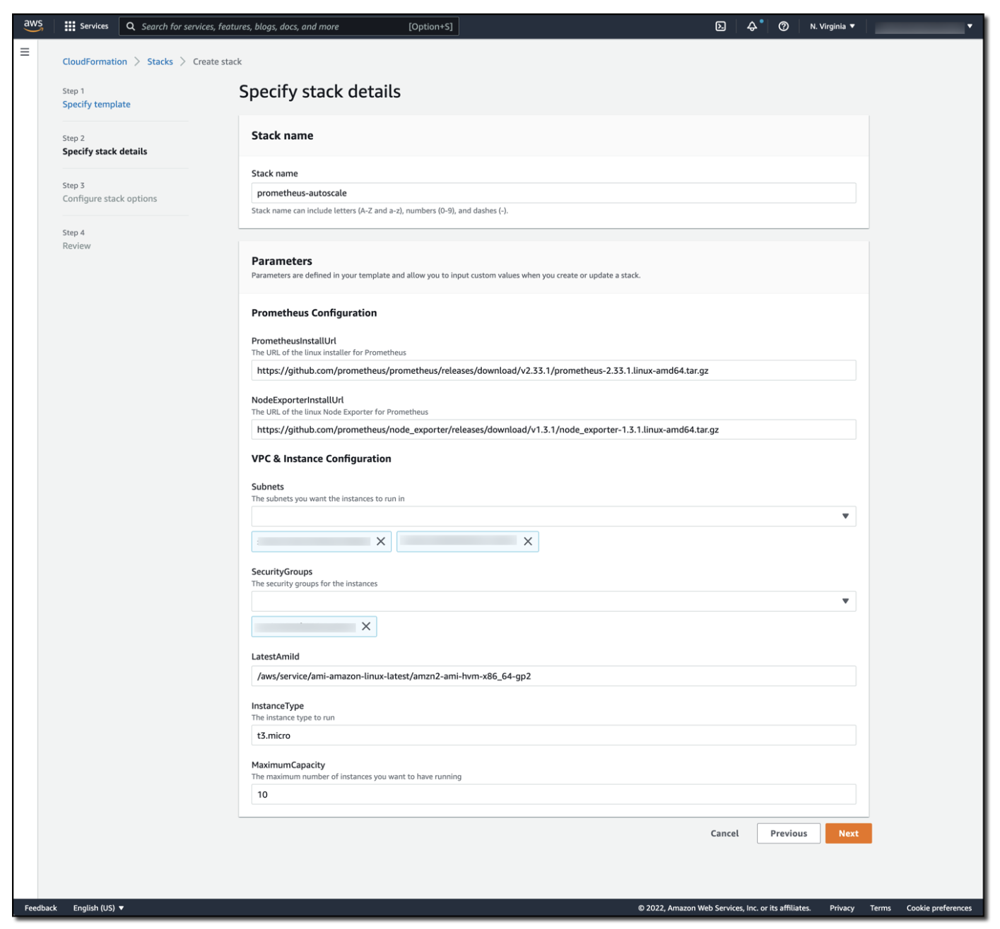

# Auto-scaling Amazon EC2 using Amazon Managed Service for Prometheus and alert manager

Customers want to migrate their existing Prometheus workloads to the cloud and utilize all that the cloud offers. AWS has services like Amazon [EC2 Auto Scaling](https://aws.amazon.com/ec2/autoscaling/), which lets you scale out [Amazon Elastic Compute Cloud (Amazon EC2)](https://aws.amazon.com/pm/ec2/) instances based on metrics like CPU or memory utilization. Applications that use Prometheus metrics can easily integrate into EC2 Auto Scaling without needing to replace their monitoring stack. In this post, I will walk you through configuring Amazon EC2 Auto Scaling to work with [Amazon Managed Service for Prometheus Alert Manager](https://aws.amazon.com/prometheus/). This approach lets you move a Prometheus-based workload to the cloud while taking advantage of services like autoscaling.

Amazon Managed Service for Prometheus provides support for [alerting rules](https://docs.aws.amazon.com/prometheus/latest/userguide/AMP-Ruler.html) that use [PromQL](https://prometheus.io/docs/prometheus/latest/querying/basics/). The [Prometheus alerting rules documentation](https://prometheus.io/docs/prometheus/latest/configuration/alerting_rules/) provides the syntax and examples of valid alerting rules. Likewise, the Prometheus alert manager documentation references both the [syntax](https://prometheus.io/docs/prometheus/latest/configuration/template_reference/) and [examples](https://prometheus.io/docs/prometheus/latest/configuration/template_examples/) of valid alert manager configurations.

## Solution overview

First, let’s briefly review Amazon EC2 Auto Scaling‘s concept of an [Auto Scaling group](https://docs.aws.amazon.com/autoscaling/ec2/userguide/auto-scaling-groups.html) which is a logical collection of Amazon EC2 instances. An Auto Scaling group can launch EC2 instances based on a predefined launch template. The [launch template](https://docs.aws.amazon.com/AWSEC2/latest/UserGuide/ec2-launch-templates.html) contains information used to launch the Amazon EC2 instance, including the AMI ID, the instance type, network settings, and [AWS Identity and Access Management (IAM)](https://aws.amazon.com/iam/) instance profile.

Amazon EC2 Auto Scaling groups have a [minimum size, maximum size, and desired capacity](https://docs.aws.amazon.com/autoscaling/ec2/userguide/what-is-amazon-ec2-auto-scaling.html) concepts. When Amazon EC2 Auto Scaling detects that the current running capacity of the Auto Scaling group is above or below the desired capacity, it will automatically scale out or scale in as needed. This scaling approach lets you utilize elasticity within your workload while still keeping bounds on both capacity and costs.

To demonstrate this solution, I have created an Amazon EC2 Auto Scaling group that contains two Amazon EC2 instances. These instances [remote write instance metrics](https://docs.aws.amazon.com/prometheus/latest/userguide/AMP-onboard-ingest-metrics-remote-write-EC2.html) to an Amazon Managed Service for Prometheus workspace. I have set the Auto Scaling group’s minimum size to two (to maintain high availability), and I’ve set the group’s maximum size to 10 (to help control costs). As more traffic hits the solution, additional Amazon EC2 instances are automatically added to support the load, up to the Amazon EC2 Auto Scaling group’s maximum size. As the load decreases, those Amazon EC2 instances are terminated until the Amazon EC2 Auto Scaling group reaches the group’s minimum size. This approach lets you have a performant application by utilizing the elasticity of the cloud.

Note that as you scrape more and more resources, you could quickly overwhelm the capabilities of a single Prometheus server. You can avoid this situation by scaling Prometheus servers linearly with the workload. This approach ensures that you can collect metric data at the granularity that you want.

To support the Auto Scaling of a Prometheus workload, I have created an Amazon Managed Service for Prometheus workspace with the following rules:

` YAML `
```
groups:
- name: example
  rules:
  - alert: HostHighCpuLoad
    expr: 100 - (avg(rate(node_cpu_seconds_total{mode="idle"}[2m])) * 100) > 60
    for: 5m
    labels:
      severity: warning
      event_type: scale_up
    annotations:
      summary: Host high CPU load (instance {{ $labels.instance }})
      description: "CPU load is > 60%\n  VALUE = {{ $value }}\n  LABELS = {{ $labels }}"
  - alert: HostLowCpuLoad
    expr: 100 - (avg(rate(node_cpu_seconds_total{mode="idle"}[2m])) * 100) < 30
    for: 5m
    labels:
      severity: warning
      event_type: scale_down
    annotations:
      summary: Host low CPU load (instance {{ $labels.instance }})
      description: "CPU load is < 30%\n  VALUE = {{ $value }}\n  LABELS = {{ $labels }}"

```

This rules set creates a ` HostHighCpuLoad ` and a ` HostLowCpuLoad ` rules. These alerts trigger when the CPU is greater than 60% or less than 30% utilization over a five-minute period.

After raising an alert, the alert manager will forward the message into an Amazon SNS topic, passing an ` alert_type ` (the alert name) and ` event_type ` (scale_down or scale_up).

` YAML `
```
alertmanager_config: |
  route: 
    receiver: default_receiver
    repeat_interval: 5m
        
  receivers:
    - name: default_receiver
      sns_configs:
        - topic_arn: <ARN OF SNS TOPIC GOES HERE>
          send_resolved: false
          sigv4:
            region: us-east-1
          message: |
            alert_type: {{ .CommonLabels.alertname }}
            event_type: {{ .CommonLabels.event_type }}

```

An AWS [Lambda](https://aws.amazon.com/lambda/) function is subscribed to the Amazon SNS topic. I have written logic in the Lambda function to inspect the Amazon SNS message and determine if a ` scale_up ` or ` scale_down ` event should happen. Then, the Lambda function increments or decrements the desired capacity of the Amazon EC2 Auto Scaling group. The Amazon EC2 Auto Scaling group detects a requested change in capacity, and then invokes or deallocates Amazon EC2 instances.

The Lambda code to support Auto Scaling is as follows:

` Python `
```
import json
import boto3
import os

def lambda_handler(event, context):
    print(event)
    msg = event['Records'][0]['Sns']['Message']
    
    scale_type = ''
    if msg.find('scale_up') > -1:
        scale_type = 'scale_up'
    else:
        scale_type = 'scale_down'
    
    get_desired_instance_count(scale_type)
    
def get_desired_instance_count(scale_type):
    
    client = boto3.client('autoscaling')
    asg_name = os.environ['ASG_NAME']
    response = client.describe_auto_scaling_groups(AutoScalingGroupNames=[ asg_name])

    minSize = response['AutoScalingGroups'][0]['MinSize']
    maxSize = response['AutoScalingGroups'][0]['MaxSize']
    desiredCapacity = response['AutoScalingGroups'][0]['DesiredCapacity']
    
    if scale_type == "scale_up":
        desiredCapacity = min(desiredCapacity+1, maxSize)
    if scale_type == "scale_down":
        desiredCapacity = max(desiredCapacity - 1, minSize)
    
    print('Scale type: {}; new capacity: {}'.format(scale_type, desiredCapacity))
    response = client.set_desired_capacity(AutoScalingGroupName=asg_name, DesiredCapacity=desiredCapacity, HonorCooldown=False)

```

The full architecture can be reviewed in the following figure.


## Testing out the solution

You can launch an AWS CloudFormation template to automatically provision this solution.

Stack prerequisites:

* An [Amazon Virtual Private Cloud (Amazon VPC)](https://aws.amazon.com/vpc/)
* An AWS Security Group that allows outbound traffic

Select the Download Launch Stack Template link to download and set up the template in your account. As part of the configuration process, you must specify the subnets and the security groups that you want associated with the Amazon EC2 instances. See the following figure for details.

[## Download Launch Stack Template ](https://prometheus-autoscale.s3.amazonaws.com/prometheus-autoscale.template)



This is the CloudFormation stack details screen, where the stack name has been set as prometheus-autoscale. The stack parameters include a URL of the Linux installer for Prometheus, the URL for the Linux Node Exporter for Prometheus, the subnets and security groups used in the solution, the AMI and instance type to use, and the maximum capacity of the Amazon EC2 Auto Scaling group.

The stack will take approximately eight minutes to deploy. Once complete, you will find two Amazon EC2 instances that have been deployed and are running in the Amazon EC2 Auto Scaling group that has been created for you. To validate that this solution auto-scales via Amazon Managed Service for Prometheus Alert Manager, you apply load to the Amazon EC2 instances using the [AWS Systems Manager Run Command](https://docs.aws.amazon.com/systems-manager/latest/userguide/execute-remote-commands.html) and the [AWSFIS-Run-CPU-Stress automation document](https://docs.aws.amazon.com/fis/latest/userguide/actions-ssm-agent.html#awsfis-run-cpu-stress).

As stress is applied to the CPUs in the Amazon EC2 Auto Scaling group, alert manager publishes these alerts, which the Lambda function responds to by scaling up the Auto Scaling group.  As CPU consumption decreases, the low CPU alert in the Amazon Managed Service for Prometheus workspace fires, alert manager publishes the alert to the Amazon SNS topic, and the Lambda function responds by responds by scaling down the Auto Scaling group, as demonstrated in the following figure.


The Grafana dashboard has a line showing that CPU has spiked to 100%. Although the CPU is high, another line shows that the number of instances has stepped up from 2 to 10. Once CPU has decreased, the number of instances slowly decreases back down to 2.

## Costs

Amazon Managed Service for Prometheus is priced based on the metrics ingested, metrics stored, and metrics queried. Visit the [Amazon Managed Service for Prometheus pricing page](https://aws.amazon.com/prometheus/pricing/) for the latest pricing and pricing examples.

Amazon SNS is priced based on the number of monthly API requests made. Message delivery between Amazon SNS and Lambda is free, but it does charge for the amount of data transferred between Amazon SNS and Lambda. See the [latest Amazon SNS pricing details](https://aws.amazon.com/sns/pricing/).

Lambda is priced based on the duration of your function execution and the number of requests made to the function. See the latest [AWS Lambda pricing details](https://aws.amazon.com/lambda/pricing/).

There are [no additional charges for using](https://aws.amazon.com/ec2/autoscaling/pricing/) Amazon EC2 Auto Scaling.

## Conclusion

By using Amazon Managed Service for Prometheus, alert manager, Amazon SNS, and Lambda, you can control the scaling activities of an Amazon EC2 Auto Scaling group. The solution in this post demonstrates how you can move existing Prometheus workloads to AWS, while also utilizing Amazon EC2 Auto Scaling. As load increases to the application, it seamlessly scales to meet demand.

In this example, the Amazon EC2 Auto Scaling group scaled based on CPU, but you can follow a similar approach for any Prometheus metric from your workload. This approach provides fine-grained control over scaling actions, thereby making sure that you can scale your workload on the metric that provides the most business value.

In previous blog posts, we’ve also demonstrated how you can use [Amazon Managed Service for Prometheus Alert Manager to receive alerts with PagerDuty](https://aws.amazon.com/blogs/mt/using-amazon-managed-service-for-prometheus-alert-manager-to-receive-alerts-with-pagerduty/) and [how to integrate Amazon Managed Service for Prometheus with Slack](https://aws.amazon.com/blogs/mt/how-to-integrate-amazon-managed-service-for-prometheus-with-slack/). These solutions show how you can receive alerts from your workspace in the way that is most useful to you.

For next steps, see how to [create your own rules configuration file](https://docs.aws.amazon.com/prometheus/latest/userguide/AMP-rules-upload.html) for Amazon Managed Service for Prometheus, and set up your own [alert receiver](https://docs.aws.amazon.com/prometheus/latest/userguide/AMP-alertmanager-receiver.html). Moreover, check out [Awesome Prometheus alerts](https://awesome-prometheus-alerts.grep.to/alertmanager) for some good examples of alerting rules that can be used within alert manager.