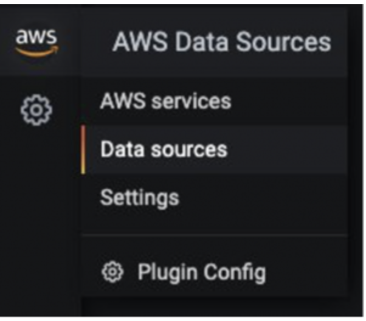
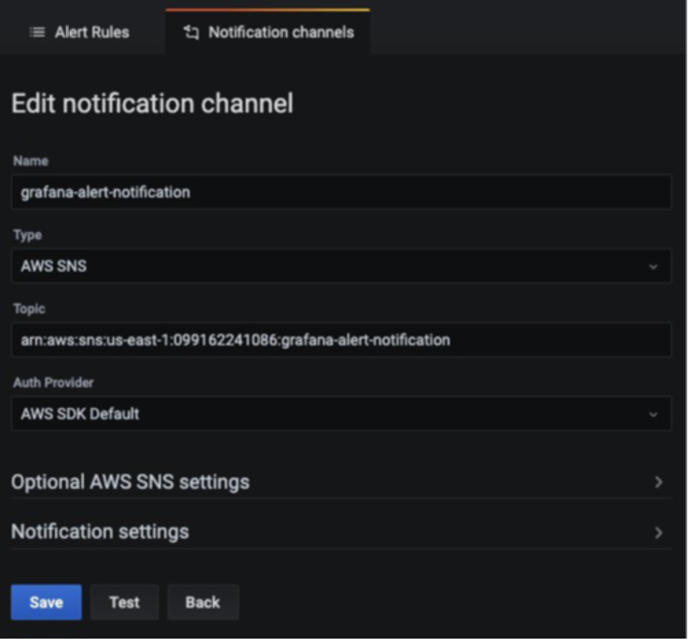

# Monitoring hybrid environments using Amazon Managed Service for Grafana

In this recipe we show you how to visualize metrics from an Azure Cloud environment to [Amazon Managed Service for Grafana](https://aws.amazon.com/grafana/) (AMG) and create alert notifications in AMG to be sent to [Amazon Simple Notification Service](https://docs.aws.amazon.com/sns/latest/dg/welcome.html) and Slack.


As part of the implementation, we will create an AMG workspace, configure the Azure Monitor plugin as the data source for AMG and configure the Grafana dashboard. We will be creating two notification channels: one for Amazon SNS and one for slack.We will also configure alerts in the AMG dashboard to be sent to the notification channels.

!!! note
    This guide will take approximately 30 minutes to complete.

## Infrastructure
In the following section we will be setting up the infrastructure for this recipe. 

### Prerequisites

* The AWS CLI is [installed](https://docs.aws.amazon.com/cli/latest/userguide/cli-chap-install.html) and [configured](https://docs.aws.amazon.com/cli/latest/userguide/cli-chap-configure.html) in your environment.
* You need to enable [AWS-SSO](https://docs.aws.amazon.com/singlesignon/latest/userguide/step1.html)

### Architecture


First, create an AMG workspace to visualize the metrics from Azure Monitor. Follow the steps in the [Getting Started with Amazon Managed Service for Grafana](https://aws.amazon.com/blogs/mt/amazon-managed-grafana-getting-started/) blog post. After you create the workspace, you can assign access to the Grafana workspace to an individual user or a user group. By default, the user has a user type of viewer. Change the user type based on the user role.

!!! Note 
    You must assign an Admin role to at least one user in the workspace.

In Figure 1, the user name is grafana-admin. The user type is Admin. On the Data sources tab, choose the required data source. Review the configuration, and then choose Create workspace.


### Configure the data source and custom dashboard

Now, under Data sources, configure the Azure Monitor plugin to start querying and visualizing the metrics from the Azure environment. Choose Data sources to add a data source.


In Add data source, search for Azure Monitor and then configure the parameters from the app registration console in the Azure environment.


To configure the Azure Monitor plugin, you need the directory (tenant) ID and the application (client) ID. For instructions, see the [article](https://docs.microsoft.com/en-us/azure/active-directory/develop/howto-create-service-principal-portal) about creating an Azure AD application and service principal. It explains how to register the app and grant access to Grafana to query the data.


After the data source is configured, import a custom dashboard to analyze the Azure metrics. In the left pane, choose the + icon, and then choose Import.

In Import via grafana.com, enter the dashboard ID, 10532.


This will import the Azure Virtual Machine dashboard where you can start analyzing the Azure Monitor metrics. In my setup, I have a virtual machine running in the Azure environment.


### Configure the notification channels on AMG

In this section, you’ll configure two notifications channels and then send alerts.

Use the following command to create an SNS topic named grafana-notification and subscribe an email address.

```
aws sns create-topic --name grafana-notification
aws sns subscribe --topic-arn arn:aws:sns:<region>:<account-id>:grafana-notification --protocol email --notification-endpoint <email-id>

```
In the left pane, choose the bell icon to add a new notification channel.
Now configure the grafana-notification notification channel. On Edit notification channel, for Type, choose AWS SNS. For Topic, use the ARN of the SNS topic you just created. For Auth Provider, choose the workspace IAM role.



### Slack notification channel 
To configure a Slack notification channel, create a Slack workspace or use an existing one. Enable Incoming Webhooks as described in [Sending messages using Incoming Webhooks](https://api.slack.com/messaging/webhooks).

After you’ve configured the workspace, you should be able to get a webhook URL that will be used in the Grafana dashboard.


### Configure alerts in AMG

You can configure Grafana alerts when the metric increases beyond the threshold. With AMG, you can configure how often the alert must be evaluated in the dashboard and send the notification. In this example, configure an alert for CPU utilization for an Azure virtual machine. When the utilization exceeds a threshold, configure AMG to send notifications to both channels.

In the dashboard, choose CPU utilization from the dropdown, and then choose Edit. On the Alert tab of the graph panel, configure how often the alert rule should be evaluated and the conditions that must be met for the alert to change state and initiate its notifications.

In the following configuration, an alert is created if the CPU utilization exceeds 50%. Notifications will be sent to the grafana-alert-notification and slack-alert-notification channels.


Now, you can sign in to the Azure virtual machine and initiate stress testing using tools like stress. When the CPU utilization exceeds the threshold, you will receive notifications on both channels.

Now configure alerts for CPU utilization with the right threshold to simulate an alert that is sent to the Slack channel.

## Conclusion

In the recipe, we showed you how to deploy the AMG workspace, configure notification channels, collect metrics from Azure Cloud, and configure alerts on the AMG dashboard. Because AMG is a fully managed, serverless solution, you can spend your time on the applications that transform your business and leave the heavy lifting of managing Grafana to AWS.
