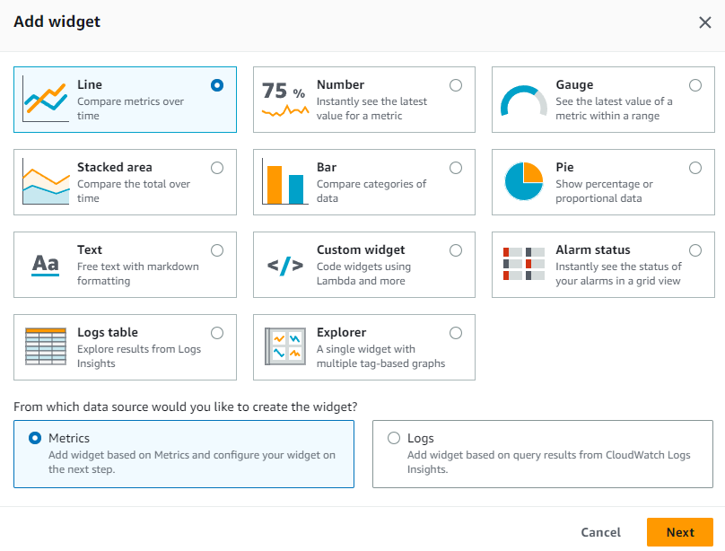
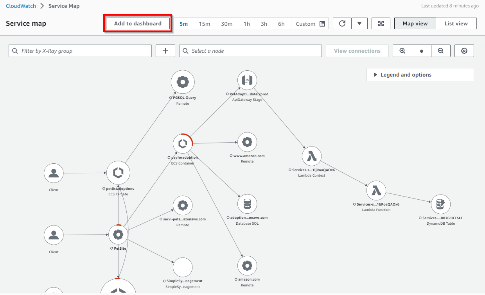
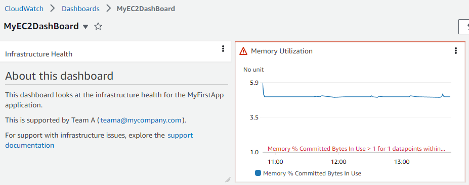

# CloudWatch Dashboard

## Introduction

Getting to know the inventory details of resources in AWS accounts, the resources performance and health checks is important for a stable resource management. Amazon CloudWatch dashboards are customizable home pages in CloudWatch console that can be used to monitor your resources in a single view, even if those resources are cross-account or spread across different regions.

[Amazon CloudWatch dashboards](https://docs.aws.amazon.com/AmazonCloudWatch/latest/monitoring/CloudWatch_Dashboards.html) enable customers to create reusable graphs and visualize cloud resources and applications in a unified view. Through CloudWatch dashboards customers can graph metrics and logs data side by side in a unified view to quickly get the context and move from diagnosing the problem to understanding the root cause & by reducing the mean time to recover or resolve (MTTR). For example, customers can visualize current utilization of key metrics like CPU utilization & memory and compare them to allocated capacity. Customers can also correlate log pattern of a specific metric and set alarms to alert on performance and operational issues. CloudWatch dashboard also helps customers display the current status of alarms to quickly visualize & get their attention for action. Sharing of CloudWatch dashboards allow customers to easily share displayed dashboard information to teams and or stakeholders who are internal or external to the organizations.

## Widgets

#### Default Widgets

Widgets form the building blocks of CloudWatch dashboards that display important information & near real time details of resources and application metrics and logs in AWS environment. Customers can customize dashboards to their desired experience by adding, removing, rearranging, or resizing widgets according to their requirements.

The types of graphs that you can add to your dashboard include Line, Number, Gauge, Stacked area, Bar and Pie.

There are default widget types like **Line, Number, Gauge, Stacked area, Bar, Pie** which are of **Graph** type and other widgets like **Text, Alarm Status, Logs table, Explorer** are also available for customers to choose for adding Metrics or Logs data to build dashboards.



**Additional References:**

- AWS Observability Workshop on [Metric Number Widgets](https://catalog.workshops.aws/observability/en-US/aws-native/dashboards/metrics-number)
- AWS Observability Workshop on [Text Widgets](https://catalog.workshops.aws/observability/en-US/aws-native/dashboards/text-widget)
- AWS Observability Workshop on [Alarm Widgets](https://catalog.workshops.aws/observability/en-US/aws-native/dashboards/alarm-widgets)
- Documentation on [Creating and working with widgets on CloudWatch dashboards](https://docs.aws.amazon.com/AmazonCloudWatch/latest/monitoring/create-and-work-with-widgets.html)

#### Custom Widgets

Customers can also choose to [add custom widget](https://docs.aws.amazon.com/AmazonCloudWatch/latest/monitoring/create-and-work-with-widgets.html) in CloudWatch dashboards to experience custom visualizations, display information from multiple sources or add custom controls like buttons to take actions directly in a CloudWatch Dashboard. Custom Widgets are completely serverless powered by Lambda functions, enabling complete control over the content, layout and interactions. Custom Widget is an easy way to build custom data view or tool on a dashboard which doesn’t need complicated web framework to learn. If you can write code in Lambda and create HTML then you can create a useful custom widget.


**Additional References:**

- AWS Observability Workshop on [custom widgets](https://catalog.workshops.aws/observability/en-US/aws-native/dashboards/custom-widgets)
- [CloudWatch Custom Widgets Samples](https://github.com/aws-samples/cloudwatch-custom-widgets-samples#what-are-custom-widgets) on GitHub
- Blog: [Using Amazon CloudWatch dashboards custom widgets](https://aws.amazon.com/blogs/mt/introducing-amazon-cloudwatch-dashboards-custom-widgets/)

## Automatic Dashboards

Automatic Dashboards are available in all AWS public regions which provide an aggregated view of the health and performance of all AWS resources under Amazon CloudWatch. This helps customers quickly get started with monitoring, resource-based view of metrics and alarms, and easily drill-down to understand the root cause of performance issues. Automatic Dashboards are pre-built with AWS service recommended [best practices](https://docs.aws.amazon.com/prescriptive-guidance/latest/implementing-logging-monitoring-cloudwatch/cloudwatch-dashboards-visualizations.html), remain resource aware, and dynamically update to reflect the latest state of important performance metrics. Automatic service dashboards display all the standard CloudWatch metrics for a service, graph all resources used for each service metric and help customers quickly identify outlier resources across accounts that can help identify resources with high or low utilization, which can help optimize costs.


**Additional References:**

- AWS Observability Workshop on [Automatic dashboards](https://catalog.workshops.aws/observability/en-US/aws-native/dashboards/autogen-dashboard)
- [Monitor AWS Resources Using Amazon CloudWatch Dashboards](https://www.youtube.com/watch?v=I7EFLChc07M) on YouTube

#### Container Insights in Automatic dashboards

[CloudWatch Container Insights](https://docs.aws.amazon.com/AmazonCloudWatch/latest/monitoring/ContainerInsights.html) collect, aggregate, and summarize metrics and logs from containerized applications and microservices. Container Insights is available for Amazon Elastic Container Service (Amazon ECS), Amazon Elastic Kubernetes Service (Amazon EKS), and Kubernetes platforms on Amazon EC2. Container Insights supports collecting metrics from clusters deployed on Fargate for both Amazon ECS and Amazon EKS. CloudWatch automatically collects metrics for many resources, such as CPU, memory, disk, and network & also provides diagnostic information, such as container restart failures, to help isolate issues and resolve them quickly.

CloudWatch creates aggregated metrics at the cluster, node, pod, task, and service level as CloudWatch metrics using [embedded metric format](https://aws-observability.github.io/observability-best-practices/guides/signal-collection/emf/), which are performance log events that use a structured JSON schema that enables high-cardinality data to be ingested and stored at scale. The metrics that Container Insights collects are available in [CloudWatch automatic dashboards](https://docs.aws.amazon.com/prescriptive-guidance/latest/implementing-logging-monitoring-cloudwatch/cloudwatch-dashboards-visualizations.html#use-automatic-dashboards), and also viewable in the Metrics section of the CloudWatch console.


#### Lambda Insights in Automatic dashboards

[CloudWatch Lambda Insights](https://docs.aws.amazon.com/lambda/latest/dg/monitoring-insights.html) is a monitoring and troubleshooting solution for serverless applications such as AWS Lambda, which creates dynamic, [automatic dashboards](https://docs.aws.amazon.com/prescriptive-guidance/latest/implementing-logging-monitoring-cloudwatch/cloudwatch-dashboards-visualizations.html#use-automatic-dashboards) for Lambda functions. It also collects, aggregates and summarizes system-level metrics, including CPU time, memory, disk, and network and diagnostic information such as cold starts and Lambda worker shutdowns to help isolate and quickly resolve issues with Lambda functions. [Lambda Insights](https://docs.aws.amazon.com/AmazonCloudWatch/latest/monitoring/Lambda-Insights.html) is a Lambda extension provided as a layer at the function level which when enabled uses [embedded metric format](https://aws-observability.github.io/observability-best-practices/guides/signal-collection/emf/) to extract metrics from the log events and doesn’t require any agents.


## Custom Dashboards

Customers can also create [Custom Dashboards](https://docs.aws.amazon.com/AmazonCloudWatch/latest/monitoring/create_dashboard.html) as many additional dashboards as they want with different widgets and customize it accordingly. Dashboards can be configured for cross-region & cross account view and can be added to a favorites list.


Customers can add automatic or custom dashboards to the [favorite list](https://docs.aws.amazon.com/AmazonCloudWatch/latest/monitoring/add-dashboard-to-favorites.html) in the CloudWatch console so that its quick and easy to access them from the navigation pane in the console page.

**Additional References:**

- AWS Observability Workshop on [CloudWatch dashboard](https://catalog.workshops.aws/observability/en-US/aws-native/dashboards/create)
- AWS Well-Architected Labs on Performance Efficiency for [monitoring with CloudWatch Dashboards](https://www.wellarchitectedlabs.com/performance-efficiency/100_labs/100_monitoring_windows_ec2_cloudwatch/)

#### Adding Contributor Insights to CloudWatch dashboards

CloudWatch provides [Contributor Insights](https://docs.aws.amazon.com/AmazonCloudWatch/latest/monitoring/ContributorInsights.html) to analyze log data and create time series that display contributor data, where you can see metrics about the top-N contributors, the total number of unique contributors, and their usage. This helps you find top talkers and understand who or what is impacting system performance. For example, customers can find bad hosts, identify the heaviest network users, or find URLs that generate the most errors.

Contributor Insights reports can be added to any [new or existing Dashboards](https://docs.aws.amazon.com/AmazonCloudWatch/latest/monitoring/ContributorInsights-ViewReports.html) in CloudWatch console.


#### Adding Application Insights to CloudWatch dashboards

[CloudWatch Application Insights](https://docs.aws.amazon.com/AmazonCloudWatch/latest/monitoring/cloudwatch-application-insights.html) facilitates observability for applications hosted on AWS and their underlying AWS resources which enhances visibility into the health of applications that it provides helps reduce mean time to repair (MTTR) to troubleshoot application issues. Application Insights provides automated dashboards that show potential problems with monitored applications, which help customers quickly isolate ongoing issues with the applications and infrastructure.

The ‘Export to CloudWatch’ option inside Application Insights as shown below adds a dashboard in CloudWatch console which helps customers easily monitor their critical application for insights.


#### Adding Service Map to CloudWatch dashboards

[CloudWatch ServiceLens](https://docs.aws.amazon.com/AmazonCloudWatch/latest/monitoring/ServiceLens.html) enhances the observability of services and applications by integrating traces, metrics, logs, alarms, and other resource health information in one place. ServiceLens integrates CloudWatch with AWS X-Ray to provide an end-to-end view of the application to help customers more efficiently pinpoint performance bottlenecks and identify impacted users. A [service map](https://docs.aws.amazon.com/AmazonCloudWatch/latest/monitoring/servicelens_service_map.html) displays service endpoints and resources as nodes and highlights the traffic, latency, and errors for each node and its connections. Each displayed node provide detailed insights about the correlated metrics, logs, and traces associated with that part of the service.

‘Add to dashboard’ option inside Service Map as shown below adds a new dashboard or to an existing dashboard in CloudWatch console which helps customers easily trace their application for insights.



#### Adding Metrics Explorer to CloudWatch dashboards

[Metrics explorer](https://docs.aws.amazon.com/AmazonCloudWatch/latest/monitoring/CloudWatch-Metrics-Explorer.html) in CloudWatch is a tag-based tool that enables customers to filter, aggregate and visualize metrics by tags and resource properties to enhance observability for AWS services. Metrics explorer gives flexible and dynamic troubleshooting experience, so that customers can create multiple graphs at a time and use these graphs to build application health dashboards. Metrics explorer visualizations are dynamic, so if a matching resource is created after you create a metrics explorer widget and add it to a CloudWatch dashboard, the new resource automatically appears in the explorer widget.

‘[Add to dashboard](https://docs.aws.amazon.com/AmazonCloudWatch/latest/monitoring/add_metrics_explorer_dashboard.html)’ option inside Metrics Explorer as shown below adds a new dashboard or to an existing dashboard in CloudWatch console which helps customers easily get more graph insights into their AWS Services and resources.


## What to visualize using CloudWatch dashboards

Customer can create dashboards at account and application-level to monitor workloads and applications across regions and accounts. Customers can quickly get started with CloudWatch automatic dashboards, which are AWS service-level dashboards preconfigured with service-specific metrics. It is recommended to create application and workload-specific dashboards that focus on key metrics and resources that are relevant and critical to the application or workload in your production environment.

#### Visualizing metrics data

Metrics data can be added to CloudWatch dashboards through Graph widgets like **Line, Number, Gauge, Stacked area, Bar, Pie**, supported by statistics on metrics through **Average, Minimum, Maximum, Sum, and SampleCount**. [Statistics](https://docs.aws.amazon.com/AmazonCloudWatch/latest/monitoring/Statistics-definitions.html) are metric data aggregations over specified periods of time.


[Metric math](https://docs.aws.amazon.com/AmazonCloudWatch/latest/monitoring/using-metric-math.html) enables to query multiple CloudWatch metrics and use math expressions to create new time series based on these metrics. Customers can visualize the resulting time series on the CloudWatch console and add them to dashboards. Customers also perform metric math programmatically using the [GetMetricDataAPI](https://docs.aws.amazon.com/AmazonCloudWatch/latest/APIReference/API_GetMetricData.html) operation.

**Additional Reference:**

- [Monitoring your IoT fleet using CloudWatch](https://aws.amazon.com/blogs/iot/monitoring-your-iot-fleet-using-cloudwatch/)

#### Visualizing logs data

Customers can achieve [visualizations of logs data](https://docs.aws.amazon.com/AmazonCloudWatch/latest/logs/CWL_Insights-Visualizing-Log-Data.html) in CloudWatch dashboards using bar charts, line charts, and stacked area charts to more efficiently identify patterns. CloudWatch Logs Insights generates visualizations for queries that use the stats function and one or more aggregation functions that can produce bar charts. If the query uses bin() function to [group the data](https://docs.aws.amazon.com/AmazonCloudWatch/latest/logs/CWL_Insights-Visualizing-Log-Data.html#CWL_Insights-Visualizing-ByFields) by one field over time, then line charts and stacked area charts can be used for visualization.

[Time series data](https://docs.aws.amazon.com/AmazonCloudWatch/latest/logs/CWL_Insights-Visualizing-Log-Data.html#CWL_Insights-Visualizing-TimeSeries) can be visualized using the characteristics if the query contains one or more aggregation of status functions or if the query uses the bin() function to group the data by one field.

A sample query with count() as stats function is shown below

```java
filter @message like /GET/
| parse @message '_ - - _ "GET _ HTTP/1.0" .*.*.*' as ip, timestamp, page, status, responseTime, bytes
| stats count() as request_count by status
```

For the above query, the results are shown below in the CloudWatch Logs Insights.


Visualization of the query results as a pie chart is shown below.


**Additional Reference:**

- AWS Observability Workshop on [displaying log results](https://catalog.workshops.aws/observability/en-US/aws-native/logs/logsinsights/displayformats) in CloudWatch dashboard.
- [Visualize AWS WAF logs with an Amazon CloudWatch dashboard](https://aws.amazon.com/blogs/security/visualize-aws-waf-logs-with-an-amazon-cloudwatch-dashboard/)

#### Visualizing alarms

Metric alarm in CloudWatch watches a single metric or the result of a math expression based on CloudWatch metrics. The alarm performs one or more actions based on the value of the metric or expression relative to a threshold over a time period. [CloudWatch dashboards](https://docs.aws.amazon.com/AmazonCloudWatch/latest/monitoring/add_remove_alarm_dashboard.html) can be added with a single alarm in a widget, which displays the graph of the alarm's metric and also displays the alarm status. Also, an alarm status widget can be added to CloudWatch dashboard which displays the status of multiple alarms in a grid. Only the alarm names and current status are displayed, Graphs are not displayed.

A sample metric alarm status captured in a alarm widget inside a CloudWatch dashboard is shown below.



## Cross-account & Cross-region

Customers having multiple AWS accounts can set up [CloudWatch cross-account](https://docs.aws.amazon.com/AmazonCloudWatch/latest/monitoring/cloudwatch_crossaccount_dashboard.html) observability and then create rich cross-account dashboards in central monitoring accounts, through which they can seamlessly search, visualize, and analyze metrics, logs, and traces without account boundaries.

Customers can also create [cross-account cross-region](https://docs.aws.amazon.com/AmazonCloudWatch/latest/monitoring/cloudwatch_xaxr_dashboard.html) dashboards, which summarize CloudWatch data from multiple AWS accounts and multiple regions into a single dashboard. From this high-level dashboard customers can get a unified view of the entire application, and also drill down into more specific dashboards without having to sign in & out of accounts or switch between regions.

**Additional References:**

- [How to auto add new cross-account Amazon EC2 instances in a central Amazon CloudWatch dashboard](https://aws.amazon.com/blogs/mt/how-to-auto-add-new-cross-account-amazon-ec2-instances-in-a-central-amazon-cloudwatch-dashboard/)
- [Deploy Multi-Account Amazon CloudWatch Dashboards](https://aws.amazon.com/blogs/mt/deploy-multi-account-amazon-cloudwatch-dashboards/)
- [Create Cross Account & Cross Region CloudWatch Dashboards](https://www.youtube.com/watch?v=eIUZdaqColg) on YouTube

## Sharing dashboards

CloudWatch dashboards can be shared with people across teams, with stakeholders and with people external to your organization who do not have direct access to your AWS account. These [shared dashboards](https://docs.aws.amazon.com/AmazonCloudWatch/latest/monitoring/cloudwatch-dashboard-sharing.html) can even be displayed on big screens in team areas, monitoring or network operations centers (NOC) or embed them in Wikis or public webpages.

There are three ways to share dashboards to make it easy and secure.

- a dashboard can be [shared publicly](https://docs.aws.amazon.com/AmazonCloudWatch/latest/monitoring/cloudwatch-dashboard-sharing.html#share-cloudwatch-dashboard-public) so that anyone having the link can view the dashboard.
- a dashboard can be [shared to specific email addresses](https://docs.aws.amazon.com/AmazonCloudWatch/latest/monitoring/cloudwatch-dashboard-sharing.html#share-cloudwatch-dashboard-email-addresses) of the people who can view the dashboard. Each of these users creates their own password that they enter to view the dashboard.
- dashboards can be shared within AWS accounts with access through a [single sign-on (SSO) provider](https://docs.aws.amazon.com/AmazonCloudWatch/latest/monitoring/cloudwatch-dashboard-sharing.html#share-cloudwatch-dashboards-setup-SSO).

**Things to note while sharing dashboards publicly**

Sharing of CloudWatch dashboards publicly is not recommended if the dashboard contains any sensitive or confidential information. Whenever possible, it is recommended to make use of authentication through username/password or single sign-on (SSO) while sharing dashboards.

When dashboards are made publicly accessible, CloudWatch generates a link to a web page which hosts the dashboard. Anyone viewing the web page will also be able to see the contents of the publicly shared dashboard. The web page provides temporary credentials through the link to call APIs to query alarms and contributor insights rules in the Dashboard which you share, and to all metrics and the names and tags of all EC2 instances in your account even if they are not shown in the Dashboard which you share. We recommend you to consider whether it is appropriate to make this information publicly available.

Please note that when you enable sharing of dashboards publicly to the web page, the following Amazon Cognito resources will be created in your account: Cognito user pool; Cognito app client; Cognito Identity pool and IAM role.

**Things to note while sharing dashboards using credentials (Username and password protected dashboard)**

Sharing of CloudWatch dashboards is not recommended if the dashboard contains any sensitive or confidential information which you would not wish to share with the users with whom you are sharing the dashboard.

When dashboards are enabled for sharing, CloudWatch generates a link to a web page which hosts the dashboard. The users that you specified above will be granted the following permissions: CloudWatch read-only permissions to alarms and contributor insights rules in the Dashboard which you share, and to all metrics and the names and tags of all EC2 instances in your account even if they are not shown in the Dashboard which you share. We recommend you to consider whether it is appropriate to make this information available to the users with whom you are sharing.

Please note that when you enable sharing of dashboards for users you specify for access to the web page, the following Amazon Cognito resources will be created in your account: Cognito user pool; Cognito users; Cognito app client; Cognito Identity pool and IAM role.

**Things to note while sharing dashboards using SSO Provider**

When CloudWatch dashboards are shared using Single Sign-on (SSO), users registered with the selected SSO provider will be granted permissions to access all dashboards in the account where it is shared. Also, when the sharing of dashboards is disabled in this method, all dashboards are automatically unshared.

**Additional References:**

- AWS Observability Workshop on [sharing dashboards](https://catalog.workshops.aws/observability/en-US/aws-native/dashboards/sharingdashboard)
- Blog: [Share your Amazon CloudWatch Dashboards with anyone using AWS Single Sign-On](https://aws.amazon.com/blogs/mt/share-your-amazon-cloudwatch-dashboards-with-anyone-using-aws-single-sign-on/)
- Blog: [Communicate monitoring information by sharing Amazon CloudWatch dashboards](https://aws.amazon.com/blogs/mt/communicate-monitoring-information-by-sharing-amazon-cloudwatch-dashboards/)

## Live data

CloudWatch dashboards also display [live data](https://docs.aws.amazon.com/AmazonCloudWatch/latest/monitoring/cloudwatch-live-data.html) through metric widgets if the metrics from your workloads are constantly published. Customers can choose to enable live data for a whole dashboard, or for individual widgets on a dashboard.

If live data is turned **off**, only data points with an aggregation period of at least one minute in the past are shown. For example, when using 5-minute periods, the data point for 12:35 would be aggregated from 12:35 to 12:40, and displayed at 12:41.

If live data is turned **on**, the most recent data point is shown as soon as any data is published in the corresponding aggregation interval. Each time you refresh the display, the most recent data point may change as new data within that aggregation period is published.

## Animated Dashboard

[Animated dashboard](https://docs.aws.amazon.com/AmazonCloudWatch/latest/monitoring/cloudwatch-animated-dashboard.html) replays CloudWatch metric data that was captured over time, which helps customers see trends, make presentations, or analyze issues after they occur. Animated widgets in the dashboard include line widgets, stacked area widgets, number widgets, and metrics explorer widgets. Pie graphs, bar charts, text widgets, and logs widgets are displayed in the dashboard but are not animated.

## API/CLI support for CloudWatch Dashboard

Apart from accessing CloudWatch dashboard through the AWS Management Console customers can also access the service via API, AWS command-line interface (CLI) and AWS SDKs. CloudWatch API for dashboards help in automating through AWS CLI or integrating with software/products so that you can spend less time managing or administering the resources and applications.

- [ListDashboards](https://docs.aws.amazon.com/AmazonCloudWatch/latest/APIReference/API_ListDashboards.html): Returns a list of the dashboards for your account
- [GetDashboard](https://docs.aws.amazon.com/AmazonCloudWatch/latest/APIReference/API_GetDashboard.html): Displays the details of the dashboard that you specify.
- [DeleteDashboards](https://docs.aws.amazon.com/AmazonCloudWatch/latest/APIReference/API_DeleteDashboards.html): Deletes all dashboards that you specify.
- [PutDashboard](https://docs.aws.amazon.com/AmazonCloudWatch/latest/APIReference/API_PutDashboard.html): Creates a dashboard if it does not already exist, or updates an existing dashboard. If you update a dashboard, the entire contents are replaced with what you specify here.

CloudWatch API Reference for [Dashboard Body Structure and Syntax](https://docs.aws.amazon.com/AmazonCloudWatch/latest/APIReference/CloudWatch-Dashboard-Body-Structure.html)

The AWS Command Line Interface (AWS CLI) is an open source tool that enables customers to interact with AWS services using commands in command-line shell, that implement functionality equivalent to that provided by the browser-based AWS Management Console from the command prompt in terminal program.

CLI Support:

- [list-dashboards](https://docs.aws.amazon.com/cli/latest/reference/cloudwatch/list-dashboards.html)
- [get-dashboard](https://docs.aws.amazon.com/cli/latest/reference/cloudwatch/get-dashboard.html)
- [delete-dashboards](https://docs.aws.amazon.com/cli/latest/reference/cloudwatch/delete-dashboards.html)
- [put-dashboard](https://docs.aws.amazon.com/cli/latest/reference/cloudwatch/put-dashboard.html)

**Additional Reference:** AWS Observability Workshop on [CloudWatch dashboards and AWS CLI](https://catalog.workshops.aws/observability/en-US/aws-native/dashboards/createcli)

## Automation of CloudWatch Dashboard

For automating creation of CloudWatch dashboards, customers can use Infrastructure as a Code (IaaC) tools like CloudFormation or Terraform that help set up AWS resources so that customers can spend less time managing those resources and more time focusing on applications that run in AWS.

[AWS CloudFormation](https://docs.aws.amazon.com/AWSCloudFormation/latest/UserGuide/aws-resource-cloudwatch-dashboard.html) supports creating dashboards through templates. The AWS::CloudWatch::Dashboard resource specifies an Amazon CloudWatch dashboard.

[Terraform](https://registry.terraform.io/providers/hashicorp/aws/latest/docs/resources/cloudwatch_dashboard) also has modules which support creating CloudWatch dashboards through IaaC automation.

Manually creating dashboards using desired widgets is straight forward. However, it can require some effort to update the resource sources if the content is based on the dynamic information, such as EC2 instances that are created or removed during scale-out and scale-in events in the Auto Scaling group. Please refer to the blog post if you wish to automatically [create and update your Amazon CloudWatch dashboards using Amazon EventBridge and AWS Lambda](https://aws.amazon.com/blogs/mt/update-your-amazon-cloudwatch-dashboards-automatically-using-amazon-eventbridge-and-aws-lambda/).

**Additional Reference Blogs:**

- [Automating Amazon CloudWatch dashboard creation for Amazon EBS volume KPIs](https://aws.amazon.com/blogs/storage/automating-amazon-cloudwatch-dashboard-creation-for-amazon-ebs-volume-kpis/)
- [Automate creation of Amazon CloudWatch alarms and dashboards with AWS Systems Manager and Ansible](https://aws.amazon.com/blogs/mt/automate-creation-of-amazon-cloudwatch-alarms-and-dashboards-with-aws-systems-manager-and-ansible/)
- [Deploying an automated Amazon CloudWatch dashboard for AWS Outposts using AWS CDK](https://aws.amazon.com/blogs/compute/deploying-an-automated-amazon-cloudwatch-dashboard-for-aws-outposts-using-aws-cdk/)

**Product FAQs** on [CloudWatch dashboard](https://aws.amazon.com/cloudwatch/faqs/#Dashboards)
