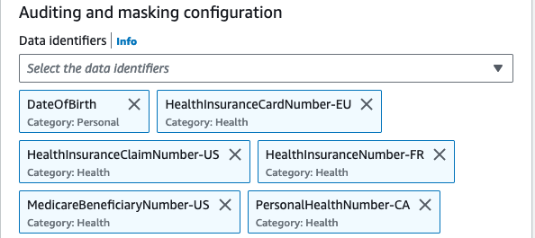

# CloudWatch Logs Data Protection Policies for SLG/EDU

Although logging data is beneficial in general, however, masking them is useful for organizations who have strict regulations such as the Health Insurance Portability and Accountability Act (HIPAA), General Data Privacy Regulation (GDPR), Payment Card Industry Data Security Standard (PCI-DSS), and Federal Risk and Authorization Management Program (FedRAMP).

[Data Protection policies](https://docs.aws.amazon.com/AmazonCloudWatch/latest/logs/cloudwatch-logs-data-protection-policies.html) in CloudWatch Logs enables customers to define and apply data protection policies that scan log data-in-transit for sensitive data and mask sensitive data that is detected.

These policies leverage pattern matching and machine learning models to detect sensitive data and helps you audit and mask those data that appears in events ingested by CloudWatch log groups in your account.

The techniques and criteria used to select sensitive data are referred to as [matching data identifiers](https://docs.aws.amazon.com/AmazonCloudWatch/latest/logs/cloudwatch-logs-data-protection-policies.html). Using these managed data identifiers, CloudWatch Logs can detect:

- Credentials such as private keys or AWS secret access keys
- Device identifiers such as IP addresses or MAC addresses
- Financial information such as bank account number, credit card numbers or credit card verification code
- Protected Health Information (PHI) such as Health Insurance Card Number (EHIC) or Personal health Number
- Personally Identifiable Information (PII) such as driver’s licenses, social security numbers or taxpayer identification numbers

!!! important
    Sensitive data is detected and masked when it is ingested into the log group. When you set a data protection policy, log events ingested to the log group before that time are not masked.

Let us expand on some of the data types mentioned above and see some examples:


## Data Types

### Credentials

Credentials are sensitive data types which are used to verify who you are and whether you have permission to access the resources that you are requesting. AWS uses these credentials like private keys and secret access keys to authenticate and authorize your requests.

Using CloudWatch Logs Data Protection policies, sensitive data that matches the data identifiers you have selected is masked. (We will see a masked example at the end of the section).


!!! Tip
    Data classification best practices start with clearly defined data classification tiers and requirements, which meet your organizational, legal, and compliance standards.

    As a best practice, use tags on AWS resources based on the data classification framework to implement compliance in accordance with your organization data governance policies. 


!!! Tip
    To avoid sensitive data in your log events, best practice is to exclude them in your code in the first place and log only necessary information.


### Financial Information

As defined by the Payment Card Industry Data Security Standard (PCI DSS), bank account, routing numbers, debit and credit card numbers, credit card magnetic strip data are considered as sensitive financial information.

To detect sensitive data, CloudWatch Logs scans for the data identifiers that you specify regardless of the geo-location the log group is located once you set a data protection policy.


!!! info
    Check the full list of [financial data types and data identifiers](https://docs.aws.amazon.com/AmazonCloudWatch/latest/logs/protect-sensitive-log-data-types-financial.html)


### Protected Health Information (PHI)

PHI includes a very wide set of personally identifiable health and health-related data, including insurance and billing information, diagnosis data, clinical care data like medical records and data sets and lab results such as images and test results.

CloudWatch Logs scan and detect the health information from the chosen log group and mask that data.



!!! info
    Check the full list of [phi data types and data identifiers](https://docs.aws.amazon.com/AmazonCloudWatch/latest/logs/protect-sensitive-log-data-types-health.html)


### Personally Identifiable Information (PII)

PII is a textual reference to personal data that could be used to identify an individual. PII examples include addresses, bank account numbers, and phone numbers.


!!! info
    Check the full list of [pii data types and data identifiers](https://docs.aws.amazon.com/AmazonCloudWatch/latest/logs/protect-sensitive-log-data-types-pii.html)


## Masked Logs

Now if you go to your log group where you set your data protection policy, you will see that data protection is `On` and the console also displays a count of sensitive data.


Now, clicking on `View in Log Insights` will take you to the Log Insights console. Running the below query to check the logs events in a log stream will give you a list of all the logs.

```
fields @timestamp, @message
| sort @timestamp desc
| limit 20
```

Once you expand a query, you will see the masked results as shown below:


!!! important
    When you create a data protection policy, then by default, sensitive data that matches the data identifiers you've selected is masked. Only users who have the `logs:Unmask` IAM permission can view unmasked data.


!!! Tip
    Use [AWS IAM and Access Management(IAM)](https://docs.aws.amazon.com/AmazonCloudWatch/latest/monitoring/auth-and-access-control-cw.html) to administer and restrict access to sensitive data in CloudWatch.


!!! Tip
    Regular monitoring and auditing of your cloud environment are equally important in safeguarding sensitive data. It becomes a critical aspect when applications generate a large volume of data and manual and thereby, it is recommended not to log an excessive amount of data. Read this AWS Prescriptive Guidance for [Logging Best Practices](https://docs.aws.amazon.com/prescriptive-guidance/latest/logging-monitoring-for-application-owners/logging-best-practices.html)


!!! Tip
    Log Group Data is always encrypted in CloudWatch Logs. Alternatively, you can also use [AWS Key Management Service](https://docs.aws.amazon.com/AmazonCloudWatch/latest/logs/encrypt-log-data-kms.html) to encrypt your log data.


!!! Tip
    For resiliency and scalability, set up CloudWatch alarms and automate remediation using AWS Amazon EventBridge and AWS Systems Manager. 


[^1]: Check our AWS blog [Protect Sensitive Data with Amazon CloudWatch Logs](https://aws.amazon.com/blogs/aws/protect-sensitive-data-with-amazon-cloudwatch-logs/) to get started.

