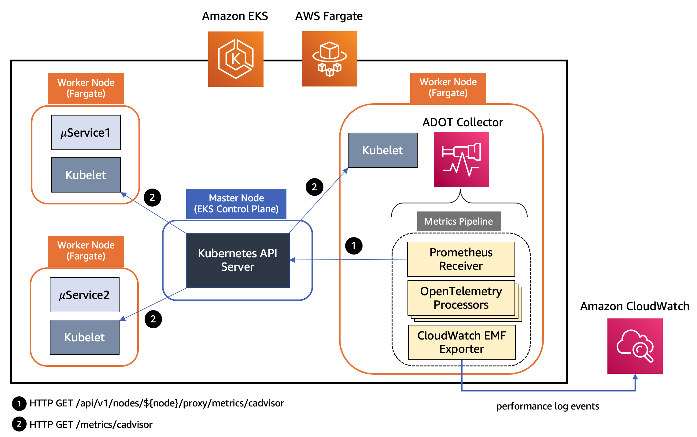

# Amazon CloudWatch Container Insights

このオブザーバビリティのベストプラクティスガイドのセクションでは、Amazon CloudWatch Container Insights に関連する次のトピックを深掘りします。

* Amazon CloudWatch Container Insights の概要
* AWS Distro for OpenTelemetry での Amazon CloudWatch Container Insights の使用
* Amazon EKS 用 CloudWatch Container Insights の Fluent Bit インテグレーション
* Amazon EKS での Container Insights によるコスト削減
* EKS ブループリントを使用した Container Insights のセットアップ

### はじめに

[Amazon CloudWatch Container Insights](https://docs.aws.amazon.com/AmazonCloudWatch/latest/monitoring/ContainerInsights.html) は、コンテナ化されたアプリケーションとマイクロサービスからメトリクスとログを収集、集約、要約するのに役立ちます。メトリクスデータは、[組み込みメトリクスフォーマット](https://docs.aws.amazon.com/AmazonCloudWatch/latest/monitoring/CloudWatch_Embedded_Metric_Format.html)を使用してパフォーマンスログイベントとして収集されます。これらのパフォーマンスログイベントは、高基数データを大規模に取り込み、保存できるように構造化された JSON スキーマを使用します。このデータから、CloudWatch はクラスター、ノード、Pod、タスク、サービスレベルで CloudWatch メトリクスとして集計メトリクスを作成します。Container Insights が収集するメトリクスは、CloudWatch の自動ダッシュボードで利用できます。Container Insights は、セルフマネージドノードグループ、マネージドノードグループ、AWS Fargate プロファイルを持つ Amazon EKS クラスターで利用できます。

コスト最適化の観点から、Container Insights のコストを管理するのに役立てるために、CloudWatch はログデータから可能な限りのすべてのメトリクスを自動的に作成しません。ただし、CloudWatch Logs Insights を使用して生のパフォーマンスログイベントを分析することで、追加のメトリクスとより詳細な粒度のメトリクスを表示できます。Container Insights によって収集されたメトリクスは、カスタムメトリクスとして課金されます。CloudWatch の料金について詳しくは、[Amazon CloudWatch 料金](https://aws.amazon.com/cloudwatch/pricing/) を参照してください。

Amazon EKS では、Container Insights はクラスター内のすべての実行中コンテナを検出するために、Amazon が Amazon Elastic Container Registry を介して提供する [CloudWatch エージェント](https://gallery.ecr.aws/cloudwatch-agent/cloudwatch-agent) のコンテナ化バージョンを使用します。次に、パフォーマンススタックのすべてのレベルでパフォーマンスデータを収集します。Container Insights は、収集するログとメトリクスの暗号化を AWS KMS キーでサポートしています。この暗号化を有効にするには、Container Insights データを受信するロググループに対して、AWS KMS 暗号化を手動で有効にする必要があります。これにより、CloudWatch Container Insights は提供された AWS KMS キーを使用してこのデータを暗号化します。ロググループの暗号化には対称キーのみがサポートされており、非対称 AWS KMS キーはサポートされていません。Container Insights は Linux インスタンスでのみサポートされています。Amazon EKS 用の Container Insights は、[こちらの](https://docs.aws.amazon.com/AmazonCloudWatch/latest/monitoring/ContainerInsights.html#:~:text=Container%20Insights%20for%20Amazon%20EKS%20and%20Kubernetes%20is%20supported%20in%20the%20following%20Regions%3A) AWS リージョンでサポートされています。

### AWS Distro for OpenTelemetry を使用した Amazon CloudWatch Container Insights

ここからは、Amazon EKS ワークロードからコンテナインサイトメトリクスの収集を有効にするオプションの1つである [AWS Distro for OpenTelemetry (ADOT)](https://aws-otel.github.io/docs/introduction) について詳しく見ていきます。[AWS Distro for OpenTelemetry (ADOT)](https://aws-otel.github.io/docs/introduction) は、[OpenTelemetry](https://opentelemetry.io/docs/) プロジェクトの AWS サポートのセキュアなディストリビューションです。ADOT を使用すると、ユーザーはアプリケーションを一度だけインスツルメントして、相関メトリクスとトレースを複数のモニタリングソリューションに送信できます。 ADOT が CloudWatch Container Insights をサポートすることで、[Amazon Elastic Cloud Compute](https://aws.amazon.com/pm/ec2/?trk=ps_a134p000004f2ZFAAY&trkCampaign=acq_paid_search_brand≻_channel=PS≻_campaign=acquisition_US≻_publisher=Google≻_category=Cloud%20Computing≻_country=US≻_geo=NAMER≻_outcome=acq≻_detail=amazon%20ec2≻_content=EC2_e≻_matchtype=e≻_segment=467723097970≻_medium=ACQ-P|PS-GO|Brand|Desktop|SU|Cloud%20Computing|EC2|US|EN|Text&s_kwcid=AL!4422!3!467723097970!e!!g!!amazon%20ec2&ef_id=Cj0KCQiArt6PBhCoARIsAMF5waj-FXPUD0G-cm0dJ05Mz6aXDvqEGu-S7pCXwvVusULN6ZbPbc_Alg8aArOHEALw_wcB:G:s&s_kwcid=AL!4422!3!467723097970!e!!g!!amazon%20ec2) (Amazon EC2) 上で実行されている Amazon EKS クラスターから CPU、メモリ、ディスク、ネットワークの使用状況などのシステムメトリクスを収集できるようになり、Amazon CloudWatch エージェントと同じエクスペリエンスを提供します。 ADOT Collector は現在、Amazon EKS の CloudWatch Container Insights と Amazon EKS 用の Fargate プロファイルをサポートしています。 お客様は今では、Amazon EKS クラスターにデプロイされた Pod の CPU やメモリの利用状況などのコンテナと Pod のメトリクスを収集し、CloudWatch ダッシュボードで確認できるようになりました。これにより、トラフィックに対応してスケールアップまたはスケールダウンを決定し、コストを節約できます。

ADOT Collector には、[パイプラインの概念](https://opentelemetry.io/docs/collector/configuration/)があり、レシーバー、プロセッサー、エクスポーターという3つの主要なコンポーネントタイプで構成されています。 [レシーバー](https://opentelemetry.io/docs/collector/configuration/#receivers) は、データが Collector に入る方法です。 指定された形式でデータを受け入れ、内部形式に変換し、パイプラインで定義されている [プロセッサー](https://opentelemetry.io/docs/collector/configuration/#processors) と [エクスポーター](https://opentelemetry.io/docs/collector/configuration/#exporters) に渡します。 プルベースまたはプッシュベースのいずれかです。 プロセッサーは、受信とエクスポートの間でデータに対してバッチ処理、フィルタリング、変換などのタスクを実行するために使用されるオプションのコンポーネントです。 エクスポーターは、メトリクス、ログ、トレースを送信する宛先を決定するために使用されます。 Collector アーキテクチャでは、YAML 設定を介してそのようなパイプラインの複数のインスタンスを定義できます。 次の図は、Amazon EKS と Amazon EKS with Fargate プロファイルにデプロイされた ADOT Collector インスタンスのパイプラインコンポーネントを示しています。

  

*図: Amazon EKS にデプロイされた ADOT Collector インスタンスのパイプラインコンポーネント*  

上記のアーキテクチャでは、パイプラインで [AWS Container Insights Receiver](https://github.com/open-telemetry/opentelemetry-collector-contrib/tree/main/receiver/awscontainerinsightreceiver) のインスタンスを使用し、Kubelet から直接メトリクスを収集しています。 AWS Container Insights Receiver (`awscontainerinsightreceiver`) は、[CloudWatch Container Insights](https://docs.aws.amazon.com/AmazonCloudWatch/latest/monitoring/ContainerInsights.html) をサポートする AWS 専用のレシーバーです。CloudWatch Container Insights は、コンテナ化されたアプリケーションとマイクロサービスからメトリクスとログを収集、集計、要約します。 データは、[埋め込みメトリクスフォーマット](https://docs.aws.amazon.com/AmazonCloudWatch/latest/monitoring/CloudWatch_Embedded_Metric_Format.html)を使用してパフォーマンスログイベントとして収集されます。 EMF データから、Amazon CloudWatch はクラスター、ノード、Pod、タスク、サービスレベルで集計された CloudWatch メトリクスを作成できます。 以下は、`awscontainerinsightreceiver` の設定例です。

```
receivers:
  awscontainerinsightreceiver:
    # all parameters are optional
    collection_interval: 60s
    container_orchestrator: eks
    add_service_as_attribute: true 
    prefer_full_pod_name: false 
    add_full_pod_name_metric_label: false 
```

これは、上記の構成を使用してコレクターを DaemonSet として Amazon EKS にデプロイすることを意味します。 また、このレシーバーから直接 Kubelet から収集されるより完全なメトリクスセットにアクセスできます。 クラスター内のすべてのノードからリソースメトリクスを収集するには、ADOT Collector のインスタンスを複数持つことで十分です。 負荷が高い場合、ADOT コレクターの単一インスタンスでは対応しきれない可能性があるため、常に複数のコレクターをデプロイすることをお勧めします。  

  

*図: Amazon EKS with Fargate プロファイルにデプロイされた ADOT Collector インスタンスのパイプラインコンポーネント*  

上記のアーキテクチャでは、Kubernetes クラスターのワーカーノード上の kubelet は、*/metrics/cadvisor* エンドポイントで CPU、メモリ、ディスク、ネットワークの使用状況などのリソースメトリクスを公開しています。 ただし、EKS Fargate ネットワーキングアーキテクチャでは、Pod がそのワーカーノード上の kubelet に直接到達することはできません。 したがって、ADOT Collector は Kubernetes API サーバーを呼び出して、ワーカーノード上の kubelet への接続をプロキシし、そのノード上のワークロードの kubelet の cAdvisor メトリクスを収集します。 これらのメトリクスは Prometheus 形式で利用できるようになっています。 したがって、コレクターは Prometheus サーバーのドロップイン置換として [Prometheus Receiver](https://github.com/open-telemetry/opentelemetry-collector-contrib/tree/main/receiver/prometheusreceiver) のインスタンスを使用し、Kubernetes API サーバーエンドポイントからこれらのメトリクスをスクレイプします。 Kubernetes のサービスディスカバリを使用すると、レシーバーは EKS クラスター内のすべてのワーカーノードを検出できます。 したがって、ADOT Collector のインスタンスを複数持つことで、クラスター内のすべてのノードからリソースメトリクスを収集するのに十分です。 負荷が高い場合、ADOT コレクターの単一インスタンスでは対応しきれない可能性があるため、常に複数のコレクターをデプロイすることをお勧めします。  

メトリクスは、フィルタリング、名前変更、データ集計と変換などを実行する一連のプロセッサを経由します。 上記の Amazon EKS 用 ADOT Collector インスタンスのパイプラインで使用されるプロセッサのリストは次のとおりです。  

* [Filter Processor](https://github.com/open-telemetry/opentelemetry-collector-contrib/tree/main/processor/filterprocessor) は AWS OpenTelemetry ディストリビューションの一部で、名前に基づいてメトリクスを含めたり除外したりします。 メトリクス収集パイプラインの一部として使用して、不要なメトリクスをフィルタリングできます。 たとえば、Container Insights が `pod_` という名前のプレフィックスを持つ Pod レベルのメトリクスのみを収集し、`pod_network` という名前のプレフィックスを持つネットワークメトリクスは除外したいとします。  

```
      # filter out only renamed metrics which we care about
      filter:
        metrics:
          include:
            match_type: regexp
            metric_names:
              - new_container_.*
              - pod_.*
```  

* [Metrics Transform Processor](https://github.com/open-telemetry/opentelemetry-collector-contrib/tree/main/processor/metricstransformprocessor) を使用して、メトリクスの名前変更、ラベルキーと値の追加、名前変更、削除を行ったり、ラベルやラベル値にわたるメトリクスのスケーリングと集計を行ったりできます。   

```
     metricstransform/rename:
        transforms:
          - include: container_spec_cpu_quota
            new_name: new_container_cpu_limit_raw
            action: insert
            match_type: regexp
            experimental_match_labels: {"container": "\\S"}
```  

* [Cumulative to Delta Processor](https://github.com/open-telemetry/opentelemetry-collector-contrib/tree/main/processor/cumulativetodeltaprocessor) は、単調増加の累積和メトリクスとヒストグラムメトリクスを単調増加のデルタメトリクスに変換します。 単調でない和と指数ヒストグラムは除外されます。  

```
` # convert cumulative sum datapoints to delta
 cumulativetodelta:
    metrics:
        - pod_cpu_usage_seconds_total 
        - pod_network_rx_errors`
```  

* [Delta to Rate Processor](https://github.com/open-telemetry/opentelemetry-collector-contrib/tree/main/processor/deltatorateprocessor) は、デルタ和メトリクスをレートメトリクスに変換します。 このレートはゲージです。  

```
` # convert delta to rate
    deltatorate:
        metrics:
            - pod_memory_hierarchical_pgfault 
            - pod_memory_hierarchical_pgmajfault 
            - pod_network_rx_bytes 
            - pod_network_rx_dropped 
            - pod_network_rx_errors 
            - pod_network_tx_errors 
            - pod_network_tx_packets 
            - new_container_memory_pgfault 
            - new_container_memory_pgmajfault 
            - new_container_memory_hierarchical_pgfault 
            - new_container_memory_hierarchical_pgmajfault`
```  

* [Metrics Generation Processor](https://github.com/open-telemetry/opentelemetry-collector-contrib/tree/main/processor/metricsgenerationprocessor) を使用すると、指定されたルールに従って既存のメトリクスから新しいメトリクスを作成できます。   

```
      experimental_metricsgeneration/1:
        rules:
          - name: pod_memory_utilization_over_pod_limit
            unit: Percent
            type: calculate
            metric1: pod_memory_working_set
            metric2: pod_memory_limit
            operation: percent
```  

パイプラインの最終コンポーネントは、[AWS CloudWatch EMF Exporter](https://github.com/open-telemetry/opentelemetry-collector-contrib/tree/main/exporter/awsemfexporter) で、メトリクスを埋め込みメトリクス形式 (EMF) に変換してから、[PutLogEvents](https://docs.aws.amazon.com/AmazonCloudWatchLogs/latest/APIReference/API_PutLogEvents.html) API を使用して直接 CloudWatch Logs に送信します。 ADOT Collector は、Amazon EKS 上で実行されている各ワークロードについて、次のメトリクスのリストを CloudWatch に送信します。  

* pod_cpu_utilization_over_pod_limit  
* pod_cpu_usage_total  
* pod_cpu_limit  
* pod_memory_utilization_over_pod_limit  
* pod_memory_working_set  
* pod_memory_limit  
* pod_network_rx_bytes  
* pod_network_tx_bytes  

各メトリクスは、次のディメンションセットに関連付けられ、*ContainerInsights* という名前の CloudWatch 名前空間の下で収集されます。  

* ClusterName、LaunchType  
* ClusterName、Namespace、LaunchType  
* ClusterName、Namespace、PodName、LaunchType  

さらに、[ADOT 用の Container Insights Prometheus サポート](https://aws.amazon.com/blogs/containers/introducing-cloudwatch-container-insights-prometheus-support-with-aws-distro-for-opentelemetry-on-amazon-ecs-and-amazon-eks/)と[CloudWatch Container Insights を使用して Amazon EKS リソースメトリクスを視覚化するために Amazon EKS に ADOT コレクターをデプロイする方法](https://aws.amazon.com/blogs/containers/introducing-amazon-cloudwatch-container-insights-for-amazon-eks-fargate-using-aws-distro-for-opentelemetry/)を学習して、Amazon EKS クラスターに ADOT コレクターパイプラインを設定し、Amazon EKS リソースメトリクスを CloudWatch Container Insights で視覚化する方法を理解してください。 また、コンテナ化されたアプリケーションの監視の手順を説明している [Easily Monitor Containerized Applications with Amazon CloudWatch Container Insights](https://community.aws/tutorials/navigating-amazon-eks/eks-monitor-containerized-applications#step-3-use-cloudwatch-logs-insights-query-to-search-and-analyze-container-logs) を参照してください。これには、Amazon EKS クラスターの構成、コンテナ化されたアプリケーションのデプロイ、Container Insights を使用したアプリケーションのパフォーマンスの監視の手順が含まれています。

### Amazon EKS の CloudWatch Container Insights との Fluent Bit インテグレーション

[Fluent Bit](https://fluentbit.io/) は、オープンソースのマルチプラットフォームなログ処理および転送ツールで、さまざまなソースからデータとログを収集し、CloudWatch Logs を含むさまざまなデスティネーションに統合して送信できます。また、[Docker](https://www.docker.com/) および [Kubernetes](https://kubernetes.io/) 環境と完全に互換性があります。新しくリリースされた Fluent Bit デーモンセットを使用すると、EKS クラスターからコンテナーログを CloudWatch Logs に送信し、ログの保存と分析ができます。

軽量な特性により、EKS ワーカーノード上の Container Insights でデフォルトのログ転送として Fluent Bit を使用することで、アプリケーションログを効率的かつ信頼性高く CloudWatch Logs にストリーミングできます。Fluent Bit を使用することで、Container Insights はポッドレベルの CPU およびメモリ利用効率の観点から、リソース効率的な方法で大規模なビジネスクリティカルなログを配信できます。つまり、以前使用していたログ転送ツールである FluentD と比較して、Fluent Bit はリソースフットプリントが小さく、その結果、メモリおよび CPU の点でよりリソース効率が高いのです。一方、Fluent Bit および関連プラグインを含む [AWS for Fluent Bit イメージ](https://github.com/aws/aws-for-fluent-bit) は、AWS エコシステム内で統一されたエクスペリエンスを提供することを目的としているため、新しい AWS 機能をより迅速に採用する追加の柔軟性を Fluent Bit に提供します。

以下のアーキテクチャは、Amazon EKS の CloudWatch Container Insights で使用される個々のコンポーネントを示しています。


*図: Amazon EKS の CloudWatch Container Insights で使用される個々のコンポーネント*

コンテナーを操作する場合、可能な限り Docker JSON ロギングドライバーを使用して、アプリケーションログを含むすべてのログを標準出力(stdout)と標準エラー出力(stderr)を介してプッシュすることをお勧めします。このため、EKS ではロギングドライバーがデフォルトで構成されており、コンテナ化されたアプリケーションが `stdout` または `stderr` に書き込むものはすべて、ワーカーノードの `“/var/log/containers"` 以下の JSON ファイルにストリーミングされます。Container Insights はこれらのログをデフォルトで 3 つのカテゴリに分類し、Fluent Bit 内および CloudWatch Logs 内の独立したロググループ内にカテゴリごとに専用の入力ストリームを作成します。これらのカテゴリは以下のとおりです。

* アプリケーションログ: `“/var/log/containers/*.log"` 以下に保存されているすべてのアプリケーションログは、専用の `/aws/containerinsights/Cluster_Name/application` ロググループにストリーミングされます。kube-proxy や aws-node ログなどの非アプリケーションログはデフォルトで除外されます。ただし、CoreDNS ログなどの追加の Kubernetes アドオンログも処理され、このロググループにストリーミングされます。
* ホストログ: 各 EKS ワーカーノードのシステムログが `/aws/containerinsights/Cluster_Name/host` ロググループにストリーミングされます。これらのシステムログには、`“/var/log/messages,/var/log/dmesg,/var/log/secure”` ファイルの内容が含まれます。コンテナ化されたワークロードはステートレスで動的な性質があるため、EKS ワーカーノードはスケーリングアクティビティ中に頻繁に終了されることを考えると、Fluent Bit でこれらのログをリアルタイムにストリーミングし、ノードが終了した後でもこれらのログを CloudWatch Logs で利用できるようにすることが、EKS ワーカーノードの観測可能性とヘルスモニタリングの点で重要です。また、多くの場合ワーカーノードにログインすることなくクラスターの問題をデバッグまたはトラブルシューティングできるようになり、これらのログをより体系的な方法で分析できます。  
* データプレーンログ: EKS はすでに [コントロールプレーンログ](https://docs.aws.amazon.com/eks/latest/userguide/control-plane-logs.html) を提供しています。Container Insights と Fluent Bit のインテグレーションにより、実行中の Pod を維持管理する責任があるすべてのワーカーノード上で実行される EKS データプレーンコンポーネントによって生成されるログがデータプレーンログとしてキャプチャされます。これらのログも `‘/aws/containerinsights/Cluster_Name/dataplane` の専用 CloudWatch ロググループにストリーミングされます。kube-proxy、aws-node、Docker ランタイムのログがこのロググループに保存されます。コントロールプレーンログに加えて、これらのデータプレーンログを CloudWatch Logs に保存することで、EKS クラスターの完全な画像を提供できます。

さらに、Fluent Bit 構成、Fluent Bit モニタリング、ログ分析などのトピックの詳細は、[Amazon EKS との Fluent Bit インテグレーション](https://aws.amazon.com/blogs/containers/fluent-bit-integration-in-cloudwatch-container-insights-for-eks/) をご覧ください。

### Amazon EKS でのコンテナインサイトによるコスト削減

デフォルトの構成では、Container Insights レシーバーは [レシーバーのドキュメント](https://github.com/open-telemetry/opentelemetry-collector-contrib/tree/main/receiver/awscontainerinsightreceiver#available-metrics-and-resource-attributes) で定義されているメトリクスの完全なセットを収集します。収集されるメトリクスとディメンションの数が多く、大規模なクラスタの場合、メトリクスの取り込みとストレージのコストが大幅に増加します。ADOT Collector を構成して、価値のあるメトリクスのみを送信し、コストを節約する 2 つの異なるアプローチを示します。

#### プロセッサの使用

上記で説明したように、メトリクスや属性をフィルタリングして [EMF ログ](https://docs.aws.amazon.com/ja_jp/AmazonCloudWatch/latest/monitoring/CloudWatch_Embedded_Metric_Format.html) のサイズを削減するために、OpenTelemetry プロセッサを導入するアプローチがあります。ここでは、*Filter* と *Resource* という 2 つのプロセッサの基本的な使用方法を示します。

[Filter プロセッサ](https://github.com/open-telemetry/opentelemetry-collector-contrib/blob/main/processor/filterprocessor/README.md) は、`otel-agent-conf` という `ConfigMap` に含めることができます。

```
processors:
  # filter processors example
  filter/include:
    # any names NOT matching filters are excluded from remainder of pipeline
    metrics:
      include:
        match_type: regexp
        metric_names:
          # re2 regexp patterns
          - ^pod_.*
  filter/exclude:
    # any names matching filters are excluded from remainder of pipeline
    metrics:
      exclude:
        match_type: regexp
        metric_names:
          - ^pod_network.*
```

[Resource プロセッサ](https://github.com/open-telemetry/opentelemetry-collector-contrib/blob/main/processor/resourceprocessor/README.md) も AWS OpenTelemetry Distro に組み込まれており、不要なメトリクス属性を削除するために使用できます。たとえば、EMF ログから `Kubernetes` と `Sources` フィールドを削除したい場合は、リソースプロセッサをパイプラインに追加できます。

```
  # resource processors example
  resource:
    attributes:
    - key: Sources
      action: delete
    - key: kubernetes
      action: delete
```

#### メトリクスとディメンションのカスタマイズ

このアプローチでは、CloudWatch EMF エクスポーターを設定して、CloudWatch Logs に送信したいメトリクスのセットのみを生成するようにします。CloudWatch EMF エクスポーターの設定の [metric_declaration](https://github.com/open-telemetry/opentelemetry-collector-contrib/blob/5ccdbe08c6a2a43b7c6c7f9c0031a4b0348394a9/exporter/awsemfexporter/README.md#metric_declaration) セクションを使用して、エクスポートしたいメトリクスとディメンションのセットを定義できます。たとえば、デフォルトの設定から pod メトリクスのみを保持できます。この `metric_declaration` セクションは次のようになり、他のディメンションを気にしない場合はディメンションセットを `[PodName, Namespace, ClusterName]` のみにしてメトリクス数を減らすことができます。

```
  awsemf:
    namespace: ContainerInsights
    log_group_name: '/aws/containerinsights/{ClusterName}/performance'
    log_stream_name: '{NodeName}'
    resource_to_telemetry_conversion:
      enabled: true
    dimension_rollup_option: NoDimensionRollup
    parse_json_encoded_attr_values: [Sources, kubernetes]
    # Customized metric declaration section
    metric_declarations:
      # pod metrics
      - dimensions: [[PodName, Namespace, ClusterName]]
        metric_name_selectors:
          - pod_cpu_utilization
          - pod_memory_utilization
          - pod_cpu_utilization_over_pod_limit
          - pod_memory_utilization_over_pod_limit
```

この設定では、デフォルトの設定の複数のディメンションに対する 55 種類の異なるメトリクスではなく、単一のディメンション `[PodName, Namespace, ClusterName]` 内の次の 4 つのメトリクスが生成され、ストリーミングされます。

* pod_cpu_utilization
* pod_memory_utilization  
* pod_cpu_utilization_over_pod_limit
* pod_memory_utilization_over_pod_limit

この設定により、デフォルトで設定されているすべてのメトリクスではなく、関心のあるメトリクスのみを送信できます。その結果、Container Insights のメトリクスインジェストコストを大幅に削減できます。この柔軟性を持つことで、Container Insights の顧客はエクスポートされるメトリクスを高度に制御できます。 `awsemf` エクスポーターの設定を変更してメトリクスをカスタマイズすることも非常に柔軟であり、送信したいメトリクスとそのディメンションの両方をカスタマイズできます。これは、CloudWatch Logs に送信されるログにのみ適用されることに注意してください。

上記で説明した 2 つのアプローチは相互に排他的ではありません。実際、モニタリングシステムにインジェストしたいメトリクスをカスタマイズする柔軟性の高い度合いのために、両方を組み合わせることができます。次のグラフに示すように、メトリクスの保存と処理に関連するコストを削減するためにこのアプローチを使用します。

  

*図: AWS Cost Explorer*  

前の AWS Cost Explorer グラフでは、小規模な EKS クラスター(20 個のワーカーノード、220 個の Pod) で ADOT Collector を使用したさまざまな設定に関連する CloudWatch の日次コストを確認できます。*8 月 15 日* は、デフォルトの設定を使用した ADOT Collector での CloudWatch の請求を示しています。*8 月 16 日* には、[EMF エクスポーターのカスタマイズ](https://aws.amazon.com/blogs/containers/cost-savings-by-customizing-metrics-sent-by-container-insights-in-amazon-eks/#customize-emf-exporter) アプローチを使用しており、約 30% のコスト削減が見られます。*8 月 17 日* には、[Processors](https://aws.amazon.com/blogs/containers/cost-savings-by-customizing-metrics-sent-by-container-insights-in-amazon-eks/#processors) アプローチを使用し、約 45% のコスト削減を実現しています。  

Container Insights によって送信されるメトリクスをカスタマイズすることのトレードオフを考慮する必要があります。メトリクスをカスタマイズすることでモニタリングコストを削減できますが、モニタリング対象のクラスターの可視性は犠牲になります。また、AWS コンソール内の Container Insights によって提供される組み込みダッシュボードも、ダッシュボードで使用されているメトリクスやディメンションの送信を選択しない場合はカスタマイズされたメトリクスの影響を受ける可能性があります。詳細の学習については、 [Amazon EKS の Container Insights によって送信されるメトリクスのカスタマイズによるコスト削減](https://aws.amazon.com/blogs/containers/cost-savings-by-customizing-metrics-sent-by-container-insights-in-amazon-eks/) をご確認ください。

### EKS Blueprints を使用した Container Insights の設定

[EKS Blueprints](https://aws.amazon.com/blogs/containers/bootstrapping-clusters-with-eks-blueprints/) は、アカウントとリージョン間で一貫性のある、バッテリー同梱の EKS クラスターを設定およびデプロイするのに役立つ Infrastructure as Code (IaC) モジュールのコレクションです。EKS Blueprints を使用すると、[Amazon EKS アドオン](https://docs.aws.amazon.com/eks/latest/userguide/eks-add-ons.html)とともに EKS クラスターを簡単にブートストラップできます。また、Prometheus、Karpenter、Nginx、Traefik、AWS Load Balancer Controller、Container Insights、Fluent Bit、Keda、Argo CD など、人気のオープンソース アドオンの幅広いセットも利用できます。EKS Blueprints は、インフラストラクチャの自動化に役立つ [HashiCorp Terraform](https://github.com/aws-ia/terraform-aws-eks-blueprints) と [AWS Cloud Development Kit (AWS CDK)](https://github.com/aws-quickstart/cdk-eks-blueprints) の 2 つの一般的な IaC フレームワークで実装されています。

EKS Blueprints を使用した Amazon EKS クラスターの作成プロセスの一環として、Container Insights を Day 2 の運用ツールとして設定できます。これにより、コンテナ化されたアプリケーションとマイクロサービスからのメトリクスとログを収集、集約、要約し、Amazon CloudWatch コンソールに表示できます。

### まとめ

このオブザーバビリティのベストプラクティスガイドのセクションでは、CloudWatch Container Insights のより深い詳細について多くをカバーしました。これには、Amazon CloudWatch Container Insights の概要と、Amazon EKS 上のコンテナ化されたワークロードを観察するのにどのように役立つかが含まれます。 AWS Distro for Open Telemetry を使用した Amazon CloudWatch Container Insights のより深い内容をカバーし、コンテナインサイトメトリクスの収集を有効にして、Amazon CloudWatch コンソール上のコンテナ化されたワークロードのメトリクスを視覚化しました。 次に、Amazon EKS 用の CloudWatch Container Insights での Fluent Bit インテグレーションの多くの深さをカバーして、Fluent Bit 内に専用の入力ストリームを作成し、アプリケーション、ホスト、データプレーンログの CloudWatch Logs 内に独立したロググループを作成しました。 次に、プロセッサー、メトリクスディメンションなどの 2 つの異なるアプローチについて説明し、CloudWatch Container Insights でコスト削減を実現する方法について説明しました。 最後に、Amazon EKS クラスター作成プロセス中に Container Insights を設定するために EKS ブループリントを使用する方法について簡単に説明しました。 [One Observability ワークショップ](https://catalog.workshops.aws/observability/en-US) 内の [CloudWatch Container Insights モジュール](https://catalog.workshops.aws/observability/en-US/aws-native/insights/containerinsights)でハンズオン体験ができます。
