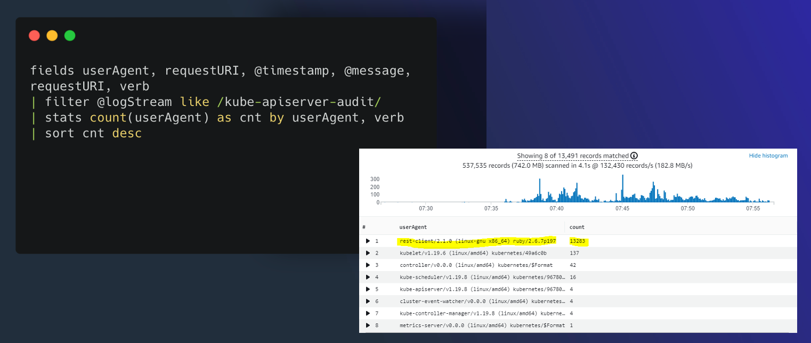

# ログ集約

このオブザーバビリティのベストプラクティスガイドのセクションでは、AWS ネイティブサービスを使用した Amazon EKS のログ記録に関連する次のトピックを深く掘り下げます。

* Amazon EKS ログ記録の概要
* Amazon EKS コントロールプレーンのログ記録  
* Amazon EKS データプレーンのログ記録
* Amazon EKS アプリケーションログ記録
* AWS ネイティブサービスを使用した Amazon EKS およびその他のコンピュートプラットフォームからの統合ログ集約
* まとめ

### はじめに

Amazon EKS のログは、コントロールプレーンログ、ノードログ、アプリケーションログの3つのタイプに分けることができます。[Kubernetes コントロールプレーン](https://kubernetes.io/docs/concepts/overview/components/#control-plane-components) は、Kubernetes クラスタを管理し、監査および診断目的で使用されるログを生成するコンポーネントのセットです。Amazon EKS では、[異なるコントロールプレーンコンポーネントのログをオンに](https://docs.aws.amazon.com/eks/latest/userguide/control-plane-logs.html) し、それらを CloudWatch に送信できます。

Kubernetes は、ポッドを実行する各 Kubernetes ノード上で `kubelet` や `kube-proxy` などのシステムコンポーネントも実行します。これらのコンポーネントは、各ノード内でログを書き込み、CloudWatch と Container Insights を設定して、各 Amazon EKS ノードのこれらのログをキャプチャできます。

コンテナは Kubernetes クラスタ内で [ポッド](https://kubernetes.io/docs/concepts/workloads/pods/) としてグループ化され、Kubernetes ノード上で実行するようにスケジュールされます。ほとんどのコンテナ化されたアプリケーションは標準出力および標準エラーに書き込み、コンテナエンジンが出力をロギングドライバにリダイレクトします。Kubernetes では、コンテナログはノードの `/var/log/pods` ディレクトリにあります。CloudWatch と Container Insights を設定して、Amazon EKS ポッドのそれぞれのこれらのログをキャプチャできます。

Kubernetes でコンテナログを集中型ログ集約システムに送信するための一般的なアプローチは3つあります。

* ノードレベルのエージェント、[Fluentd デーモンセット](https://docs.aws.amazon.com/AmazonCloudWatch/latest/monitoring/Container-Insights-setup-logs.html) など。これが推奨パターンです。
* サイドカーコンテナ、Fluentd サイドカーコンテナなど。  
* ログ収集システムへの直接書き込み。このアプローチでは、アプリケーションがログの送信を担当します。Fluentd のようなコミュニティビルドソリューションを再利用する代わりに、ログ集計システムの SDK をアプリケーションコードに含める必要があるため、これが最も推奨されていないオプションです。このパターンはまた、ロギングの実装がアプリケーションから独立している必要があるという *関心の分離の原則* に反しています。これにより、アプリケーションに影響や変更を与えることなく、ロギングインフラストラクチャを変更できます。

これからは、Amazon EKS および他のコンピュートプラットフォームからの統合ログ集約とともに、これらの Amazon EKS ログのカテゴリごとに詳しく見ていきます。

### Amazon EKS コントロールプレーンログ

Amazon EKS クラスターは、Kubernetes クラスターの高可用性のシングルテナントコントロールプレーンと、コンテナを実行する Amazon EKS ノードで構成されます。コントロールプレーンノードは、AWS によって管理されるアカウントで実行されます。Amazon EKS クラスターコントロールプレーン ノードは CloudWatch と統合されており、特定のコントロールプレーンコンポーネントのログをオンにすることができます。ログは、Kubernetes コントロールプレーンコンポーネントインスタンスごとに提供されます。 AWS はコントロールプレーンノードのヘルスを管理し、[Kubernetes エンドポイントのサービスレベルアグリーメント (SLA)](http://aws.amazon.com/eks/sla/) を提供します。

[Amazon EKS コントロールプレーンログ](https://docs.aws.amazon.com/eks/latest/userguide/control-plane-logs.html) は、次のクラスターコントロールプレーンログタイプで構成されます。各ログタイプは、Kubernetes コントロールプレーンのコンポーネントに対応しています。これらのコンポーネントの詳細については、Kubernetes のドキュメントの [Kubernetes コンポーネント](https://kubernetes.io/docs/concepts/overview/components/) を参照してください。

* **API サーバー (`api`)** – クラスターの API サーバーは、Kubernetes API を公開するコントロールプレーンコンポーネントです。 クラスターの起動時またはすぐ後に API サーバーログを有効にすると、API サーバーの起動に使用された API サーバーフラグがログに含まれます。 詳細については、Kubernetes のドキュメントの [`kube-apiserver`](https://kubernetes.io/docs/reference/command-line-tools-reference/kube-apiserver/) と [audit ポリシー](https://github.com/kubernetes/kubernetes/blob/master/cluster/gce/gci/configure-helper.sh#L1129-L1255) を参照してください。

* **Audit (`audit`)** – Kubernetes の監査ログは、クラスターに影響を与えた個々のユーザー、管理者、またはシステムコンポーネントの記録を提供します。 詳細については、Kubernetes ドキュメントの[監査](https://kubernetes.io/docs/tasks/debug-application-cluster/audit/)を参照してください。

* **Authenticator (`authenticator`)** – Authenticator ログは Amazon EKS 固有のものです。 これらのログは、IAM 資格情報を使用した Kubernetes [ロールベースのアクセス制御](https://kubernetes.io/docs/reference/access-authn-authz/rbac/) (RBAC) 認証に Amazon EKS が使用するコントロールプレーンコンポーネントを表しています。 詳細については、[クラスター管理](https://docs.aws.amazon.com/eks/latest/userguide/eks-managing.html) を参照してください。

* **Controller manager (`controllerManager`)** – コントローラーマネージャーは、Kubernetes と共に出荷されるコアコントロールループを管理します。 詳細については、Kubernetes ドキュメントの [kube-controller-manager](https://kubernetes.io/docs/reference/command-line-tools-reference/kube-controller-manager/) を参照してください。

* **Scheduler (`scheduler`)** – スケジューラーコンポーネントは、クラスター内のポッドの実行時期と場所を管理します。 詳細については、Kubernetes ドキュメントの [kube-scheduler](https://kubernetes.io/docs/reference/command-line-tools-reference/kube-scheduler/) を参照してください。

[コントロールプレーンログの有効化と無効化](https://docs.aws.amazon.com/eks/latest/userguide/control-plane-logs.html#:~:text=the%20Kubernetes%20documentation.-,Enabling%20and%20disabling%20control%20plane%20logs,-By%20default%2C%20cluster) のセクションに従い、AWS コンソールまたは AWS CLI を介してコントロールプレーンログを有効にしてください。

#### CloudWatch コンソールからコントロールプレーンログをクエリする

Amazon EKS クラスターでコントロールプレーンログを有効にすると、EKS コントロールプレーンログを `/aws/eks/クラスター名/cluster` ロググループで確認できます。詳細は、[Viewing cluster control plane logs](https://docs.aws.amazon.com/eks/latest/userguide/control-plane-logs.html#viewing-control-plane-logs) を参照してください。`クラスター名` はご自身のクラスターの名前に置き換えてください。

CloudWatch Logs Insights を使用して、EKS コントロールプレーンログデータを検索できます。詳細は、[Analyzing log data with CloudWatch Insights](https://docs.aws.amazon.com/AmazonCloudWatch/latest/logs/AnalyzingLogData.html) を参照してください。クラスターでコントロールプレーンログを有効にするまで、CloudWatch Logs でログイベントを表示できないことに注意してください。CloudWatch Logs Insights でクエリを実行する時間範囲を選択する前に、コントロールプレーンログが有効になっていることを確認してください。以下のスクリーンショットは、クエリ出力を含む EKS コントロールプレーンログクエリの例を示しています。



*図: CloudWatch Logs Insights*

#### EKS の一般的なユースケースの CloudWatch Logs Insights のサンプルクエリ

クラスター作成者を見つけるには、**kubernetes-admin** ユーザーにマップされている IAM エンティティを検索します。

```
fields @logStream, @timestamp, @message| sort @timestamp desc
| filter @logStream like /authenticator/
| filter @message like "username=kubernetes-admin"
| limit 50
```

出力例:

```

@logStream, @timestamp @messageauthenticator-71976 ca11bea5d3083393f7d32dab75b,2021-08-11-10:09:49.020,"time=""2021-08-11T10:09:43Z"" level=info msg=""access granted"" arn=""arn:aws:iam::12345678910:user/awscli"" client=""127.0.0.1:51326"" groups=""[system:masters]"" method=POST path=/authenticate sts=sts.eu-west-1.amazonaws.com uid=""heptio-authenticator-aws:12345678910:ABCDEFGHIJKLMNOP"" username=kubernetes-admin"
```

この出力では、IAM ユーザー **arn:aws:iam::[12345678910](tel:12345678910):user/awscli** がユーザー **kubernetes-admin** にマップされています。

特定のユーザーが実行したリクエストを見つけるには、**kubernetes-admin** ユーザーが実行した操作を検索します。

```

fields @logStream, @timestamp, @message| filter @logStream like /^kube-apiserver-audit/
| filter strcontains(user.username,"kubernetes-admin")
| sort @timestamp desc
| limit 50
```

出力例:

```

@logStream,@timestamp,@messagekube-apiserver-audit-71976ca11bea5d3083393f7d32dab75b,2021-08-11 09:29:13.095,"{...""requestURI"":""/api/v1/namespaces/kube-system/endpoints?limit=500";","string""verb"":""list"",""user"":{""username"":""kubernetes-admin"",""uid"":""heptio-authenticator-aws:12345678910:ABCDEFGHIJKLMNOP"",""groups"":[""system:masters"",""system:authenticated""],""extra"":{""accessKeyId"":[""ABCDEFGHIJKLMNOP""],""arn"":[""arn:aws:iam::12345678910:user/awscli""],""canonicalArn"":[""arn:aws:iam::12345678910:user/awscli""],""sessionName"":[""""]}},""sourceIPs"":[""12.34.56.78""],""userAgent"":""kubectl/v1.22.0 (darwin/amd64) kubernetes/c2b5237"",""objectRef"":{""resource"":""endpoints"",""namespace"":""kube-system"",""apiVersion"":""v1""}...}"
```

特定の userAgent が行った API 呼び出しを見つけるには、次の例のクエリを使用できます。

```

fields @logStream, @timestamp, userAgent, verb, requestURI, @message| filter @logStream like /kube-apiserver-audit/
| filter userAgent like /kubectl\/v1.22.0/
| sort @timestamp desc
| filter verb like /(get)/
```

短縮した出力例:

```

@logStream,@timestamp,userAgent,verb,requestURI,@messagekube-apiserver-audit-71976ca11bea5d3083393f7d32dab75b,2021-08-11 14:06:47.068,kubectl/v1.22.0 (darwin/amd64) kubernetes/c2b5237,get,/apis/metrics.k8s.io/v1beta1?timeout=32s,"{""kind"":""Event"",""apiVersion"":""audit.k8s.io/v1"",""level"":""Metadata"",""auditID"":""863d9353-61a2-4255-a243-afaeb9183524"",""stage"":""ResponseComplete"",""requestURI"":""/apis/metrics.k8s.io/v1beta1?timeout=32s"",""verb"":""get"",""user"":{""username"":""kubernetes-admin"",""uid"":""heptio-authenticator-aws:12345678910:AIDAUQGC5HFOHXON7M22F"",""groups"":[""system:masters"",""system:authenticated""],""extra"":{""accessKeyId"":[""ABCDEFGHIJKLMNOP""],""arn"":[""arn:aws:iam::12345678910:user/awscli""],""canonicalArn"":[""arn:aws:iam::12345678910:user/awscli""],""sourceIPs"":[""12.34.56.78""],""userAgent"":""kubectl/v1.22.0 (darwin/amd64) kubernetes/c2b5237""...}"
```

**aws-auth** ConfigMap への変更を見つけるには、次の例のクエリを使用できます。

```

fields @logStream, @timestamp, @message| filter @logStream like /^kube-apiserver-audit/
| filter requestURI like /\/api\/v1\/namespaces\/kube-system\/configmaps/
| filter objectRef.name = "aws-auth"
| filter verb like /(create|delete|patch)/
| sort @timestamp desc
| limit 50
```

短縮した出力例:

```

@logStream,@timestamp,@messagekube-apiserver-audit-f01c77ed8078a670a2eb63af6f127163,2021-10-27 05:43:01.850,{""kind"":""Event"",""apiVersion"":""audit.k8s.io/v1"",""level"":""RequestResponse"",""auditID"":""8f9a5a16-f115-4bb8-912f-ee2b1d737ff1"",""stage"":""ResponseComplete"",""requestURI"":""/api/v1/namespaces/kube-system/configmaps/aws-auth?timeout=19s"",""verb"":""patch"",""responseStatus"": {""metadata"": {},""code"": 200 },""requestObject"": {""data"": { contents of aws-auth ConfigMap } },""requestReceivedTimestamp"":""2021-10-27T05:43:01.033516Z"",""stageTimestamp"":""2021-10-27T05:43:01.042364Z"" }
```

拒否されたリクエストを見つけるには、次の例のクエリを使用できます。

```

fields @logStream, @timestamp, @message| filter @logStream like /^authenticator/
| filter @message like "denied"
| sort @timestamp desc
| limit 50
```

出力例:

```

@logStream,@timestamp,@messageauthenticator-8c0c570ea5676c62c44d98da6189a02b,2021-08-08 20:04:46.282,"time=""2021-08-08T20:04:44Z"" level=warning msg=""access denied"" client=""127.0.0.1:52856"" error=""sts getCallerIdentity failed: error from AWS (expected 200, got 403)"" method=POST path=/authenticate"
```

ポッドがスケジュールされたノードを見つけるには、**kube-scheduler** ログをクエリします。

```

fields @logStream, @timestamp, @message| sort @timestamp desc
| filter @logStream like /kube-scheduler/
| filter @message like "aws-6799fc88d8-jqc2r"
| limit 50
```

出力例:

```

@logStream,@timestamp,@messagekube-scheduler-bb3ea89d63fd2b9735ba06b144377db6,2021-08-15 12:19:43.000,"I0915 12:19:43.933124       1 scheduler.go:604] ""Successfully bound pod to node"" pod=""kube-system/aws-6799fc88d8-jqc2r"" node=""ip-192-168-66-187.eu-west-1.compute.internal"" evaluatedNodes=3 feasibleNodes=2"
```

この出力例では、ポッド **aws-6799fc88d8-jqc2r** がノード **ip-192-168-66-187.eu-west-1.compute.internal** にスケジュールされました。

Kubernetes API サーバーのリクエストに対する HTTP 5xx サーバーエラーを見つけるには、次の例のクエリを使用できます。

```

fields @logStream, @timestamp, responseStatus.code, @message| filter @logStream like /^kube-apiserver-audit/
| filter responseStatus.code >= 500
| limit 50
```

短縮した出力例:

```

@logStream,@timestamp,responseStatus.code,@messagekube-apiserver-audit-4d5145b53c40d10c276ad08fa36d1f11,2021-08-04 07:22:06.518,503,"...""requestURI"":""/apis/metrics.k8s.io/v1beta1?timeout=32s"",""verb"":""get"",""user"":{""username"":""system:serviceaccount:kube-system:resourcequota-controller"",""uid"":""36d9c3dd-f1fd-4cae-9266-900d64d6a754"",""groups"":[""system:serviceaccounts"",""system:serviceaccounts:kube-system"",""system:authenticated""]},""sourceIPs"":[""12.34.56.78""],""userAgent"":""kube-controller-manager/v1.21.2 (linux/amd64) kubernetes/d2965f0/system:serviceaccount:kube-system:resourcequota-controller"",""responseStatus"":{""metadata"":{},""code"":503},..."}}"
```

CronJob のアクティベーションをトラブルシューティングするには、**cronjob-controller** が行った API 呼び出しを検索します。

```

fields @logStream, @timestamp, @message| filter @logStream like /kube-apiserver-audit/
| filter user.username like "system:serviceaccount:kube-system:cronjob-controller"
| display @logStream, @timestamp, @message, objectRef.namespace, objectRef.name
| sort @timestamp desc
| limit 50
```

短縮した出力例:

```

{ "kind": "Event", "apiVersion": "audit.k8s.io/v1", "objectRef": { "resource": "cronjobs", "namespace": "default", "name": "hello", "apiGroup": "batch", "apiVersion": "v1" }, "responseObject": { "kind": "CronJob", "apiVersion": "batch/v1", "spec": { "schedule": "*/1 * * * *" }, "status": { "lastScheduleTime": "2021-08-09T07:19:00Z" } } }
```

この出力例では、**default** 名前空間の **hello** ジョブが 1 分ごとに実行され、最後に **2021-08-09T07:19:00Z** にスケジュールされました。

**replicaset-controller** が行った API 呼び出しを見つけるには、次の例のクエリを使用できます。

```

fields @logStream, @timestamp, @message| filter @logStream like /kube-apiserver-audit/
| filter user.username like "system:serviceaccount:kube-system:replicaset-controller"
| display @logStream, @timestamp, requestURI, verb, user.username
| sort @timestamp desc
| limit 50
```

出力例:

```

@logStream,@timestamp,requestURI,verb,user.usernamekube-apiserver-audit-8c0c570ea5676c62c44d98da6189a02b,2021-08-10 17:13:53.281,/api/v1/namespaces/kube-system/pods,create,system:serviceaccount:kube-system:replicaset-controller
kube-apiserver-audit-4d5145b53c40d10c276ad08fa36d1f11,2021-08-04 0718:44.561,/apis/apps/v1/namespaces/kube-system/replicasets/coredns-6496b6c8b9/status,update,system:serviceaccount:kube-system:replicaset-controller
```

Kubernetes リソースに対して行われた操作を見つけるには、次の例のクエリを使用できます。

```

fields @logStream, @timestamp, @message| filter @logStream like /^kube-apiserver-audit/
| filter verb == "delete" and requestURI like "/api/v1/namespaces/default/pods/my-app"
| sort @timestamp desc
| limit 10
```

前の例のクエリは、**default** 名前空間のポッド **my-app** に対する **delete** API 呼び出しをフィルタリングします。
短縮した出力例:

```

@logStream,@timestamp,@messagekube-apiserver-audit-e7b3cb08c0296daf439493a6fc9aff8c,2021-08-11 14:09:47.813,"...""requestURI"":""/api/v1/namespaces/default/pods/my-app"",""verb"":""delete"",""user"":{""username""""kubernetes-admin"",""uid"":""heptio-authenticator-aws:12345678910:ABCDEFGHIJKLMNOP"",""groups"":[""system:masters"",""system:authenticated""],""extra"":{""accessKeyId"":[""ABCDEFGHIJKLMNOP""],""arn"":[""arn:aws:iam::12345678910:user/awscli""],""canonicalArn"":[""arn:aws:iam::12345678910:user/awscli""],""sessionName"":[""""]}},""sourceIPs"":[""12.34.56.78""],""userAgent"":""kubectl/v1.22.0 (darwin/amd64) kubernetes/c2b5237"",""objectRef"":{""resource"":""pods"",""namespace"":""default"",""name"":""my-app"",""apiVersion"":""v1""},""responseStatus"":{""metadata"":{},""code"":200},""requestObject"":{""kind"":""DeleteOptions"",""apiVersion"":""v1"",""propagationPolicy"":""Background""},
..."
```

Kubernetes API サーバーへの呼び出しに対する HTTP レスポンスコードのカウントを取得するには、次の例のクエリを使用できます。

```

fields @logStream, @timestamp, @message| filter @logStream like /^kube-apiserver-audit/
| stats count(*) as count by responseStatus.code
| sort count desc
```

出力例:

```

responseStatus.code,count200,35066
201,525
403,125
404,116
101,2
```

**kube-system** 名前空間の DaemonSets/アドオンへの変更を見つけるには、次の例のクエリを使用できます。

```

filter @logStream like /^kube-apiserver-audit/| fields @logStream, @timestamp, @message
| filter verb like /(create|update|delete)/ and strcontains(requestURI,"/apis/apps/v1/namespaces/kube-system/daemonsets")
| sort @timestamp desc
| limit 50
```

出力例:

```

{ "kind": "Event", "apiVersion": "audit.k8s.io/v1", "level": "RequestResponse", "auditID": "93e24148-0aa6-4166-8086-a689b0031612", "stage": "ResponseComplete", "requestURI": "/apis/apps/v1/namespaces/kube-system/daemonsets/aws-node?fieldManager=kubectl-set", "verb": "patch", "user": { "username": "kubernetes-admin", "groups": [ "system:masters", "system:authenticated" ] }, "userAgent": "kubectl/v1.22.2 (darwin/amd64) kubernetes/8b5a191", "objectRef": { "resource": "daemonsets", "namespace": "kube-system", "name": "aws-node", "apiGroup": "apps", "apiVersion": "v1" }, "requestObject": { "REDACTED": "REDACTED" }, "requestReceivedTimestamp": "2021-08-09T08:07:21.868376Z", "stageTimestamp": "2021-08-09T08:07:21.883489Z", "annotations": { "authorization.k8s.io/decision": "allow", "authorization.k8s.io/reason": "" } }
```

この出力例では、**kubernetes-admin** ユーザーが **kubectl** v1.22.2 を使用して **aws-node** DaemonSet をパッチしました。

ノードを削除したユーザーを見つけるには、次の例のクエリを使用できます。

```

fields @logStream, @timestamp, @message| filter @logStream like /^kube-apiserver-audit/
| filter verb == "delete" and requestURI like "/api/v1/nodes"
| sort @timestamp desc
| limit 10
```

短縮した出力例:

```

@logStream,@timestamp,@messagekube-apiserver-audit-e503271cd443efdbd2050ae8ca0794eb,2022-03-25 07:26:55.661,"{"kind":"Event","
```

最後に、コントロールプレーンログ機能の使用を開始した場合は、[Understanding and Cost Optimizing Amazon EKS Control Plane Logs](https://aws.amazon.com/blogs/containers/understanding-and-cost-optimizing-amazon-eks-control-plane-logs/) を学習することを強くおすすめします。

### Amazon EKS データプレーンログ

Amazon EKS のログとメトリクスをキャプチャするために、[CloudWatch Container Insights](https://docs.aws.amazon.com/AmazonCloudWatch/latest/monitoring/Container-Insights-setup-logs.html) の使用をおすすめします。[Container Insights](https://docs.aws.amazon.com/AmazonCloudWatch/latest/monitoring/ContainerInsights.html) は、CloudWatch エージェントを使用してクラスター、ノード、Pod レベルのメトリクスを実装し、ログを CloudWatch にキャプチャするために [Fluent Bit](https://fluentbit.io/) または [Fluentd](https://www.fluentd.org/) を使用します。Container Insights は、キャプチャした CloudWatch メトリクスの階層ビューを備えた自動ダッシュボードも提供します。Container Insights は、すべての Amazon EKS ノードで実行される CloudWatch DaemonSet および Fluent Bit DaemonSet としてデプロイされます。Fargate ノードは、ノードが AWS によって管理され、DaemonSet をサポートしていないため、Container Insights ではサポートされていません。Amazon EKS の Fargate ログは、このガイドで個別にカバーされています。

次の表は、Amazon EKS 用の[デフォルトの Fluentd または Fluent Bit ログキャプチャ構成](https://docs.aws.amazon.com/AmazonCloudWatch/latest/monitoring/Container-Insights-setup-logs-FluentBit.html)によってキャプチャされる CloudWatch ロググループとログを示しています。

|`/aws/containerinsights/Cluster_Name/host`	|`/var/log/dmesg`、`/var/log/secure`、`/var/log/messages` からのログ。	|
|---	|---	|
|`/aws/containerinsights/Cluster_Name/dataplane`	|`kubelet.service`、`kubeproxy.service`、`docker.service` の `/var/log/journal` のログ。	|

ログに Fluent Bit または Fluentd を使用した Container Insights を使用したくない場合は、Amazon EKS ノードにインストールされた CloudWatch エージェントを使用して、ノードとコンテナのログをキャプチャできます。Amazon EKS ノードは EC2 インスタンスであるため、Amazon EC2 の標準的なシステムレベルのログアプローチに含める必要があります。Distributor と State Manager を使用して CloudWatch エージェントをインストールする場合、Amazon EKS ノードも CloudWatch エージェントのインストール、構成、更新に含まれます。次の表は、Fluent Bit または Fluentd を使用した Container Insights でログを使用していない場合にキャプチャする必要がある Kubernetes 固有のログを示しています。


|`var/log/aws-routed-eni/ipamd.log``/var/log/aws-routed-eni/plugin.log`	|L-IPAM デーモンのログはここにあります	|
|---	|---	|

データプレーンログの詳細については、[Amazon EKS ノードログの推奨ガイダンス](https://docs.aws.amazon.com/prescriptive-guidance/latest/implementing-logging-monitoring-cloudwatch/kubernetes-eks-logging.html) を参照してください。

### Amazon EKS のアプリケーションログ

Amazon EKS で Kubernetes 環境でアプリケーションを大規模に実行する際、アプリケーションログの収集は不可欠です。アプリケーションログを収集するには、[Fluent Bit](https://fluentbit.io/)、[Fluentd](https://www.fluentd.org/)、[CloudWatch Container Insights](https://docs.aws.amazon.com/AmazonCloudWatch/latest/monitoring/ContainerInsights.html) などのログアグリゲータを Amazon EKS クラスタにインストールする必要があります。

[Fluent Bit](https://fluentbit.io/) は C++ で書かれたオープンソースのログプロセッサとフォワーダで、異なるソースからデータを収集し、フィルタでエンリッチして、複数のデスティネーションに送信できます。このガイドのソリューションを使用することで、ログのために `aws-for-fluent-bit` または `fargate-fluentbit` を有効にできます。[Fluentd](https://www.fluentd.org/) は統合ログレイヤのためのオープンソースのデータコレクタで、Ruby で書かれています。Fluentd は統合ログレイヤとして機能し、複数のソースからデータを集約し、異なるフォーマットのデータを JSON 形式のオブジェクトに統一し、異なる出力デスティネーションにルーティングできます。数千台のサーバーをモニタリングする場合、ログコレクタの選択は CPU とメモリの利用率にとって重要です。複数の Amazon EKS クラスタがある場合は、Fluent Bit を軽量のシッパーとして使用して、クラスタ内の異なるノードからデータを収集し、Fluentd に転送して集約、処理、サポートされている出力デスティネーションへのルーティングを行うことができます。

ログコレクタおよびフォワーダとして Fluent Bit を使用し、アプリケーションとクラスタのログを CloudWatch に送信することをお勧めします。その後、CloudWatch のサブスクリプションフィルタを使用して、ログを Amazon OpenSearch Service にストリーミングできます。このオプションは、このセクションのアーキテクチャ図に示されています。


*図: Amazon EKS アプリケーションログのアーキテクチャ*

この図は、Amazon EKS クラスタからのアプリケーションログが Amazon OpenSearch Service にストリーミングされるときのワークフローを示しています。Amazon EKS クラスタ内の Fluent Bit サービスがログを CloudWatch にプッシュします。AWS Lambda 関数は、サブスクリプションフィルタを使用してログを Amazon OpenSearch Service にストリーミングします。その後、設定されたインデックスのログを Kibana で視覚化できます。また、Amazon Kinesis Data Firehose を使用してログをストリーミングし、S3 バケットに保存して、[Amazon Athena](https://docs.aws.amazon.com/athena/latest/ug/what-is.html) で分析とクエリを行うこともできます。

ほとんどのクラスタでは、ログの集約に Fluentd や Fluent Bit を使用しても、ほとんど最適化の必要はありません。これは、数千の Pod とノードを持つ大規模なクラスタを扱う場合に変わってきます。 数千の Pod を持つクラスタでの Fluentd と Fluent Bit の影響についての調査結果を公開しています。 さらに学習するために、[Kubernetes API サーバへの API 呼び出しの量を減らすことを目的とした Fluent Bit の拡張](https://aws.amazon.com/blogs/containers/capturing-logs-at-scale-with-fluent-bit-and-amazon-eks/) について確認することをお勧めします。この Fluent Bit の `Use_Kubelet` 機能を使用すると、ホスト上の kubelet から Pod のメタデータを取得できます。Amazon EKS のお客様は、この機能を有効にすることで、数万の Pod を実行するクラスタで Fluent Bit を使用してログをキャプチャできます。Kubernetes クラスタの規模に関係なく、この機能を有効にすることをお勧めします。

#### Amazon EKS on Fargate のログ記録

Amazon EKS on Fargate を使用すると、Kubernetes ノードを割り当てたり管理したりすることなく Pod をデプロイできます。これにより、Kubernetes ノードのシステムレベルのログをキャプチャする必要がなくなります。Fargate Pod からのログをキャプチャするには、Fluent Bit を使用してログを直接 CloudWatch に転送できます。これにより、Amazon EKS Pod on Fargate のためのさらなる設定やサイドカーコンテナなしで、ログを CloudWatch に自動的にルーティングできます。これについての詳細は、Amazon EKS ドキュメントの [Fargate ロギング](https://docs.aws.amazon.com/eks/latest/userguide/fargate-logging.html) および AWS ブログの [Fluent Bit for Amazon EKS](http://aws.amazon.com/blogs/containers/fluent-bit-for-amazon-eks-on-aws-fargate-is-here/) を参照してください。このソリューションは、Fargate 上の Amazon EKS クラスターに設定された Fluent Bit 設定に基づいて、コンテナからの `STDOUT` および `STDERR` 入出力 (I/O) ストリームをキャプチャし、Fluent Bit を介して CloudWatch に送信します。

Amazon EKS 向けの Fluent Bit サポートにより、Amazon EKS Pod が Fargate 上で実行されている場合にコンテナログをルーティングするためのサイドカーを実行する必要がなくなりました。新しい組み込みロギングサポートにより、レコードを送信する宛先を選択できます。Amazon EKS on Fargate は、AWS によって管理されている Fluent Bit の AWS に準拠したディストリビューションを使用します。


*図: Amazon EKS on Fargate のログ記録*

Amazon EKS の Fluent Bit サポートの詳細については、Amazon EKS ドキュメントの [Fargate ロギング](https://docs.aws.amazon.com/eks/latest/userguide/fargate-logging.html) を参照してください。

いくつかの理由から、AWS Fargate 上で実行されている Pod でサイドカーパターンを使用する必要がある場合があります。Fluentd (または [Fluent Bit](http://fluentbit.io/)) サイドカーコンテナを実行して、アプリケーションによって生成されたログをキャプチャできます。このオプションでは、アプリケーションがログを `stdout` または `stderr` ではなくファイルシステムに書き込む必要があります。このアプローチの結果として、`kubectl` ログを使用してコンテナログを表示できなくなります。ログを `kubectl logs` に表示させるには、アプリケーションログを `stdout` とファイルシステムの両方に同時に書き込むことができます。

[Fargate の Pod は 20GB の短命ストレージを取得します](https://docs.aws.amazon.com/eks/latest/userguide/fargate-pod-configuration.html)。これは、Pod に属するすべてのコンテナで利用できます。アプリケーションを設定してローカルファイルシステムにログを書き込み、Fluentd がログディレクトリ(またはファイル)を監視するように指示できます。Fluentd はログファイルの末尾からイベントを読み取り、CloudWatch などの宛先にイベントを送信してストレージします。ログが全体のボリュームを奪わないように、定期的にログをローテーションすることをお勧めします。

AWS Fargate 上で Kubernetes アプリケーションを大規模に運用および監視する方法の詳細については、[Amazon EKS on AWS Fargate を使用した場合のアプリケーションログのキャプチャ方法](https://aws.amazon.com/blogs/containers/how-to-capture-application-logs-when-using-amazon-eks-on-aws-fargate/) を参照してください。このアプローチでは、ファイルに書き込みと `stdout` にも書き込みを行うので、`kubectl logs` でログが表示されます。

### Amazon EKS やその他のコンピュートプラットフォームからの統合ログ集約に AWS ネイティブサービスを使用する

お客様は、エージェント、ログルーター、拡張機能を使用して、[Amazon Elastic Kubernetes Service](https://aws.amazon.com/eks/)(Amazon EKS)、[Amazon Elastic Compute Cloud](https://aws.amazon.com/ec2/)(Amazon EC2)、[Amazon Elastic Container Service](https://aws.amazon.com/ecs/)(Amazon ECS)、[Amazon Kinesis Data Firehose](https://aws.amazon.com/kinesis/data-firehose/)、[AWS Lambda](https://aws.amazon.com/lambda/)など、異なるコンピューティングプラットフォーム間でログを統一および集中化したいと考えています。その後、異なるコンピューティングプラットフォームから収集したログを可視化および分析するために、OpenSearch ダッシュボードを備えた [Amazon OpenSearch Service](https://aws.amazon.com/opensearch-service/) を使用できます。

統合された集約ログシステムには、以下のメリットがあります。

* 異なるコンピューティングプラットフォーム間のすべてのログへのシングルポイントアクセス
* [Amazon Simple Storage Service](http://aws.amazon.com/s3)(Amazon S3)、Amazon OpenSearch Service、[Amazon Redshift](https://aws.amazon.com/redshift)などの下流システムへの配信前に、ログの変換を定義および標準化する支援
* Amazon OpenSearch Service を使用してログをすばやくインデックス付けし、OpenSearch ダッシュボードを使用してルーター、アプリケーション、その他のデバイスからのログを検索および可視化できる機能

次の図は、[Amazon Elastic Kubernetes Service](https://aws.amazon.com/eks/)(Amazon EKS)、[Amazon Elastic Compute Cloud](https://aws.amazon.com/ec2/)(Amazon EC2)、[Amazon Elastic Container Service](https://aws.amazon.com/ecs/)(Amazon ECS)、[AWS Lambda](https://aws.amazon.com/lambda/)など、異なるコンピュートプラットフォーム間でログ集約を実行するアーキテクチャを示しています。


*図: 異なるコンピュートプラットフォーム間でのログ集約。*

このアーキテクチャは、ログエージェント、ログルーター、Lambda 拡張機能など、さまざまなログ集約ツールを使用して、複数のコンピュートプラットフォームからログを収集し、Kinesis Data Firehose に配信します。Kinesis Data Firehose はログを Amazon OpenSearch Service にストリーミングします。Amazon OpenSearch Service に永続化できなかったログレコードは Amazon S3 に書き込まれます。このアーキテクチャをスケールするには、これらのコンピュートプラットフォームのそれぞれがログを個別の Firehose 配信ストリームにストリーミングし、24 時間ごとにインデックスが追加され回転します。

Kinesis Data Firehose と Amazon OpenSearch Service を使用して、[Amazon Elastic Kubernetes Service](https://aws.amazon.com/eks/)(Amazon EKS)、[Amazon Elastic Compute Cloud](https://aws.amazon.com/ec2/)(Amazon EC2)、[Amazon Elastic Container Service](https://aws.amazon.com/ecs/)(Amazon ECS)、[AWS Lambda](https://aws.amazon.com/lambda/)などの異なるコンピュートプラットフォーム間でログの集約と分析を統一する方法の詳細は、[こちら](https://aws.amazon.com/blogs/big-data/unify-log-aggregation-and-analytics-across-compute-platforms/)をご覧ください。このアプローチにより、サービスごとに異なるプラットフォームを使用するのではなく、単一のプラットフォームを使用してログをすばやく分析し、障害の根本原因を特定できます。

## まとめ

このオブザーバビリティのベストプラクティスガイドのセクションでは、コントロールプレーンログ、ノードログ、アプリケーションログの 3 つの種類の Kubernetes ログについて深掘りしました。さらに、Kinesis Data Firehose や Amazon OpenSearch Service などの AWS ネイティブサービスを使用して、Amazon EKS やその他のコンピュートプラットフォームから統合ログ収集を行う方法について学びました。さらに深掘りしたい場合は、AWS の [One Observability ワークショップ](https://catalog.workshops.aws/observability/ja-JP) の AWS ネイティブオブザーバビリティカテゴリの Logs と Insights モジュールを実践することを強くおすすめします。
