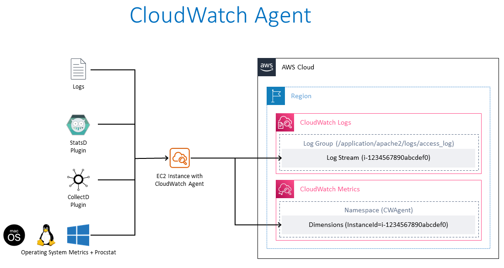
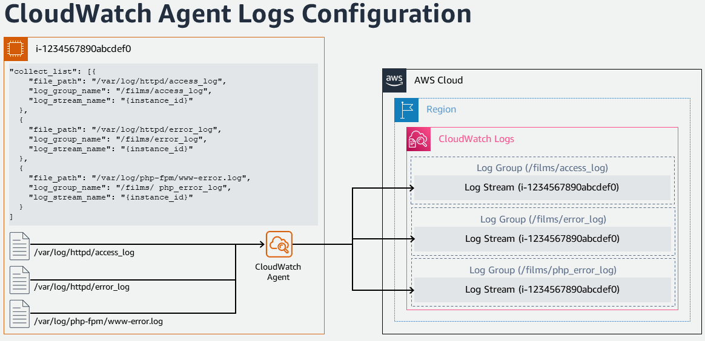
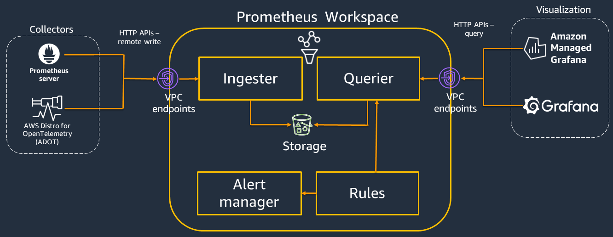
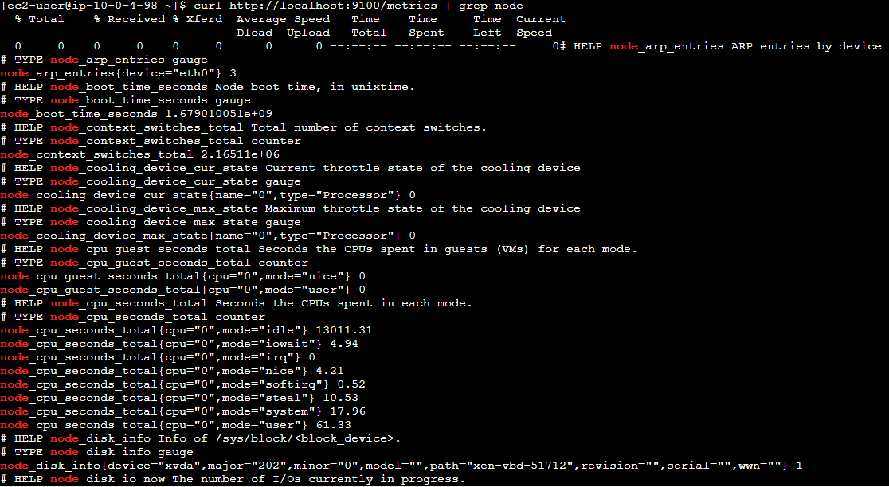

# Amazon EC2 のモニタリングとオブザーバビリティ

## はじめに

継続的なモニタリングとオブザーバビリティは、クラウド環境の機動性を高め、顧客体験を改善し、リスクを軽減します。Wikipedia によると、[オブザーバビリティ](https://en.wikipedia.org/wiki/Observability) とは、システムの外部出力から内部状態をどの程度推測できるかを表す指標です。オブザーバビリティという用語自体は制御理論の分野から来ており、基本的にはシステム内のコンポーネントの内部状態を、それが生成する外部シグナルや出力から学習することができることを意味します。

モニタリングとオブザーバビリティの違いは、モニタリングはシステムが機能しているかどうかを教えてくれるのに対し、オブザーバビリティはシステムがなぜ機能していないのかを教えてくれることです。モニタリングは通常反応的な対策であるのに対し、オブザーバビリティの目的は主要業績評価指標を予防的な方法で改善できるようにすることです。観測されないシステムは制御や最適化ができません。メトリクス、ログ、トレースの収集を通じたワークロードの計装と、適切なモニタリングおよびオブザーバビリティツールを使用した意味のあるインサイトと詳細なコンテキストの取得により、お客様は環境を制御および最適化できます。

AWS では、お客様がエンドツーエンドのサービス可視性を得られるよう、モニタリングからオブザーバビリティへの変革を可能にしています。この記事では、ネイティブおよびオープンソースのツールを通じて、Amazon Elastic Compute Cloud (Amazon EC2) サービスの AWS クラウド環境におけるモニタリングとオブザーバビリティを改善するためのベストプラクティスに焦点を当てます。

## Amazon EC2

[Amazon Elastic Compute Cloud](https://aws.amazon.com/ec2/) (Amazon EC2) は、Amazon Web Services(AWS) クラウドにおける高度にスケーラブルなコンピューティングプラットフォームです。Amazon EC2 は、前もってのハードウェアへの投資の必要性をなくし、お客様はアプリケーションのより迅速な開発とデプロイが可能となり、実際に使用した分のみの課金となります。EC2 が提供する主な機能として、インスタンスと呼ばれる仮想コンピューティング環境、インスタンスの事前設定テンプレートである Amazon マシンイメージ、CPU、メモリ、ストレージ、ネットワーク容量などのリソース構成がインスタンスタイプとして利用可能です。

## AWS ネイティブツールを使用したモニタリングとオブザーバビリティ

### Amazon CloudWatch

[Amazon CloudWatch](https://aws.amazon.com/cloudwatch/) は、AWS、ハイブリッド、オンプレミスのアプリケーションとインフラストラクチャリソースのためのデータと実行可能なインサイトを提供するモニタリングと管理サービスです。CloudWatch はログ、メトリクス、イベントの形式でモニタリングと運用データを収集します。また、AWS とオンプレミスのサーバーで実行される AWS リソース、アプリケーション、サービスの統合ビューを提供します。CloudWatch はシステム全体のリソース利用率、アプリケーションパフォーマンス、運用状態の可視化を支援します。

### 統合された CloudWatch エージェント

統合された CloudWatch エージェントは、x86-64 および ARM64 アーキテクチャを利用するほとんどのオペレーティング システムをサポートする、MIT ライセンスのオープンソース ソフトウェアです。CloudWatch エージェントは、オペレーティング システム間のハイブリッド環境にある Amazon EC2 インスタンスとオンプレミスのサーバーからシステムレベルのメトリクスを収集したり、アプリケーションやサービスからカスタム メトリクスを取得したり、Amazon EC2 インスタンスとオンプレミスのサーバーからログを収集するのに役立ちます。

### Amazon EC2 インスタンスへの CloudWatch エージェントのインストール

#### コマンドラインによるインストール

CloudWatch エージェントは、[コマンドライン](https://docs.aws.amazon.com/AmazonCloudWatch/latest/monitoring/installing-cloudwatch-agent-commandline.html)を通じてインストールできます。必要なパッケージは、さまざまなアーキテクチャとオペレーティング システムのために[ダウンロード](https://docs.aws.amazon.com/AmazonCloudWatch/latest/monitoring/download-cloudwatch-agent-commandline.html)可能です。CloudWatch エージェントが Amazon EC2 インスタンスから情報を読み取り、CloudWatch に書き込むことを許可する必要な [IAM ロール](https://docs.aws.amazon.com/AmazonCloudWatch/latest/monitoring/create-iam-roles-for-cloudwatch-agent-commandline.html) を作成します。必要な IAM ロールが作成されたら、必要な Amazon EC2 インスタンス上で CloudWatch エージェントを[インストールして実行](https://docs.aws.amazon.com/AmazonCloudWatch/latest/monitoring/install-CloudWatch-Agent-commandline-fleet.html)できます。

!!! note "参考資料"

    ドキュメント: [コマンドラインを使用した CloudWatch エージェントのインストール](https://docs.aws.amazon.com/AmazonCloudWatch/latest/monitoring/installing-cloudwatch-agent-commandline.html)

    AWS Observability ワークショップ: [CloudWatch エージェントのセットアップとインストール](https://catalog.workshops.aws/observability/ja-JP/aws-native/ec2-monitoring/install-ec2)

#### AWS Systems Manager を使用したインストール

CloudWatch エージェントは、[AWS Systems Manager](https://docs.aws.amazon.com/ja_jp/AmazonCloudWatch/latest/monitoring/installing-cloudwatch-agent-ssm.html) を使用してもインストールできます。CloudWatch エージェントが Amazon EC2 インスタンスから情報を読み取り、それを CloudWatch に書き込み、AWS Systems Manager と通信できるアクセス許可を付与する IAM ロールを作成します。EC2 インスタンスに CloudWatch エージェントをインストールする前に、必要な EC2 インスタンスで [SSM エージェントをインストールまたは更新](https://docs.aws.amazon.com/ja_jp/AmazonCloudWatch/latest/monitoring/download-CloudWatch-Agent-on-EC2-Instance-SSM-first.html#update-SSM-Agent-EC2instance-first) します。CloudWatch エージェントは AWS Systems Manager を通じてダウンロードできます。収集するメトリクス(カスタムメトリクスを含む)とログを指定する JSON 設定ファイルを作成できます。必要な IAM ロールが作成され、設定ファイルが作成されたら、必要な Amazon EC2 インスタンスで CloudWatch エージェントをインストールして実行できます。

!!! note "参考文献"

    参考文献:
    ドキュメント: [AWS Systems Manager を使用した CloudWatch エージェントのインストール](https://docs.aws.amazon.com/ja_jp/AmazonCloudWatch/latest/monitoring/installing-cloudwatch-agent-ssm.html)

    AWS Observability ワークショップ: [AWS Systems Manager を使用した CloudWatch エージェントのクイックセットアップインストール](https://catalog.workshops.aws/observability/ja-JP/aws-native/ec2-monitoring/install-ec2/ssm-quicksetup)

    関連ブログ記事: [Amazon CloudWatch Agent with AWS Systems Manager Integration – Unified Metrics & Log Collection for Linux & Windows](https://aws.amazon.com/blogs/aws/new-amazon-cloudwatch-agent-with-aws-systems-manager-integration-unified-metrics-log-collection-for-linux-windows/)

    YouTube 動画: [Collect Metrics and Logs from Amazon EC2 instances with the CloudWatch Agent](https://www.youtube.com/watch?v=vAnIhIwE5hY)

#### ハイブリッド環境のオンプレミスサーバーへの CloudWatch エージェントのインストール

サーバーがオンプレミスとクラウドの両方に存在するハイブリッドなお客様の環境では、Amazon CloudWatch で統一されたオブザーバビリティを実現するために、同様のアプローチを取ることができます。CloudWatch エージェントは、Amazon S3 から直接ダウンロードするか、AWS Systems Manager を通じてダウンロードできます。オンプレミスのサーバーから Amazon CloudWatch にデータを送信するための IAM ユーザーを作成します。オンプレミスのサーバーにエージェントをインストールして起動します。

!!! note "参考資料" 

    ドキュメント: [オンプレミスサーバーへの CloudWatch エージェントのインストール](https://docs.aws.amazon.com/ja_jp/AmazonCloudWatch/latest/monitoring/install-CloudWatch-Agent-on-premise.html)

### Amazon CloudWatch を使用した Amazon EC2 インスタンスのモニタリング

Amazon EC2 インスタンスとアプリケーションの信頼性、可用性、パフォーマンスを維持するための重要な側面は、[継続的なモニタリング](https://catalog.workshops.aws/observability/ja/aws-native/ec2-monitoring)です。必要な Amazon EC2 インスタンスに CloudWatch エージェントをインストールすることで、インスタンスの正常性とパフォーマンスを監視し、安定した環境を維持する必要があります。ベースラインとして、CPU 使用率、ネットワーク使用率、ディスクパフォーマンス、ディスク読み取り/書き込み、メモリ使用率、ディスクスワップ使用率、ディスク空き容量、ページファイル使用率、EC2 インスタンスのログ収集などを推奨します。

#### 基本と詳細モニタリング

Amazon CloudWatch は、Amazon EC2 からの生データを収集し、リアルタイムに近い読みやすいメトリクスに変換します。
デフォルトでは、Amazon EC2 はインスタンスの基本モニタリングとして、5 分ごとにメトリクスデータを CloudWatch に送信します。
インスタンスのメトリクスデータを 1 分ごとに CloudWatch に送信するには、インスタンスで[詳細モニタリング](https://docs.aws.amazon.com/ja_jp/AWSEC2/latest/UserGuide/using-cloudwatch-new.html) を有効にできます。

#### モニタリングの自動化ツールと手動ツール

AWS は、Amazon EC2 のモニタリングと問題が発生した場合の報告を支援する自動化ツールと手動ツールの 2 種類を提供しています。これらのツールの一部は少しの設定が必要で、いくつかは手動の介入が必要です。
[自動化モニタリングツール](https://docs.aws.amazon.com/ja_jp/AWSEC2/latest/UserGuide/monitoring_automated_manual.html#monitoring_automated_tools) には、AWS システムステータスチェック、インスタンスステータスチェック、Amazon CloudWatch アラーム、Amazon EventBridge、Amazon CloudWatch Logs、CloudWatch エージェント、Microsoft System Center Operations Manager 用 AWS Management Pack が含まれます。[手動モニタリング](https://docs.aws.amazon.com/ja_jp/AWSEC2/latest/UserGuide/monitoring_automated_manual.html#monitoring_manual_tools) ツールには、この記事の下のセクションで詳しく見ていくダッシュボードが含まれます。

!!! note "参考文献"

    ドキュメント: [自動化および手動によるモニタリング](https://docs.aws.amazon.com/ja_jp/AWSEC2/latest/UserGuide/monitoring_automated_manual.html)

### CloudWatch エージェントを使用した Amazon EC2 インスタンスからのメトリクス

メトリクスは CloudWatch の基本的な概念です。メトリクスとは、CloudWatch に公開される時系列のデータポイントの集まりを表します。メトリクスを監視する変数と考え、データポイントをその変数の時間経過に伴う値と捉えます。たとえば、特定の EC2 インスタンスの CPU 使用率は、Amazon EC2 が提供するメトリクスの 1 つです。

#### CloudWatch エージェントを使用したデフォルトメトリクス

Amazon CloudWatch は、Amazon EC2 インスタンスからメトリクスを収集します。これらのメトリクスは、AWS Management Console、AWS CLI、API を通じて表示できます。利用可能なメトリクスは、5 分間隔で収集される基本モニタリング、または詳細モニタリングが有効になっている場合は 1 分間隔で収集されるデータポイントです。

#### CloudWatch エージェントを使用したカスタムメトリクス

お客様は、API や CLI を通じて、標準の 1 分間隔の解像度または 1 秒間隔の高解像度のグラニュラリティを使用して、独自のカスタムメトリクスを CloudWatch に公開することもできます。統合された CloudWatch エージェントは、[StatsD](https://docs.aws.amazon.com/ja_jp/AmazonCloudWatch/latest/monitoring/CloudWatch-Agent-custom-metrics-statsd.html) と [collectd](https://docs.aws.amazon.com/ja_jp/AmazonCloudWatch/latest/monitoring/CloudWatch-Agent-custom-metrics-collectd.html) を介してカスタムメトリクスの取得をサポートしています。

アプリケーションやサービスからのカスタムメトリクスは、StatsD プロトコルを使用した CloudWatch エージェントで取得できます。StatsD は、さまざまなアプリケーションからメトリクスを収集できる一般的なオープンソースのソリューションです。StatsD は、Linux ベースおよび Windows ベースのサーバーの両方をサポートしている独自のメトリクスを計装するのに特に便利です。

アプリケーションやサービスからのカスタムメトリクスは、collectd プロトコルを使用した CloudWatch エージェントでも取得できます。これは、Linux サーバーでのみサポートされている一般的なオープンソースのソリューションで、さまざまなアプリケーションのシステム統計を収集できるプラグインがあります。CloudWatch エージェントがすでに収集できるシステムメトリクスと collectd からの追加メトリクスを組み合わせることで、システムとアプリケーションをより適切に監視、分析、トラブルシューティングできます。

#### CloudWatch エージェントを使用した追加のカスタムメトリクス

CloudWatch エージェントは、EC2 インスタンスからカスタムメトリクスを収集することをサポートしています。一般的な例をいくつか示します。

- Elastic Network Adapter(ENA)を使用する Linux 上の EC2 インスタンスのネットワークパフォーマンスメトリクス。
- Linux サーバーからの Nvidia GPU メトリクス。  
- Linux と Windows のサーバー上の個々のプロセスから procstat プラグインを使用したプロセスメトリクス。

### CloudWatch エージェントを使用した Amazon EC2 インスタンスからのログ

Amazon CloudWatch Logs は、既存のシステム、アプリケーション、カスタムのログファイルを使用して、システムとアプリケーションをほぼリアルタイムで監視およびトラブルシューティングするのに役立ちます。Amazon EC2 インスタンスとオンプレミスのサーバーから CloudWatch にログを収集するには、統合された CloudWatch エージェントをインストールする必要があります。統合された最新の CloudWatch エージェントが推奨されています。これはログと高度なメトリクスの両方を収集でき、さまざまなオペレーティングシステムをサポートしています。インスタンスがインスタンスメタデータサービスバージョン 2 (IMDSv2) を使用している場合、統合エージェントが必要です。

統合された CloudWatch エージェントによって収集されたログは、Amazon CloudWatch Logs で処理および保存されます。Windows または Linux サーバー、Amazon EC2 とオンプレミスのサーバーの両方からログを収集できます。CloudWatch エージェントの設定ウィザードを使用して、CloudWatch エージェントの設定を定義する設定 JSON ファイルを設定できます。

!!! note "参考資料"

    AWS Observability ワークショップ: [Logs](https://catalog.workshops.aws/observability/ja-JP/aws-native/logs)

### Amazon EC2 インスタンスイベント

イベントは、AWS 環境の変更を示します。AWS リソースとアプリケーションは、状態が変化したときにイベントを生成できます。CloudWatch Events は、AWS リソースとアプリケーションの変更を説明するシステムイベントの近リアルタイムストリームを提供します。たとえば、Amazon EC2 は、EC2 インスタンスの状態が保留から実行中に変化したときにイベントを生成します。カスタマーは、カスタムアプリケーションレベルのイベントを生成し、それらを CloudWatch Events に発行することもできます。

カスタマーは、ステータスチェックとスケジュールされたイベントを表示することで、[Amazon EC2 インスタンスのステータスを監視](https://docs.aws.amazon.com/ja_jp/AWSEC2/latest/UserGuide/monitoring-instances-status-check.html)できます。ステータスチェックは、Amazon EC2 によって実行された自動チェックの結果を提供します。これらの自動チェックは、特定の問題がインスタンスに影響を与えているかどうかを検出します。ステータスチェック情報は、Amazon CloudWatch が提供するデータとともに、各インスタンスの詳細な運用可視性を提供します。

#### Amazon EC2 インスタンスイベントの Amazon EventBridge ルール

Amazon CloudWatch Events は、Amazon EventBridge を使用してシステムイベントを自動化し、リソースの変更や問題などのアクションに自動的に対応できます。Amazon EC2 を含む AWS サービスからのイベントは、リアルタイムで CloudWatch Events に配信されます。カスタマーは、イベントがルールに一致したときに適切なアクションを実行するための EventBridge ルールを作成できます。
アクションとして、AWS Lambda 関数の呼び出し、Amazon EC2 Run Command の呼び出し、イベントの Amazon Kinesis Data Streams へのリレー、AWS Step Functions ステートマシンのアクティブ化、Amazon SNS トピックへの通知、Amazon SQS キューへの通知、内部または外部のインシデント対応アプリケーションや SIEM ツールへのパイプなどがあります。

!!! note "参照"

    AWS Observability ワークショップ: [インシデント対応 - EventBridge ルール](https://catalog.workshops.aws/observability/ja-JP/aws-native/ec2-monitoring/incident-response/create-eventbridge-rule)

#### Amazon EC2 インスタンスの Amazon CloudWatch アラーム

Amazon [CloudWatch アラーム](https://docs.aws.amazon.com/ja_jp/AmazonCloudWatch/latest/monitoring/AlarmThatSendsEmail.html) は、指定した期間にわたってメトリクスを監視し、複数の期間におけるしきい値とのメトリクス値に基づいて、1つ以上のアクションを実行できます。アラームは状態が変化したときにのみアクションを呼び出します。アクションは、Amazon SNS トピックや Amazon EC2 オートスケーリングへの通知の送信あるいは [EC2 インスタンスの停止、終了、再起動、復旧などの適切な処理](https://docs.aws.amazon.com/ja_jp/AmazonCloudWatch/latest/monitoring/UsingAlarmActions.html)を実行できます。

アラームがトリガーされると、アクションとして SNS トピックに E メール通知が送信されます。

#### オートスケーリングインスタンスのモニタリング

Amazon EC2 オートスケーリングは、アプリケーションの負荷を処理するのに必要な数の Amazon EC2 インスタンスが利用できるようにするのに役立ちます。[Amazon EC2 オートスケーリングのメトリクス](https://docs.aws.amazon.com/ja_jp/autoscaling/ec2/userguide/ec2-auto-scaling-cloudwatch-monitoring.html) は、オートスケーリンググループに関する情報を収集し、AWS/AutoScaling 名前空間にあります。 オートスケーリングインスタンスからの CPU やその他の使用データを表す Amazon EC2 インスタンスのメトリクスは、AWS/EC2 名前空間にあります。

### CloudWatch でのダッシュボード

AWS アカウント内のリソースのインベントリの詳細、リソースのパフォーマンス、正常性の確認は、安定したリソース管理にとって重要です。[Amazon CloudWatch ダッシュボード](https://docs.aws.amazon.com/ja_jp/AmazonCloudWatch/latest/monitoring/CloudWatch_Dashboards.html) は、CloudWatch コンソール内のカスタマイズ可能なホームページで、リージョン間にまたがるリソースであっても、1 つのビューで監視できます。利用可能な Amazon EC2 インスタンスの良いビューや詳細を取得する方法があります。

#### CloudWatch の自動ダッシュボード

自動ダッシュボードは、すべての AWS パブリックリージョンで利用でき、Amazon EC2 インスタンスを含むすべての AWS リソースの正常性とパフォーマンスの集約されたビューを CloudWatch で提供します。これにより、お客様はモニタリング、メトリクスとアラームのリソースベースのビューをすぐに開始し、パフォーマンスの問題の根本原因を簡単に特定できます。自動ダッシュボードは、AWS サービスの推奨 [ベストプラクティス](https://docs.aws.amazon.com/prescriptive-guidance/latest/implementing-logging-monitoring-cloudwatch/cloudwatch-dashboards-visualizations.html) で事前構築されており、リソースを意識した状態を維持し、重要なパフォーマンスメトリクスの最新の状態を動的に反映するように更新されます。

#### CloudWatch のカスタムダッシュボード

[カスタムダッシュボード](https://docs.aws.amazon.com/ja_jp/AmazonCloudWatch/latest/monitoring/create_dashboard.html) を使用すると、お客様は必要な数の追加のダッシュボードを異なるウィジェットで作成し、カスタマイズできます。ダッシュボードはクロスリージョンおよびクロスアカウント表示用に構成でき、お気に入りリストに追加できます。

#### CloudWatch のリソースヘルスダッシュボード

CloudWatch ServiceLens のリソースヘルスは、お客様がアプリケーション全体の [Amazon EC2 ホストのヘルスとパフォーマンスを自動的に発見、管理、視覚化](https://aws.amazon.com/blogs/mt/introducing-cloudwatch-resource-health-monitor-ec2-hosts/) できる、完全マネージドなソリューションです。お客様は、CPU やメモリなどのパフォーマンス次元でホストのヘルスを可視化し、インスタンスタイプ、インスタンス状態、セキュリティグループなどのフィルタを使用して、単一のビューで数百のホストをスライスアンドダイスできます。EC2 ホストのグループを並列で比較できるほか、個々のホストへの詳細な洞察も可能です。

## オープンソースツールを使用したモニタリングとオブザーバビリティ

### AWS Distro for OpenTelemetry を使用した Amazon EC2 インスタンスのモニタリング

[AWS Distro for OpenTelemetry(ADOT)](https://aws.amazon.com/otel) は、セキュアで実稼働準備が整い、AWS がサポートする OpenTelemetry プロジェクトのディストリビューションです。Cloud Native Computing Foundation の一部である OpenTelemetry は、アプリケーションモニタリングのための分散トレースとメトリクスを収集するためのオープンソース API、ライブラリ、エージェントを提供します。AWS Distro for OpenTelemetry を使用すると、お客様はアプリケーションに一度だけインスツルメントを適用して、相関メトリクスとトレースを複数の AWS およびパートナーモニタリングソリューションに送信できます。

AWS Distro for OpenTelemetry(ADOT) は、アプリケーションのパフォーマンスと正常性を監視するためにデータを相関付けることを容易にする分散型モニタリングフレームワークを提供します。これは、サービスの可視性とメンテナンスを向上させる上で重要です。

ADOT の主なコンポーネントは、SDK、自動インスツルメンテーション エージェント、コレクター、バックエンドサービスにデータを送信するエクスポーターです。

[OpenTelemetry SDK](https://github.com/aws-observability): AWS リソース固有のメタデータの収集を可能にするために、X-Ray トレースフォーマットとコンテキストの OpenTelemetry SDK へのサポートを追加します。OpenTelemetry SDK は、AWS X-Ray および CloudWatch からインジェストされたトレースデータとメトリクスデータを相関付けることができます。

[自動インスツルメンテーションエージェント](https://aws-otel.github.io/docs/getting-started/java-sdk/auto-instr): AWS SDK および AWS X-Ray トレースデータ用の OpenTelemetry Java 自動インスツルメンテーションエージェントへのサポートを追加しました。

[OpenTelemetry Collector](https://github.com/open-telemetry/opentelemetry-collector): このディストリビューションのコレクターは、アップストリームの OpenTelemetry コレクターを使用して構築されています。 アップストリームコレクターに、AWS X-Ray、Amazon CloudWatch、Amazon Managed Service for Prometheus を含む AWS サービスにデータを送信する AWS 専用のエクスポーターを追加しました。

#### ADOT Collector と Amazon CloudWatch によるメトリクスとトレース

AWS Distro for OpenTelemetry (ADOT) Collector は、CloudWatch エージェントとともに Amazon EC2 インスタンスにインストールでき、OpenTelemetry SDK を使用して Amazon EC2 インスタンスで実行されているワークロードからアプリケーショントレースとメトリクスを収集できます。

OpenTelemetry メトリクスを Amazon CloudWatch でサポートするために、[AWS EMF Exporter for OpenTelemetry Collector](https://github.com/open-telemetry/opentelemetry-collector-contrib/tree/main/exporter/awsemfexporter) は OpenTelemetry 形式のメトリクスを CloudWatch Embedded Metric Format(EMF)に変換します。これにより、OpenTelemetry メトリクスに統合されたアプリケーションが、高基数のアプリケーションメトリクスを CloudWatch に送信できるようになります。[The X-Ray exporter](https://aws-otel.github.io/docs/getting-started/x-ray#configuring-the-aws-x-ray-exporter) を使用すると、OTLP 形式で収集されたトレースを [AWS X-ray](https://aws.amazon.com/xray/) にエクスポートできます。

ADOT Collector は、Amazon EC2 上に AWS CloudFormation を使用してインストールできます。または [AWS Systems Manager Distributor](https://catalog.workshops.aws/observability/en-US/aws-managed-oss/ec2-monitoring/configure-adot-collector) を使用して、アプリケーションメトリクスを収集できます。

### Prometheus を使用した Amazon EC2 インスタンスのモニタリング

[Prometheus](https://prometheus.io/) はシステム監視とアラートのためのスタンドアロンのオープンソースプロジェクトで、独立してメンテナンスされています。Prometheus は時系列データとしてメトリクスを収集および保存します。つまり、メトリクス情報は記録されたタイムスタンプとともに、ラベルと呼ばれるオプションのキーバリューのペアで保存されます。

Prometheus はコマンドラインフラグを介して構成され、すべての構成詳細は prometheus.yaml ファイルで維持されます。構成ファイル内の 「scrape_config」 セクションは、スクレイプのターゲットとパラメータを指定します。 [Prometheus サービスディスカバリー](https://github.com/prometheus/prometheus/tree/main/discovery) (SD) は、メトリクスのスクレイプ対象のエンドポイントを見つける方法論です。Amazon EC2 サービスディスカバリー構成により、AWS EC2 インスタンスからスクレイプターゲットを取得できます。これらは `ec2_sd_config` 内で構成されます。

#### Prometheus と Amazon CloudWatch によるメトリクス

EC2 インスタンス上の CloudWatch エージェントは、Prometheus と連携して設定でき、CloudWatch でのモニタリングのためのメトリクスを収集できます。これは、EC2 上のコンテナワークロードを好むお客様で、オープンソースの Prometheus モニタリングと互換性のあるカスタムメトリクスが必要な場合に役立ちます。CloudWatch エージェントのインストールは、上記の以前のセクションで説明した手順に従うことで実行できます。Prometheus メトリクスを収集する CloudWatch エージェントには、2 つの設定が必要です。1 つは Prometheus のドキュメントの 'scrape_config' に記載されている標準的な Prometheus 構成です。もう 1 つは、 [CloudWatch エージェントの設定](https://docs.aws.amazon.com/ja_jp/AmazonCloudWatch/latest/monitoring/CloudWatch-Agent-PrometheusEC2.html#CloudWatch-Agent-PrometheusEC2-configure) です。

#### Prometheus と ADOT Collector によるメトリクス

お客様は、オブザーバビリティのニーズのために、オープンソースのセットアップを選択できます。
これには、AWS Distro for OpenTelemetry (ADOT) Collector を設定して、Prometheus で計装されたアプリケーションからスクレイプし、メトリクスを Prometheus サーバーに送信できます。
このフローには、Prometheus Receiver、Prometheus Remote Write Exporter、Sigv4 Authentication Extension の 3 つの OpenTelemetry コンポーネントが関与しています。
Prometheus Receiver は Prometheus 形式のメトリクスデータを受信します。Prometheus Exporter は Prometheus 形式でデータをエクスポートします。Sigv4 Authenticator 拡張機能は、AWS サービスへのリクエストに Sigv4 認証を提供します。

#### Prometheus Node Exporter

[Prometheus Node Exporter](https://github.com/prometheus/node_exporter) は、クラウド環境向けのオープンソースの時系列モニタリングおよびアラートシステムです。Amazon EC2 インスタンスに Node Exporter をインストルメントして、ノードレベルのメトリクスを時系列データとして収集および保存できます。これには、タイムスタンプを使用して情報を記録します。Node exporter は、http://localhost:9100/metrics 経由でさまざまなホストメトリクスを公開できる Prometheus エクスポーターです。

メトリクスが作成されると、[Amazon Managed Prometheus](https://aws.amazon.com/prometheus/) に送信できます。

### Fluent Bit プラグインを使用した Amazon EC2 インスタンスからのログのストリーミング

[Fluent Bit](https://fluentbit.io/) は、大規模なデータ収集を処理するためのオープンソースおよびマルチプラットフォームなログ処理ツールです。Fluent Bit は、さまざまなソースからの情報、さまざまなデータ形式、データの信頼性、セキュリティ、柔軟なルーティング、複数のデスティネーションを扱うデータを収集および集約します。

Fluent Bit は、Amazon EC2 からのログを Amazon CloudWatch などの AWS サービスにストリーミングするための簡単な拡張ポイントを作成するのに役立ちます。ログの保持と分析に使用されます。新しくリリースされた [Fluent Bit プラグイン](https://github.com/aws/amazon-cloudwatch-logs-for-fluent-bit#new-higher-performance-core-fluent-bit-plugin) を使用すると、ログを Amazon CloudWatch にルーティングできます。

### Amazon Managed Grafana によるダッシュボード

[Amazon Managed Grafana](https://aws.amazon.com/grafana/) は、オープンソースの Grafana プロジェクトに基づいた、完全マネージドなサービスです。リッチでインタラクティブかつセキュアなデータ可視化により、顧客はメトリクス、ログ、トレースを複数のデータソースにわたって、すぐにクエリ、相関分析、解析、モニタリング、アラームを設定できます。顧客はインタラクティブなダッシュボードを作成し、自動スケーリングされた高可用性かつエンタープライズレベルのセキュリティを備えたサービスを通じて組織内の誰とでも共有できます。Amazon Managed Grafana を使用することで、顧客は AWS アカウント、リージョン、データソースをまたいで、ダッシュボードへのユーザーやチームのアクセスを管理できます。

Grafana ワークスペースコンソールの AWS データソース構成オプションを使用して、Amazon Managed Grafana に Amazon CloudWatch をデータソースとして追加できます。この機能により、既存の CloudWatch アカウントを検出し、CloudWatch へのアクセスに必要な認証情報の構成を管理することで、CloudWatch をデータソースとして簡単に追加できます。Amazon Managed Grafana は [Prometheus データソース](https://docs.aws.amazon.com/grafana/latest/userguide/prometheus-data-source.html)もサポートしています。つまり、セルフマネージドの Prometheus サーバーと Amazon Managed Service for Prometheus ワークスペースの両方がデータソースとして利用できます。

Amazon Managed Grafana にはさまざまなパネルが用意されているため、適切なクエリの構築や表示プロパティのカスタマイズが簡単に行え、必要なダッシュボードを作成できます。

## まとめ

モニタリングにより、システムが適切に機能しているかどうかを把握できます。オブザーバビリティにより、システムが適切に機能していない理由を理解できます。優れたオブザーバビリティにより、気づく必要があるとは思わなかった疑問に答えることができます。モニタリングとオブザーバビリティは、システムの出力から推測できる内部状態を測定する道を開きます。

マイクロサービス、サーバーレス、非同期アーキテクチャでクラウド上で実行されているモダンアプリケーションは、メトリクス、ログ、トレース、イベントの形式で大量のデータを生成します。Amazon CloudWatch と Amazon Distro for OpenTelemetry、Amazon Managed Prometheus、Amazon Managed Grafana などのオープンソースツールにより、顧客はこのデータを統一プラットフォームで収集、アクセス、相関付けることができます。データサイロを壊すことで、システム全体の可視性を容易に得て、問題を迅速に解決できるよう支援します。
